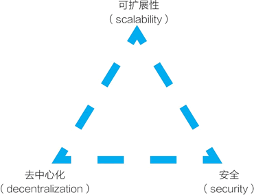
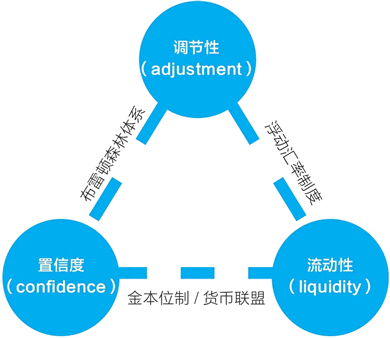

# 区块链“不可能三角”

在前面的讨论中我们提到，一个基础公链要同时兼顾功能、性能、网络三个要素。在区块链的设计中，还有一个更知名的“不可能三角”（见图 1），它指的是，一个区块链项目无法同时满足三个条件，最多只能同时满足两个条件：

*   可扩展性（scalability）
*   去中心化（decentralization）
*   安全（security）

图 1：区块链的“不可能三角”
对比一下比特币和 EOS：比特币系统看重的是去中心化和安全，而牺牲了可扩展性；EOS 在一定程度上牺牲了去中心化，而去追求可扩展性与安全。

在很多领域中都有这样的不可能三角，我们要在三个因素间权衡：

*   比如在软件工程中的时间（time）、成本（money）、功能性（scope）。
*   比如在分布式系统中的一致性（consistency）、可用性（availability）、网络分区（partition tolerance）。
*   比如在货币汇率政策中的三元悖论或保罗·克鲁格曼所画的永恒的三角形，即调节性（adjustment）、置信度（confidence）、流动性（liquidity）（见图 2）。

图 2：保罗·克鲁格曼的永恒的三角形