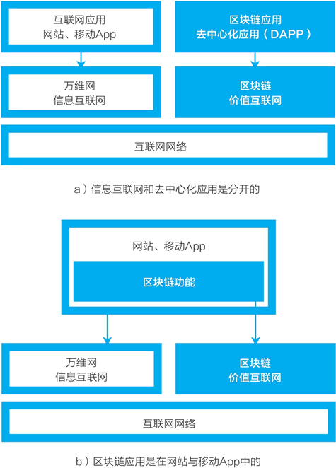
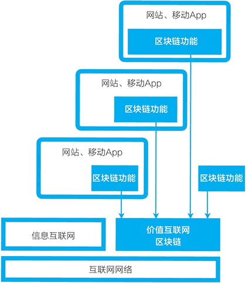
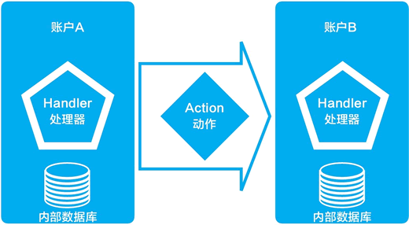
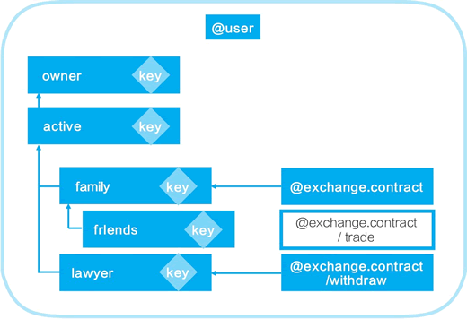
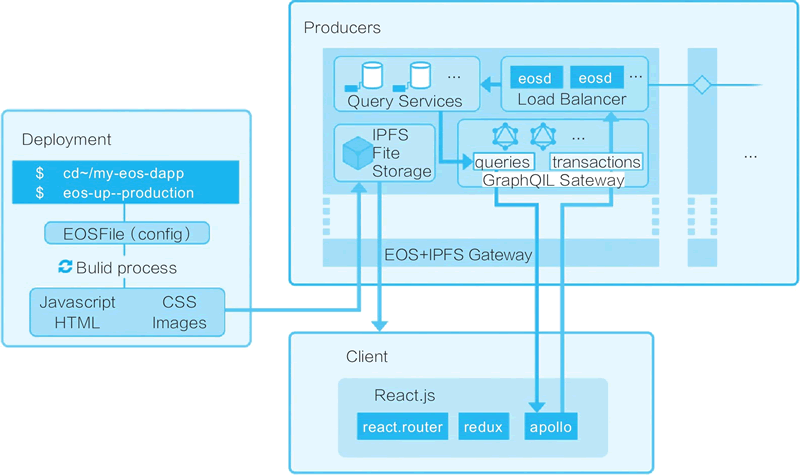
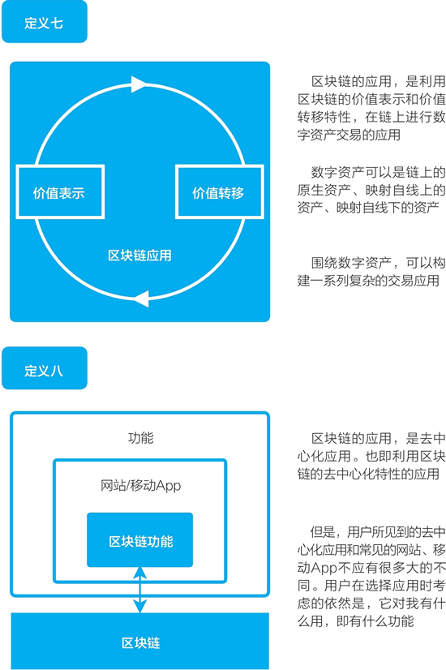

# 区块链应用（去中心化应用）是什么样的?

EOS 的技术白皮书给出了应用所需的六个条件（如下所示），而 EOS 的软件设计的确是对应这些条件而设计的。本节我们将重点讨论 EOS 的其中三个为应用而做的特别设计：用户免费、账户体系、存储。

区块链应用的六个条件：

1.  支持百万级别的用户，需要能够处理数千万日活跃用户的区块链技术。
2.  使用免费，应用开发人员需要具备灵活性，能够为用户提供免费服务；用户不必为了使用平台或从平台的服务中受益而付费。
3.  轻松升级和故障修复，区块链平台必须对软件和智能合约的升级提供支持。
4.  延迟低，及时地反馈是良好用户体验的基础。
5.  串行性能，有些应用程序由于必须顺序执行命令，无法用并行算法进行实现。区块链需要提供强大的串行性能支持。
6.  并行性能，大型应用程序需要在多个 CPU 和计算机之间分配工作负载。

> 《EOSIO 技术白皮书》翻译版：[`blog.eosdata.io/index.php/2018/04/28/eos-io-whitepaper-v2/`](http://blog.eosdata.io/index.php/2018/04/28/eos-io-whitepaper-v2/)；英文版：[`github.com/EOSIO/Do-cumentation/blob/master/TechnicalWhitePaper.md#accounts`](https://github.com/EOSIO/Do-cumentation/blob/master/TechnicalWhitePaper.md#accounts)。

## 区块链应用要去中心化到什么程度

类似于互联网，让区块链变得有用的所有期待都寄托在应用上，通常人们也称之为去中心化应用（DAPP）。在讨论 EOS 为应用所做的特别设计之前，我们先讨论区块链应用或所谓去中心化应用的架构，这是区块链落地应用的最前沿，众人仍在探索。

对于应用的前景，在《区块链革命》一书中，唐·塔普斯科特曾展望道：“我们在进入数字化革命的一个新纪元，人们可以进行分布式软件的编程和分享。就如区块链协议本身是分布式的那样，一个分布式的应用程序或 DAPP（去中心化应用程序）会在很多计算机上运行，而不是在一个单一的服务器上运行。”

经过 20 多年的发展，我们都已经很熟悉信息互联网的网站或移动应用是什么样的，那么，和区块链相关的去中心化应用究竟是什么样的呢？

要理解区块链应用或去中心化应用，我们还是要从熟悉的事物谈起。

现在被认同的发展前景是，互联网将从信息互联网跨越到基于区块链的价值互联网。信息互联网的应用是网站与移动 App。在展望应用时，很多人自然地认为，在区块链上将出现原生的区块链应用或去中心化应用。

这样形成的结构是如图 1 a) 所示：网站、移动 App 对应的是信息互联网，而所谓的区块链应用/去中心化应用对应着区块链。早期应用的确呈现这样的状态，比如区块浏览器、每个区块链自己的钱包等。每一条区块链都是分布式账本与去中心网络，它们提供数据与功能。早期应用与这些区块链进行交互。

但我们很快发现，当普通用户要使用区块链时，应用可能变成类似于图 1 b) 的样子：网站与移动 App 中有一个与区块链进行数据和功能交互的“区块链应用”，而普通用户看到的其实还是网站与移动应用。我们甚至可以说，对于普通用户来说，可能根本没有什么区块链应用或去中心化应用，只有应用。

图 1：区块链应用
如果单独看一条区块链的应用，情形可能如图 2 所示。

*   这条区块链是分布式账本与去中心网络，它提供着一系列与价值相关的数据和功能。
*   多个应用接入区块链网络。在这些应用中，有的可能是普通用户可以使用的，是网站/移动 App 与区块链应用的组合；有的可能是纯粹的区块链应用。

图 2：区块链应用的可能性
有的应用可能接入多个区块链，比如现在常见的应用交易所、钱包就接入多个区块链。

基于 Steem 区块链的 Steemit 博客应用是少有的普通用户可以使用的应用。在 Steem 区块链上，上述这样的应用架构就展现得较为明晰：

*   Steem 区块链上存储价值（STEEM 币、SP、SBD 等三种通证），并按照内容贡献进行价值的分配。
*   基于这条区块链建立有多个应用：普通用户可用的 Steemit 博客平台、视频平台 DTube 等；常备的应用如区块链浏览器 [steemd.com](http://steemd.com) 网站。它的社区算是较为活跃的，还有其他的很多应用。

Steem 的主要开发者也是 EOS 的主要开发者丹尼尔·拉瑞莫（BM），EOS 是将 Steem 区块链通用化，并做了很多改进。比如，对比 Steem 与 EOS 我们可以看到，EOS 不再采用把内容存放在区块链上这个不合理的设计，但它继续扩展了 Steem 中已经有的账号与权限体系。

比特币系统完成了用区块链进行价值表示和价值转移的概念验证，而 Steem 区块链和 Steemit 博客平台这个早期项目可能完成了区块链应用的概念验证。现在，EOS 将其之前的很多设计发扬光大。

在《去中心化应用》一书中，开发者西拉杰·拉瓦尔对去中心化应用的去中心化程度进行了一番讨论。他认为，区块链可能在四个过去集中化的方面完成去中心化：

*   将数据去中心化（decentralized data）
*   将财富去中心化（decentralized wealth）
*   将身份去中心化（decentralized identity）
*   将计算去中心化（decentralized computing）

我认为，区块链的核心功能是去中心化的价值表示和价值转移，它们分别对应的是以上分类中的财富与计算。当试图构建应用时，我们应把重点放在这两者上面。和其他主要的区块链一样，EOS 在这两个方面做得很好。它还试图大幅度改进区块链本身的核心性能，即每秒事务处理量（TPS）。

或许同样重要的是，与其他区块链相比，EOS 为开发一个普通用户可用的应用，提供了更多的功能与特性。接下来我们讨论 EOS 为应用而做的三件事：用户免费、账户与权限体系、存储系统。

## 用户免费

在讨论应用所需的条件时，EOS 白皮书写道：“用户不必为了使用平台或从平台的服务中受益而付费。”

用户免费是 EOS 与比特币、以太坊相对而言的显著差别。在比特币、以太坊系统中，普通用户如果进行转账交易等操作，需要支付相应的交易费。而 EOS 把承担这个费用的压力转移给了应用的提供者。

用户免费是和 EOS 的通证经济设计紧密相关的。使用一个区块链的应用通常需要三种资源，这三种资源是由维护这个去中心网络的计算机提供的，对 EOS 来说，这三种资源是由区块生产者（BP）提供的。这三种资源分别是：

*   带宽资源：带宽和日志存储（磁盘）（Bandwidth and Log Storage（Disk））。
*   计算资源：计算和计算积压（CPU）（Computation and Computational Backlog（CPU））。
*   状态资源：状态存储（RAM）（State Storage（RAM））。

这三种资源（带宽资源、计算资源和状态资源）对应的是一个计算机网络的三种能力。对于熟悉计算机的人来说，带宽资源和计算资源容易理解，而状态资源是区块链的专用术语。正如之前讨论的，区块链账本中存储的是状态，比如交易账本、账户余额等，按其名字缩写为 RAM，它的性质大约相当于内存。

EOS 还特别举例说明，什么应该存入状态，什么不应该存入状态。例如，一个区块链应用程序的逻辑不需要读取博客文章的内容和评论，因此它们不应该存储在区块链的状态中。但是，博客文章或评论是否存在、投票数以及其他属性，需要存在区块链的状态之中。

> 特别地，BM 之前设计与开发了内容专用的区块链 Steem，在 Steem 中，博客文章和评论的文本是存储在区块链的区块（区块链账本）中的。BM 在实践中可能意识到，正确的做法应当是只在区块链账本中存储与交易相关的信息。

简单地说，区块链是用于交易的，区块链的状态是交易账本，那么，与交易相关的信息应该存入交易账本，而与交易无关的信息不应存入交易账本。

EOS 区块链的这三种资源的消耗机制是这样的：区块生产者（BP）公布可用的带宽（bandwidth）、计算（computation）和状态（state）的容量。

EOSIO 系统允许每个账户消耗一定比例的可用资源，这个比例是根据账户将自己持有的通证存入“三天抵押合约”的数量决定的。

例如，假设有一个基于 EOS 的应用，如果一个账户持有总通证的 1%，那么这个账户可利用 1% 的状态存储容量。

因此，对于如何做到对用户免费，EOS 的设计关键是如下两点。

#### 第一，用户不用直接向区块链付费，而由应用来处理。

在以太坊区块链网络中，我要将以太币或其他基于 ERC20 标准的通证转移给别人，我作为交易的发起人，需要自己设定一个交易费（gas），给区块链网络直接付费，从而让以太坊网络能处理这一交易。

EOS 的设计逻辑是基于这样的假设：“没有任何网站要求访问者为维护服务器而支付小额费用。因此，去中心化应用程序不应该强迫它的客户为使用区块链而向区块链支付直接费用。”

EOS 虽然以“接收方付费”作为一个讨论部分的小标题，但它的思路其实是，由应用自己来决定采取什么样的方式。通常为了应用能够便于用户使用，它的基本逻辑应当是，应用自行解决费用，最终用户使用区块链网络是免费的。

#### 第二，将交易成本与通证价值区分开。

在以太坊区块链网络中，我们支付交易费支付的是以太币，随着以太币价格的涨跌，交易成本就随着这个通证价格波动。而 EOS 的设计逻辑是：“将交易成本与通证价值区分开。”

EOS 区块链网络的做法是，一个应用拥有的带宽、计算、状态等资源，是与其持有的通证数量有关的，但由于不需要消耗，因此在一定程度上可视为与该通证的价值或价格无关。

如果我们作为应用开发者，并不持有足够多的通证，则 EOS 区块链网络还提供一种租用机制，这个机制是“将资源能力授权出去”（delegating capacity）：通证的持有人可能不需要立即消耗可用带宽的全部或部分资源，他们可以选择将未消耗的带宽委托或租赁给他人。

但要注意的是这句话：“带宽和计算可以授权给他人，但是对应用程序状态的存储需要开发者持有通证，直至状态删除为止。如果程序的状态永不删除，那么这部分通证就退出了流通。”

> 根据 EOSIO 文档，这里的状态可认为指的是一个应用所占用的区块链网络的 RAM 存储空间。原文为：Storage of application state will require an application developer to hold tokens until that state is deleted.If state is never deleted,then the tokens are effectively removed from circulation.
> 
> 对比以太坊和 EOS 我们可以看到，在以太坊中进行交易，个人用户需要支付交易费，而在 EOS 中进行交易，则是应用提供者需要承担成本，现在看来其中主要的成本是与 RAM 存储空间相关的。

## 账户与权限体系

EOS 与比特币、以太坊的一大不同点是，它允许用户创建一个不超过 12 位长的用户名，这个用户名代表的是我们的账户。

#### 以太坊的账户

比特币区块链根本就没有账户的概念，比特币只有地址；以太坊设计了账户，但远没有 EOS 这么完备的账户权限相关功能。为了便于理解，我们先看从比特币到以太坊的“从地址到账户”，再看 EOS 的账户设计。

比特币是没有账户的，所有的比特币交易都是地址之间的交换。我们所持有的比特币是自己的各个地址中比特币的总和，在比特币系统中是没有账户、余额这种东西的。

以太坊引入了账户的概念：以太坊账户。每个账户包括四个信息：一个随机数、账户的余额、合约代码（如果有的话）、存储（通常为空）。

以太坊包括两类账户：

*   外部由私钥控制的账户。
*   合约控制的账户。

对比特币来说，它只有由外部的私钥控制的地址。在以太坊外部账户中没有代码，它可以创建和签署一个交易，也就是发出消息，而一个合约账户在收到消息后可以执行相应的代码和处理存储。这里的“合约”代码相当于存在于以太坊执行环境中的“自治代理”，它拥有自己的以太坊账户，它在收到交易信息后就相当于被捅了一下，然后自动执行一段代码。

和比特币一样，以太坊的区块中存储的也是交易，它包括的字段主要有：接受者（接受的账户）、发送者的签名、发送者发给接受者的以太币金额等。

#### EOS 的账户

EOS 的账户系统则要复杂得多，它更像银行的账户系统或者我们在互联网应用（比如谷歌、微信等）中的账户系统。

下面来看看 EOS 账户系统的构成。

一个 EOS 账户系统可以发送动作（action）给另一个账户，而每个账户都可以设定一个处理器（handler）来自动处理发送给自己的动作。动作和处理器的结合，就是 EOS 的智能合约（见图 3）。

每个账户都有自己的内部数据库（private database），这个账户内部的内部数据库只有自己的动作处理器可以访问。

图 3：EOS 账户的交互：动作与处理器
EOS 系统提供了一个标准的基于角色的权限系统（role based permission management），这使得所有基于 EOS 开发的应用都可以采用这个账户体系与权限系统，而不必自己重新造轮子。

在 BM 之前开发的 Steem 区块链中，基于角色的权限系统就被引入区块链中，他在 Steem 中硬编码了三种用户权限：owner、active、posting。

> EOS 白皮书在讨论 Steem 时说：“posting 权限只能执行诸如投票和发布等社交行为，而 active 权限除了更改所有者之外，还可以做其他任何事情。owner 权限用作冷存储，它能够做所有事情。”

EOS 对此进一步改进，对这个基于角色的权限系统进行了通用化，“允许每个账户持有者定义自己的权限层次结构以及动作的分组”。这样做给了应用开发者更多的自由度。

> 在 EOS 开发者文档中，有关于账户与权限的开发信息，见 [`developers.eos.io/eosio-nodeos/docs/accounts-and-permissions`](https://developers.eos.io/eosio-nodeos/docs/accounts-and-permissions)。

在 EOS 的账户权限系统中有两个缺省的权限组：最高级别的缺省权限组是 owner，第二个缺省权限组是 active，它可以做出除更改所有者之外的所有事。其他的权限组都可以由 active 派生出来，这些权限组用户可以自行定义。比如，我开发一个博客应用，我就可以自己定义一个 publish 权限组出来（见图 4）。

图 4：EOS 白皮书中的一个权限系统示例

## 存储系统

我们都已经知道，只有与交易相关的信息应该存储在区块链的区块中，那么，对于去中心化的应用，其他的数据应该存储在何处呢？

> EOS 存储的白皮书见：[`github.com/EOSIO/Docum-entation/blob/master/EOS.IO%20Storage.pdf`](https://github.com/EOSIO/Docum-entation/blob/master/EOS.IO%20Storage.pdf)。其中，它强调区块链的区块中不应存储文件。

绝大多数基础公链都没有解决这个周边问题，而聚焦于区块链的核心任务——交易。但为了让 EOS 可以更好地用于开发应用，EOS 在 2017 年 9 月就发布了 EOS 存储的独立白皮书，解释了它在存储方面的开发设想。

在讨论了星际文件系统（IPFS）、分布式存储项目（Filecoin、Maidsafe、Siacoin、Storj），以及现有的中心化存储（如 DropBox、GoogleDriver、苹果的 iCloud）等后，它提出了用自己的通证与 IPFS 结合，形成一个用于 EOS 应用开发的存储。

有了基于 IPFS 的文件存储系统之后，在 2017 年 12 月 12 日，EOS 团队发表文章给出了它建议的 EOS 应用开发架构（见图 5）。从图中可以看到，在它建议的应用开发框架中，EOS 的应用是被建议存储在基于 IPFS 的 EOS 存储中的（即图中的 IPFS File Storage）。到目前为止，EOS 在存储方面还仅仅提供了一个设想，离真正落实还有一定的距离。

总的来说，区块链将价值表示和价值转移这两个与价值有关的核心功能去中心化了，区块链应用可通过接口与区块链交互数据（通证）和计算（通证交易）。EOS 作为当下最热门的新区块链系统，它的特色在于，在这两个核心功能之外，它为应用的开发提供了各种便利，可能促进更多应用的出现。

图 5：EOS 应用开发框架（2017 年 12 月）
区块链的第七、第八个定义如图 6 所示。
图 6：区块链的定义之七、之八