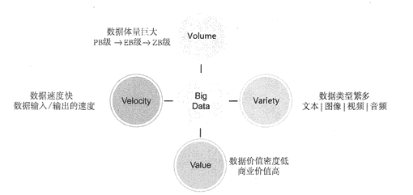
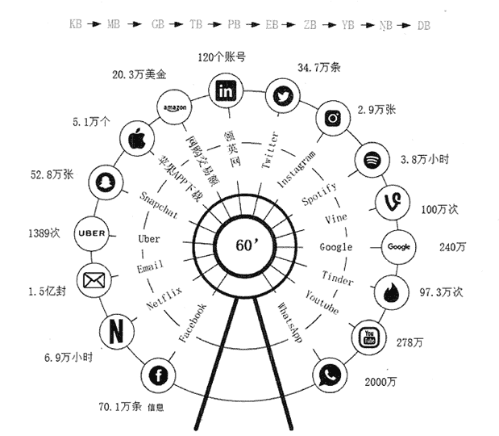

# 大数据是什么？1 分钟了解大数据的概念！

> 原文：[`c.biancheng.net/view/3500.html`](http://c.biancheng.net/view/3500.html)

大数据本身是一个抽象的概念。从一般意义上讲，大数据是指无法在有限时间内用常规软件工具对其进行获取、存储、管理和处理的数据集合。

目前，业界对大数据还没有一个统一的定义，但是大家普遍认为，大数据具备 Volume、Velocity、Variety 和 Value 四个特征，简称“4V”，即数据体量巨大、数据速度快、数据类型繁多和数据价值密度低，如图 1 所示。下面分别对每个特征作简要描述。

图 1  大数据特征

#### 1）Volume：表示大数据的数据体量巨大。

数据集合的规模不断扩大，已经从 GB 级增加到 TB 级再增加到 PB 级，近年来，数据量甚至开始以 EB 和 ZB 来计数。

例如，一个中型城市的视频监控信息一天就能达到几十 TB 的数据量。百度首页导航每天需要提供的数据超过 1-5PB，如果将这些数据打印出来，会超过 5000 亿张 A4 纸。图 2 展示了每分钟互联网产生的各类数据的量。

图 2  互联网每分钟产生的数据

#### 2）Velocity：表示大数据的数据产生、处理和分析的速度在持续加快。

加速的原因是数据创建的实时性特点，以及将流数据结合到业务流程和决策过程中的需求。数据处理速度快，处理模式已经开始从批处理转向流处理。

业界对大数据的处理能力有一个称谓——“ 1 秒定律”，也就是说，可以从各种类型的数据中快速获得高价值的信息。大数据的快速处理能力充分体现出它与传统的数据处理技术的本质区别。

#### 3）Variety：表示大数据的数据类型繁多。

传统 IT 产业产生和处理的数据类型较为单一，大部分是结构化数据。随着传感器、智能设备、社交网络、物联网、移动计算、在线广告等新的渠道和技术不断涌现，产生的数据类型无以计数。

现在的数据类型不再只是格式化数据，更多的是半结构化或者非结构化数据，如 XML、邮件、博客、即时消息、视频、照片、点击流、 日志文件等。企业需要整合、存储和分析来自复杂的传统和非传统信息源的数据，包括企业内部和外部的数据。

#### 4）Value：表示大数据的数据价值密度低。

大数据由于体量不断加大，单位数据的价值密 度在不断降低，然而数据的整体价值在提高。以监控视频为例，在一小时的视频中，有用的数据可能仅仅只有一两秒，但是却会非常重要。现在许多专家已经将大数据等同于黄金和石油，这表示大数据当中蕴含了无限的商业价值。

根据中商产业研究院发布的《2018-2023 年中国大数据产业市场前景及投资机会研究报告》显示，2017 年中国大数据产业规模达到 4700 亿元，同比增长 30%。随着大数据在各行业的融合应用不断深化，预计 2018 年中国大数据市场产值将突破 6000 亿元达到 6200 亿元。

通过对大数据进行处理，找出其中潜在的商业价值，将会产生巨大的商业利润。