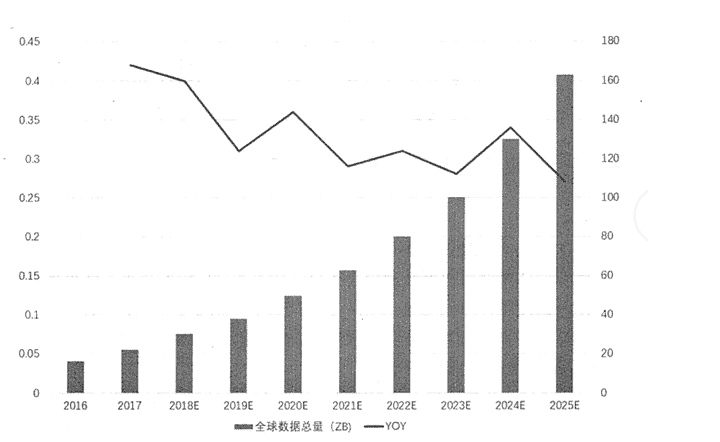
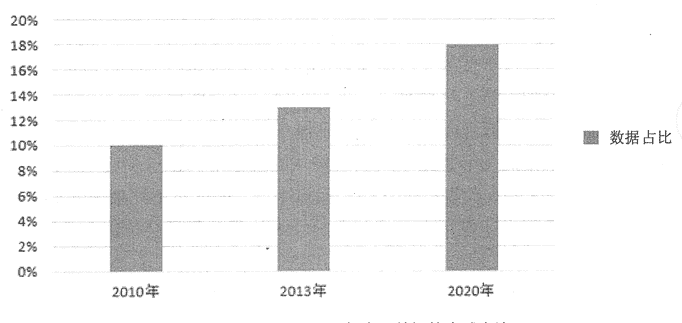

# 大数据时代是什么意思？

> 原文：[`c.biancheng.net/view/3502.html`](http://c.biancheng.net/view/3502.html)

近年来，信息技术迅猛发展，尤其是以互联网、物联网、信息获取、社交网络等为代表的技术日新月异，促使手机、平板电脑、pc 等各式各样的信息传感器随处可见，虚拟网络快速发展，现实世界快速虚拟化，数据的来源及其数量正以前所未有的速度增长。

伴随着云计算、大数据、物联网、人工智能等信息技术的快速发展和传统产业数字化的转型，数据量呈现几何级增长，根据市场研究资料显示，全球数据总量将从 2016 年的 16.1ZB 增长到 2025 年的 163ZB （约合 180 万亿 GB），十年内将有 10 倍的增长，复合增长率为 26%，如图 1 所示。

若以现有的蓝光光盘为计量标准，那么 40ZB 的数据全部存入蓝光光盘，所需要的光盘总重量将达到 424 艘尼米兹号航母的总重量。而这些数据中，约 80% 是非结构化或半结构化类型的数据，甚至更有一部分是不断变化的流数据。因此，数据的爆炸性增长态势，以及其数据构成特点使得人们进入了“大数据”时代。
图 1  2016-2025 年全球数据产量及预测如今，大数据已经被赋予多重战略含义。

在资源的角度，数据被视为“未来的石油”，被作为战略性资产进行管理。

在国家治理角度，大数据被用来提升治理效率，重构治理模式，破解治理难题，它将掀起一场国家治理革命。

在经济增长角度，大数据是全球经济低迷环境下的产业亮点，是战略新兴产业的最活跃部分。

在国家安全角度，全球数据空间没有国界边疆，大数据能力成为大国之间博弈和较量的利器。

总之，国家竞争焦点将从资本、土地、人口、资源转向数据空间，全球竞争版图将分成新的两大阵营：数据强国与数据弱国。

从宏观上看，由于大数据革命的系统性影响和深远意义，主要大国快速做出战略响应，将大数据置于非常核心的位置，推出国家级创新战略计划。

美国 2012 年发布了《大数据研究和发展计划》，并成立“大数据高级指导小组”，2013 年又推出“数据一知识一行动”计划，2014 年进一步发布《大数据：把握机遇，维护价值》政策报告，启动“公开数据行动”，陆续公开 50 个门类的政府数据，鼓励商业部门进行开发和创新。

欧盟正在力推《数据价值链战略计划》；英国发布了《英国数据能力发展战略规划》；日本发布了《创建最尖端 IT 国家宣言》；韩国提出了“大数据中心战略”。中国多个省市发布了大数据发展战略，国家层面的《关于促进大数据发展的行动纲要》也于 2015 年 8 月 19 日正式通过。

从微观上看，大数据重塑了企业的发展战略和转型方向。

美国的企业以 GE 提出的“工业互联网”为代表，提出智能机器、智能生产系统、智能决策系统，将逐渐取代原有的生产体系，构成一个“以数据为核心”的智能化产业生态系统。

德国的企业以“工业 4.0”为代表，要通过信息物理系统（Cyber Physical System, CPS）把一切机器、物品、人、服务、建筑统统连接起来,形成一个高度整合的生产系统。

中国的企业以阿里巴巴提出的“DT 时代”（Data Technology）为代表，认为未来驱动发展的不再是石油、钢铁，而是数据。

这 3 种新的发展理念可谓异曲同工、如出一辙，共同宣告“数据驱动发展”成为时代主题。

与此同时，大数据也是促进国家治理变革的基础性力量。正如《大数据时代》的作者舍恩伯格在定义中所强调的：“大数据是人们在大规模数据的基础上可以做到的事情，而这些事情在小规模数据的基础上是无法完成的。”

在国家治理领域，大数据为解决以往的“顽疾”和 “痛点”，提供了强大支撑，如建设阳光政府、责任政府、智慧政府；大数据使以往无法实现的环节变得简单、可操作，如精准医疗、个性化教育、社会监管、舆情监测预警。

大数据也使一些新的主题成为国家治理的重点，如维护数据主权、开放数据资产、保持在数字空间的国家竞争力等。

中国具备成为数据强国的优势。中国的数据量在 2013 年已达到 576EB，到 2020 年这个数字将会达到 8.06ZB，增长超过 12 倍。

从全球占比来看，中国成为数据强国的潜力极为突岀，2010 年中国数据占全球数据的比例为 10%，2013 年占比为 13%，2020 年占比将达到 18%，如图 2 所示。

图 2  2010-2020 年中国数据的全球占比
届时，中国的数据规模将超过美国位居世界第一。中国成为数据大国并不奇怪，因为中国是人口大国、制造业大国、互联网大国、物联网大国，这都是最活跃的数据生产主体，未来几年，中国成为数据大国也是逻辑上的必然结果。