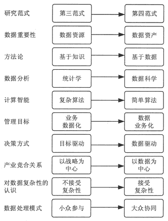
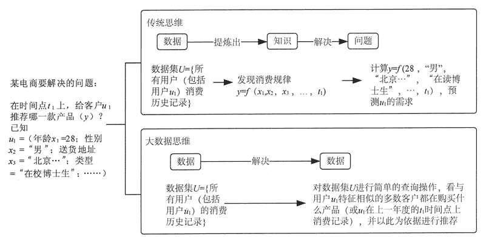
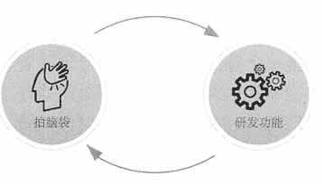
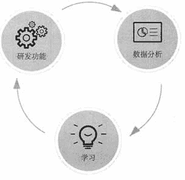

# 大数据时代的 10 个重大变化（长篇神文）

> 原文：[`c.biancheng.net/view/3504.html`](http://c.biancheng.net/view/3504.html)

大数据时代的到来改变了人们的生活方式、思维模式和研究范式，我们可以总结出 10 个重大变化，如图 1 所示。

图 1  大数据时代的 10 个重大变化

## 对研究范式的新认识：从第三范式到第四范式

2007 年 1 月，图灵奖得主、关系型数据库鼻祖 JimGray 发表演讲，他凭着自己对于人类科学发展特征的深刻洞察，敏锐地指出科学的发展正在进入“数据密集型科学发现范式”——科学史上的“第四范式”。

在他看来，人类科学研究活动已经历过三种不同范式的演变过程。

“第一范式”是指原始社会的“实验科学范式”。18 世纪以前的科学进步均属于此列，其核心特征是对有限的客观对象进行观察、总结、提炼，用归纳法找出其中的科学规律，如伽利略提出的物理学定律。

“第二范式”是指 19 世纪以来的理论科学阶段，以模型和归纳为特征的“理论科学范式”。其核心特征是以演绎法为主，凭借科学家的智慧构建理论大厦，如爱因斯坦提出的相对论、麦克斯方程组、量子理论和概率论等。

“第三范式”是指 20 世纪中期以来的计算科学阶段的“计算科学范式”。面对大量过于复杂的现象，归纳法和演绎法都难以满足科学研究的需求，人类开始借助计算机的高级运算能力对复杂现象进行建模和预测，如天气、地震、核试验、原子的运动等。

然而，随着近年来人类采集数据量的爆炸性增长，传统的计算科学范式已经越来越无力驾驭海量的科研数据了。例如，欧洲的大型粒子对撞机、天文领域的 Pan-STARRS 望远镜每天产生的数据多达几千万亿字节（PB）。很明显，这些数据已经突破了“第三范式”的处理极限，无法被科学家有效利用。

正因为如此，目前正在从“计算科学范式”转向“数据密集型科学发现范式”。

“第四范式”的主要特点是科学研究人员只需要从大数据中查找和挖掘所需要的信息和知识，无须直接面对所研究的物理对象。例如，在大数据时代，天文学家的研究方式发生了新的变化，其主要研究任务变为从海量数据库中发现所需的物体或现象的照片，而不再需要亲自进行太空拍照。

## 对数据重要性的新认识：从数据资源到数据资产

在大数据时代，数据不仅是一种“资源”，更是一种重要的“资产”。因此，数据科学应把数据当作一种“资产”来管理，而不能仅仅当作“资源”来对待。也就是说，与其他类型的资产相似，数据也具有财务价值，且需要作为独立实体进行组织与管理。

大数据时代的到来，让“数据即资产”成为最核心的产业趋势。在这个“数据为王”的时代，回首信息产业发展的起起伏伏，我们发现产业兴衰的决定性因素，已不是土地、人力、技术、资本这些传统意义上的生产要素，而是曾经被一度忽视的“数据资产”。

世界经济论坛报告曾经预测称，“未来的大数据将成为新的财富高地，其价值可能会堪比石油”，而大数据之父维克托也乐观地表示，“数据列入企业资产负债表只是时间问题”。

“数据成为资产”是互联网泛在化的一种资本体现，它让互联网不仅具有应用和服务本身的价值，而且具有了内在的“金融”价值。数据不再只是体现于“使用价值”方面的产品，而成为实实在在的“价值”。

目前，作为数据资产先行者的 IT 企业，如苹果、谷歌、IBM、阿里、腾讯、百度等，无不想尽各种方式，挖掘多种形态的设备及软件功能，收集各种类型的数据，发挥大数据的商业价值，将传统意义上的 IT 企业，打造成为“终端+应用+平台+数据”四位一体的泛互联网化企业，以期在大数据时代获取更大的收益。

大数据资产的价值的衡量尺度主要有以下 3 个方面的标准。

#### 1）独立拥有及控制数据资产

目前，数据的所有权问题在业界还比较模糊。从拥有和控制的角度来看，数据可以分为 Ⅰ 型数据、Ⅱ 型数据和 Ⅲ 型数据。

Ⅰ 型数据主要是指数据的生产者自己生产出来的各种数据，例如，百度对使用其搜索引擎的用户的各种行为进行收集、整理和分析，这类数据虽然由用户产生，但产权却属于生产者，并最大限度地发挥其商业价值。

Ⅱ 型数据又称为入口数据，例如，各种电子商务营销公司通过将自身的工具或插件植入电商平台，来为其提供统计分析服务，并从中获取各类经营数据。虽然这些数据的所有权并不属于这些公司，在使用时也有一些规则限制，但是它们却有着对数据实际的控制权。

相比于前两类数据，Ⅲ 型数据的产权情况比较复杂，它们主要依靠网络爬虫，甚至是黑客手段获取数据。与 Ⅰ 型和 Ⅱ 型数据不同的是，这些公司流出的内部数据放在网上供人付费下载。这种数据在当前阶段，还不能和资产完全画等号。

#### 2）计量规则与货币资本类似

大数据要实现真正的资产化，用货币对海量数据进行计量是一个大问题。尽管很多企业都意识到数据作为资产的可能性，但除了极少数专门以数据交易为主营业务的公司外，大多数公司都没有为数据的货币计量做出适当的账务处理。

虽然数据作为资产尚未在企业财务中得到真正的引用，但将数据列入无形资产比较有利。

考虑到研发因素，很多高科技企业都具有较长的投入产出期，可以让那些存储在硬盘上的数据直接进入资产负债表。对于通过交易手段获得的数据，可以按实际支付价款作为入账价值计入无形资产，从而为企业形成有效税盾，降低企业实际税负。

#### 3）具有资本一般的增值属性

资本区别于一般产品的特征在于，它具有不断增值的可能性。只有能够利用数据、组合数据、转化数据的企业，他们手中的大数据资源才能成为数据资产。

目前，直接利用数据为企业带来经济利益的方法主要有数据租售、信息租售、数据使能三种模式。

*   数据租售主要通过对业务数据进行收集、整理、过滤、校对、打包、发布等一系列操作，实现数据內在的价值。
*   信息租售则通过聚焦行业焦点，收集相关数据，深度整合、萃取及分析，形成完整数据链条，实现数据的资产转化。
*   数据使能是指类似于阿里这样的互联网公司通过提供大量的金融数据挖掘及分析服务，为传统金融行业难以下手的小额贷款业务开创新的行业增长点。

总而言之，作为信息时代核心的价值载体，大数据必然具有朝向价值本体转化的趋势，而它的“资产化”，或者未来更进一步的“资本化”蜕变，将为未来完全信息化、泛互联网化的商业模式打下基础。

## 对方法论的新认识：从基于知识到基于数据

传统的方法论往往是“基于知识”的，即从“大量实践（数据）”中总结和提炼出一般性知识（定理、模式、模型、函数等）之后，用知识去解决（或解释）问题。因此，传统的问题解决思路是“问题→知识→问题”，即根据问题找“知识”,并用“知识”解决“问题”。

然而，数据科学中兴起了另一种方法论——“问题→数据→问题”，即根据“问题”找“数据”，并直接用“数据”（在不需要把“数据”转换成“知识”的前提下）解决“问题”，如图 2 所示。

图 2  传统思维与大数据思维的比较

## 对数据分析的新认识：从统计学到数据科学

在传统科学中，数据分析主要以数学和统计学为直接理论工具。但是，云计算等计算模式的出现及大数据时代的到来，提升了我们对数据的获取、存储、计算与管理能力，进而对统计学理论与方法产生了深远影响。大数据带给我们 4 个颠覆性的观念转变。

#### 1）不是随机样本，而是全体数据

在大数据时代，我们可以分析更多的数据，有时候甚至可以处理和某个特别现象相关的所有数据，而不再依赖于随机采样。

以前我们通常把随机采样看成是理所应当的限制，但是真正的大数据时代是指不用随机分析法这样的捷径，而采用对所有数据进行分析的方法，通过观察所有数据，来寻找异常值进行分析。

例如，信用卡诈骗是通过异常情况来识别的，只有掌握了所有数据才能做到这一点。在这种情况下，异常值是最有用的信息，可以把它与正常交易情况作对比从而发现问题。

#### 2）不是纯净性，而是混杂性

数据量的大幅增加会造成一些错误的数据混进数据集。但是，正因为我们掌握了几乎所有的数据，所以我们不再担心某个数据点对整套分析的不利影响。

我们要做的就是要接受这些纷繁的数据并从中受益，而不是以高昂的代价消除所有的不确定性。这就是由“小数据”到“大数据”的改变。

#### 3）不是精确性，而是趋势

研究数据如此之多，以至于我们不再热衷于追求精确度。之前需要分析的数据很少，所以我们必须尽可能精确地量化我们的记录，但随着规模的扩大，对精确度的痴迷将减弱。

拥有了大数据，我们不再需要对一个现象刨根问底，只要掌握了大体的发展方向即可，适当忽略微观层面上的精确度，会让我们在宏观层面拥有更好的洞察力。

例如，微信朋友圈中朋友发动态的时间，在一小时以内的会显示多少分钟之前，在一小时以外的就只显示几小时前；微信公众号中显示的阅读量，超过十万以后显示的就是 100000+，而不是具体数据，因为超过十万的阅读量已经让我们觉得这篇文章很优秀了，没必要精确。

#### 4）不是因果关系，而是相关关系

在数据科学中，广泛应用“基于数据”的思维模式，重视对“相关性”的分析，而不是等到发现“真正的因果关系”之后才解决问题。

在大数据时代，人们开始重视相关分析，而不仅仅是因果分析。我们无须再紧盯事物之间的因果关系，而应该寻找事物之间的相关关系。相关关系也许不能准确地告诉我们某件事情为何会发生，但是它会告诉我们某件事情已经发生了。

在大数据时代，我们不必非得知道现象背后的原因，而是要让数据自己发声。知道是什么就够了，没必要知道为什么。例如，知道用户对什么感兴趣即可，没必要去研究用户为什么感兴趣。

相关关系的核心是量化两个数据值之间的数据关系。相关关系强是指当一个数据值增加时，其他数据值很有可能也会随之增加。相关关系是通过识别关联物来帮助我们分析某一现象的，而不是揭示其内部的运作。

通过找到一个现象良好的关联物，相关关系可以帮助我们捕捉现在和预测未来。例如，如果川和万经常一起发生，我们只需要注意方是否发生，就可以预测力是否也发生了。

## 对计算智能的新认识：从复杂算法到简单算法

“只要拥有足够多的数据，我们可以变得更聪明”是大数据时代的一个新认识。因此，在大数据时代，原本复杂的“智能问题”变成简单的“数据问题”。

只要对大数据进行简单查询就可以达到“基于复杂算法的智能计算的效果”。为此，很多学者曾讨论过一个重要话题——“大数据时代需要的是更多的数据还是更好的模型？”

机器翻译是传统自然语言技术领域的难点，虽曾提出过很多种算法，但应用效果并不理想。IBM 有能力将《人民日报》历年的文本输入电脑，试图破译中文的语言结构。

例如，实现中文的语音输入或者中英互译，这项技术在 20 世纪 90 年代就取得突破，但进展缓慢，在应用中还是有很多问题。近年来，Google 翻译等工具改变了“实现策略”，不再依靠复杂算法进行翻译,而是通过对他们之前收集的跨语言语料库进行简单查询的方式,提升了机器翻译的效果和效率。

他们并不教给电脑所有的语言规则，而是让电脑自己去发现这些规则。电脑通过分析经过人工翻译的数以千万计的文件来发现其中的规则。这些翻译结果源自图书、各种机构（如联合国）及世界各地的网站。

他们的电脑会扫描这些语篇，从中寻找在统计学上非常重要的模式，即翻译结果和原文之间并非偶然产生的模式。一旦电脑找到了这些模式，今后它就能使用这些模式来翻译其他类似的语篇。

通过数十亿次重复使用，就会得出数十亿种模式及一个异常聪明的电脑程序。但是对于某些语言来说，他们能够使用到的已翻译完成的语篇非常少，因此 Google 的软件所探测到的模式就相对很少。这就是为什么 Google 的翻译质量会因语言对的不同而不同。

通过不断向电脑提供新的翻译语篇，Google 就能让电脑更加聪明，翻译结果更加准确。

## 对管理目标的新认识：从业务数据化到数据业务化

在传统数据管理中，企业更加关注的是业务的数据化问题，即如何将业务活动以数据方式记录下来，以便进行业务审计、分析与挖掘。

在大数据时代，企业需要重视一个新的课题——数据业务化，即如何“基于数据”动态地定义、优化和重组业务及其流程，进而提升业务的敏捷性，降低风险和成本。业务数据化是前提，而数据业务化是目标。

电商的经营模式与实体店最本质的区别是，电商每卖出一件产品，都会留存一条详尽的数据记录。也正是因为可以用数字化的形式保留每一笔销售的明细，电商可以清楚地掌握每一件商品到底卖给了谁。

此外，依托互联网这个平台，电商还可以记录每一个消费者的鼠标单击记录、网上搜索记录。所有这些记录形成了一个关于消费者行为的实时数据闭环，通过这个闭环中源源不断产生的新鲜数据，电商可以更好地洞察消费者，更及时地预测其需求的变化，经营者和消费者之间因此产生了很强的黏性。

线下实体商店很难做到这一点，他们可能只知道一个省、一个市或者一个地区卖了多少商品，但是，他们很难了解到所生产、经营的每一件商品究竟卖到了哪一个具体的地方、哪一个具体的人，这个人还买了其他什么东西、查看了哪些商品、可能会喜欢什么样的商品。

也就是说，线下实体店即使收集了一些数据，但其数据的粒度、宽度、广度和深度都非常有限。由于缺乏足够的数据，实体店对自己的经营行为，对消费者的洞察力，以及和消费者之间的黏性都十分有限。

就此而言，一家电商和一家线下实体店最本质的区别就是是否保存了足够的数据。其实，这正是互联网化的核心和本质，即“数据化”。这并不是一个简单的数据化，而是所有业务的过程都要数据化，即把所有的业务过程记录下来，形成一个数据的闭环，这个闭环的实时性和效率是关键的指标。这个思想就是一切业务都要数据化。

在大数据时代，企业不仅仅是把业务数据化，更重要的是把数据业务化，也就是把数据作为直接生产力，将数据价值直接通过前台产品作用于消费者。

数据可以反映用户过去的行为轨迹，也可以预测用户将来的行为倾向。比较好理解的一个实例就是关联推荐，当用户买了一个商品之后，可以给用户推荐一个最有可能再买的商品。个性化是数据作为直接生产力的一个具体体现。

随着数据分析工具与数据挖掘渠道的日益丰富与多样化，数据存量越来越大，数据对企业也越来越重要。数据业务化能够给企业带来的业务价值主要包括以下几点：提高生产过程的资源利用率，降低生产成本；根据商业分析提高商业智能的准确率，降低传统“凭感觉”做决策的业务风险；动态价格优化利润和增长；获取优质客户。

目前，越来越多的企业级用户已经考虑从批量分析向近实时分析发展，从而提高 IT 创造价值的能力。同时，数据分析在快速从商业智能向用户智能发展。数据业务化可以让数据给企业创造额外收益和价值。

## 对决策方式的新认识：从目标驱动型到数据驱动型

传统科学思维中，决策制定往往是“目标”或“模型”驱动的，也就是根据目标（或模型）进行决策。然而，大数据时代出现了另一种思维模式，即数据驱动型决策，数据成为决策制定的主要“触发条件”和“重要依据”。

小数据时代，企业讨论什么事情该做不该做，许多时候是凭感觉来决策的，流程如图 3 所示，由两个环节组成：一个是拍脑袋，另一个是研发功能。

图 3  产品迭代的错误流程
基本上就是产品经理通过一些调研，想了一个功能，做了设计。下一步就是把这个功能研发出来，然后看一下效果如何，再做下一步。

整个过程都是凭一些感觉来决策。这种方式总是会出现问题，很容易走一些弯路，很有可能做出错误的决定。

数据驱动型决策加入了数据分析环节，如图 4 所示。

基本流程就是企业有一些点子，通过点子去研发这些功能，之后要进行数据收集，然后进行数据分析。基于数据分析得到一些结论，然后基于这些结论，再去进行下一步的研发。整个过程就形成了一个循环。在这种决策流程中，人为的因素影响越来越少，而主要是用一种科学的方法来进行产品的迭代。

图 4  数据驱动的产品迭代流程
例如，一个产品的界面到底是绿色背景好还是蓝色背景好，从设计的层面考虑，两者是都有可能的。那么就可以做一下 A/B 测试。

可以让 50% 的人显示绿色背景，50% 的人显示蓝色背景，然后看用户点击量。哪个点击比较多，就选择哪个。这就是数据驱动，这样就转变成不是凭感觉，而是通过数据去决策。

相比于基于本能、假设或认知偏见而做出的决策，基于证据的决策更可靠。通过数据驱动的方法，企业能够判断趋势，从而展开有效行动，帮助自己发现问题，推动创新或解决方案的出现。

## 对产业竞合关系的新认识：从以战略为中心到以数据为中心

在大数据时代，企业之间的竞合关系发生了变化，原本相互竞争，甚至不愿合作的企业，不得不开始合作，形成新的业态和产业链。

所谓竞合关系，即在竞争中合作，在合作中竞争。它的核心思想主要体现在两个方面：创造价值与争夺价值。创造价值是个体之间相互合作、共创价值的过程；争夺价值则是个体之间相互竞争、分享价值的过程。

竞合的思想就是要求所有参与者共同把蛋糕做大，每个参与者最终分得的部分都会相应增加。

传统的竞合关系以战略为中心，德国宝马汽车公司和戴姆勒公司旗下的奔驰品牌在整车制造领域存在着品牌竞争，但双方不仅共同开发、生产及采购汽车零部件，而且在混合动力技术——领域进行研究合作。

为了能够在激烈的市场竞争中获取优势，两家公司通过竞合战略，互通有无、共享资源，从而在汽车业整体利润下滑的趋势下获得相对较好的收益，最终取得双赢。

在大数据时代，竞合关系是以数据为中心的。数据产业就是从信息化过程累积的数据资源中提取有用信息进行创新，并将这些数据创新赋予商业模式。

这种由大数据创新所驱动的产业化过程具有“提升其他产业利润”的特征，除了能探索新的价值发现、创造与获取方式以谋求本身发展外，还能帮助传统产业突破瓶颈、升级转型，是一种新的竞合关系，而非一般观点的“新兴科技催生的经济业态与原有经济业态存在竞争关系”。

所以，数据产业培育围绕传统经济升级转型，依附传统行业企业共生发展，是最好的发展策略。例如，近年来发展火热的团购，就是数据产业帮助传统餐饮业、旅游业和交通行业的升级转型。提供团购业务的企业在获得收益的同时，也提高了其他传统行业的效益。

但是，传统企业与团购企业也存在着一定的竞争关系。传统企业在与团购企业合作的过程中，也尽力防止自己的线下业务全部转为自己不能掌控的团购企业。

团购网站为了能获得更广的用户群、更大的流量来提升自己的市场地位，除了自身扩展商户和培养网民习惯之外，还纷纷采取了合纵连横的发展战略。

聚划算、京东团购、当当团购、58 团购等纷纷开放平台，吸引了千品网、高朋、满座、窝窝等团购网站的入驻，投奔平台正在成为行业共识。

对于独立团购网站来说，入驻电商平台不仅能带来流量，电商平台在实物销售上的积累对其实物团购也有一定的促进作用。

## 对数据复杂性的新认识：从不接受到接受数据的复杂性

在传统科学看来，数据需要彻底“净化”和“集成”，计算目的是需要找出“精确答案”，而其背后的哲学是“不接受数据的复杂性”。

然而，大数据中更加强调的是数据的动态性、异构性和跨域等复杂性，开始把“复杂性”当作数据的一个固有特征来对待，组织数据生态系统的管理目标开始转向将组织处于混沌边缘状态。

在小数据时代，对于数据的存储与检索一直依赖于分类法和索引法的机制，这种机制是以预设场域为前提的。这种结构化数据库的预设场域能够卓越地展示数据的整齐排列与准确存储，与追求数据的精确性目标是完全一致的。

在数据稀缺与问题清晰的年代，这种基于预设的结构化数据库能够有效地回答人们的问题，并且这种数据库在不同的时间能够提供一致的结果。

面对大数据，数据的海量、混杂等特征会使预设的数据库系统崩溃。其实，数据的纷繁杂乱才真正呈现出世界的复杂性和不确定性特征，想要获得大数据的价值，承认混乱而不是避免混乱才是一种可行的路径。

为此，伴随着大数据的涌现，出现了非关系型数据库，它不需要预先设定记录结构，而且允许处理各种各样形形色色参差不齐的数据。

因为包容了结构的多样性，这些无须预设的非关系型数据库设计能够处理和存储更多的数据，成为大数据时代的重要应对手段。

在大数据时代，海量数据的涌现一定会增加数据的混乱性且会造成结果的不准确性，如果仍然依循准确性，那么将无法应对这个新的时代。

大数据通常都用概率说话，与数据的混杂性可能带来的结果错误性相比，数据量的扩张带给我们的新洞察、新趋势和新价值更有意义。

因此，与致力于避免错误相比，对错误的包容将会带给我们更多信息。其实，允许数据的混杂性和容许结果的不精确性才是我们拥抱大数据的正确态度，未来我们应当习惯这种思维。

## 对数据处理模式的新认识：从小众参与到大众协同

在传统科学中，数据的分析和挖掘都是具有很高专业素养的“企业核心员工”的事情，企业管理的重要目的是如何激励和考核这些“核心员工”。

但是，在大数据时代，基于“核心员工”的创新工作成本和风险越来越大，而基于“专家余（Pro-AmT 的大规模协作日益受到重视，正成为解决数据规模与形式化之间矛盾的重要手段。

大规模生产让数以百计的人买得起商品，但商品本身却是一模一样的。

企业面临这样一个矛盾：定制化的产品更能满足用户的需求，但却非常昂贵；与此同时，量产化的商品价格低廉,但无法完全满足用户的需求。

如果能够做到大规模定制，为大量用户定制产品和服务，则能使产品成本低，又兼具个性化，从而使企业有能力满足要求，但价格又不至于像手工制作那般让人无法承担。

因此，在企业可以负担得起大规模定制带来的高成本的前提下，要真正做到个性化产品和服务，就必须对用户需求有很好的了解，这就需要用户提前参与到产品设计中。

在大数据时代，用户不再仅仅热衷于消费，他们更乐于参与到产品的创造过程中，大数据技术让用户参与创造与分享成果的需求得到实现。

市场上传统的著名品牌越来越重视从用户的反馈中改进产品的后续设计和提高用户体验，例如，“小米”这样的新兴品牌建立了互联网用户粉丝论坛，让用户直接参与到新产品的设计过程之中，充分发挥用户丰富的想象力，企业也能直接了解他们的需求。

大众协同的另一个方面就是企业可以利用用户完成数据的采集，如实时车辆交通数据采集商 Inrix。该公司目前有一亿个手机端用户，Inrix 的软件可以帮助用户避开堵车，为用户呈现路的热量图。

提供数据并不是这个产品的特色，但值得一提的是，Inrix 并没有用交警的数据，这个软件的每位用户在使用过程中会给服务器发送实时数据，如速度和位置，这样每个用户都是探测器。使用该服务的用户越多，Inrix 获得的数据就越多，从而可以提供更好的服务。