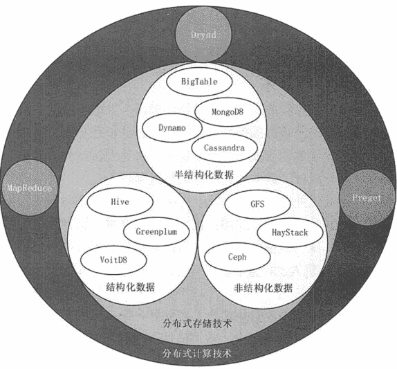
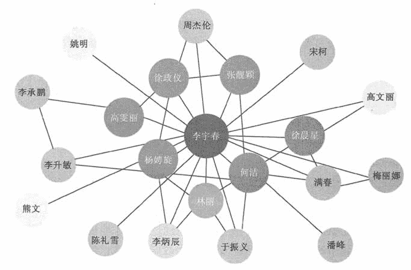

# 大数据开发涉及到的关键技术有哪些？

> 原文：[`c.biancheng.net/view/3523.html`](http://c.biancheng.net/view/3523.html)

大数据本身是一种现象而不是一种技术。大数据技术是一系列使用非传统的工具来对大量的结构化、半结构化和非结构化数据进行处理，从而获得分析和预测结果的数据处理技术。

大数据价值的完整体现需要多种技术的协同。大数据关键技术涵盖数据存储、处理、应用等多方面的技术，根据大数据的处理过程，可将其分为大数据采集、大数据预处理、大数据存储及管理、大数据处理、大数据分析及挖掘、大数据展示等。

## 大数据采集技术

大数据采集技术是指通过 RFID 数据、传感器数据、社交网络交互数据及移动互联网数据等方式获得各种类型的结构化、半结构化及非结构化的海量数据。

因为数据源多种多样，数据量大，产生速度快，所以大数据采集技术也面临着许多技术挑战，必须保证数据采集的可靠性和高效性，还要避免重复数据。

大数据的数据源主要有运营数据库、社交网络和感知设备 3 大类。针对不同的数据源，所采用的数据采集方法也不相同。《大数据采集技术概述》教程中会对大数据采集技术做详细介绍。

## 大数据预处理技术

大数据预处理技术主要是指完成对已接收数据的辨析、抽取、清洗、填补、平滑、合并、规格化及检查一致性等操作。

因获取的数据可能具有多种结构和类型，数据抽取的主要目的是将这些复杂的数据转化为单一的或者便于处理的结构，以达到快速分析处理的目的。

通常数据预处理包含 3 个部分：数据清理、数据集成和变换及数据规约。

#### 1）数据清理

数据清理主要包含遗漏值处理（缺少感兴趣的属性）、噪音数据处理（数据中存在错误或偏离期望值的数据）和不一致数据处理。

*   遗漏数据可用全局常量、属性均值、可能值填充或者直接忽略该数据等方法处理。
*   噪音数据可用分箱（对原始数据进行分组，然后对每一组内的数据进行平滑处理）、聚类、计算机人工检查和回归等方法去除噪音。
*   对于不一致数据则可进行手动更正。

#### 2）数据集成

数据集成是指把多个数据源中的数据整合并存储到一个一致的数据库中。

这一过程中需要着重解决 3 个问题：模式匹配、数据冗余、数据值冲突检测与处理。

由于来自多个数据集合的数据在命名上存在差异，因此等价的实体常具有不同的名称。对来自多个实体的不同数据进行匹配是处理数据集成的首要问题。

数据冗余可能来源于数据属性命名的不一致，可以利用皮尔逊积矩来衡量数值属性，对于离散数据可以利用卡方检验来检测两个属性之间的关联。

数据值冲突问题主要表现为，来源不同的统一实体具有不同的数据值。数据变换的主要过程有平滑、聚集、数据泛化、规范化及属性构造等。

数据规约主要包括数据方聚集、维规约、数据压缩、数值规约和概念分层等。

使用数据规约技术可以实现数据集的规约表示，使得数据集变小的同时仍然近于保持原数据的完整性。

在规约后的数据集上进行挖掘，依然能够得到与使用原数据集时近乎相同的分析结果。

《大数据预处理架构和方法》教程中会对大数据预处理技术进行详细介绍。

## 大数据存储及管理技术

大数据存储及管理的主要目的是用存储器把采集到的数据存储起来，建立相应的数据库，并进行管理和调用。

在大数据时代，从多渠道获得的原始数据常常缺乏一致性，数据结构混杂,并且数据不断增长，这造成了单机系统的性能不断下降，即使不断提升硬件配置也难以跟上数据增长的速度。这导致传统的处理和存储技术失去可行性。

大数据存储及管理技术重点研究复杂结构化、半结构化和非结构化大数据管理与处理技术,解决大数据的可存储、可表示、可处理、可靠性及有效传输等几个关键问题。

具体来讲需要解决以下几个问题：海量文件的存储与管理，海量小文件的存储、索引和管理，海量大文件的分块与存储，系统可扩展性与可靠性。

面对海量的 Web 数据，为了满足大数据的存储和管理，Google 自行研发了一系列大数据技术和工具用于内部各种大数据应用，并将这些技术以论文的形式逐步公开，从而使得以 GFS、MapReduce、BigTable 为代表的一系列大数据处理技术被广泛了解并得到应用，同时还催生出以 Hadoop 为代表的一系列大数据开源工具。

从功能上划分，这些工具可以分为分布式文件系统、NoSQL 数据库系统和数据仓库系统。这 3 类系统分别用来存储和管理非结构化、半结构化和结构化数据，如图 1 所示。
图 1  典型大数据存储与管理系统及其分类
《Hadoop HDFS 分布式文件系统》教程和《NoSQL 非关系型数据库》教程分别对分布式文件系统和 NoSQL 数据库系统进行详细介绍。

## 大数据处理

大数据的应用类型很多，主要的处理模式可以分为流处理模式和批处理模式两种。批处理是先存储后处理，而流处理则是直接处理。

#### 1\. 批处理模式

Google 公司在 2004 年提出的 MapReduce 编程模型是最具代表性的批处理模式。

MapReduce 模型首先将用户的原始数据源进行分块，然后分别交给不同的 Map 任务去处理。

Map 任务从输入中解析出 key/value 对集合，然后对这些集合执行用户自行定义的 Map 函数以得到中间结果，并将该结果写入本地硬盘。

Reduce 任务从硬盘上读取数据之后，会根据 key 值进行排序，将具有相同 key 值的数据组织在一起。最后，用户自定义的 Reduce 函数会作用于这些排好序的结果并输出最终结果。

MapReduce 的核心设计思想有两点。

*   将问题分而治之，把待处理的数据分成多个模块分别交给多个 Map 任务去并发处理。
*   把计算推到数据而不是把数据推到计算，从而有效地避免数据传输过程中产生的大量通信开销。

#### 2\. 流处理模式

流处理模式的基本理念是，数据的价值会随着时间的流逝而不断减少。因此，尽可能快地对最新的数据做出分析并给出结果是所有流处理模式的主要目标。

需要采用流处理模式的大数据应用场景主要有网页点击数的实时统计，传感器网络，金融中的高频交易等。

流处理模式将数据视为流，将源源不断的数据组成数据流。当新的数据到来时就立刻处理并返回所需的结果。

数据的实时处理是一个很有挑战性的工作，数据流本身具有持续到达、速度快、规模巨大等特点，因此，通常不会对所有的数据进行永久化存储，同时，由于数据环境处在不断的变化之中，系统很难准确掌握整个数据的全貌。

由于响应时间的要求，流处理的过程基本在内存中完成，其处理方式更多地依赖于在内存中设计巧妙的概要数据结构。内存容量是限制流处理模式的一个主要瓶颈。

《Hadoop MapReduce 概述》教程和《Spark 简介》《Spark Streaming 简介》教程会分别对批处理模式和流处理模式进行详细介绍。

## 大数据分析及挖掘技术

大数据处理的核心就是对大数据进行分析，只有通过分析才能获取很多智能的、深入的、有价值的信息。

越来越多的应用涉及大数据，这些大数据的属性，包括数量、速度、多样性等都引发了大数据不断增长的复杂性，所以，大数据的分析方法在大数据领域就显得尤为重要，可以说是决定最终信息是否有价值的决定性因素。

利用数据挖掘进行数据分析的常用方法主要有分类、回归分析、聚类、关联规则等，它们分别从不同的角度对数据进行挖掘。

#### 1) 分类

分类是找岀数据库中一组数据对象的共同特点并按照分类模式将其划分为不同的类。

其目的是通过分类模型，将数据库中的数据项映射到某个给定的类别。它可以应用到客户的分类、客户的属性和特征分析、客户满意度分析、客户的购买趋势预测等。

#### 2) 回归分析

回归分析方法反映的是事务数据库中属性值在时间上的特征。

该方法可产生一个将数据项映射到一个实值预测变量的函数，发现变量或属性间的依赖关系，其主要研究问题包括数据序列的趋势特征、数据序列的预测及数据间的相关关系等。

它可以应用到市场营销的各个方面，如客户寻求、保持和预防客户流失活动、产品生命周期分析、销售趋势预测及有针对性的促销活动等。

#### 3) 聚类

聚类是把一组数据按照相似性和差异性分为几个类别。

其目的是使得属于同一类别的数据间的相似性尽可能大，不同类别中的数据间的相似性尽可能小。它可以应用于客户群体的分类、客户背景分析、客户购买趋势预测、市场的细分等。

#### 4) 关联规则

关联规则是描述数据库中数据项之间所存在的关系的规则。

即根据一个事务中某些项的出现可推导岀另一些项在同一事务中也会出现，即隐藏在数据间的关联或相互关系。

在客户关系管理中，通过对企业的客户数据库里的大量数据进行挖掘，可以从大量的记录中发现有趣的关联关系，找出影响市场营销效果的关键因素，为产品定位、定价，客户寻求、细分与保持，市场营销与推销，营销风险评估和诈骗预测等决策支持提供参考依据。

《数据挖掘分析》教程对数据分析技术进行详细介绍。

## 大数据展示技术

在大数据时代下，数据井喷似地增长，分析人员将这些庞大的数据汇总并进行分析，而分析出的成果如果是密密麻麻的文字，那么就没有几个人能理解，所以我们就需要将数据可视化。

图表甚至动态图的形式可将数据更加直观地展现给用户，从而减少用户的阅读和思考时间，以便很好地做出决策。图 1 可以清晰地展示人物之间的关系。

图 1“人立方”展示人物关系图
可视化技术是最佳的结果展示方式之一，其通过清晰的图形图像展示直观地反映出最终结果。

数据可视化是将数据以不同的视觉表现形式展现在不同系统中，包括相应信息单位的各种属性和变量。

数据可视化技术主要指的是技术上较为高级的技术方法，这些技术方法通过表达、建模，以及对立体、表面、属性、动画的显示，对数据加以可视化解释。

传统的数据可视化工具仅仅将数据加以组合，通过不同的展现方式提供给用户，用于发现数据之间的关联信息。

随着大数据时代的来临，数据可视化产品已经不再满足于使用传统的数据可视化工具来对数据仓库中的数据进行抽取、归纳及简单的展现。

新型的数据可视化产品必须满足互联网上爆发的大数据需求，必须快速收集、筛选、分析、归纳、展现决策者所需要的信息，并根据新增的数据进行实时更新。因此，在大数据时代，数据可视化工具必须具有以下特性。

#### 1）实时性

数据可视化工具必须适应大数据时代数据量的爆炸式增长需求，必须快速收集分析数据，并对数据信息进行实时更新。

#### 2）操作简单

数据可视化工具满足快速开发、易于操作的特性，能满足互联网时代信息多变的特点。

#### 3）更丰富的展现

数据可视化工具需要具有更丰富的展现方式，能充分满足数据展现的多维度要求。

#### 4）多种数据集成支持方式

数据的来源不仅仅局限于数据库，数据可视化工具将支持团队协作数据、数据仓库、文本等多种方式，并能够通过互联网进行展现。

数据可视化技术是一个新兴领域，有许多新的发展。

企业获取数据可视化功能主要通过编程和非编程两类工具实现。

主流编程工具包括 3 种类型：从艺术的角度创作的数据可视化工具，比较典型的工具是 Processing.js，它是为艺术家提供的编程语言。

从统计和数据处理的角度创作的数据可视化工具，R 语言是一款典型的工具，它本身既可以做数据分析，又可以做图形处理。

介于两者之间的工具，既要兼顾数据处理，又要兼顾展现效果，D3.js 是一个不错的选择，像 D3.js 这种基于 JavaScript 的数据可视化工具更适合在互联网上互动式展示数据。