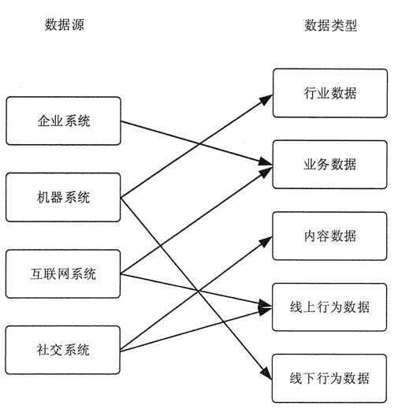

# 大数据采集技术概述

> 原文：[`c.biancheng.net/view/3526.html`](http://c.biancheng.net/view/3526.html)

大数据采集是指从传感器和智能设备、企业在线系统、企业离线系统、社交网络和互联网平台等获取数据的过程。

数据包括 RFID 数据、传感器数据、用户行为数据、社交网络交互数据及移动互联网数据等各种类型的结构化、半结构化及非结构化的海量数据。

不但数据源的种类多，数据的类型繁杂，数据量大，并且产生的速度快，传统的数据采集方法完全无法胜任。

所以，大数据采集技术面临着许多技术挑战，一方面需要保证数据采集的可靠性和高效性，同时还要避免重复数据。

## 大数据分类

传统的数据采集来源单一，且存储、管理和分析数据量也相对较小，大多采用关系型数据库和并行数据仓库即可处理。

在依靠并行计算提升数据处理速度方面，传统的并行数据库技术追求的是高度一致性和容错性，从而难以保证其可用性和扩展性。

在大数据体系中，传统数据分为业务数据和行业数据，传统数据体系中没有考虑过的新数据源包括内容数据、线上行为数据和线下行为数据 3 大类。

在传统数据体系和新数据体系中，数据共分为以下 5 种。

1.  业务数据：消费者数据、客户关系数据、库存数据、账目数据等。
2.  行业数据：车流量数据、能耗数据、PM2.5 数据等。
3.  内容数据：应用日志、电子文档、机器数据、语音数据、社交媒体数据等。
4.  线上行为数据：页面数据、交互数据、表单数据、会话数据、反馈数据等。
5.  线下行为数据：车辆位置和轨迹、用户位置和轨迹、动物位置和轨迹等。

大数据的主要来源如下。

1.  企业系统：客户关系管理系统、企业资源计划系统、库存系统、销售系统等。
2.  机器系统：智能仪表、工业设备传感器、智能设备、视频监控系统等。
3.  互联网系统：电商系统、服务行业业务系统、政府监管系统等。
4.  社交系统：微信、QQ、微博、博客、新闻网站、朋友圈等。

在大数据体系中，数据源与数据类型的关系如图 1 所示。大数据系统从传统企业系统中获取相关的业务数据。
图 1  数据源与数据类型的关系机器系统产生的数据分为两大类：

*   通过智能仪表和传感器获取行业数据，例如，公路卡口设备获取车流量数据，智能电表获取用电量等。
*   通过各类监控设备获取人、动物和物体的位置和轨迹信息。

互联网系统会产生相关的业务数据和线上行为数据，例如，用户的反馈和评价信息，用户购买的产品和品牌信息等。

社交系统会产生大量的內容数据，如博客与照片等，以及线上行为数据。所以，大数据采集与传统数据采集有很大的区别。

从数据源方面来看，传统数据采集的数据源单一，就是从传统企业的客户关系管理系统、企业资源计划系统及相关业务系统中获取数据，而大数据采集系统还需要从社交系统、互联网系统及各种类型的机器设备上获取数据。

从数据量方面来看，互联网系统和机器系统产生的数据量要远远大于企业系统的数据量。

从数据结构方面来看，传统数据采集的数据都是结构化的数据，而大数据采集系统需要采集大量的视频、音频、照片等非结构化数据，以及网页、博客、日志等半结构化数据。

从数据产生速度来看，传统数据采集的数据几乎都是由人操作生成的，远远慢于机器生成数据的效率。因此，传统数据采集的方法和大数据釆集的方法也有根本区别。

## 大数据采集方法分类

大数据的采集是指利用多个数据库或存储系统来接收发自客户端（Web、App 或者传感器形式等）的数据。例如，电商会使用传统的关系型数据库 MySQL 和 Oracle 等来存储每一笔事务数据，在大数据时代，Redis、MongoDB 和 HBase 等 NoSQL 数据库也常用于数据的采集。

大数据的采集过程的主要特点和挑战是并发数高，因为同时可能会有成千上万的用户在进行访问和操作，例如，火车票售票网站和淘宝的并发访问量在峰值时可达到上百万，所以在采集端需要部署大量数据库才能对其支撑，并且，在这些数据库之间进行负载均衡和分片是需要深入的思考和设计的。

根据数据源的不同，大数据采集方法也不相同。但是为了能够满足大数据采集的需要，大数据采集时都使用了大数据的处理模式，即 MapReduce 分布式并行处理模式或基于内存的流式处理模式。

针对 4 种不同的数据源，大数据采集方法有以下几大类。

#### 1\. 数据库采集

传统企业会使用传统的关系型数据库 MySQL 和 Oracle 等来存储数据。

随着大数据时代的到来，Redis、MongoDB 和 HBase 等 NoSQL 数据库也常用于数据的采集。企业通过在采集端部署大量数据库，并在这些数据库之间进行负载均衡和分片，来完成大数据采集工作。

#### 2\. 系统日志采集

系统日志采集主要是收集公司业务平台日常产生的大量日志数据，供离线和在线的大数据分析系统使用。

高可用性、高可靠性、可扩展性是日志收集系统所具有的基本特征。系统日志采集工具均采用分布式架构，能够满足每秒数百 MB 的日志数据采集和传输需求。

详细内容可参考教程《系统日志采集方法》。

#### 3\. 网络数据采集

网络数据采集是指通过网络爬虫或网站公开 API 等方式从网站上获取数据信息的过程。

网络爬虫会从一个或若干初始网页的 URL 开始，获得各个网页上的内容，并且在抓取网页的过程中，不断从当前页面上抽取新的 URL 放入队列，直到满足设置的停止条件为止。

这样可将非结构化数据、半结构化数据从网页中提取出来，存储在本地的存储系统中。

详细内容可参考教程《网络数据采集方法》。

#### 4\. 感知设备数据采集

感知设备数据采集是指通过传感器、摄像头和其他智能终端自动采集信号、图片或录像来获取数据。

大数据智能感知系统需要实现对结构化、半结构化、非结构化的海量数据的智能化识别、定位、跟踪、接入、传输、信号转换、监控、初步处理和管理等。其关键技术包括针对大数据源的智能识别、感知、适配、传输、接入等。