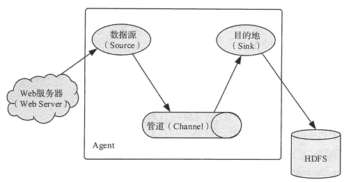

# 通过系统日志采集大数据

> 原文：[`c.biancheng.net/view/3527.html`](http://c.biancheng.net/view/3527.html)

许多公司的平台每天都会产生大量的日志，并且一般为流式数据，如搜索引擎的 pv 和查询等。处理这些日志需要特定的日志系统，这些系统需要具有以下特征。

*   构建应用系统和分析系统的桥梁，并将它们之间的关联解耦。
*   支持近实时的在线分析系统和分布式并发的离线分析系统。
*   具有高可扩展性，也就是说，当数据量增加时，可以通过增加结点进行水平扩展。

目前使用最广泛的、用于系统日志采集的海量数据采集工具有 Hadoop 的 Chukwa、ApacheFlumeAFacebook 的 Scribe 和 LinkedIn 的 Kafka 等。

以上工具均采用分布式架构，能满足每秒数百 MB 的日志数据采集和传输需求。本节我们以 Flume 系统为例对系统日志采集方法进行介绍。

## Flume 的基本概念

Flume 是一个高可用的、高可靠的、分布式的海量日志采集、聚合和传输系统。

Flume 支持在日志系统中定制各类数据发送方，用于收集数据，同时，Flume 提供对数据进行简单处理，并写到各种数据接收方（如文本、HDFS、HBase 等）的能力。

Flume 的核心是把数据从数据源（Source）收集过来，再将收集到的数据送到指定的目的地（Smk）。

为了保证输送的过程一定成功，在送到目的地之前，会先缓存数据到管道（Channel）,待数据真正到达目的地后，Flume 再删除缓存的数据，如图 1 所示。
图 1  Flume 的基本概念
Flume 的数据流由事件（Event）贯穿始终，事件是将传输的数据进行封装而得到的，是 Flume 传输数据的基本单位。

如果是文本文件，事件通常是一行记录。事件携带日志数据并且携带头信息，这些事件由 Agent 外部的数据源生成，当 Source 捕获事件后会进行特定的格式化，然后 Source 会把事件推入(单个或多个) Channel 中。

Channel 可以看作是一个缓冲区，它将保存事件直到 Sink 处理完该事件。Sink 负责持久化日志或者把事件推向另一个 Source。

## Flume 使用方法

Flume 的用法很简单，主要是编写一个用户配置文件。在配置文件当中描述 Source、Channel 与 Sink 的具体实现，而后运行一个 Agent 实例。

在运行 Agent 实例的过程中会读取配置文件的内容，这样 Flume 就会采集到数据。

Flume 提供了大量内置的 Source、Channel 和 Sink 类型，而且不同类型的 Source、Channel 和 Sink 可以进行灵活组合。

配置文件的编写原则如下。

**1）**从整体上描述 Agent 中 Sources、Sinks、Channels 所涉及的组件。

#Name the components on this agent
a1.sources = r1
a1.sinks = k1
a1.channels = c1

**2）**详细描述 Agent 中每一个 Source、Sink 与 Channel 的具体实现，即需要指定 Source 到底是什么类型的，是接收文件的、接收 HTTP 的，还是接收 Thrift 的。

对于 Sink，需要指定结果是输出到 HDFS 中，还是 HBase 中等。

对于 Channel，需要指定格式是内存、数据库，还是文件等。

#Describe/configure the source
al.sources.r1.type = netcat
al.sources.r1.bind = localhost
al.sources.r1.port = 44444

#Describe the sink
a1.sinks.k1.type = logger

#Use a channel which buffers events in memory.
a1.channels.c1.type = memory
a1.channels.c1.capacity = 1000
a1.channels.c1.transactioncapacity = 100

**3）**通过 Channel 将 Source 与 Sink 连接起来。

#Bind the source and sink to the channel
a1.sources.r1.channels = c1
a1.sinks.k1.channel = c1

**4）**启动 Agent 的 shell 操作。

flume-ng agent -n a1 -c ../conf -f ../conf/example.file\
-Dflume.root.logger = DEBUG,console

参数说明如下。

*   “-n”指定 Agent 的名称(与配置文件中代理的名字相同)。
*   “-c"指定 Flume 中配置文件的目录。
*   “-f”指定配置文件。
*   “-Dflume.root.logger = DEBUG,console”设置日志等级。

## Flume 应用案例

NetCat Source 应用可监听一个指定的网络端口，即只要应用程序向这个端口写数据，这个 Source 组件就可以获取到信息。其中，Sink 使用 logger 类型，Channel 使用内存（Memory）格式。

#### 1）编写配置文件

# Name the components on this agent
a1.sources = r1
a1.sinks = k1
a1.channels = c1

# Describe/configure the source
a1.sources.r1.type = netcat
a1.sources.r1.bind = 192.168.80.80
a1.sources.r1.port = 44444

# Describe the sink
a1.sinks.k1.type = logger

# Use a channel which buffers events in memory
a1.channels.c1.type = memory
a1.channels.c1.capacity = 1000
a1.channels.c1.transactionCapacity = 100

# Bind the source and sink to the channel
a1.sources.r1.channels = c1
a1.sinks.k1.channel = c1

该配置文件定义了一个名字为 a1 的 Agent，—个 Source 在 port 44444 监听数据，一个 Channel 使用内存缓存事件，一个 Sink 把事件记录在控制台。

#### 2）启动 FlumeAgental 服务端。

$ flume-ng agent -n al -c ../conf -f ../conf/neteat.conf \
-Dflume.root.logger=DEBUG,console

#### 3）使用 Telnet 发送数据。

以下代码为从另一个终端，使用 Telnet 通过 port 44444 给 Flume 发送数据。

$ telnet local host 44444
Trying 127.0.0.1...
Connected to localhost.localdomain(127.0.0.1).
Escape character is '^]'.
Hello world! <ENTER>
OK

#### 4）在控制台上查看 Flume 收集到的日志数据。

17/6/19 15:32:19 INFO source.NetcatSource: Sources tarting
17/06/19 15:32:19 INFO source.NetcatSource: Created serverSocket:sun.nio.ch.
ServerSocketChannelImpl[/127.0.0.1:44444]
17/06/19 15:32:34 INFO sink.LoggerSink: Event:{ headers:{} body:48 65 6C 6C 6F 20 77 6F 72 6C 64 21 0D Helloworld! .}