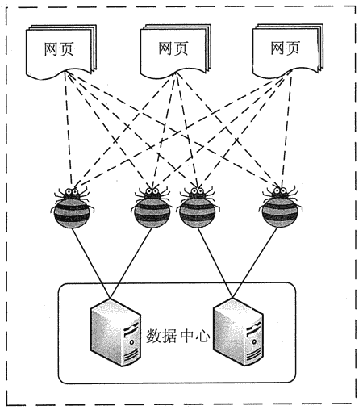
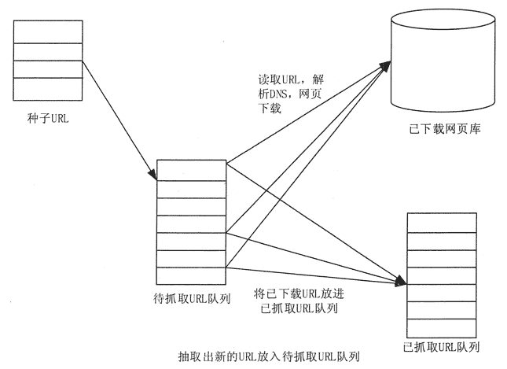
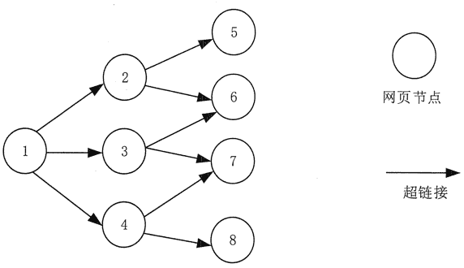
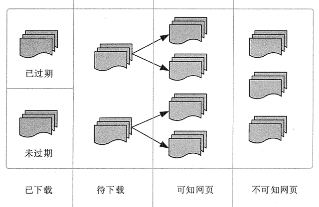
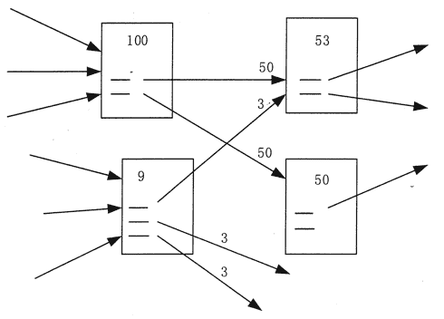

# 通过网络爬虫采集大数据

> 原文：[`c.biancheng.net/view/3530.html`](http://c.biancheng.net/view/3530.html)

网络数据采集是指通过网络爬虫或网站公开 API 等方式从网站上获取数据信息。该方法可以将非结构化数据从网页中抽取出来，将其存储为统一的本地数据文件，并以结构化的方式存储。它支持图片、音频、视频等文件或附件的采集，附件与正文可以自动关联。

在互联网时代，网络爬虫主要是为搜索引擎提供最全面和最新的数据。

在大数据时代，网络爬虫更是从互联网上采集数据的有利工具。目前已经知道的各种网络爬虫工具已经有上百个，网络爬虫工具基本可以分为 3 类。

*   分布式网络爬虫工具，如 Nutch。
*   Java 网络爬虫工具，如 Crawler4j、WebMagic、WebCollector。
*   非 Java 网络爬虫工具，如 Scrapy(基于 Python 语言开发)。

本节首先对网络爬虫的原理和工作流程进行简单介绍，然后对网络爬虫抓取策略进行讨论，最后对典型的网络工具进行描述。

## 网络爬虫原理

网络爬虫是一种按照一定的规则，自动地抓取 Web 信息的程序或者脚本。

Web 网络爬虫可以自动采集所有其能够访问到的页面内容，为搜索引擎和大数据分析提供数据来源。从功能上来讲，爬虫一般有数据采集、处理和存储 3 部分功能，如图 1 所示。
图 1  网络爬虫示意
网页中除了包含供用户阅读的文字信息外，还包含一些超链接信息。

网络爬虫系统正是通过网页中的超链接信息不断获得网络上的其他网页的。网络爬虫从一个或若干初始网页的 URL 开始，获得初始网页上的 URL，在抓取网页的过程中，不断从当前页面上抽取新的 URL 放入队列，直到满足系统的一定停止条件。

网络爬虫系统一般会选择一些比较重要的、出度（网页中链出的超链接数）较大的网站的 URL 作为种子 URL 集合。

网络爬虫系统以这些种子集合作为初始 URL，开始数据的抓取。因为网页中含有链接信息，通过已有网页的 URL 会得到一些新的 URL。

可以把网页之间的指向结构视为一个森林，每个种子 URL 对应的网页是森林中的一棵树的根结点，这样网络爬虫系统就可以根据广度优先搜索算法或者深度优先搜索算法遍历所有的网页。

由于深度优先搜索算法可能会使爬虫系统陷入一个网站内部，不利于搜索比较靠近网站首页的网页信息，因此一般采用广度优先搜索算法采集网页。

网络爬虫系统首先将种子 URL 放入下载队列，并简单地从队首取出一个 URL 下载其对应的网页，得到网页的内容并将其存储后，经过解析网页中的链接信息可以得到一些新的 URL。

其次，根据一定的网页分析算法过滤掉与主题无关的链接，保留有用的链接并将其放入等待抓取的 URL 队列。

最后，取出一个 URL，对其对应的网页进行下载，然后再解析，如此反复进行，直到遍历了整个网络或者满足某种条件后才会停止下来。

## 网络爬虫工作流程

如图 2 所示，网络爬虫的基本工作流程如下。

1）首先选取一部分种子 URL。

2）将这些 URL 放入待抓取 URL 队列。

3）从待抓取 URL 队列中取出待抓取 URL，解析 DNS，得到主机的 IP 地址，并将 URL 对应的网页下载下来，存储到已下载网页库中。此外，将这些 URL 放进已抓取 URL 队列。

4）分析已抓取 URL 队列中的 URL，分析其中的其他 URL，并且将这些 URL 放入待抓取 URL 队列，从而进入下一个循环。
图 2  网络爬虫的基本工作流程

## 网络爬虫抓取策略

Google 和百度等通用搜索引擎抓取的网页数量通常都是以亿为单位计算的。那么，面对如此众多的网页，通过何种方式才能使网络爬虫尽可能地遍历所有网页，从而尽可能地扩大网页信息的抓取覆盖面，这是网络爬虫系统面对的一个很关键的问题。在网络爬虫系统中，抓取策略决定了抓取网页的顺序。

本节首先对网络爬虫抓取策略用到的基本概念做简单介绍。

#### 1）网页间关系模型

从互联网的结构来看，网页之间通过数量不等的超链接相互连接，形成一个彼此关联、庞大复杂的有向图。

如图 3 所示，如果将网页看成是图中的某一个结点，而将网页中指向其他网页的链接看成是这个结点指向其他结点的边，那么我们很容易将整个互联网上的网页建模成一个有向图。

理论上讲，通过遍历算法遍历该图，可以访问到互联网上几乎所有的网页。

图 3  网页关系模型图

#### 2）网页分类

从爬虫的角度对互联网进行划分，可以将互联网的所有页面分为 5 个部分：已下载未过期网页、已下载已过期网页、待下载网页、可知网页和不可知网页，如图 4 所示。

抓取到本地的网页实际上是互联网内容的一个镜像与备份。互联网是动态变化的，当一部分互联网上的内容发生变化后，抓取到本地的网页就过期了。所以，已下载的网页分为已下载未过期网页和已下载已过期网页两类。

图 4  网页分类待下载网页是指待抓取 URL 队列中的那些页面。

可知网页是指还没有抓取下来，也没有在待抓取 URL 队列中，但是可以通过对已抓取页面或者待抓取 URL 对应页面进行分析，从而获取到的网页。

还有一部分网页，网络爬虫是无法直接抓取下载的，称为不可知网页。

下面重点介绍几种常见的抓取策略。

#### 1.  通用网络爬虫

通用网络爬虫又称全网爬虫，爬行对象从一些种子 URL 扩展到整个 Web，主要为门户站点搜索引擎和大型 Web 服务提供商采集数据。

为提高工作效率，通用网络爬虫会采取一定的爬行策略。常用的爬行策略有深度优先策略和广度优先策略。

**1）深度优先策略**

深度优先策略是指网络爬虫会从起始页开始，一个链接一个链接地跟踪下去，直到不能再深入为止。

网络爬虫在完成一个爬行分支后返回到上一链接结点进一步搜索其他链接。当所有链接遍历完后，爬行任务结束。

这种策略比较适合垂直搜索或站内搜索，但爬行页面内容层次较深的站点时会造成资源的巨大浪费。

以图 3 为例，遍历的路径为 1→2→5→6→3→7→4→8。

在深度优先策略中，当搜索到某一个结点的时候，这个结点的子结点及该子结点的后继结点全部优先于该结点的兄弟结点，深度优先策略在搜索空间的时候会尽量地往深处去，只有找不到某结点的后继结点时才考虑它的兄弟结点。

这样的策略就决定了深度优先策略不一定能找到最优解，并且由于深度的限制甚至找不到解。

如果不加限制，就会沿着一条路径无限制地扩展下去，这样就会“陷入”到巨大的数据量中。一般情况下，使用深度优先策略都会选择一个合适的深度，然后反复地搜索，直到找到解，这样搜索的效率就降低了。所以深度优先策略一般在搜索数据量比较小的时候才使用。

**2）广度优先策略**

广度优先策略按照网页内容目录层次深浅来爬行页面，处于较浅目录层次的页面首先被爬行。当同一层次中的页面爬行完毕后，爬虫再深入下一层继续爬行。

仍然以图 3 为例，遍历的路径为 1→2→3→4→5→6→7→8

由于广度优先策略是对第 N 层的结点扩展完成后才进入第 N+1 层的，所以可以保证以最短路径找到解。

这种策略能够有效控制页面的爬行深度，避免遇到一个无穷深层分支时无法结束爬行的问题，实现方便，无须存储大量中间结点，不足之处在于需较长时间才能爬行到目录层次较深的页面。

如果搜索时分支过多，也就是结点的后继结点太多，就会使算法耗尽资源，在可以利用的空间內找不到解。

#### 2.  聚焦网络爬虫

聚焦网络爬虫又称主题网络爬虫，是指选择性地爬行那些与预先定义好的主题相关的页面的网络爬虫。

**1）基于内容评价的爬行策略**

DeBra 将文本相似度的计算方法引入到网络爬虫中，提出了 Fish Search 算法。

该算法将用户输入的查询词作为主题，包含查询词的页面被视为与主题相关的页面，其局限性在于无法评价页面与主题相关度的大小。

Herseovic 对 Fish Search 算法进行了改进，提出了 Shark Search 算法，即利用空间向量模型计算页面与主题的相关度大小。

采用基于连续值计算链接价值的方法，不但可以计算出哪些抓取的链接和主题相关，还可以得到相关度的量化大小。

**2）基于链接结构评价的爬行策略**

网页不同于一般文本，它是一种半结构化的文档，包含了许多结构化的信息。

网页不是单独存在的，页面中的链接指示了页面之间的相互关系，基于链接结构的搜索策略模式利用这些结构特征来评价页面和链接的重要性，以此决定搜索的顺序。其中，PageRank 算法是这类搜索策略模式的代表。

PageRank 算法的基本原理是，如果一个网页多次被引用，则可能是很重要的网页，如果一个网页没有被多次引用，但是被重要的网页引用，也有可能是重要的网页。一个网页的重要性被平均地传递到它所引用的网页上。

将某个页面的 PageRank 除以存在于这个页面的正向链接，并将得到的值分别和正向链接所指的页面的 PageRank 相加，即得到了被链接的页面的 PageRank。

如图 5 所示，PageRank 值为 100 的网页把它的重要性平均传递给了它所引用的两个页面，每个页面获得了 50，同样 PageRank 值为 9 的网页给它所引用的 3 个页面的每个页面传递的值为 3。

PageRank 值为 53 的页面的值来源于两个引用了它的页面传递过来的值。
、
图 5  PageRank 算法示例
**3）基于增强学习的爬行策略**

Rennie 和 McCallum 将增强学习引入聚焦爬虫，利用贝叶斯分类器，根据整个网页文本和链接文本对超链接进行分类，为每个链接计算出重要性，从而决定链接的访问顺序。

**4）基于语境图的爬行策略**

Diligenti 等人提出了一种通过建立语境图学习网页之间的相关度的爬行策略，该策略可训练一个机器学习系统，通过该系统可计算当前页面到相关 Web 页面的距离，距离近的页面中的链接优先访问。

#### 3\. 增量式网络爬虫

增量式网络爬虫是指对已下载网页采取增量式更新并且只爬行新产生的或者已经发生变化网页的爬虫，它能够在一定程度上保证所爬行的页面是尽可能新的页面。

增量式网络爬虫有两个目标：

*   保持本地页面集中存储的页面为最新页面。
*   提高本地页面集中页面的质量。

为实现第一个目标，增量式网络爬虫需要通过重新访问网页来更新本地页面集中页面的内容。常用的方法有统一更新法、个体更新法和基于分类的更新法。

*   在统一更新法中，网络爬虫以相同的频率访问所有网页，而不考虑网页的改变频率。
*   在个体更新法中，网络爬虫根据个体网页的改变频率来重新访问各页面。
*   在基于分类的更新法中，网络爬虫根据网页改变频率将其分为更新较快网页子集和更新较慢网页子集两类，然后以不同的频率访问这两类网页。

为实现第二个目标，增量式网络爬虫需要对网页的重要性排序，常用的策略有广度优先策略、PageRank 优先策略等。

#### 4\. 深层网络爬虫

网页按存在方式可以分为表层网页和深层网页。

*   表层网页是指传统搜索引擎可以索引的页面，以超链接可以到达的静态网页为主。
*   深层网页是那些大部分内容不能通过静态链接获取的，隐藏在搜索表单后的，只有用户提交一些关键词才能获得的网页。

深层网络爬虫体系结构包含 6 个基本功能模块（爬行控制器、解析器、表单分析器、表单处理器、响应分析器、LVS 控制器）和两个爬虫内部数据结构（URL 列表和 LVS 表）。

其中，LVS（LabelValueSet）表示标签和数值集合，用来表示填充表单的数据源。在爬取过程中，最重要的部分就是表单填写，包含基于领域知识的表单填写和基于网页结构分析的表单填写两种。