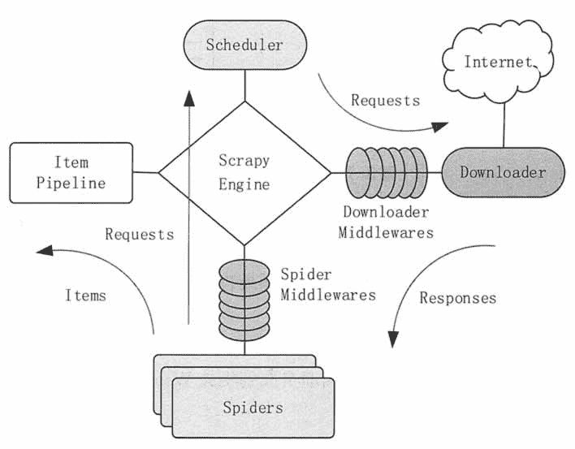

# Scrapy 网络爬虫简介

> 原文：[`c.biancheng.net/view/3541.html`](http://c.biancheng.net/view/3541.html)

Scrapy 是一个为了爬取网站数据、提取结构性数据而编写的应用框架，可以应用在包括数据挖掘、信息处理或存储历史数据等一系列的程序中。

#### 1\. Scrapy 架构

Scrapy 的整体架构由 Scrapy 引擎（ScrapyEngine）、调度器（Scheduler）、下载器（Downloader）、爬虫（Spiders）和数据项管道（itemPipeline）5 个组件组成。图 1 展示了各个组件的交互关系和系统中的数据流。
图 1  Scrapy 架构 Scrapy 的架构由以下 5 个组件和两个中间件构成。

| 组件/中间件 | 作用 |
| --- | --- |
| Scrapy 引擎（ScrapyEngine） | 是整个系统的核心，负责控制数据在整个组件中的流动，并在相应动作发生时触发事件。 |
| 调度器（Scheduler） | 管理 Request 请求的出入栈，去除重复的请求。调度器从 Scrapy 引擎接收请求，并将请求加入请求队列，以便在后期需要的时候提交给 Scrapy 引擎。 |
| 下载器（Downloader） | 负责获取页面数据，并通过 Scrapy 引擎提供给网络爬虫。 |
| 网络爬虫（Spiders） | 是 Scrapy 用户编写的用于分析结果并提取数据项或跟进的 URL 的类。每个爬虫负责处理一个（或者一组）特定网站。 |
| 数据项管道（ItemPipeline） | 负责处理被爬虫提取出来的数据项。典型的处理有清理、验证及持久化。 |
| 下载器中间件 | 是引擎和下载器之间的特定接口，处理下载器传递给引擎的结果。其通过插入自定义代码来扩展下载器的功能。 |
| 爬虫中间件 | 是引擎和爬虫之间的特定接口，用来处理爬虫的输入，并输出数据项。其通过插入自定义代码来扩展爬虫的功能。 |

Scrapy 中的数据流由 Scrapy 引擎控制，整体的流程如下。

**1）**Scrapy 引擎打开一个网站，找到处理该网站的爬虫，并询问爬虫第一次要爬取的 URL。

**2）**Scrapy 引擎从爬虫中获取第一次要爬取的 URL，并以 Request 方式发送给调度器。

**3）**Scrapy 引擎向调度器请求下一个要爬取的 URL。

**4）**调度器返回下一个要爬取的 URL 给 Scrapy 引擎，Scrapy 引擎将 URL 通过下载器中间件转发给下载器。

**5）**下载器下载给定的网页，下载完毕后，生成一个该页面的结果，并将其通过下载器中间件发送给 Scrapy 引擎。

**6）**Scrapy 引擎从下载器中接收到下载结果，并通过爬虫中间件发送给爬虫进行处理。

**7）**爬虫对结果进行处理，并返回爬取到的数据项及需要跟进的新的 URL 给 Scrapy 引擎。

**8）**Scrapy 引擎将爬取到的数据项发送给数据项管道，将爬虫生成的新的请求发送给调度器。

**9）**从步骤（2）开始重复，直到调度器中没有更多的请求，Scrapy 引擎关闭该网站。

#### 2\. Scrapy 应用案例

如果需要从某个网站中获取信息，但该网站未提供 API 或能通过程序获取信息的机制，Scrapy 就可以用来完成这个任务。

本节通过一个具体应用来讲解使用 Scrapy 抓取数据的方法。本应用要获取在当当网站销售的有关“Python 核心编程”和“Python 基础教程”的所有书籍的 URL、名字、描述及价格等信息。

**1）创建项目**

在开始爬取之前，必须创建一个新的 Scrapy 项目。进入打算存储代码的目录中，运行下列命令。

scrapy startproject tutorial

该命令将会创建包含下列内容的 tutorial 目录。

tutorial/
    scrapy.cfg
    tutorial/
        —init_.py
        items.py
        pipelines.py
        settings.py
        spiders/
            _init_.py
            ...

这些文件分别如下。

| 名称 | 说明 |
| --- | --- |
| scrapy.cfg | 项目的配置文件 |
| tutorial/ | 项目的 Python 模块，之后将在此加入代码 |
| tutorial/items.py | 项目中的 item 文件 |
| tutorial/pipelines.py | 项目中的 pipelines 文件 |
| tutorial/settings.py | 项目的设置文件 |
| tutorial/spiders/ | 放置 Spider 代码的目录 |

**2）定义 Item**

在 Scrapy 中，Item 是保存爬取到的数据的容器，其使用方法和 Python 字典类似，并且提供了额外保护机制来避免拼写错误导致的未定义字段错误。

一般来说，Item 可以用 scrapy.item.Item 类来创建，并且用 scrapy.item.Field 对象来定义属性。

如果想要从网页抓取的每一本书的内容为书名（Title）、链接（Link）、简介（Description）和价格（Price），则根据要抓取的内容，可构建 Item 的模型。

修改 tutorial 目录下的 items.py 文件，在原来的类后面添加新的类。因为要抓当当网站的内容，所以我们可以将其命名为 DangItem，并定义相应的字段。编辑 tutorial 目录中的 items.py 文件。

import scrapy

class DangItem(scrapy.Item):
    title = scrapy.Field()
    link. = scrapy.Field()
    dese = scrapy.Field()
    price = scrapy.Filed()

**3）编写 Spider**

Spider 是用户编写的用于从单个（或一组）网站爬取数据的类。它包含了一个用于下载的初始 URL，负责跟进网页中的链接的方法，负责分析页面中的内容的方法，以及负责提取生成的 Item 的方法。

创建的 Spider 必须继承 scrapy.Spider 类，并且需要定义以下 3 个属性。

*   name:Spider 的名字，必须是唯一的，不可以为不同的 Spider 设定相同的名字。
*   start_urls：包含了 Spider 在启动时进行爬取的 URL 列表。第一个被获取到的页面是其中之一，后续的 URL 则从初始的 URL 获取到的数据中提取。
*   parse()：是一个用来解析下载返回数据的方法。被调用时，每个初始 URL 完成下载后生成的 Response 对象将会作为唯一的参数传递给该方法。该方法将负责解析返回的数据（Response），提取数据生成 Item，以及生成需要进一步处理的 URL 的 Request 对象。

以下是我们编写的 Spider 代码，保存在 tutorial/spiders 目录下的 dang_spider.py 文件中。

```

import scrapy

class DangSpider(scrapy.Spider):
    name = "dangdang"
    allowed_domains=["dangdang.com”]
    start_urls=[
        http://search.dangdang.com/?key=python 核心编程&act=click,
        http://search.dangdang.com/?key=python 基础教程&act=click]

        def parse(self,response):
            filename=response.url.split("/")[-2]
            with open(filename,'wb')as f:
                f.write(response.body)
```

**4）爬取**

进入项目的根目录，执行下列命令启动 Spider。

scrapy crawl dmoz

该命令将会启动用于爬取 dangdang.com 的 Spider，系统将会产生类似的输出。

2017-01-23 18:13:07-0400 [scrapy] INFO: Scrapy started (bot: tutorial)
2017-01-23 18:13:07-0400 [scrapy] INFO: Optional features available: ...
2017-01-23 18:13:07-0400 [scrapy] INFO: Overridden settings: {}
2017-01-23 18:13:07-0400 [scrapy] INFO: Enabled extensions: ...
2017-01-23 18:13:07-0400 [scrapy] INFO: Enabled downloader middlewares: ...
2017-01-23 18:13:07-0400 [scrapy] INFO: Enabled spider middlewares: ...
2017-01-23 18:13:07-0400 [scrapy] INFO: Enabled item.pipelines: ...
2017-01-23 18:13:07-0400 [dangdang] INFO: Spider opened
2017-01-23 18:13:08-0400： [dangdang] DEBUG:  Crawled (200)<GET http://search.
langdang.com/?key=python 核心编程&act=click> (referer: None)
2017-01-23  18:13:08-0400 [dangdang] DEBUG: Crawled (200)<GET http://search.
dangdang.com/?key=python 基础教程&act=click> (referer: None)
2017-01-23 18:13:09-0400 [dangdang] INFO: Closing spider (finished)

查看包含“dangdang”的输出，可以看到，输出的 log 中包含定义在 start_urls 中的初始 URL，并且与 Spider 中是一一对应的。在 log 中可以看到其没有指向其他页面(referer:None)。

除此之外，根据 parse 方法，有两个包含 URL 所对应的内容的文件被创建了，即 Python 核心编程和 Python 基础教程。

在执行上面的 shell 命令时，scrapy 会创建一个 scrapy.http.Request 对象，将 start_url 传递给 它，抓取完毕后，回调 parse 函数。

**5）提取 Item**

在抓取任务中，一般不会只抓取网页，而是要将抓取的结果直接变成结构化数据。根据前面定义的 Item 数据模型，我们就可以修改 Parser，并用 Scmpy 内置的 XPath 解析 HTML 文档。

通过观察当当网页源码，我们发现有关书籍的信息都是包含在第二个＜ul＞元素中的，并且相关的书籍被用列表方式展现出来。所以，我们可以用下述代码选择该网页中书籍列表里所有<Vli＞元素，每一个元素对应一本书。选择<li＞元素的函数是 response.xpath("//ul/li")。

```

from scrapy.spider import bpiaer
from scrapy.selector import Selector
from tutorial.items import DangItem
class DangSpider(Spider)
    name = "dangdang"
    allowed_domains = ["dangdang.com"]
    start_urls =[
    http: //search.dangdang.com/?key=python 核心编程&act=click,
    http: //search.dangdang.com/?key=python 基础教程&act=click ]

def parse(self, response):

sel = Selector(response)
sites = sel.xpath('//ul/li)
items =[]
for site in sites:

item = DangItem()
item['title'] = site.xpath ('a/text()').extract() item['link'] = site.xpath ('a/@href').extract() item['desc'] = site.xpath ('text()').extract()
item['rice'] = site.xpath('text()') .extract() items.append(item)
return items
```

增加 json 选项把结果保存为 JSON 格式，执行下列命令启动 Scrapy。

scrapy crawl dangdang -o items.json

该命名将采用 JSON 格式对爬取的数据进行序列化，并生成 items.json 文件。