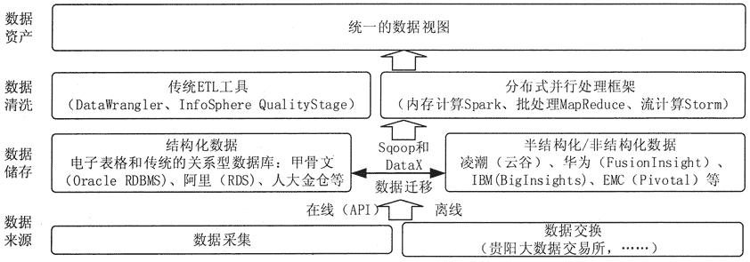
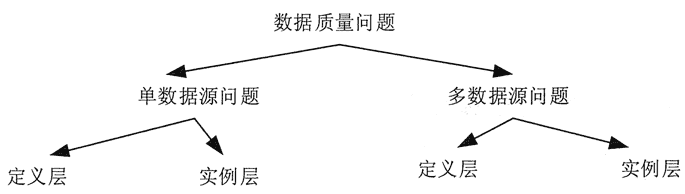

# 大数据预处理架构和方法简介

> 原文：[`c.biancheng.net/view/3544.html`](http://c.biancheng.net/view/3544.html)

数据预处理主要包括数据清洗（Data Cleaning）、数据集成（Data Integration）、数据转换（Data Transformation）和数据消减（Data Reduction）。本节在介绍大数据预处理基本概念的基础上对数据预处理的方法进行讲解。

## 大数据预处理整体架构

大数据预处理将数据划分为结构化数据和半结构化/非结构化数据，分别采用传统 ETL 工具和分布式并行处理框架来实现。总体架构如图 1 所示。
图 1  大数据预处理总体架构
结构化数据可以存储在传统的关系型数据库中。关系型数据库在处理事务、及时响应、保证数据的一致性方面有天然的优势。

非结构化数据可以存储在新型的分布式存储中，如 Hadoop 的 HDFSo 半结构化数据可以存储在新型的分布式 NoSQL 数据库中，如 HBase。

分布式存储在系统的横向扩展性、存储成本、文件读取速度方面有着显著的优势。

结构化数据和非结构化数据之间的数据可以按照数据处理的需求进行迁移。例如，为了进行快速并行处理，需要将传统关系型数据库中的结构化数据导入到分布式存储中。

可以利用 Sqoop 等工具，先将关系型数据库的表结构导入分布式数据库，然后再向分布式数据库的表中导入结构化数据。

## 数据质量问题分类

数据清洗在汇聚多个维度、多个来源、多种结构的数据之后，对数据进行抽取、转换和集成加载。

在以上过程中，除了更正、修复系统中的一些错误数据之外，更多的是对数据进行归并整理，并储存到新的存储介质中。其中，数据的质量至关重要。

如图 2 所示，常见的数据质量问题可以根据数据源的多少和所属层次（定义层和实例层）分为 4 类。

**1）单数据源定义层**

违背字段约束条件（例如，日期出现 9 月 31 日），字段属性依赖冲突（例如，两条记录描述同一个人的某一个属性，但数值不一致），违反唯一性（同一个主键 ID 出现了多次）等。

**2）单数据源实例层**

单个属性值含有过多信息，拼写错误，存在空白值，存在噪音数据，数据重复，数据过时等；

**3）多数据源定义层**

同一个实体的不同称呼（如 custom_id、custom_num），同一种属性的不同定义（例如，字段长度定义不一致，字段类型不一致等）；

**4）多数据源实例层**

数据的维度、粒度不一致（例如，有的按 GB 记录存储量，有的按 TB 记录存储量；有的按照年度统计，有的按照月份统计），数据重复，拼写错误等。

图 2  数据质量问题分类
除此之外，在数据处理过程中产生的“二次数据”，也会有噪声、重复或错误的情况。

数据的调整和清洗，也会涉及格式、测量单位和数据标准化与归一化的相关事情，以致对实验结果产生比较大的影响。通常这类问题可以归结为不确定性。

不确定性有两方面内涵，包括各数据点自身存在的不确定性，以及数据点属性值的不确定性。前者可用概率描述，后者有多重描述方式，如描述属性值的概率密度函数，以方差为代表的统计值等。

## 大数据预处理方法

噪声数据是指数据中存在着错误或异常（偏离期望值）的数据，不完整数据是指感兴趣的属性没有值，而不一致数据则是指数据内涵出现不一致情况（例如，作为关键字的同一部门编码出现不同值）。

数据清洗是指消除数据中存在的噪声及纠正其不一致的错误。数据集成是指将来自多个数据源的数据合并到一起构成一个完整的数据集。

数据转换是指将一种格式的数据转换为另一种格式的数据。数据消减是指通过删除冗余特征或聚类消除多余数据。

不完整、有噪声和不一致对大数据来讲是非常普遍的情况。不完整数据的产生有多种原因。

*   有些属性的内容有时没有，例如，参与销售事务数据中的顾客信息不完整。
*   有些数据产生交易的时候被认为是不必要的而没有被记录下来。
*   由于误解或检测设备失灵导致相关数据没有被记录下来。
*   与其他记录内容不一致而被删除。
*   历史记录或对数据的修改被忽略了。遗失数据，尤其是一些关键属性的遗失数据或许需要被推导出来。

噪声数据的产生原因如下。

*   数据采集设备有问题。
*   在数据录入过程发生了人为或计算机错误。
*   数据传输过程中发生错误。
*   由于命名规则或数据代码不同而引起的不一致。

数据清洗的处理过程通常包括填补遗漏的数据值，平滑有噪声数据，识别或除去异常值，以及解决不一致问题。有问题的数据将会误导数据挖掘的搜索过程。详细内容可参考《数据清洗》教程。

尽管大多数数据挖掘过程均包含对不完全或噪声数据的处理，但它们并不完全可靠且常常将处理的重点放在如何避免所挖掘出的模式对数据过分准确的描述上。因此进行一定的数据清洗对数据处理是十分必要的。

数据集成就是将来自多个数据源的数据合并到一起。由于描述同一个概念的属性在不同数据库中有时会取不同的名字，所以在进行数据集成时就常常会引起数据的不一致或冗余。

例如，在一个数据库中，一个顾客的身份编码为“custom_number”，而在另一个数据库中则为“custom_id”。命名的不一致常常也会导致同一属性值的内容不同。

例如，在一个数据库中一个人的姓取“John”，而在另一个数据库中则取“J”。大量的数据冗余不仅会降低挖掘速度，而且也会误导挖掘进程。因此，除了进行数据清洗之外，在数据集成中还需要注意消除数据的冗余。

详细内容可参考《数据集成》教程。

数据转换主要是对数据进行规格化操作。在正式进行数据挖掘之前，尤其是使用基于对象距离的挖掘算法时，如神经网络、最近邻分类等，必须进行数据规格化，也就是将其缩至特定的范围之内，如[0,l]。

例如，对于一个顾客信息数据库中的年龄属性或工资属性，由于工资属性的取值比年龄属性的取值要大许多，如果不进行规格化处理，基于工资属性的距离计算值显然将远远超过基于年龄属性的距离计算值，这就意味着工资属性的作用在整个数据对象的距离计算中被错误地放大了。

详细内容可参考《数据转换》教程。

数据消减的目的就是缩小所挖掘数据的规模，但却不会影响（或基本不影响）最终的挖掘结果。现有的数据消减方法如下。

**1）数据聚合（DataAggregation）**，如构造数据立方。

**2）消减维数（DimensionReduction）**，如通过相关分析消除多余属性。

**3）数据压缩（DataCompression）**，如利用编码方法（如最小编码长度或小波）。

**4）数据块消减（NmnerosityReduction）**，如利用聚类或参数模型替代原有数据。此外，利用基于概念树的泛化（Generalization）也可以实现对数据规模的消减。

这些数据预处理方法并不是相互独立的，而是相互关联的。例如，消除数据冗余既可以看成是一种形式的数据清洗，也可以认为是一种数据消减。

详细内容可参考《数据消减》教程。