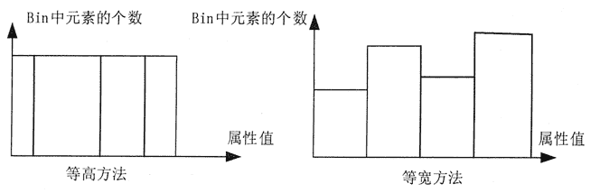
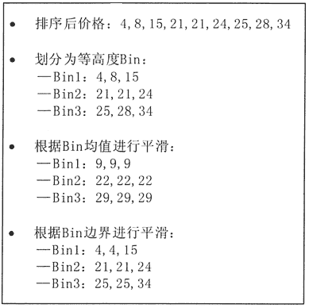
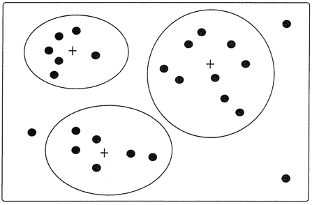

# 大数据预处理之数据清洗

> 原文：[`c.biancheng.net/view/3545.html`](http://c.biancheng.net/view/3545.html)

现实世界的数据常常是不完全的、有噪声的、不一致的。数据清洗过程包括遗漏数据处理，噪声数据处理，以及不一致数据处理。本节介绍数据清洗的主要处理方法。

## 遗漏数据处理

假设在分析一个商场销售数据时，发现有多个记录中的属性值为空，如顾客的收入属性，则对于为空的属性值，可以采用以下方法进行遗漏数据处理。

**1）忽略该条记录**

若一条记录中有属性值被遗漏了，则将此条记录排除，尤其是没有类别属性值而又要进行分类数据挖掘时。

当然，这种方法并不很有效，尤其是在每个属性的遗漏值的记录比例相差较大时。

**2）手工填补遗漏值**

一般这种方法比较耗时，而且对于存在许多遗漏情况的大规模数据集而言，显然可行性较差。

**3）利用默认值填补遗漏值**

对一个属性的所有遗漏的值均利用一个事先确定好的值来填补，如都用“OK”来填补。但当一个属性的遗漏值较多时，若采用这种方法，就可能误导挖掘进程。

因此这种方法虽然简单，但并不推荐使用，或使用时需要仔细分析填补后的情况，以尽量避免对最终挖掘结果产生较大误差。

**4）利用均值填补遗漏值**

计算一个属性值的平均值，并用此值填补该属性所有遗漏的值。例如，若顾客的平均收入为 10000 元，则用此值填补“顾客收入”属性中所有被遗漏的值。

**5）利用同类别均值填补遗漏值**

这种方法尤其适合在进行分类挖掘时使用。

例如，若要对商场顾客按信用风险进行分类挖掘时，就可以用在同一信用风险类别（如良好）下的“顾客收入”属性的平均值，来填补所有在同一信用风险类别下“顾客收入”属性的遗漏值。

**6）利用最可能的值填补遗漏值**

可以利用回归分析、贝叶斯计算公式或决策树推断出该条记录特定属性的最大可能的取值。

例如，利用数据集中其他顾客的属性值，可以构造一个决策树来预测“顾客收入”属性的遗漏值。

最后一种方法是一种较常用的方法，与其他方法相比，它最大程度地利用了当前数据所包含的信息来帮助预测所遗漏的数据。

## 噪声数据处理

噪声是指被测变量的一个随机错误和变化。下面通过给定一个数值型属性（如价格）来说明平滑去噪的具体方法。

#### 1\. Bin 方法

Bin 方法通过利用应被平滑数据点的周围点（近邻），对一组排序数据进行平滑。排序后的数据被分配到若干桶（称为 Bins）中。

如图 1 所示，对 Bin 的划分方法一般有两种，一种是等高方法，即每个 Bin 中的元素的个数相等，另一种是等宽方法，即每个 Bin 的取值间距（左右边界之差）相同。
图 1  两种典型 Bin 划分方法
图 2 描述了一些 Bin 方法技术。首先，对价格数据进行排序，然后，将其划分为若干等高度的 Bin，即每个 Bin 包含 3 个数值，最后，既可以利用每个 Bin 的均值进行平滑，也可以利用每个 Bin 的边界进行平滑。

利用均值进行平滑时，第一个 Bin 中 4、8、15 均用该 Bin 的均值替换，利用边界进行平滑时，对于给定的 Bin，其最大值与最小值就构成了该 Bin 的边界，利用每个 Bin 的边界值（最大值或最小值）可替换该 Bin 中的所有值。

一般来说，每个 Bin 的宽度越宽，其平滑效果越明显。

图 2  利用 Bin 方法平滑去噪

#### 2\. 聚类分析方法

通过聚类分析方法可帮助发现异常数据。相似或相邻近的数据聚合在一起形成了各个聚类集合，而那些位于这些聚类集合之外的数据对象，自然而然就被认为是异常数据。

如图 3 所示。聚类分析方法的具体内容将在本章教程大数据挖掘中详细介绍。

图 3  基于聚类分析方法的异常数据监测

#### 3\. 人机结合检查方法

通过人机结合检查方法，可以帮助发现异常数据。

例如，利用基于信息论的方法可帮助识别手写符号库中的异常模式，所识别出的异常模式可输出到一个列表中，然后由人对这一列表中的各异常模式进行检查，并最终确认无用的模式（真正异常的模式）。

这种人机结合检查方法比手工方法的手写符号库检查效率要高许多。

#### 4\. 回归方法

可以利用拟合函数对数据进行平滑。

例如，借助线性回归方法，包括多变量回归方法，就可以获得多个变量之间的拟合关系，从而达到利用一个（或一组）变量值来预测另一个变量取值的目的。

利用回归分析方法所获得的拟合函数，能够帮助平滑数据及除去其中的噪声。

许多数据平滑方法，同时也是数据消减方法，例如，以上描述的 Bin 方法可以帮助消减一个属性中的不同取值，这也就意味着 Bin 方法可以作为基于逻辑挖掘方法的数据消减处理方法。

## 不一致数据处理

现实世界的数据库常岀现数据记录内容不一致的问题，其中的一些数据可以利用它们与外部的关联，手工解决这种问题。

例如，数据录入错误一般可以通过与原稿进行对比来加以纠正。 此外还有一些方法可以帮助纠正使用编码时所发生的不一致问题。知识工程工具也可以帮助发 现违反数据约束条件的情况。

由于同一属性在不同数据库中的取名不规范，常常使得在进行数据集成时，导致不一致情况的发生。