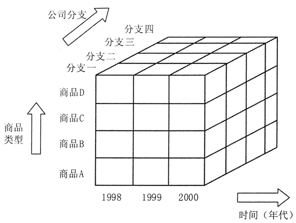
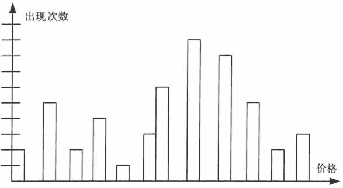
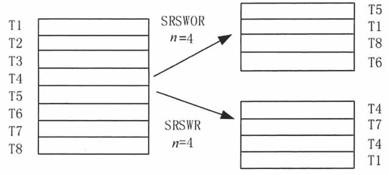
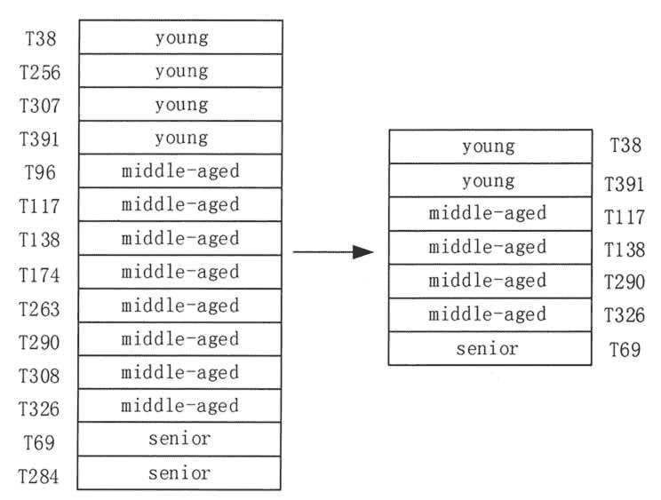

# 大数据预处理之数据消减

> 原文：[`c.biancheng.net/view/3550.html`](http://c.biancheng.net/view/3550.html)

我们都知道对大规模数据进行复杂的数据分析通常需要耗费大量的时间，这时就需要我们的数据消减技术了。

数据消减技术的主要目的就是从原有巨大数据集中获得一个精简的数据集，并使这一精简数据集保持原有数据集的完整性。这样在精简数据集上进行数据挖掘就会提高效率，并且能够保证挖掘出来的结果与使用原有数据集所获得的结果基本相同。

数据消减的主要策略有以下几种。

| 名称 | 说明 |
| --- | --- |
| 数据立方合计 | 这类合计操作主要用于构造数据立方（数据仓库操作）。 |
| 维数消减 | 主要用于检测和消除无关、弱相关，或冗余的属性或维（数据仓库中属性）。 |
| 数据压缩 | 利用编码技术压缩数据集的大小。 |
| 数据块消减 | 利用更简单的数据表达形式，如参数模型、非参数模型（聚类、采样、直方图等），来取代原有的数据。 |
| 离散化与概念层次生成 | 所谓离散化就是利用取值范围或更高层次概念来替换初始数据。利用概念层次可以帮助挖掘不同抽象层次的模式知识。 |

## 数据立方合计

图 1 展示了在 3 个维度上对某公司原始销售数据进行合计所获得的数据立方。它从时间（年代）、公司分支，以及商品类型 3 个角度（维）描述了相应（时空）的销售额（对应一个小立方块）。
图 1  数据立方合计描述
每个属性都可对应一个概念层次树，以帮助进行多抽象层次的数据分析。例如，一个分支属性的（概念）层次树，可以提升到更高一层的区域概念，这样就可以将多个同一区域的分支合并到一起。

在最低层次所建立的数据立方称为基立方，而最高抽象层次对应的数据立方称为顶立方。

顶立方代表整个公司三年中，所有分支、所有类型商品的销售总额。显然每一层次的数据立方都是对低一层数据的进一步抽象，因此它也是一种有效的数据消减。

## 维数消减

数据集可能包含成百上千的属性，而这些属性中的许多属性是与挖掘任务无关的或冗余的。

例如，挖掘顾客是否会在商场购买电视机的分类规则时，顾客的电话号码很可能与挖掘任务无关。但如果利用人类专家来帮助挑选有用的属性，则困难又费时费力，特别是当数据内涵并不十分清楚的时候。无论是漏掉相关属性，还是选择了无关属性参加数据挖掘工作，都将严重影响数据挖掘最终结果的正确性和有效性。此外，多余或无关的属性也将影响数据挖掘的挖掘效率。

维数消减就是通过消除多余和无关的属性而有效消减数据集的规模的。

这里通常采用属性子集选择方法。属性子集选择方法的目标就是寻找出最小的属性子集并确保新数据子集的概率分布尽可能接近原来数据集的概率分布。利用筛选后的属性集进行数据挖掘，由于使用了较少的属性，从而使得用户更加容易理解挖掘结果。

如果数据有 d 个属性，那么就会有 2^d 个不同子集。从初始属性集中发现较好的属性子集的过程就是一个最优穷尽搜索的过程，显然，随着属性个数的不断增加，搜索的难度也会大大增加。所以，一般需要利用启发知识来帮助有效缩小搜索空间。这类启发式搜索方法通常都是基于可能获得全局最优的局部最优来指导并帮助获得相应的属性子集的。

一般利用统计重要性的测试来帮助选择“最优”或“最差”属性。这里假设各属性之间都是相互独立的。构造属性子集的基本启发式搜索方法有以下几种。

#### 1\. 逐步添加方法

该方法从一个空属性集（作为属性子集初始值）幵始，每次从原有属性集合中选择一个当前最优的属性添加到当前属性子集中。直到无法选择出最优属性或满足一定阈值约束为止。

#### 2\. 逐步消减方法

该方法从一个全属性集（作为属性子集初始值）开始，每次从当前属性子集中选择一个当前最差的属性并将其从当前属性子集中消去。直到无法选择出最差属性或满足一定阈值约束为止。

#### 3\. 消减与添加结合方法

该方法将逐步添加方法与逐步消减方法结合在一起，每次从当前属性子集中选择一个当前最差的属性并将其从当前属性子集中消去，以及从原有属性集合中选择一个当前最优的属性添加到当前属性子集中。直到无法选择出最优属性且无法选择出最差属性，或满足一定阈值约束为止。

#### 4\. 决策树归纳方法

通常用于分类的决策树算法也可以用于构造属性子集。具体方法就是，利用决策树的归纳方法对初始数据进行分类归纳学习，获得一个初始决策树，没有出现在这个决策树上的属性均认为是无关属性，将这些属性从初始属性集合中删除掉，就可以获得一个较优的属性子集。

## 数据压缩

数据压缩就是利用数据编码或数据转换将原来的数据集合压缩为一个较小规模的数据集合。

若仅根据压缩后的数据集就可以恢复原来的数据集，那么就认为这一压缩是无损的，否则就称为有损的。在数据挖掘领域通常使用的两种数据压缩方法均是有损的，它们是离散小波转换（Discrete Wavelet Transforms）和主要素分析（Principal Components Analysis）。

#### 1\. 离散小波变换

离散小波变换是一种线性信号处理技术，该方法可以将一个数据向量转换为另一个数据向量（为小波相关系数），且两个向量具有相同长度。可以舍弃后者中的一些小波相关系数。

例如，保留所有大于用户指定阈值的小波系数，而将其他小波系数置为 0，以帮助提高数据处理的运算效率。

这一方法可以在保留数据主要特征的情况下除去数据中的噪声，因此该方法可以有效地进行数据清洗。此外，在给定一组小波相关系数的情况下，利用离散小波变换的逆运算还可以近似恢复原来的数据。

#### 2\. 主要素分析

主要素分析是一种进行数据压缩常用的方法。

假设需要压缩的数据由 N 个数据行（向量）组成，共有 k 个维度（属性或特征）。该方法是从 k 个维度中寻找出 c 个共轭向量（c<<N)，从而实现对初始数据的有效数据压缩的。

主要素分析方法的主要处理步骤如下。

**1）**对输入数据进行规格化，以确保各属性的数据取值均落入相同的数值范围。

**2）**根据已规格化的数据计算 c 个共轭向量，这 c 个共轭向量就是主要素，而所输入的数据均可以表示为这 c 个共轭向量的线性组合。

**3）**对 c 个共轭向量按其重要性（计算所得变化量）进行递减排序。

**4）**根据所给定的用户阈值，消去重要性较低的共轭向量，以便最终获得消减后的数据集合，此外，利用最主要的主要素也可以更好地近似恢复原来的数据。

主要素分析方法的计算量不大且可以用于取值有序或无序的属性，同时也能处理稀疏或异常数据。该方法还可以将多于两维的数据通过处理降为两维数据。与离散小波变换方法相比，主要素分析方法能较好地处理稀疏数据，而离散小波变换则更适合对高维数据进行处理变换。

## 数据块消减

数据块消减方法主要包括参数与非参数两种基本方法。所谓参数方法就是利用一个模型来帮助获得原来的数据，因此只需要存储模型的参数即可（当然异常数据也需要存储）。

例如，线性回归模型就可以根据一组变量预测计算另一个变量。而非参数方法则是存储利用直方图、聚类或取样而获得的消减后数据集。下面介绍几种主要的数据块消减方法。

#### 1\. 回归与线性对数模型

回归与线性对数模型可用于拟合所给定的数据集。线性回归方法是利用一条直线模型对数据进行拟合的，可以是基于一个自变量的，也可以是基于多个自变量的。

线性对数模型则是拟合多维离散概率分布的。如果给定 n 维（例如，用 n 个属性描述）元组的集合，则可以把每个元组看作 n 维空间的点。

对于离散属性集，可以使用线性对数模型，基于维组合的一个较小子集，来估计多维空间中每个点的概率。这使得高维数据空间可以由较低维空间构造。因此，线性对数模型也可以用于维归约和数据光滑。

回归与线性对数模型均可用于稀疏数据及异常数据的处理。但是回归模型对异常数据的处理结果要好许多。应用回归方法处理高维数据时计算复杂度较大，而线性对数模型则具有较好的可扩展性。

#### 2\. 直方图

直方图是利用 Bin 方法对数据分布情况进行近似的，它是一种常用的数据消减方法。属性 A 的直方图就是根据属性 A 的数据分布将其划分为若干不相交的子集（桶）的。这些子集沿水平轴显示，其高度（或面积）与该桶所代表的数值平均（出现）频率成正比。若每个桶仅代表一对属性值/频率，则这个桶就称为单桶。通常一个桶代表某个属性的一段连续值。

以下是一个商场所销售商品的价格清单（按递增顺序排列，括号中的数表示前面数字出现的次数）。

1（2）、5（5）、8（2）、10（4）、12、14（3）、15（5）、18（8）、20（7）、21（4）、25（5）、28、30（3）

上述数据所形成的属性值/频率对的直方图如图 2 所示。构造直方图所涉及的数据集划分方法有以下几种。

#### 1）等宽方法

在一个等宽的直方图中，每个桶的宽度（范围）是相同的（如图 2 所示）。

#### 2）等高方法

在一个等高的直方图中，每个桶中的数据个数是相同的。

#### 3）V-Optimal 方法

若对指定桶个数的所有可能直方图进行考虑，该方法所获得的直方图是这些直方图中变化最小的，即具有最小方差的直方图。直方图方差是指每个桶所代表数值的加权之和，其权值为相应桶中数值的个数。

#### 4）MaxDiff 方法

该方法以相邻数值（对）之差为基础，一个桶的边界则是由包含有 β-1 个最大差距的数值对所确定的，其中，β 为用户指定的阈值。
图 2  等宽的直方图
V-Optimal 方法和 MaxDiff 方法比其他方法更加准确和实用。直方图在拟合稀疏和异常数据时具有较高的效能，此外，直方图方法也可以用于处理多维（属性）数据，多维直方图能够描述出属性间的相互关系。

#### 3\. 聚类

聚类技术将数据行视为对象。聚类分析所获得的组或类具有以下性质。同一组或类中的对象彼此相似，而不同组或类中的对象彼此不相似。

相似性通常利用多维空间中的距离来表示。一个组或类的“质量”可以用其所含对象间的最大距离（称为半径）来衡量，也可以用中心距离，即组或类中各对象与中心点距离的平均值，来作为组或类的“质量”。

在数据消减中，数据的聚类表示可用于替换原来的数据。当然这一技术的有效性依赖于实际数据的内在规律。在处理带有较强噪声数据时采用数据聚类方法常常是非常有效的。

#### 4\. 采样

采样方法由于可以利用一小部分数据（子集）来代表一个大数据集，因此可以作为数据消减的技术方法之一。

假设一个大数据集为 D，其中包括 N 个数据行。几种主要的采样方法如下。

**1）无替换简单随机采样方法（简称 SRSWOR 方法）**

该方法从 N 个数据行中随机（每一数据行被选中的概率为 1/N）抽取出 n 个数据行，以构成由 n 个数据行组成的采样数据子集，如图 3 所示。

图 3  两种随机采样方法示意
**2）有替换简单随机采样方法（简称 SRSWR 方法）**

该方法也是从 N 个数据行中每次随机抽取一个数据行，但该数据行被选中后仍将留在大数据集 D 中，最后获得的由 n 个数据行组成的采样数据子集中可能会出现相同的数据行，如图 3 所示。

**3）聚类采样方法**

该方法首先将大数据集 D 划分为 M 个不相交的类，然后再分别从这 M 个类的数据对象中进行随机抽取，这样就可以最终获得聚类采样数据子集。

**4）分层采样方法**

该方法首先将大数据集划分为若干不相交的层，然后再分别从这些层中随机抽取数据对象，从而获得具有代表性的采样数据子集。

例如，可以对一个顾客数据集按照年龄进行分层，然后再在每个年龄组中进行随机选择，从而确保最终获得的分层采样数据子集中的年龄分布具有代表性，如图 4 所示。
图 4  分层采样方法示意