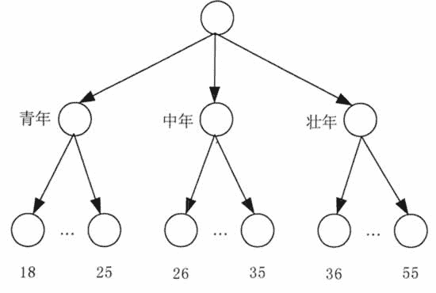
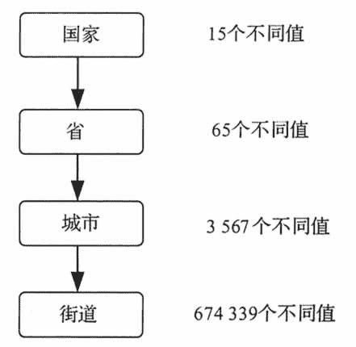

# 离散化和数值概念层次树简介

> 原文：[`c.biancheng.net/view/3555.html`](http://c.biancheng.net/view/3555.html)

离散化技术方法可以通过将属性（连续取值）域值范围分为若干区间，来帮助消减一个连续（取值）属性的取值个数。可以用一个标签来表示一个区间内的实际数据值。在基于决策树的分类挖掘中，消减属性取值个数的离散化处理是一个极为有效的数据预处理步骤。

图 1 所示是一个年龄属性的概念层次树。概念层次树可以通过利用较高层次概念替换低层次概念（如年龄的数值）来减少原有数据集的数据量。虽然一些细节在数据泛化过程中消失了，但这样所获得的泛化数据或许会更易于理解、更有意义。在消减后的数据集上进行数据挖掘显然效率更高。

## 数值概念层次树

由于数据的范围变化较大，所以构造数值属性的概念层次树是一件较为困难的事情。利用数据分布分析，可以自动构造数值属性的概念层次树。其中，主要的几种构造方法如下。

#### 1\. Bin 方法

Bin 方法是一种离散化方法。例如，属性的值可以通过将其分配到各 Bin 中而将其离散化。利用每个 Bin 的均值和中位数替换每个 Bin 中的值（利用均值或中位数进行平滑），并循环应用这些操作处理每次的操作结果，就可以获得一个概念层次树。

图 1  年龄属性的概念层次树

#### 2\. 直方图方法

直方图方法也可以用于离散化处理。例如，在等宽直方图中，数值被划分为等大小的区间，如（0,100］,（100,200］,…，（900,1000］。

循环应用直方图方法处理每次的划分结果，当达到用户指定层次水平后结束划分，最终可自动获得多层次概念树。最小间隔大小也可以帮助控制循环过程，包括指定一个划分的最小宽度或指定每一个层次的每一划分中数值的个数等。

#### 3\. 聚类分析方法

聚类分析方法可以将数据集划分为若干类或组。每个类构成了概念层次树的一个结点，每个类还可以进一步分解为若干子类，从而构成更低水平的层次。当然类也可以合并起来构成更高水平的层次。

#### 4\. 基于熵的方法

利用基于熵的方法构造数值概念层次树可以消减数据集规模。与其他方法不同的是，基于熵的方法利用了类别信息，这就使得边界的划分更加有利于改善分类挖掘结果的准确性。

#### 5\. 自然划分分段方法

尽管 Bin 方法、直方图方法、聚类方法和基于熵的方法均可以帮助构造数值概念层次树，但许多时候用户仍然将数值区间划分为归一的、易读懂的间隔，以使这些间隔看起来更加自然直观。

例如，将年收入数值属性取值区域分解为［50000,60000］区间要比利用复杂聚类分析所获得的［51265,60324］区间直观得多。

## 类别概念层次树

类别数据是一种离散数据。类别属性可取有限个不同的值且这些值之间无大小和顺序，如国家、工作、商品类别等。

构造类别属性的概念层次树的主要方法有以下几种。

**1）**属性值的顺序关系已在用户或专家指定的模式定义中说明。构造属性（或维）的概念层次树会涉及一组属性，在（数据库）模式定义时指定各属性的有序关系，可以有助于构造出相应的概念层次树。

例如，一个关系数据库中的地点属性将会涉及以下属性：街道、城市、省和国家。根据（数据库）模式定义时的描述，可以很容易地构造出（含有顺序语义）层次树，即街道<城市<省<国家。

**2）**通过数据聚合来描述层次树。这是概念层次树的一个主要（手工）构造方法。在大规模数据库中，通过穷举所有值而构造一个完整的概念层次树是不切实际的，但可以通过对其中的一部分数据进行聚合来描述层次数。例如，在模式定义基础上构造了省和国家的层次树，这时可以手工加入｛安徽、江苏、山东｝⊂ 华东地区和｛广东、福建｝⊂ 华南地区等“地区”中间层次。

**3）**定义一组属性但不说明其顺序。用户可以简单将一组属性组织在一起以便构成一个层次树，但不说明这些属性的相互关系。这就需要自动产生属性顺序以便构造一个有意义的概念层次树。

没有数据语义的知识，想要获得任意一组属性的顺序关系是很困难的。一个重要线索就是，高层次概念通常包含了若干低层次概念。定义属性的高层次概念通常比低层次概念包含少一些的不同值。根据这一线索，就可以通过给定属性集中每个属性的一些不同值自动构造一个概念层次树。

拥有最多不同值的属性被放到层次树的最低层，拥有的不同值数目越少的属性在概念层次树上所放的层次越高。这条启发知识在许多情况下的工作效果都很好。用户或专家在必要时，可以对所获得的概念层次树进行局部调整。

假设用户针对商场地点属性选择了一组属性，即街道、城市、省和国家。但没有说明这些属性的层次顺序关系。地点的概念层次树可以通过以下步骤自动产生。

**①** 根据每个属性不同值的数目从小到大进行排序，从而获得以下顺序，其中，括号内容为相应属性不同值的数目。

国家（15）、省（65）、城市（3567）和街道（674339）。

**②** 根据所排顺序自顶而下构造层次树，即第一个属性在最高层，最后一个属性在最低层。所获得的概念层次树如图 2 所示。
图 2  自动生成的地点属性概念层次树
**③** 用户对自动生成的概念层次树进行检查，必要时进行修改以使其能够反映所期望的属性间相互关系。本例中没有必要进行修改。

需要注意的是，上述启发知识并非始终正确。例如，在一个带有时间描述的数据库中，时间属性涉及 20 个不同年、12 个不同月和 1 个星期的值，则根据上述自动产生概念层次树的启发知识，可以获得，年＜月＜星期。星期在概念层次树的最顶层，这显然是不符合实际的。