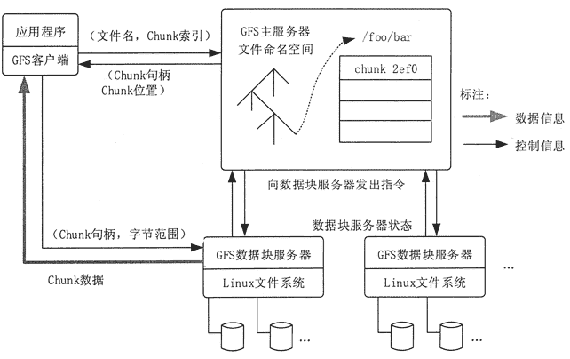

# GFS、MapReduce 和 BigTable：Google 的三种大数据处理系统

> 原文：[`c.biancheng.net/view/3565.html`](http://c.biancheng.net/view/3565.html)

Google 在搜索引擎上所获得的巨大成功，很大程度上是由于采用了先进的大数据管理和处理技术。Google 的搜索引擎是针对搜索引擎所面临的日益膨胀的海量数据存储问题，以及在此之上的海量数据处理问题而设计的。

众所周知，Google 存储着世界上最庞大的信息量（数千亿个网页、数百亿张图片）。但是，Google 并未拥有任何超级计算机来处理各种数据和搜索，也未使用 EMC 磁盘阵列等高端存储设备来保存大量的数据。

2006 年，Google 大约有 45 万台服务器，到 2010 年增加到了 100 万台，截至 2018 年，据说已经达到上千万台，并且还在不断增长中。不过这些数量巨大的服务器都不是什么昂贵的高端专业服务器，而是非常普通的 PC 级服务器，并且采用的是 PC 级主板而非昂贵的服务器专用主板。

Google 提出了一整套基于分布式并行集群方式的基础架构技术，该技术利用软件的能力来处理集群中经常发生的结点失效问题。

Google 使用的大数据平台主要包括 3 个相互独立又紧密结合在一起的系统：Google 文件系统（Google File System，GFS），针对 Google 应用程序的特点提出的 MapReduce 编程模式，以及大规模分布式数据库 BigTable。

## GFS

一般的数据检索都是用数据库系统，但是 Google 拥有全球上百亿个 Web 文档，如果用常规数据库系统检索，数据量达到 TB 量级后速度就非常慢了。正是为了解决这个问题，Google 构建出了 GFS。

GFS 是一个大型的分布式文件系统，为 Google 大数据处理系统提供海量存储，并且与 MapReduce 和 BigTable 等技术结合得十分紧密，处于系统的底层。它的设计受到 Google 特殊的应用负载和技术环境的影响。相对于传统的分布式文件系统，为了达到成本、可靠性和性能的最佳平衡，GFS 从多个方面进行了简化。

GFS 使用廉价的商用机器构建分布式文件系统，将容错的任务交由文件系统来完成，利用软件的方法解决系统可靠性问题，这样可以使得存储的成本成倍下降。

由于 GFS 中服务器数目众多，在 GFS 中，服务器死机现象经常发生，甚至都不应当将其视为异常现象。所以，如何在频繁的故障中确保数据存储的安全，保证提供不间断的数据存储服务是 GFS 最核心的问题。

GFS 的独特之处在于它采用了多种方法，从多个角度，使用不同的容错措施来确保整个系统的可靠性。

GFS 的系统架构如图 1 所示，主要由一个 Master Server（主服务器）和多个 Chunk Server（数据块服务器）组成。

Master Server 主要负责维护系统中的名字空间，访问控制信息，从文件到块的映射及块的当前位置等元数据，并与 Chunk Server 通信。

Chunk Server 负责具体的存储工作。数据以文件的形式存储在 Chunk Server 上。Client 是应用程序访问 GFS 的接口。
图 1  CFS 的系统架构
Master Server 的所有信息都存储在内存里，启动时信息从 Chunk Server 中获取。这样不但提高了 Master Server 的性能和吞吐量，也有利于 Master Server 宕机后把后备服务器切换成 Master Server。

GFS 的系统架构设计有两大优势。

*   Client 和 Master Server 之间只有控制流，没有数据流，因此降低了 Master Server 的负载。
*   由于 Client 与 Chunk Server 之间直接传输数据流，并且文件被分成多个 Chunk 进行分布式存储，因此 Client 可以同时并行访问多个 Chunk Server，从而让系统的 I/O 并行度提高。

Google 通过减少 Client 与 Master Server 的交互来解决 Master Server 的性能瓶颈冋题。Client 直接与 Chunk Server 进行通信，Master Server 仅提供查询数据块所在的 Chunk Server 的详细位置的功能。

数据块设计成 64MB，也是为了让客户端和 Master Server 的交互减少，让主要数据流量在客户端程序和 Chunk Server 之间直接交互。总之，GFS 具有以下特点。

**1）采用中心服务器模式，带来以下优势。**

*   可以方便地增加 Chunk Server。
*   Master Server 可以掌握系统内所有 Chunk Server 的情况，方便进行负载均衡。
*   不存在元数据的一致性问题。

**2）不缓存数据，具有以下优势。**

*   文件操作大部分是流式读/写，不存在大量重复的读/写，因此即使使用缓存对系统性能的提高也不大。
*   Chunk Server 上的数据存储在本地文件系统上，即使真的出现频繁存取的情况，本地文件系统的缓存也可以支持。
*   若建立系统缓存，那么缓存中的数据与 Chunk Server 中的数据的一致性很难保证。

Chunk Server 在硬盘上存储实际数据。Google 把每个 chunk 数据块的大小设计成 64MB，每个 chunk 被复制成 3 个副本放到不同的 Chunk Server 中，以创建冗余来避免服务器崩溃。如果某个 Chunk Server 发生故障，Master Server 便把数据备份到一个新的地方。

## MapReduce

GFS 解决了 Google 海量数据的存储问题，MapReduce 则是为了解决如何从这些海量数据中快速计算并获取期望结果的问题。

MapReduce 是由 Google 开发的一个针对大规模群组中的海量数据处理的分布式编程模型。

MapReduce 实现了 Map 和 Reduce 两个功能。Map 把一个函数应用于集合中的所有成员，然后返回一个基于这个处理的结果集，而 Reduce 是把两个或更多个 Map 通过多个线程、进程或者独立系统进行并行执行处理得到的结果集进行分类和归纳。

用户只需要提供自己的 Map 函数及 Reduce 函数就可以在集群上进行大规模的分布式数据处理。这一编程环境能够使程序设计人员编写大规模的并行应用程序时不用考虑集群的并发性、分布性、可靠性和可扩展性等问题。应用程序编写人员只需要将精力放在应用程序本身，关于集群的处理问题则交由平台来完成。

与传统的分布式程序设计相比，MapReduce 封装了并行处理、容错处理、本地化计算、负载均衡等细节，具有简单而强大的接口。正是由于 MapReduce 具有函数式编程语言和矢量编程语言的共性，使得这种编程模式特别适合于非结构化和结构化的海量数据的搜索、挖掘、分析等应用。

## BigTable

BigTable 是 Google 设计的分布式数据存储系统，是用来处理海量数据的一种非关系型数据库。BigTable 是一个稀疏的、分布式的、持久化存储的多维度排序的映射表。

BigTable 的设计目的是能够可靠地处理 PB 级别的数据，并且能够部署到上千台机器上。Google 设计 BigTable 的动机主要有以下 3 个方面。

#### 1）需要存储的数据种类繁多。

Google 目前向公众开放的服务很多，需要处理的数据类型也非常多，包括 URL、网页内容和用户的个性化设置等数据。

#### 2）海量的服务请求。

Google 运行着目前世界上最繁忙的系统，它每时每刻处理的客户服务请求数量是普通的系统根本无法承受的。

#### 3）商用数据库无法满足 Google 的需求。

一方面，传统的商用数据库的设计着眼点在于通用性，Google 的苛刻服务要求根本无法满足，而且在数量庞大的服务器上根本无法成功部署传统的商用数据库。另一方面，对于底层系统的完全掌控会给后期的系统维护和升级带来极大的便利。

在仔细考察了 Google 的日常需求后，BigTable 开发团队确定了 BigTable 设计所需达到的几个基本目标。

#### 1）广泛的适用性

需要满足一系列 Google 产品而并非特定产品的存储要求。

#### 2）很强的可扩展性

根据需要随时可以加入或撤销服务器。

#### 3）高可用性

确保几乎所有的情况下系统都可用。对于客户来说，有时候即使短暂的服务中断也是不能忍受的。

#### 4）简单性

底层系统的简单性既可以减少系统出错的概率，也为上层应用的开发带来了便利。

BigTable 完全实现了上述目标，已经在超过 60 个 Google 的产品和项目上得到了应用，包括 Google Analytics、GoogleFinance、Orkut、Personalized Search、Writely 和 GoogleEarth 等。

以上这些产品对 Bigtable 提出了迥异的需求，有的需要高吞吐量的批处理，有的则需要及时响应，快速返回数据给最终用户。它们使用的 BigTable 集群的配置也有很大的差异，有的集群只需要几台服务器，而有的则需要上千台服务器。