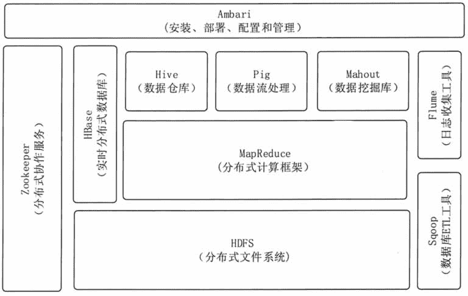
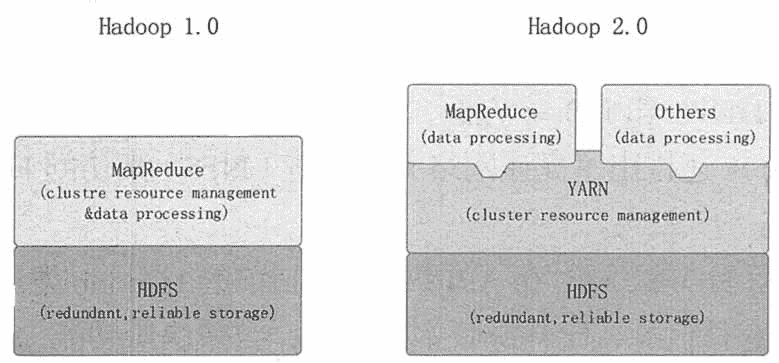

# Hadoop 大数据处理框架简介

> 原文：[`c.biancheng.net/view/3568.html`](http://c.biancheng.net/view/3568.html)

Hadoop 是一个处理、存储和分析海量的分布式、非结构化数据的开源框架。最初由 Yahoo 的工程师 Doug Cutting 和 Mike Cafarella 在 2005 年合作开发。后来，Hadoop 被贡献给了 Apache 基金会，成为 Apache 基金会的开源项目。

## Hadoop 系统简介

Hadoop 是一种分析和处理大数据的软件平台，是一个用 Java 语言实现的 Apache 的开源软件框架，在大量计算机组成的集群中实现了对海量数据的分布式计算。

Hadoop 采用 MapReduce 分布式计算框架，根据 GFS 原理开发了 HDFS（分布式文件系统），并根据 BigTable 原理开发了 HBase 数据存储系统。

Hadoop 和 Google 内部使用的分布式计算系统原理相同，其开源特性使其成为分布式计算系统的事实上的国际标准。

Yahoo、Facebook、Amazon，以及国内的百度、阿里巴巴等众多互联网公司都以 Hadoop 为基础搭建了自己的分布式计算系统。

Hadoop 是一个基础框架，允许用简单的编程模型在计算机集群上对大型数据集进行分布式处理。它的设计规模从单一服务器到数千台机器，每个服务器都能提供本地计算和存储功能，框架本身提供的是计算机集群高可用的服务，不依靠硬件来提供高可用性。

用户可以在不了解分布式底层细节的情况下，轻松地在 Hadoop 上开发和运行处理海量数据的应用程序。低成本、高可靠、高扩展、高有效、高容错等特性让 hadoop 成为最流行的大数据分析系统。

## Hadoop 生态圈

Hadoop 是一个由 Apache 基金会开发的大数据分布式系统基础架构。用户可以在不了解分布式底层细节的情况下，轻松地在 Hadoop 上开发和运行处理大规模数据的分布式程序，充分利用集群的威力高速运算和存储。

Hadoop 是一个数据管理系统，作为数据分析的核心，汇集了结构化和非结构化的数据，这些数据分布在传统的企业数据栈的每一层。

Hadoop 也是一个大规模并行处理框架，拥有超级计算能力，定位于推动企业级应用的执行。

Hadoop 又是一个幵源社区，主要为解决大数据的问题提供工具和软件。

虽然 Hadoop 提供了很多功能，但仍然应该把它归类为由多个组件组成的 Hadoop 生态圈，这些组件包括数据存储、数据集成、数擔处理和其他进行数据分析的专门工具。

图 1 展示了 Hadoop 的生态系统，主要由 HDFS、MapReduce， HBase， Zookeeper， Pig、 Hive 等核心组件构成，另外还包括 Sqoop、Flume 等框架，用来与其他企业系统融合。同时， Hadoop 生态系统也在不断增长，它新增了 Mdhout、Ambari 等内容，以提供更新功能。
图 1  Hadoop 的生态系统 Hadoop 生态圈包括以下主要组件。

#### 1）HDFS

一个提供高可用的获取应用数据的分布式文件系统。

#### 2）MapReduce

一个并行处理大数据集的编程模型。

#### 3）HBase

一个可扩展的分布式数据库，支持大表的结构化数据存储。是一个建立在 HDFS 之上的，面向列的 NoSQL 数据库，用于快速读/写大量数据。

#### 4）Hive

一个建立在 Hadoop 上的数据仓库基础构架。它提供了一系列的工具；可以用来进行数据提取转化加载（ETL），这是一种可以存储、查询和分析存储在 Hadoop 中的大规模数据的机制。

Hive 定义了简单的类 SQL 查询语言，称为 HQL，它允许不熟悉 MapReduce 的开发人员也能编写数据查询语句，然后这些语句被翻译为 Hadoop 上面的 MapReduce 任务。

#### 5）Mahout

可扩展的机器学习和数据挖掘库。它提供的 MapReduce 包含很多实现方法，包括聚类算法、回归测试、统计建模。

#### 6）Pig

一个支持并行计算的高级的数据流语言和执行框架。它是 MapReduce 编程的复杂性的抽象。Pig 平台包括运行环境和用于分析 Hadoop 数据集的脚本语言（PigLatin）。其编译器将 PigLatin 翻译成 MapReduce 程序序列。

#### 7）Zookeeper

—个应用于分布式应用的高性能的协调服务。它是一个为分布式应用提供一致性服务的软件，提供的功能包括配置维护、域名服务、分布式同步、组服务等。

#### 8）Amban

一个基于 Web 的工具，用来供应、管理和监测 Hadoop 集群，包括支持 HDFS、MapReduceAHive、HCatalog、HBase、ZooKeeperAOozie、Pig 和 Sqoop 。

Ambari 也提供了一个可视的仪表盘来查看集群的健康状态，并且能够使用户可视化地查看 MapReduce、Pig 和 Hive 应用来诊断其性能特征。

Hadoop 的生态圈还包括以下几个框架，用来与其他企业融合。

#### 1）Sqoop

一个连接工具，用于在关系数据库、数据仓库和 Hadoop 之间转移数据。Sqoop 利用数据库技术描述架构，进行数据的导入/导出；利用 MapReduce 实现并行化运行和容错技术。

#### 2）Flume

提供了分布式、可靠、高效的服务，用于收集、汇总大数据，并将单台计算机的大量数据转移到 HDFS。它基于一个简单而灵活的架构，并提供了数据流的流。它利用简单的可扩展的数据模型，将企业中多台计算机上的数据转移到 Hadoop。

## Hadoop 版本演进

当前 Hadoop 有两大版本：Hadoop 1.0 和 Hadoop 2.0，如图 2 所示。Hadoop 1.0 被称为第一代 Hadoop，由 HDFS 和 MapReduce 组成。

HDFS 由一个 NameNode 和多个 DataNode 组成，MapReduce 由一个 JobTracker 和多个 TaskTracker 组成。

Hadoop 1.0 对应的 Hadoop 版本为 0.20.x、0.21.x、 0.22.x 和 Hadoop 1.x。其中，0.20.x 是比较稳定的版本，它最后演化为 1.x，变成稳定版本。0.21.x 和 0.22.x 则增加了 NameNode HA 等新特性。
图 2  Hadoop 版本演进图 Hadoop 2.0 被称为第二代 Hadoop，是为克服 Hadoop 1.0 中 HDFS 和 MapReduce 存在的各种问题而提出的，对应的 Hadoop 版本为 0.23.x 和 2.x。

针对 Hadoop 1.0 中 NameNode HA 不支持自动切换且切换时间过长的风险，Hadoop2.0 提出了基于共享存储的 HA 方式，该方式支持失败自动切换切回。

针对 Hadoop 1.0 中的单 NameNode 制约 HDFS 扩展性的问题，Hadoop 2.0 提出了 HDFS Federation 机制，它允许多个 NameNode 各自分管不同的命名空间，进而实现数据访问隔离和集群横向扩展。

针对 Hadoop 1.0 中的 MapReduce 在扩展性和多框架支持方面的不足，Hadoop 2.0 提出了全新的资源管理框架 YARN，它将 JobTracker 中的资源管理和作业控制功能分开，分别由组件 ResourceManager 和 ApplicationMaster 实现。

其中，ResourceManager 负责所有应用程序的资源分配，而 ApplicationMaster 仅负责管理一个应用程序。相比于 Hadoop 1.0，Hadoop 2.0 框架具有更好的扩展性、可用性、可靠性、向后兼容性和更高的资源利用率，Hadoop 2.0 还能支持除 MapReduce 计算框架以外的更多的计算框架，Hadoop2.0 是目前业界主流使用的 Hadoop 版本。

## Hadoop 发行版本

虽然 Hadoop 是开源的 Apache 项目，但是在 Hadoop 行业，仍然出现了大量的新兴公司，它们以帮助人们更方便地使用 Hadoop 为目标。这些企业大多将 Hadoop 发行版进行打包、改进，以确保所有的软件一起工作。

Hadoop 的发行版除了社区的 Apache Hadoop 外，Cloudera、Hortonworks、MapR、EMC、IBM、INTEL、华为等都提供了自己的商业版本。商业版本主要是提供专业的技术支持，这对一些大型企业尤其重要。每个发行版都有自己的一些特点，本节就 3 个主要的发行版本做简单介绍。

2008 年成立的 Cloudera 是最早将 Hadoop 商用的公司，它为合作伙伴提供 Hadoop 的商用解决方案，主要包括支持、咨询服务和培训。Cloudera 的产品主要为 CDH、Cloudera Manager 和 Cloudera Support。CDH 是 Cloudem 的 Hadoop 发行版本，完全开源，比 Hadoop 在兼容性、安全性、稳定性上有所增强。

Cloudera Manager 是集群的软件分发及管理监控平台，可以在几个小时內部署好一个 Hadoop 集群，并对集群的结点及服务进行实时监控。Cloudera Support 即是对 Hadoop 的技术支持。

2011 年成立的 Hortonworks 是 Yahoo 与硅谷风投公司 Benchmark Capital 合资组建的公司。公司成立之初吸纳了大约 25 名至 30 名专门研究 Hadoop 的 Yahoo 工程师，上述工程师均在 2005 年开始协助 Yahoo 开发 Hadoop，这些工程师贡献了 Hadoop 80% 的代码。

Hortonworks 的主打产品是 Hortonworks DataPlatform（HDP），也同样是 100% 开源的产品。HDP 除了常见的项目外，还包含了一款开源的安装和管理系统（Amban）。

Cloudera 和 Hortonworks 均是通过不断提交代码来完善 Hadoop 的，而 2009 年成立的 MapR 公司在 Hadoop 领域显得有些特立独行，它提供了一款独特的发行版本。

MapR 认为 Hadoop 的代码只是参考，可以基于 Hadoop 提供的 API 来实现自己的需求。这种方法使得 MapR 做出了很大的创新，特别是在 HDFS 和 HBase 方面，MapR 让这两个基本的 Hadoop 的存储机制更加可靠、更加高性能。

MapR 还推出了高速网络文件系统（NFS）来访问 HDFS，从而大大简化了一些企业级应用的集成。

MapR 用新架构重写 HDFS，同时在 API 级别，和目前的 Hadoop 发行版本保持兼容。MapR 构建了一个 HDFS 的私有替代品，比开源版本快 3 倍，自带快照功能，而且支持无 NameNode 单点故障。

MapR 版本不再需要单独的 NameNode 机器，元数据分散在集群中，类似数据默认存储 3 份，不再需要用 NAS 来协助 NameNode 做元数据备份，提高了机器使用率。

MapR 还有一个重要的特点是可以使用 NFS 直接访问 HDFS，提供了与原有应用的兼容性。MapR 的镜像功能很适合做数据备份，而且支持跨数据中心的镜像。