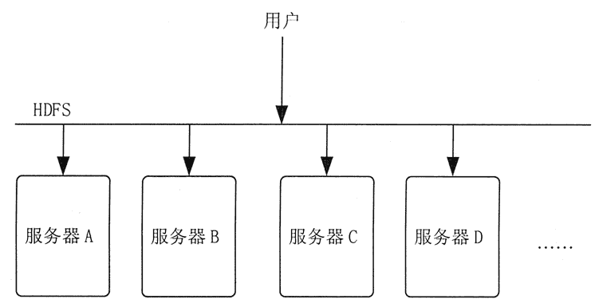
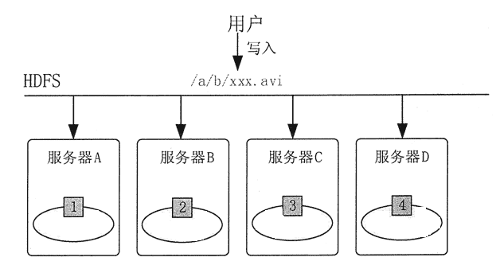
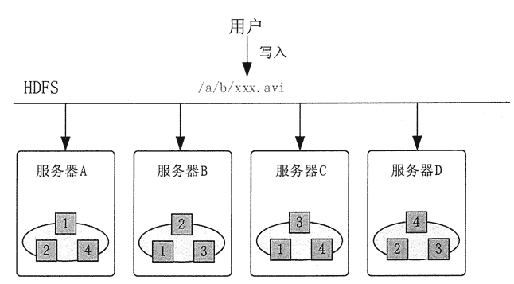

# HDFS 基本原理和设计理念

> 原文：[`c.biancheng.net/view/3570.html`](http://c.biancheng.net/view/3570.html)

本节将对 HDFS 的基本原理进行讲解。

## 文件系统的问题

文件系统是操作系统提供的磁盘空间管理服务，该服务只需要用户指定文件的存储位置及文件读取路径，而不需要用户了解文件在磁盘上是如何存放的。

但是当文件所需空间大于本机磁盘空间时，应该如何处理呢？

*   加磁盘，但是加到一定程度就有限制了。
*   加机器，即用远程共享目录的方式提供网络化的存储，这种方式可以理解为分布式文件系统的雏形，它可以把不同文件放入不同的机器中，而且空间不足时可继续加机器，突破了存储空间的限制。

但是这种传动的分布式文件系统存在多个问题。

**1）各个存储结点的负载不均衡，单机负载可能极高**。例如，如果某个文件是热门文件，则会有很多用户经常读取这个文件，这就会造成该文件所在机器的访问压力极高。

**2）数据可靠性低。**如果某个文件所在的机器出现故障，那么这个文件就不能访问了，甚至会造成数据的丢失。

**3）文件管理困难。**如果想把一些文件的存储位置进行调整，就需要查看目标机器的空间是否够用，并且需要管理员维护文件位置，在机器非常多的情况下，这种操作就极为复杂。

## HDFS 的基本思想

HDFS 是个抽象层，底层依赖很多独立的服务器，对外提供统一的文件管理功能。HDFS 的基本架构如图 1 所示。
图 1  HDFS 的基本架构
例如，用户访问 HDFS 中的 /a/b/c.mpg 这个文件时，HDFS 负责从底层的相应服务器中读取该文件，然后返回给用户，这样用户就只需和 HDFS 打交道，而不用关心这个文件是如何存储的。

为了解决存储结点负载不均衡的问题，HDFS 首先把一个文件分割成多个块，然后再把这些文件块存储在不同服务器上。这种方式的优势就是不怕文件太大，并且读文件的压力不会全部集中在一台服务器上，从而可以避免某个热点文件会带来的单机负载过高的问题。

例如，用户需要保存文件 /a/b/xxx.avi 时，HDFS 首先会把这个文件进行分割，如分为 4 块，然后分别存放到不同的服务器上，如图 2 所示。

但是如果某台服务器坏了，那么文件就会读不全。如果磁盘不能恢复，那么存储在上面的数据就会丢失。为了保证文件的可靠性，HDFS 会把每个文件块进行多个备份，一般情况下是 3 个备份。

假如要在由服务器 A、B、C 和 D 的存储结点组成的 HDFS 上存储文件 /a/b/xxx.avi，则 HDFS 会把文件分成 4 块，分别为块 1、块 2、块 3 和块 4。为了保证文件的可靠性，HDFS 会把数据块按以下方式存储到 4 台服务器上，如图 3 所示。
图 2  HDFS 文件分块存储示意
图 3  HDFS 文件多副本存储示意
采用分块多副本存储方式后，HDFS 文件的可靠性就大大增强了，即使某个服务器出现故障，也仍然可以完整读取文件，该方式同时还带来一个很大的好处，就是增加了文件的并发访问能力。例如，多个用户读取这个文件时，都要读取块 1，HDFS 可以根据服务器的繁忙程度，选择从哪台服务器读取块 1。

为了管理文件，HDFS 需要记录维护一些元数据，也就是关于文件数据信息的数据，如 HDFS 中存了哪些文件，文件被分成了哪些块，每个块被放在哪台服务器上等。

HDFS 把这些元数据抽象为一个目录树，来记录这些复杂的对应关系。这些元数据由一个单独的模块进行管理，这个模块叫作名称结点（NameNode）。存放文件块的真实服务器叫作数据结点（DataNode）。

## HDFS 的设计理念

简单来讲，HDFS 的设计理念是，可以运行在普通机器上，以流式数据方式存储文件，一次写入、多次查询，具体有以下几点。

#### 1） 可构建在廉价机器上

HDFS 的设计理念之一就是让它能运行在普通的硬件之上，即便硬件出现故障，也可以通过容错策略来保证数据的高可用性。

#### 2）高容错性

由于 HDFS 需要建立在普通计算机上，所以结点故障是正常的事情。HDFS 将数据自动保存多个副本，副本丢失后，自动恢复，从而实现数据的高容错性。

#### 3）适合批处理

HDFS 适合一次写入、多次查询（读取）的情况。在数据集生成后，需要长时间在此数据集上进行各种分析。每次分析都将涉及该数据集的大部分数据甚至全部数据，因此读取整个数据集的时间延迟比读取第一条记录的时间延迟更重要。

#### 4） 适合存储大文件

这里说的大文件包含两种意思：一是值文件大小超过 100MB 及达到 GB 甚至 TB、PB 级的文件;二是百万规模以上的文件数量。

## HDFS 的局限

HDFS 的设计理念是为了满足特定的大数据应用场景，所以 HDFS 具有一定的局限性，不能适用于所有的应用场景，HDFS 的局限主要有以下几点。

#### 1） 实时性差

要求低时间延迟的应用不适合在 HDFS 上运行，HDFS 是为高数据吞吐量应用而优化的，这可能会以高时间延迟为代价。

#### 2） 小文件问题

由于 NameNode 将文件系统的元数据存储在内存中，因此该文件系统所能存储的文件总量受限于 NameNode 的内存总容量。根据经验，每个文件、目录和数据块的存储信息大约占 150 字节。过多的小文件存储会大量消耗 NameNode 的存储量。

#### 3）文件修改问题

HDFS 中的文件只有一个写入者，而且写操作总是将数据添加在文件的末尾。HDFS 不支持具有多个写入者的操作，也不支持在文件的任意位置进行修改。