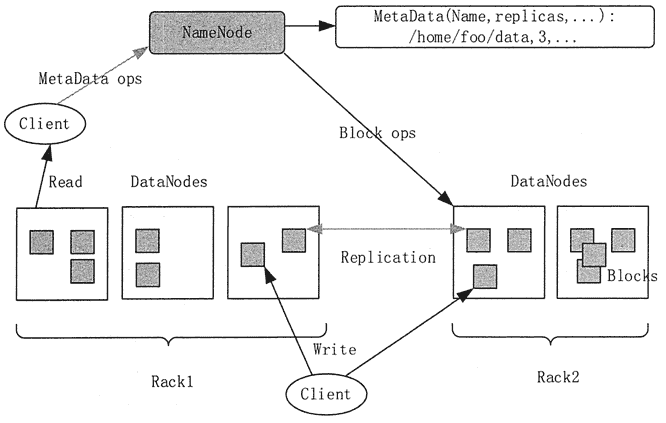
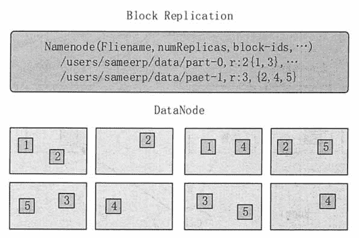

# HDFS 架构和实现机制简介

> 原文：[`c.biancheng.net/view/3571.html`](http://c.biancheng.net/view/3571.html)

本节将对 HDFS 的整体架构和基本实现机制进行简单介绍。

## HDFS 整体架构

HDFS 是一个主从 Master/Slave 架构。一个 HDFS 集群包含一个 NameNode，这是一个 Master Server，用来管理文件系统的命名空间，以及调节客户端对文件的访问。一个 HDFS 集群还包括多个 DataNode，用来存储数据。HDFS 的整体结构如图 1 所示。
图 1  HDFS 整体架构
HDFS 会对外暴露一个文件系统命名空间，并允许用户数据以文件的形式进行存储。在内部，一个文件被分成多个块并且这些块被存储在一组 DataNode 上。

#### 1）NameNode

文件的元数据采用集中式存储方案存放在 NameNode 当中。NameNode 负责执行文件系统命名空间的操作，如打幵、关闭、重命名文件和目录。NameNode 同时也负责将数据块映射到对应的 DataNode 中。

#### 2） DataNode

DataNode 是文件系统的工作结点。它们根据需要存储并检索数据块，并且定期向 NameNode 发送他们所存储的块的列表。文件数据块本身存储在不同的 DataNode 当中，DataNode 可以分布在不同机架上。

DataNode 负责服务文件系统客户端发出的读/写请求。DataNode 同时也负责接收 NameNode 的指令来进行数据块的创建、删除和复制。

#### 3）Client

HDFS 的 Client 会分别访问 NameNode 和 DataNode 以获取文件的元信息及内容。HDFS 集群的 Client 将直接访问 NameNode 和 DataNode，相关数据会直接从 NameNode 或者 DataNode 传送到客户端。

NameNode 和 DataNode 都是被设计为在普通 PC 上运行的软件程序。HDFS 是用 Java 语言实现的，任何支持 Java 语言的机器都可以运行 NameNode 或者 DataNode。Java 语言本身的可移植性意味着 HDFS 可以被广泛地部署在不同的机器上。

一个典型的部署就是，集群中的一台专用机器运行 NameNode，集群中的其他机器每台运行一个 DataNode 实例。该架构并不排除在同一台机器上运行多个 DataNode 实例的可能，但在实际的部署中很少会这么做。

单一 NameNode 的设计极大地简化了集群的系统架构，它使得所有 HDFS 元数据的仲裁和存储都由单一 NameNode 来决定，避免了数据不一致性的问题。

## HDFS 数据复制

HDFS 可以跨机架、跨机器，可靠地存储海量文件。HDFS 把每个文件存储为一系列的数据块，除了最后一个数据块以外，一个文件的所有数据块都是相同大小的。

为了容错，一个文件的数据块会被复制。对于每个文件来说，文件块大小和复制因子都是可配置的。应用程序可以声明一个文件的副本数。复制因子可以在文件创建时声明，并且可以在以后修改。

NameNode 控制所有的数据块的复制决策，如图 2 所示。它周期性地从集群中的 DataNode 中收集心跳和数据块报告。收集到心跳则意味着 DataNode 正在提供服务。收集到的数据块报告会包含相应 DataNode 上的所有数据块列表。

图 2  HDFS 复制策略
通用场景下，当复制因子是 3 时，HDFS 的放置策略是将一个副本放置到本地机架的一个结点上，另一个放在本地机架的不同结点上，最后一个放在不同机架的不同结点上。这一策略与把 3 个副本放在 3 个不同机架上的策略相比，减少了机架之间的写操作，从而提升了写性能。

机架不可用的概率要比结点不可用的概率低很多，这一策略并不影响数据可靠性和可用性。但是这一策略确实减少了读取数据时的聚合网络带宽，毕竟一个数据块是放置在两个不同的机架上，而不是 3 个。这一策略没有均匀地分布副本，三分之二的副本在一个机架上，另三分之一的副本分布在其他机架上。

当一切运行正常时，DataNode 会周期性发送心跳信息给 NameNode（默认是每 3 秒钟一次）。如果 NameNode 在预定的时间内没有收到心跳信息（默认是 10 分钟），就会认为 DataNode 出现了问题，这时候就会把该 DataNode 从集群中移除，并且启动一个进程去恢复数据。DataNode 脱离集群的原因有多种，如硬件故障、主板故障、电源老化和网络故障等。

对于 HDFS 来说，丢失一个 DataNode 意味着丢失了存储在它的硬盘上的数据块的副本。假如在任意时间总有超过一个副本存在，故障将不会导致数据丢失。当一个硬盘故障时，HDFS 会检测到存储在该硬盘上的数据块的副本数量低于要求，然后主动创建需要的副本，以达到满副本数状态。