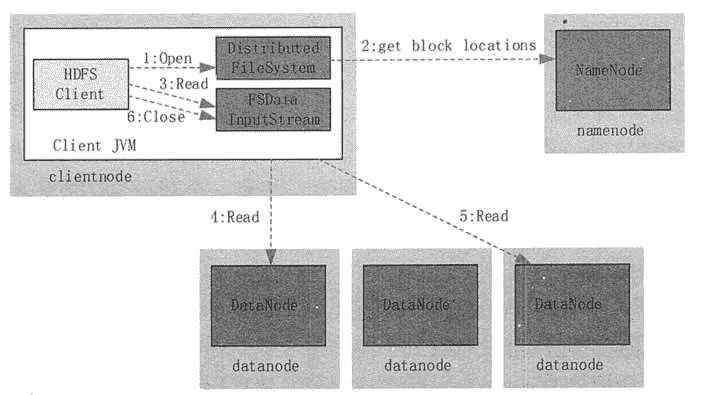
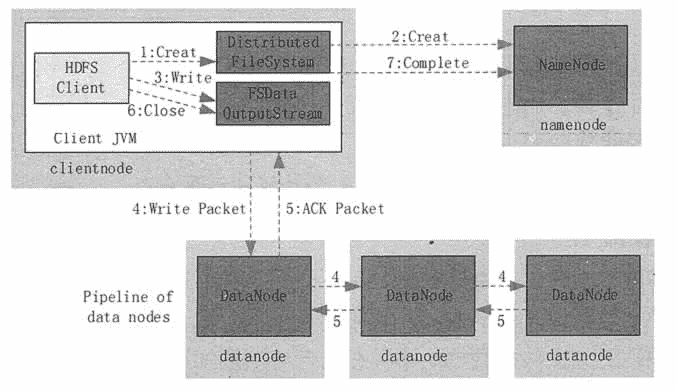

# HDFS 读取和写入数据简介

> 原文：[`c.biancheng.net/view/3574.html`](http://c.biancheng.net/view/3574.html)

HDFS 的文件访问机制为流式访问机制，即通过 API 打开文件的某个数据块之后，可以顺序读取或者写入某个文件。由于 HDFS 中存在多个角色，且对应的应用场景主要为一次写入、多次读取的场景，因此其读和写的方式有较大不同。读/写操作都由客户端发起，并且由客户端进行整个流程的控制，NameNode 和 DataNode 都是被动式响应。

## 读取流程

客户端发起读取请求时，首先与 NameNode 进行连接。

连接建立完成后，客户端会请求读取某个文件的某一个数据块。NameNode 在内存中进行检索，查看是否有对应的文件及文件块，若没有则通知客户端对应文件或数据块不存在，若有则通知客户端对应的数据块存在哪些服务器之上。

客户端接收到信息之后，与对应的 DataNode 连接，并开始进行数据传输。客户端会选择离它最近的一个副本数据进行读操作。

如图 1 所示，读取文件的具体过程如下。

**1)** 客户端调用 DistributedFileSystem 的 Open() 方法打开文件。

**2)** DistributedFileSystem 用 RPC 连接到 NameNode，请求获取文件的数据块的信息；NameNode 返回文件的部分或者全部数据块列表；对于每个数据块，NameNode 都会返回该数据块副本的 DataNode 地址；DistributedFileSystem 返回 FSDataInputStream 给客户端，用来读取数据。

**3)** 客户端调用 FSDataInputStream 的 Read() 方法开始读取数据。

**4)** FSInputStream 连接保存此文件第一个数据块的最近的 DataNode，并以数据流的形式读取数据；客户端多次调用 Read()，直到到达数据块结束位置。

**5)** FSInputStream 连接保存此文件下一个数据块的最近的 DataNode，并读取数据。

**6)** 当客户端读取完所有数据块的数据后，调用 FSDataInputStream 的 Close() 方法。

图 1  HDFS 读取流程
在读取数据的过程中，如果客户端在与数据结点通信时出现错误，则尝试连接包含此数据块的下一个数据结点。失败的数据结点将被记录，并且以后不再连接。

## 写入流程

写入文件的过程比读取较为复杂，在不发生任何异常情况下，客户端向 HDFS 写入数据的流程如图 2 所示，具体步骤如下。
图 2  HDFS 读取流程
**1)** 客户端调用 DistribuedFileSystem 的 Create() 方法来创建文件。

**2)** DistributedFileSystem 用 RPC 连接 NameNode，请求在文件系统的命名空间中创建一个新的文件；NameNode 首先确定文件原来不存在，并且客户端有创建文件的权限，然后创建新文件；DistributedFileSystem 返回 FSOutputStream 给客户端用于写数据。

**3)** 客户端调用 FSOutputStream 的 Write() 函数，向对应的文件写入数据。

**4)** 当客户端开始写入文件时，FSOutputStream 会将文件切分成多个分包（Packet），并写入其內部的数据队列。FSOutputStream 向 NameNode 申请用来保存文件和副本数据块的若干个 DataNode，这些 DataNode 形成一个数据流管道。

队列中的分包被打包成数据包，发往数据流管道中的第一个 DataNode。第一个 DataNode 将数据包发送给第二个 DataNode，第二个 DataNode 将数据包发送到第三个 DataNode。这样，数据包会流经管道上的各个 DataNode。

**5)** 为了保证所有 DataNode 的数据都是准确的，接收到数据的 DataNode 要向发送者发送确认包（ACK Packet）。确认包沿着数据流管道反向而上，从数据流管道依次经过各个 DataNode，并最终发往客户端。当客户端收到应答时，它将对应的分包从内部队列中移除。

**6)** 不断执行第 (3)~(5)步，直到数据全部写完。

**7)** 调用 FSOutputStream 的 Close() 方法，将所有的数据块写入数据流管道中的数据结点，并等待确认返回成功。最后通过 NameNode 完成写入。