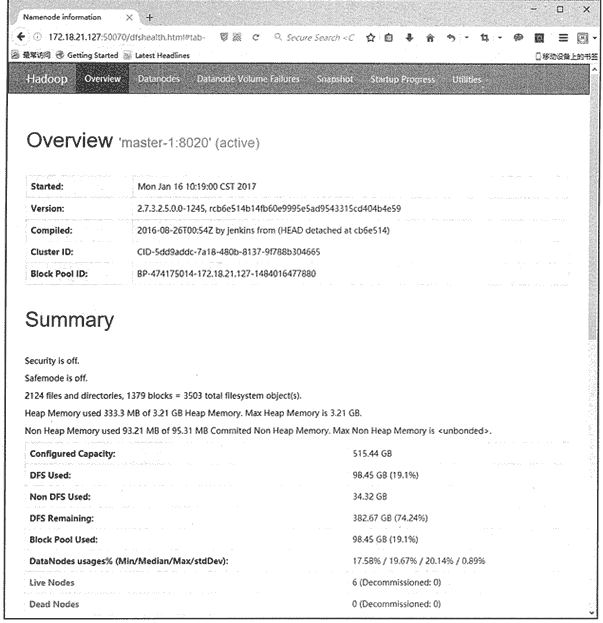
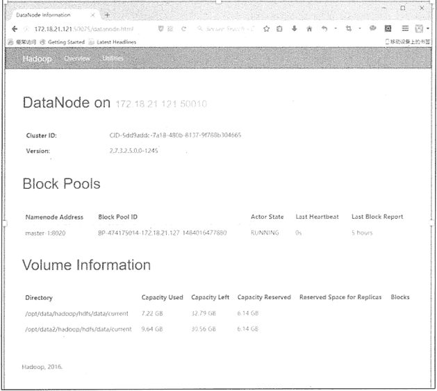
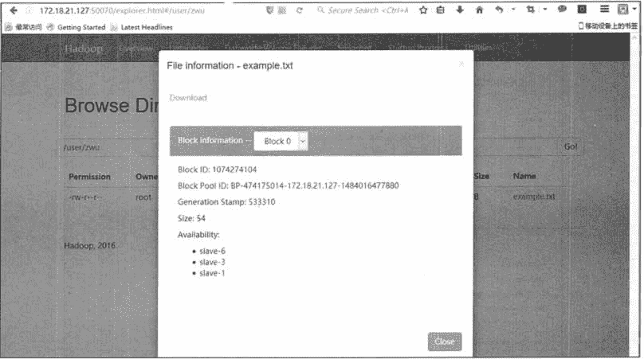

# HDFS 两种操作方式：命令行和 Java API

> 原文：[`c.biancheng.net/view/3576.html`](http://c.biancheng.net/view/3576.html)

HDFS 文件操作有两种方式：一种是命令行方式，Hadoop 提供了一套与 Linux 文件命令类似的命令行工具；另一种是 Java API，即利用 Hadoop 的 Java 库，采用编程的方式操作 HDFS 的文件。

本节将介绍 Linux 操作系统中关于 HDFS 文件操作的常用命令行，并将介绍利用 Hadoop 提供的 Java API 进行基本的文件操作，以及利用 Web 界面查看和管理 HDFS 的方法。

## HDFS 常用命令

在 Linux 命令行终端，可以使用命令行工具对 HDFS 进行操作。使用这些命令行可以完成 HDFS 文件的上传、下载和复制，还可以查看文件信息、格式化 NameNode 等。

HDFS 命令行的统一格式如下。

hadoop fs -cmd <args>

其中，`cmd`是具体的文件操作命令，`<args>`是一组数目可变的参数。

#### 1\. 添加文件和目录

HDFS 有一个默认工作目录 /usr/$USER，其中，`$USER`是登录用户名，如 root。该目录不能自动创建，需要执行 mkdir 命令创建。

hadoop fs -mkdir /usr/root

使用 Hadoop 的命令`put`将本地文件 README.txt 上传到 HDFS。

hadoop fs -put README.txt

注意，上面这个命令的最后一个参数是：“.”，这意味着把本地文件上传到默认的工作目录下，该命令等价于以下代码。

hadoop fs -put README.txt /user/root

#### 2\. 下载文件

下载文件是指从 HDFS 中获取文件，可以使用 Hadoop 的 get 命令。例如，若本地文件没有 README.txt 文件，则需要从 HDFS 中取回，可以执行以下命令。

hadoop fs -get README.txt

或者执行以下命令。

hadoop fs -get README.txt /usr/root/README.txt

#### 3\. 删除文件

Hadoop 删除文件的命令为`rm`。例如，要删除从本地文件上传到 HDFS 的 README.txt，可以执行以下命令。

hadoop fs -rm README.txt

#### 4\. 检索文件

检索文件即查阅 HDFS 中的文件内容，可以使用 Hadoop 中的`cat`命令。例如，要查阅 README.txt 的内容，可以执行以下命令。

hadoop fs -cat README.txt

另外，Hadoop 的`cat`命令的输出也可以使用管道传递给 UNIX 命令的 head，可以只显示文件的前一千个字节。

hadoop fs -cat README.txt | head

Hadoop 也支持使用`tail`命令查看最后一千字节。例如，要查阅 README.txt 最后一千个字节，可以执行如下命令。

hadoop fs -tail README.txt

#### 5\. 查阅帮助

查阅 HDFS 命令帮助，可以更好地了解和使用 Hadoop 的命令。用户可以执行`hadoop fs`来获取所用版本 HDFS 的一个完整命令类别，也可以使用`help`来显示某个具体命令的用法及简短描述。

例如，要了解`ls`命令，可执行以下命令。

hadoop fs -help ls

## HDFS 的 Web 界面

在配置好 Hadoop 集群之后，用户可以通过 Web 界面查看 HDFS 集群的状态，以及访问 HDFS，访问地址如下。

http://[NameNodeIP]:50070

其中，`[NameNodeIP]`为 HDFS 集群的 NameNode 的 IP 地址。登录后，用户可以查看 HDFS 的信息。

如图 1 所示，通过 HDFS NameNode 的 Web 界面，用户可以查看 HDFS 中各个结点的分布信息，浏览 NameNode 上的存储、登录等日志，以及下载某个 DataNode 上某个文件的内容。

通过 HDFS 的 Web 界面，还可以查看整个集群的磁盘总容量，HDFS 已经使用的存储空间量，非 HDFS 已经使用的存储空间量，HDFS 剩余的存储空间量等信息，以及查看集群中的活动结点数和宕机结点数。

图 2 显示了一个 DataNode 的信息，如磁盘的数量，每块磁盘的使用情况等。通过 Web 界面中的“Utilities”→“Browse the file system”可以查看当前 HDFS 的目录列表，以及每个目录的相关信息，包括访问权限、最后修改日期、文件拥有者、目录大小等。

进一步，用户还可以通过 Web 界面查看文件的信息，如图 3 所示。用户不仅可以查看文件的权限、大小等信息，还可以查看该文件的每个数据块所在的数据结点。

因为每一个文件都是分成好多数据块的，每个数据块又有 3 个副本，这些数据块的副本全部分布存放在多个 DataNode 中，所以用户不可能像传统文件系统那样来访问文件。HDFS Web 界面给用户提供了一个方便、直观地查看 HDFS 文件信息的方法。通过 Web 界面完成的所有操作，都可以通过 Hadoop 提供的命令来实现。


图 1  HDFS NameNode 的 WEB 界面
 
图 2  HDFS NameNode 的 WEB 界面
 
图 3  HDFS 文件界面

## HDFS 的 Java API

HDFS 设计的主要目的是对海量数据进行存储，也就是说在其上能够存储很大量的文件。

HDFS 将这些文件分割之后，存储在不同的 DataNode 上，HDFS 提供了通过 Java API 对 HDFS 里面的文件进行操作的功能，数据块在 DataNode 上的存放位置，对于开发者来说是透明的。

使用 Java API 可以完成对 HDFS 的各种操作，如新建文件、删除文件、读取文件内容等。下面将介绍 HDFS 常用的 Java API 及其编程实例。

对 HDFS 中的文件操作主要涉及以下几个类。

| 名称 | 作用 |
| --- | --- |
| org.apache.hadoop.con.Configuration | 该类的对象封装了客户端或者服务器的配置。 |
| org.apache.hadoop.fs.FileSystem | 该类的对象是一个文件系统对象，可以用该对象的一些方法来对文件进行操作。 |
| org.apache.hadoop.fs.FileStatus | 该类用于向客户端展示系统中文件和目录的元数据，具体包括文件大小、块大小、副本信息、所有者、修改时间等。 |
| org.apache.hadoop.fs.FSDatalnputStream | 该类是 HDFS 中的输入流，用于读取 Hadoop 文件。 |
| org.apache.hadoop.fs.FSDataOutputStream | 该类是 HDFS 中的输出流，用于写 Hadoop 文件； |
| org.apache.hadoop.fs.Path | 该类用于表示 Hadoop 文件系统中的文件或者目录的路径。 |

下面通过一个实例来说明如何对文件进行具体操作。

#### 1\. 获取文件系统

```

/**
 * 获取文件系统
 * @return FileSystem
 */
public static FileSystem getFileSystem(){
    // 读取配置文件
    Configuration conf = new Configuration();
    // 文件系统
    FileSystem fs = null;
    String hdfsUri = HDFSUri;
    if(StringUtils.isBlank(hdfsUri)){
        // 返回默认文件系统，如果在 Hadoop 集群下运行，使用此方法可直接获取默认文件系统
        try{
            fs = FileSystem.get(conf);
        }catch(IOException e){
            logger.error("",e);
        }
    }else{
        // 根据指定的文件系统，如果在本地测试，需要使用此方法获取文件系统
        try{
            URI uri = new URI(hdfsUri.trim());
            fs = FileSystem.get(uri,conf);
        }catch(URISyntaxException | IOExeption e){
            logger.error("",e);
        }
    }
    return fs;
}
```

#### 2\. 创建文件目录

```

/**
* 创建文件目录
* @param path
*/
public static void mkdir(String path){
    try{
        // 获取文件系统
        FileSystem fs = getFileSystem();
        String hdfsUri = HDFSUri;
        if(StringUtils.isNotBlank(hdfsUri)){
            path = hdfsUri + path;
        }
        // 创建目录
        fs.mkdirs(new Path(path));
        // 释放资源
        fs.close();
    }catch(IllegalArgumentException | IOException e){
        logger.error("",e);
    }
}
```

#### 3\. 删除文件或者文件目录

```

/**
* 删除文件或者文件目录
* @param path
*/
public static void rmdir(String path){
    try{
        // 返回 FileSystem 对象
        FileSystem fs = getFileSystem();
        String hdfsUri = HDFSUri;
        if(StringUtils.isNotBlank(hdfsUri)){
            path = hdfsUri + path;
        }
        // 删除文件或者文件目录
        fs.delete(new Path(path),true);
        // 释放资源
        fs.close();
    }catch(IllegalArgumentException | IOException e){
        logger.error("",e);
    }
}
```

#### 4\. 将文件上传至 HDFS

```

/**
* 将文件上传至 HDFS
* @param delSrc
* @param overwrite
* @param srcFile
* @param destPath
*/
public static void copyFileToHDFS(boolean delSrc,boolean overwrite,String srcFile,String destPath){
    // 源文件路径是 Linux 下的路径
    Path srcPath = new Path(srcFile);
    // 目的路径
    String hdfsUri = HDFSUri;
    if(StringUtils.isNotBlank(hdfsUri)){
        destPath = hdfsUri + destPath;
    }
    Path dstPath = new Path(destPath);
    // 实现文件上传
    try{
        // 获取 FileSystem 对象
        FileSystem fs = getFileSystem();
        fs.copyFromLocalFile(srcPath,dstPath);
        fs.copyFromLocalFile(delSrc,overwrite,srcPath,dstPath);
        // 释放资源
        fs.close();
    }catch(IOException e){
        logger.error("",e);
    }
}
```

#### 5\. 从 HDFS 下载文件

```

/**
* 从 HDFS 下载文件
* @param srcFile
* @param destPath
*/
public static void getFile(String srcFile,String destPath){
    // 源文件路径
    String hdfsUri = HDFSUri;
    if(StringUtils.isNotBlank(hdfsUri)){
        srcFile = hdfsUri + srcFile;
    }
    Path srcPath = new Path(srcFile);
    // 目的路径是 Linux 下的路径
    Path dstPath = new Path(destPath);
    try{
        // 获取 FileSystem 对象
        FileSystem fs = getFileSystem();
        // 下载 HDFS 上的文件
        fs.close();
    }catch(IOException e){
        logger.error("",e);
    }
}
```