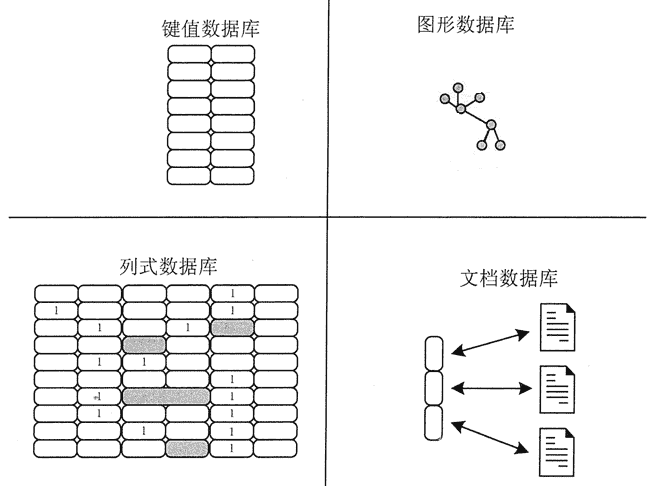
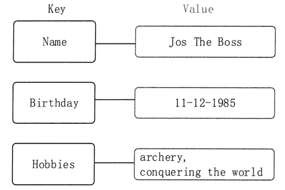
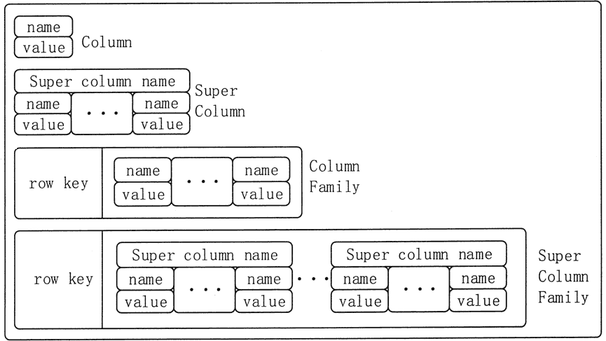
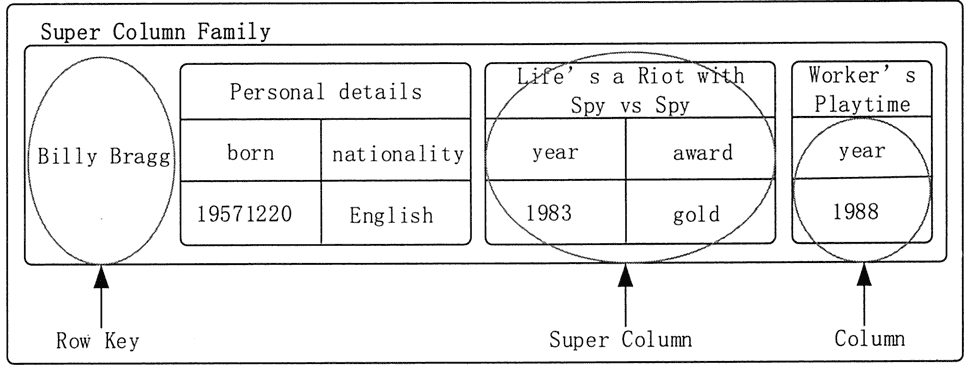
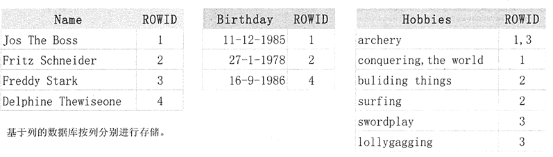
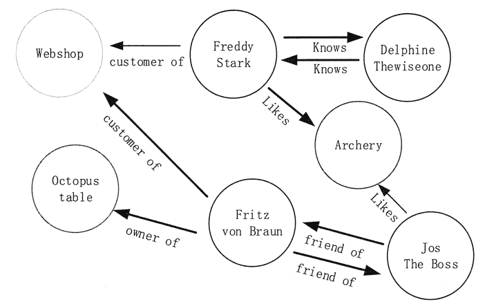

# NoSQL 数据库类型简介

> 原文：[`c.biancheng.net/view/3594.html`](http://c.biancheng.net/view/3594.html)

近些年来，NoSQL 数据库的发展势头很快。据统计，目前已经产生了 50 到 150 个 NoSQL 数据库系统。但是，归结起来，可以将典型的 NoSQL 划分为 4 种类型，分别是键值数据库、列式数据库、文档数据库和图形数据库，如图 1 所示。

图 1  4 种类型的 NoSQL 数据库
 
图 2  键值数据库举例

#### **1\. 键值数据库**

键值数据库起源于 Amazon 开发的 Dynamo 系统，可以把它理解为一个分布式的 Hashmap，支持 SET/GET 元操作。

它使用一个哈希表，表中的 Key（键）用来定位 Value（值），即存储和检索具体的 Value。数据库不能对 Value 进行索引和查询，只能通过 Key 进行查询。Value 可以用来存储任意类型的数据，包括整型、字符型、数组、对象等。

如图 2 所示。键值存储的值也可以是比较复杂的结构，如一个新的键值对封装成的一个对象。一个完整的分布式键值数据库会将 Key 按策略尽量均匀地散列在不同的结点上，其中，一致性哈希函数是比较优雅的散列策略，它可以保证当某个结点挂掉时，只有该结点的数据需要重新散列。

在存在大量写操作的情况下，键值数据库可以比关系数据库有明显的性能优势，这是因为关系型数据库需要建立索引来加速查询，当存在大量写操作时，索引会发生频繁更新，从而会产生高昂的索引维护代价。键值数据库具有良好的伸缩性，理论上讲可以实现数据量的无限扩容。

键值数据库可以进一步划分为内存键值数据库和持久化键值数据库。内存键值数据库把数据保存在内存中，如 Memcached 和 Redis。

持久化键值数据库把数据保存在磁盘中，如 BerkeleyDB、Voldmort 和 Riak。

键值数据库也有自身的局限性，主要是条件查询。如果只对部分值进行查询或更新，效率会比较低下。在使用键值数据库时，应该尽量避免多表关联查询。此外，键值数据库在发生故障时不支持回滚操作，所以无法支持事务。

大多数键值数据库通常不会关心存入的 Value 到底是什么，在它看来，那只是一堆字节而已，所以开发者也无法通过 Value 的某些属性来获取整个 Value。

#### **2\. 列式数据库**

列式数据库起源于 Google 的 BigTable，其数据模型可以看作是一个每行列数可变的数据表， 它可以细分为 4 种实现模式，如图 3 所示。
图 3  列式数据库模型
其中，Super Column Family 模式可以理解为 maps of maps，例如，可以把一个作者和他的专辑结构化地存成 Super Column Family 模式，如图 4 所示。
图 4  Super Column Family 模式
在行式数据库中查询时，无论需要哪一列都需要将每一行扫描完。假设想要在图 5 中的生日列表中查询 9 月的生日，数据库将会从上到下和从左到右扫描表，最终返回生日为 9 月的列表。
图 5  关系型数据库数据模型
如果给某些特定列建索引，那么可以显著提高查找速度，但是索引会带来额外的开销，而且数据库仍在扫描所有列。

而列式数据库可以分别存储每个列，从而在列数较少的情况下更快速地进行扫描。图 6 的布局看起来和行式数据库很相似，每一列都有一个索引，索引将行号映射到数据，列式数据库将数据映射到行号，采用这种方式计数变得更快，很容易就可以查询到某个项目的爱好人数， 并且每个表都只有一种数据类型，所以单独善储列也利于优化压缩。

图 6  列式 NoSQL 存储模型
列式数据库能够在其他列不受影响的情况下，轻松添加一列，但是如果要添加一条记录时就需要访问所有表，所以行式数据库要比列式数据库更适合联机事务处理过程（OLTP)，因为 OLTP 要频繁地进行记录的添加或修改。

列式数据库更适合执行分析操作，如进行汇总或计数。实际交易的事务，如销售类，通常会选择行式数据库。列式数据库采用高级查询执行技术，以简化的方法处理列块（称为“批处理”），从而减少了 CPU 使用率。

#### **3\. 文档数据库**

文档数据库是通过键来定位一个文档的，所以是键值数据库的一种衍生品。在文档数据库中，文档是数据库的最小单位。文档数据库可以使用模式来指定某个文档结构。

文档数据库是 NoSQL 数据库类型中出现得最自然的类型，因为它们是按照日常文档的存储来设计的，并且允许对这些数据进行复杂的查询和计算。

尽管每一种文档数据库的部署各有不同，但是大都假定文档以某种标准化格式进行封装，并对数据进行加密。

文档格式包括 XML、YAML、JSON 和 BSON 等，也可以使用二进制格式，如 PDF、Microsoft Office 文档等。一个文档可以包含复杂的数据结构，并且不需要采用特定的数据模式，每个文档可以具有完全不同的结构。

文档数据库既可以根据键来构建索引，也可以基于文档内容来构建索引。基于文档内容的索引和查询能力是文档数据库不同于键值数据库的主要方面，因为在键值数据库中，值对数据库是透明不可见的，不能基于值构建索引。

文档数据库主要用于存储和检索文档数据，非常适合那些把输入数据表示成文档的应用。从关系型数据库存储方式的角度来看，每一个事物都应该存储一次，并且通过外键进行连接，而文件存储不关心规范化，只要数据存储在一个有意义的结构中就可以。

如图 7 所示，如果我们要将报纸或杂志中的文章存储到关系型数据库中，首先我们要对存储的信息进行分类，即将文章放在一个表中，作者和相关信息放在一个表中，文章评论放在一个表中，读者信息放在一个表中，然后将这四个表连接起来进行查询。

但是文档存储可以将文章存储为单个实体，这样就降低了用户对文章数据的认知负担。

#### **4\. 图形数据库**

图形数据库以图论为基础，用图来表示一个对象集合，包括顶点及连接顶点的边。图形数据库使用图作为数据模型来存储数据，可以高效地存储不同顶点之间的关系。

图形数据库是 NoSQL 数据库类型中最复杂的一个，旨在以高效的方式存储实体之间的关系。

图形数据库适用于高度相互关联的数据，可以高效地处理实体间的关系，尤其适合于社交网络、依赖分析、模式识别、推荐系统、路径寻找、科学论文引用，以及资本资产集群等场景。
图 7  关系型数据库和文档数据库存储报纸或杂志中的文章的比较
图形或网络数据主要由结点和边两部分组成。结点是实体本身，如果是在社交网络中，那么代表的就是人。边代表两个实体之间的关系，用线来表示，并具有自己的属性。另外，边还可以有方向，如果箭头指向谁，谁就是该关系的主导方，如图 8 所示。
图 8  图形数据库模型示意
图形数据库在处理实体间的关系时具有很好的性能，但是在其他应用领域，其性能不如其他 NoSQL 数据库。

典型的图形数据库有 Neo4J、OrientDB、InfoGrid、Infinite Graph 和 GraphDB 等。有些图形数据库，如 Neo4J，完全兼容 ACID 特性。