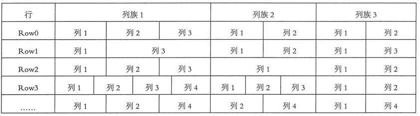
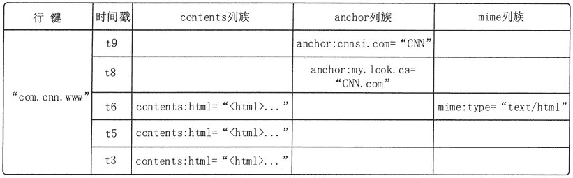
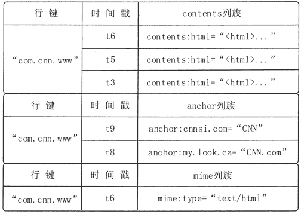

# HBase 列式数据模型简介

> 原文：[`c.biancheng.net/view/3586.html`](http://c.biancheng.net/view/3586.html)

数据模型是理解一个数据库的关键，本节介绍 HBase 的列式数据模型，与数据模型相关的基本概念，并描述 HBase 数据库的概念视图和物理视图。

## 数据模型概述

HBase 是一个稀疏、多维度、有序的映射表。

这张表中每个单元是通过由行键、列族、列限定符和时间戳组成的索引来标识的。每个单元的值是一个未经解释的字符串，没有数据类型。当用户在表中存储数据时，每一行都有一个唯一的行键和任意多的列。

表的每一行由一个或多个列族组成，一个列族中可以包含任意多个列。在同一个表模式下，每行所包含的列族是相同的，也就是说，列族的个数与名称都是相同的，但是每一行中的每个列族中列的个数可以不同，如图 1 所示。
图 1  HBase 数据模型示意
HBase 中的同一个列族里面的数据存储在一起，列族支持动态扩展，可以随时添加新的列，无须提前定义列的数量。所以，尽管表中的每一行会拥有相同的列族，但是可能具有截然不同的列。正因为如此，对于整个映射表的每行数据而言，有些列的值就是空的，所以 HBase 的表是稀疏的。

HBase 执行更新操作时，并不会删除数据旧的版本，而是生成一个新的版本，原有的版本仍然保留。

用户可以对 HBase 保留的版本数量进行设置。在查询数据库的时候，用户可以选择获取距离某个时间最近的版本，或者一次获取所有版本。如果查询的时候不提供时间戳，那么系统就会返回离当前时间最近的那一个版本的数据。

HBase 提供了两种数据版本回收方式：一种是保存数据的最后个版本；另一种是保存最近一段时间内的版本，如最近一个月。

## 数据模型的基本概念

HBase 中的数据被存储在表中，具有行和列，是一个多维的映射结构。本节将对与 HBase 数据模型相关的基本概念进行统一介绍。，

#### 1\. 表（Table)

HBase 采用表来组织数据，表由许多行和列组成，列划分为多个列族。

#### 2\. 行（Row)

在表里面，每一行代表着一个数据对象。每一行都是由一个行键（Row Key）和一个或者多个列组成的。行键是行的唯一标识，行键并没有什么特定的数据类型，以二进制的字节来存储，按字母顺序排序。

因为表的行是按照行键顺序来进行存储的，所以行键的设计相当重要。设计行键的一个重要原则就是相关的行键要存储在接近的位置，例如，设计记录网站的表时，行键需要将域名反转（例如，org.apache.www、org.apache.mail、org.apache.jira），这样的设计能使与 apache 相关的域名在表中存储的位置非常接近。

访问表中的行只有 3 种方式：通过单个行键获取单行数据；通过一个行键的区间来访问给定区间的多行数据；全表扫描。

#### 3\. 列（Column）

列由列族（Column Family）和列限定符（Column Qualifier）联合标识，由“：”进行间隔，如 family:qualifiero

#### 4\. 列族（Column Family)

在定义 HBase 表的时候需要提前设置好列族，表中所有的列都需要组织在列族里面。列族一旦确定后，就不能轻易修改，因为它会影响到 HBase 真实的物理存储结构，但是列族中的列限定符及其对应的值可以动态增删。

表中的每一行都有相同的列族，但是不需要每一行的列族里都有一致的列限定符，所以说是一种稀疏的表结构，这样可以在一定程度上避免数据的冗余。

HBase 中的列族是一些列的集合。一个列族的所有列成员都有着相同的前缀，例如，courses:history 和 courses:math 都是列族 courses 的成员。“:”是列族的分隔符，用来区分前缀和列名。列族必须在表建立的时候声明，列随时可以新建。

#### 5\. 列限定符（Column Qualifier）

列族中的数据通过列限定符来进行映射。列限定符不需要事先定义，也不需要在不同行之间保持一致。列限定符没有特定的数据类型，以二进制字节来存储。

#### 6\. 单元（Cell）

行键、列族和列限定符一起标识一个单元，存储在单元里的数据称为单元数据，没有特定的数据类型，以二进制字节来存储。

#### 7\. 时间戳（Timestamp）

默认情况下，每一个单元中的数据插入时都会用时间戳来进行版本标识。

读取单元数据时，如果时间戳没有被指定，则默认返回最新的数据；写入新的单元数据时，如果没有设置时间戳，则默认使用当前时间。每一个列族的单元数据的版本数量都被 HBase 单独维护，默认情况下，HBase 保留 3 个版本数据。

## 概念视图

在 HBase 的概念视图中，一张表可以视为一个稀疏、多维的映射关系，通过“行键+列族:列限足符+时间戳”的格式就可以定位特定单元的数据。因为 HBase 的表是稀疏的，因此某些列可以是空白的。

图 2 是 HBase 的概念视图，是一个存储网页信息的表的片段。行键是一个反向 UKL，如 www.cnn.com 反向成 com.cnn.www。

反向 URL 的好处就是，可以让来自同一个网站的数据内容都保存在相邻的位置，从而可以提高用户读取该网站的数据的速度。contents 列族存储了网页的内容；anchor 列族存储了引用这个网页的链接；mime 列族存储了该网页的媒体类型。

图 2  HBase 的概念视图
图 2 给出的 com.cnn.www 网站的概念视图中仅有一行数据，行的唯一标识为“com.cnn.www”，对这行数据的每一次逻辑修改都有一个时间戳关联对应。表中共有四列：contents:html、
anchor:cnnsi.com、anchor:my.look.ca 和 mime:type，每一列以前缀的方式给出其所属的列族。

从图 3 可以看出，网页的内容一共有 3 个版本，对应的时间戳分别为 t3、t5 和 t6。网页被两个页面引用，分别是 my.look.ca 和 cnnsi.com，被引用的时间分别是 t8 和 t9。网页的媒体类型从 t6 开始为“text/html”。

要定位单元中的数据可以采用“三维坐标”来进行，也就是 [行键，列族:列限定符，时间戳]。

例如，在图 3 中：

*   [“com.cnn.www”，anchor:cnnsi.com，t9] 对应的单元格中的数据为“CNN”。
*   [“com.cnn.www”，anchor:my.look.ca， t8] 对应的单兀中的数据为“CNN.com”。
*   [“com.cnn.www”，mime:type，t6] 对应的单元的数据为“text/html”。

从图 3 可以看出，在 HBase 表的概念视图中，每个行都包含相同的列族，尽管并不是每行都需要在每个列族里都存储数据。例如，在图 3 的前两行数据中，列族 contents 和列族 mime 的内容为空。后 3 行数据中，列族 anchor 的内容为空。后两行数据中，列族 mime 的内容为空。

## 物理视图

虽然从概念视图层面来看，HBase 的每个表是由许多行组成的，但是在物理存储层面来看，它是采用了基于列的存储方式，而不是像关系型据库那样用基于行的存储方式。这正是 HBase 与关系型数据库的重要区别之一。

图 2 的概念视图在进行物理存储的时候，会存为图 3 中的 3 个片段。也就是说，这个 HBase 表会按照 contents、anchor 和 mime 3 个列族分别存放。属于同一个列族的数据保存在一起，同时，和每个列族一起存放的还包括行键和时间戳。

在图 2 的概念视图中，可以看到许多列是空的，也就是说，这些列上面不存在值。在物理视图中，这些空的列并不会存储成 null，而是根本不会被存储，从而可以节省大量的存储空间。当请求这些空白的单元的时候，会返回 null 值。

图 3  HBase 的物理视图