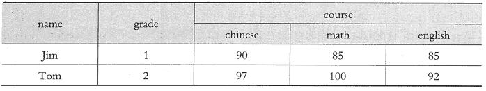

# HBase Shell 常用命令和基本操作（附带实例）

> 原文：[`c.biancheng.net/view/3587.html`](http://c.biancheng.net/view/3587.html)

HBase 为用户提供了一个非常方便的命令行使用方式——HBase Shell。

HBase Shell 提供了大多数的 HBase 命令，通过 HBase Shell，用户可以方便地创建、删除及修改表，还可以向表中添加数据，列出表中的相关信息等。本节介绍一些常用的命令和具体操作，并讲解如何使用命令行实现一个“学生成绩表”。

## —般操作

**1\. 查询服务器状态**

hbase(main):0il:0>status
1 active master,0 backup masters, 1 servers,0 dead,4.0000 average load

**2\. 查询版本号**

hbase(main):012:0>version
1.2.1,r8d8a7107dc4ccbf36a92f64675dc60392f85c015,Wed Mar 30 11:19:21 CDT 2016

## DDL 操作

数据定义语言（Data Defination Language，DDL）操作主要用来定义、修改和查询表的数据库模式。

#### **1\. 创建一个表**

hbase(main):013:0>
create'table','column_famaly','column_famaly1','column_famaly2'
0 row(s) in 94.9160 seconds

#### **2\. 列出所有表**

hbase(main):014:0>list
TABLE
stu
table
test
3 row(s) in 0.0570 seconds

#### **3\. 获取表的描述**

hbase(main):015:0> describe'table'
Table table is ENABLED
table
COLUMN FAMILIES DESCRIPTION
{NAME =>'coluran_famaly',DATA_BLOCK_ENCODING =>'NONE',BLOOMFILTER =>'ROW',REPLICATION_SCOPE=>'0',VERSIONS=>'1',COMPRESSION=>'NONE', MIN_VERSIONS =>'0',TTL=>'FOREVER',KEEP_DELETED_CELLS=>'FALSE',BLOCKSIZE=>'65536',IN_MEMORY
=>'false',BLOCKCACHE=>'true}
......
3 row(s) in 0.0430 seconds

#### **4\. 删除一个列族**

hbase(main):016:0>alter'table',{NAME=>'column_famaly',METHOD=>'delete'}
Updating all regions with the new schema...
1/1 regions updated.
Done.
0 row(s) in 3.0220 seconds

#### **5\. 删除一个表**

首先把表设置为 disable。

hbase(main):020:0>disable'stu'
0 row(s) in 2.3150 seconds

然后删除一个表。

hbase(main):021:0>drop'stu'
0 row(s) in 1.2820 seconds

#### **6\. 查询表是否存在**

hbase(main):024:0>exists'table'
Table table does exist
0 row(s) in 0.0280 seconds

#### **7\. 查看表是否可用**

hbase(main):025:0>is_enabled'table'
true
0 row(s) in 0.0150 seconds

## DML 操作

DML（Data Manipulation Language，数据操作语言）操作主要用来对表的数据进行添加、修改、获取、删除和查询。

#### **1\. 插入数据**

给 emp 表的 rw1 行分别插入 3 个列。

hbase(main):031:0>put'emp','rw1','col_f1:name','tanggao'
0 row(s) in 0.0460 seconds

hbase(main):032:0>put'emp','rw1','col_f1:age','20'
0 row(s) in 0.0150 seconds

hbase(main):033:0>put'emp','rw1','col_f1:sex','boy'
0 row(s) in 0.0190 seconds

#### **2\. 获取数据**

获取 emp 表的 rw1 行的所有数据。

hbase(main):034:0> get 'emp','rw1'
COLUMN    CELL
col_f1:age timestamp=1463055735107,value=20
col_f1:name timestamp=1463055709542,value=tanggao
col_f1:sex timestamp=1463055753395,value=boy
3 row(s) in 0.3200 seconds

获取 emp 表的 rw1 行 col_f1 列族的所有数据。

hbase(main):035:0>get'emp','rw1','col_f1'
COLUMN    CELL   
col_f1:age timestamp=1463055735107,value=20
col_f1:name timestamp=1463055709542,value=tanggao col_f1:sex timestamp=1463055753395,value=boy
3 row(s) in 0.0270 seconds

#### **3\. 更新一条记录**

更新 emp 表的 rw1 行、col_f1 列族中 age 列的值。

hbase (main):037:0> put 'emp','rw1'col_f1:age','22'
0 row(s) in 0.0160 seconds

查看更新的结果。

hbase(main):038:0>get 'emp','rw1','col_f1:age'
COLUMN    CELL   
col_f1:age timestamp=1463055893492,value=22
1 row(s) in 0.0190 seconds

#### **4\. 通过时间戳获取两个版本的数据**

hbase(main):039:0>get 'emp','rw1',{COLUMN=>'col_f1:age',TIMESTAMP=>1463055735107}
COLUMN    CELL
col_f1:age timestamp=1463055735107,value=20
1 row(s) in 0.0340 seconds

hbase(main):040:0>get 'emp','rw1',{COLUMN=>'col_f1:age',TIMESTAMP=>1463055893492}
COLUMN    CELL   
col_f1:age timestamp=1463055893492,value=22
1 row(s) in 0.0140 seconds

#### **5\. 全表扫描**

hbase(main):041:0>scan 'emp'
ROW    COLUMN+CELL
id    column=col_f1:age,timestamp=1463055893492,value=2
id    column=col_f1:name,timestamp=1463055709542,value=tanggao
id    column=col_f1:sex,timestamp=1463055753395,value=boy
1 row(s) in 0.1520 seconds

#### **6\. 删除一列**

删除 emp 表 rw1 行的一个列。

hbase(main):042:0>delete 'emp','rw1','col_f1:age'
0 row(s) in 0.0200 seconds

检查删除操作的结果。

hbase(main):043:0>get 'emp','rw1'
COLUMN    CELL
col_f1:name timestamp=1463.055709542,value=tanggao col_f1:sex timestamp=1463055753395,value=boy
2 row(s) in 0.2430 seconds

#### **7\. 删除行的所有单元格**

使用“deleteall”命令删除 emp 表 rw1 行的所有列。

hbase(main) :044:0>deleteall 'emp','rw1'
0 row(s) in 0.0550 seconds

#### **8\. 统计表中的行数**

hbase(main):045:0>count 'emp'
0 row(s) in 0.0450 seconds

#### **9\. 清空整张表**

hbase(main):007:0>truncate'emp'
Truncating 'emp' table(it may take a while);
-Disabling table...
-Truncating table...
0 row(s) in 4.1510 seconds

## HBase 表实例

下面将以一个“学生成绩表”的例子来介绍常用的 HBase 命令的使用方法。

图 1 是一张学生成绩单，其中，name 是行键，grade 是一个特殊列族，只有一列并且没有名字（列族下面的列是可以没有名字的），course 是一个列族，由 3 个列组成（Chinese、math 和 english)。用户可以根据需要在 course 中建立更多的列，如 computing、physics 等。

图 1  学生成绩单

#### **1\. 建立一个表 scores，包含两个列族：grade 和 course**

hbase(main):001:0> create 'scores','grade','course'

#### **2\. 按设计的表结构添加值**

put'scores','Jim1','grade:'1'
put'scores','Jim','course:Chinese','90'
put'scores','Jim','course:math','85'
put'scores','Jim','course:english','85'
put'scores','Tom','grade:','2'
put'scores','Tom','course:Chinese','97'
put'scores','Tom','course:math','100'
put'scores','Tom','course:english','92'

样表结构就建立起来了，列族里边可以自由添加子列。如果列族下没有子列，则只加“:”即可。

#### **3\. 根据键值查询数据**

查看 scores 表中的 Jim 行的相关数据。

hbase(main):012:0>get 'scores','Jim'

查看 scores 表中 Jim 行、course 列族中 math 列的值。

hbase(main):012:0>get 'scores','Jim','course:math'

或者用以下代码。

hbase(main):012:0>get 'scores','Jim',{COLUMN=>'course:math'}

#### **4\. 扫描所有数据**

hbase(main):012:0>scan 'scores'

上述命令会显示所有数据行，也就是 Tom 和 Jim 的所有课程的成绩，包括 chinese、math 和 english。

为了限制返回的结果，用户可以指定一些修饰词，如 TIMERANGE、FILTER、LIMIT、STARTROW、STOPROW、TIMESTAMP、MAXLENGTH 或 COLUMN。

获取 Jim 和 Tom 的 english 的成绩。

scan'scores',{COLUMN=>'course:english',STARTROW=>Jim,ENDROW=Tom}

#### **5\. 添加新的列**

为 Tom 添加 computing 课程的成绩。

hbase(main):012:0>put'scores','Tom','course:computing','90'