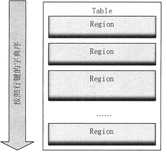
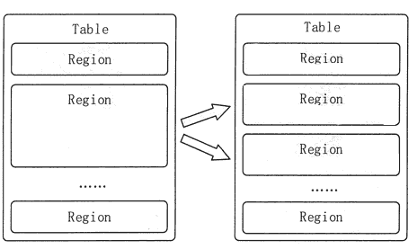
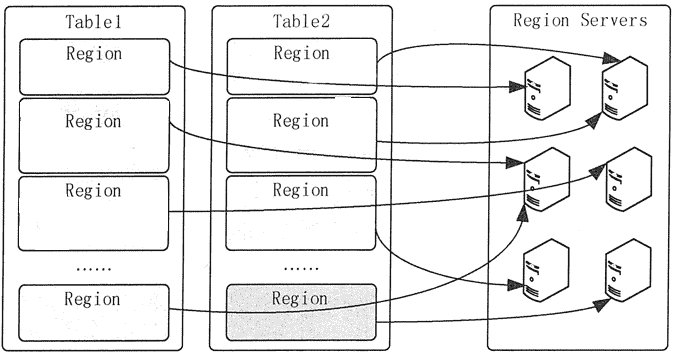
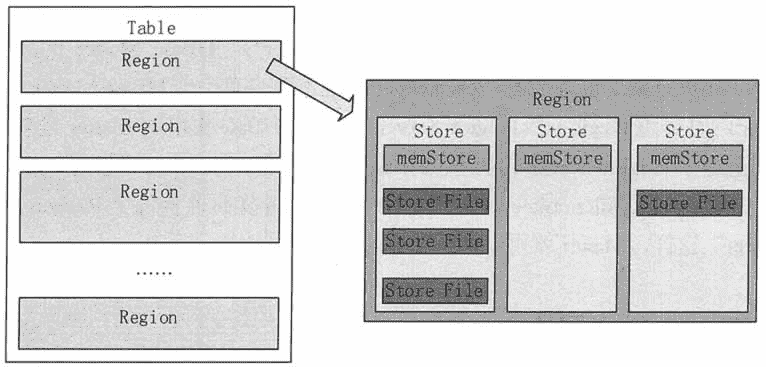
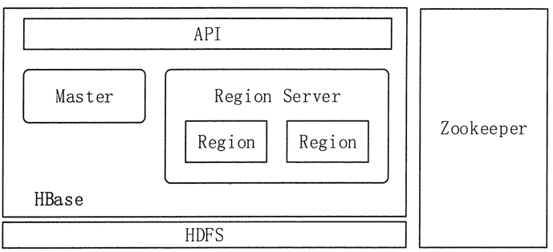

# HBase 主要运行机制（物理存储和逻辑架构）

> 原文：[`c.biancheng.net/view/3598.html`](http://c.biancheng.net/view/3598.html)

本节将对 HBase 的主要运行机制进行简单介绍。

## HBase 的物理存储

HBase 表中的所有行都是按照行键的字典序排列的。因为一张表中包含的行的数量非常多，有时候会高达几亿行，所以需要分布存储到多台服务器上。

因此，当一张表的行太多的时候，HBase 就会根据行键的值对表中的行进行分区，每个行区间构成一个“分区（Region）”，包含了位于某个值域区间内的所有数据，如图 1 所示。

图 1  HBase 的 Region 存储模式图
Region 是按大小分割的，每个表一开始只有二个 Region，随着数据不断插入到表中，Region 不断增大，当增大到一个阈值的时候，Region 就会等分为两个新的 Region。当表中的行不断增多时，就会有越来越多的 Region，如图 2 所示。
图 2  HBase 的 Region 分裂示意
Region 是 HBase 中数据分发和负载均衡的最小单元，默认大小是 100MB 到 200MB。不同的 Region 可以分布在不同的 Region Server 上，但一个 Region 不会拆分到多个 Region Server 上。每个 Region Server 负责管理一个 Region 集合。如图 3 所示。

图 3  HBase 的 Region 分布模式
Region 是 HBase 在 Region Server 上数据分发的最小单元，但并不是存储的最小单元。事实上，每个 Region 由一个或者多个 Store 组成，每个 Store 保存一个列族的数据。每个 Store 又由一个 memStore 和 0 至多个 Store File 组成，如图 4 所示。Store File 以 HFile 格式保存在 HDFS 上。

图 4  HBase 的 Region 存储模式

## HBase 的逻辑架构

在分布式的生产环境中，HBase 需要运行在 HDFS 之上，以 HDFS 作为其基础的存储设施。HBase 的上层是访问数据的 Java API 层，供应用访问存储在 HBase 中的数据。HBase 的集群主要由 Master、Region Server 和 Zookeeper 组成，具体模块如图 5 所示。

图 5  HBase 的系统架构

#### 1）Master

Master 主要负责表和 Region 的管理工作。

表的管理工作主要是负责完成增加表、删除表、修改表和查询表等操作。

Region 的管理工作更复杂一些，Master 需要负责分配 Region 给 Region Server，协调多个 Region Server，检测各个 Region Server 的状态，并平衡 Region Server 之间的负载。

当 Region 分裂或合并之后，Master 负责重新调整 Region 的布局。如果某个 Region Server 发生故障，Master 需要负责把故障 Region Server 上的 Region 迁移到其他 Region Server 上。

HBase 允许多个 Master 结点共存，但是这需要 Zookeeper 进行协调。当多个 Master 结点共存时，只有一个 Master 是提供服务的，其他的 Master 结点处于待命的状态。当正在工作的 Master 结点宕机时，其他的 Master 则会接管 HBase 的集群。

#### 2）RegionServer

HBase 有许多个 Region Server，每个 Region Server 又包含多个 Region。Region Server 是 HBase 最核心的模块，负责维护 Master 分配给它的 Region 集合，并处理对这些 Region 的读写操作。Client 直接与 Region Server 连接，并经过通信获取 HBase 中的数据。

HBase 釆用 HDFS 作为底层存储文件系统，Region Server 需要向 HDFS 写入数据，并利用 HDFS 提供可靠稳定的数据存储。Region Server 并不需要提供数据复制和维护数据副本的功能。

#### 3）Zookeeper

Zookeeper 的作用对 HBase 很重要。首先，Zookeeper 是 HBase Master 的高可用性（High Available，HA）解决方案。也就是说，Zookeeper 保证了至少有一个 HBase Master 处于运行状态。

Zookeeper 同时负责 Region 和 Region Server 的注册。HBase 集群的 Master 是整个集群的管理者，它必须知道每个 Region Server 的状态。

HBase 就是使用 Zookeeper 来管理 Region Server 状态的。每个 Region Server 都向 Zookeeper 注册，由 Zookeeper 实时监控每个 Region Server 的状态，并通知给 Master。这样，Master 就可以通过 Zookeeper 随时感知各个 Region Server 的工作状态。