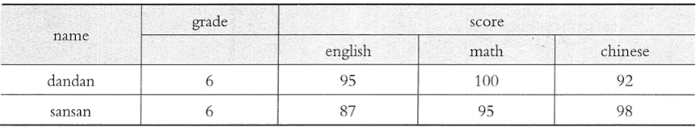

# HBase Java API 编程实例

> 原文：[`c.biancheng.net/view/3601.html`](http://c.biancheng.net/view/3601.html)

本节通过一个具体的编程实例来学习如何使用 HBase Java API 解决实际问题。在本实例中，首先创建一个学生成绩表 scores，用来存储学生各门课程的考试成绩，然后向 scores 添加数据。

表 scores 的概念视图如图 1 所示，用学生的名字 name 作为行键，年级 grade 是一个只有一个列的列族，score 是一个列族，每一门课程都是 score 的一个列，如 english、math、Chinese 等。score 的列可以随时添加。

例如，后续学生又参加了其他课程的考试，如 computing、physics 等，那么就可以添加到 score 列族。因为每个学生参加考试的课程也会不同，所以，并不一定表中的每一个单元都会有值。在该实例中，要向学生成绩表 scores 中添加的数据如图 2 所示。


图 1  学生成缋表 scores 的概念视图
 
图 2  学生成绩表 scores 的数据
本节首先对学生成绩表实例的代码框架进行描述，然后详细介绍每一个功能模块的代码细节。

```

import java.io.IOException;
import org.apache.hadoop.conf.Configuration;
import org.apache.hadoop.hbase.*;
import org.apache.hadoop.hbase.client.*;
import org.apache.hadoop.hbase.util.Bytes;
public class StudentScores {
    public static Configuration configuration; //HBase 配置信息
    public static Connection connection; //HBase 连接
    public static void main (String [] agrs) thorws IOException{
        init();//建立连接
        createTable();//建表
        insertData();//添加课程成绩
        insertData();//添加课程成绩
        insertData();//添加课程成绩
        getData();//浏览课程成绩
        close();//关闭连接
    }

    public static void init () {......} //建立连接
    public static void close () {......} //关闭连接
    public static void createTable (){......} //创建表
    public static void insertData () {......} //添加课程成绩
    public static getData() {……} //浏览操程成绩
}
```

下面分别对每一个功能模块的代码进行介绍。

**1\. 建立连接和关闭连接**

在使用 HBase 数据库前，必须首先建立连接，通过连接可以获取 Admin 子类，完成对数据库模型的操作。建立连接的代码如下。

```

public static void init () {
    configuration = HBaseConfiguration.create();
    configuration.set("hbase.rootdir","hdfs://localhost:9000/hbase");
    try{
        connection = ConnectionFactory.createConnection(configuration);
        admin = connection.getAdmin();
    }catch(IOException e){
        e.printStackTrace();
    }
}
```

代码中，首先为 configuration 配置对象设置 HBase 数据库的存储路径 hbase.rootdir。本实例使用 HDFS 作为 HBase 的底层存储方式，所以在代码中把 configuration 的第二个参数赋值为 hdfs://localhost:9000/hbase。

对 HBase 数据库操作结束之后，需要关闭数据库的连接，具体代码如下。

```

public static void close() {
    try{
        if(admin != null) {
            admin.close();
        }
        if (null != connection) {
            Connection.close();
        }
    }catch (IOException e) {
        e.printStackTrace();
    }
}
```

**2\. 创建表**

创建 HBase 数据库表的时候，首先需要定义表的模型，包括表的名称、行键和列族的名称。具体代码如下。

```

public static void createTable(String myTableName,String[] colFamily) throws IOException {
    TableName tableName = TableName.valueOf(myTableName);
    If(admin.tableExists(tableName)){
        System.out.printIn("table exists!");
    } else {
        HTableDescriptor hTableDescriptor = new HTableDescriptor(tableName);
        for(String str:colFamily){
            HColumnDescriptor hColumnDescriptor = new HColumnDescriptor(str);
            hTableDescriptor.addFamily(hColumnDescriptor);
        }
        admin.createTable(hTableDescriptor);
    }
}
```

调用上述代码创建学生成绩表 scores，需要指定参数 myTableName 为“scores”，colFamily 为 “{"grade"，"score"}”，即 createTable("scores",{"grade","score"})。

**3\. 添加数据**

为 HBase 数握库表添加数据，需要指定行键、列族、列限定符、时间戳，其中，时间戳可以在添加数据时由系统自动生成。因此，向表里添加数据时，需要提供行键、列族和列限定符及数据值信息，具体代码如下。

```

public static void insertData(String tableName, String rowKey, String colFamily, String col, String val) throws IOException {
    Table table = connection.getTable(TableName.valueOf(tableName));
    Put put = new Put(rowKey.getBytes());
    put.addColumn(colFamily.getBytes(),col.getBytes(),val.getBytes());
    table.put(put);
    table.close();
}
```

使用上述代码添加数据时，需要分别为参数 tableName、rowKey、colFamily、col 和 val 赋值。例如，要添加图 2 的第一个学生的数据，就需要使用如下 4 行代码。

```

insertData("scores","dandan","grade","","6");
insertData("scores","dandan","score","english","95");
insertData("scores","dandan","score"，"math","100");
insertData("scores","dandan","score","Chinese","92");
```

通过以下代码添加第二个学生的数据。

```

insertData("scores","sansan","grade","","6");
insertData("scores","sansan","score","english","87");
insertData("scores","sansan","score","math","95");
insertData("scores","sansan","score","Chinese","98");
```

**4\. 浏览数据**

在向数据库表添加数据以后，就可以查询表中的数据了。

```

public static void getData (String tableName,String rowKey,String colFamily,String col)throws IOException {

    Table table = connection.getTable(TableName.valueOf(tableName));
    Get get = new Get (rowKey. getBytes()).;
    get.addColumn(colFamily.getBytes(),col.getBytes());
    Result result = table.get(get);
    System.out.printIn(new String(result.getValue(colFamily.getBytes(),
    col.getBytes())));
    table.close();
}
```

使用上述代码就可以查询学生课程的成绩，例如，为了查询学生“dandan”的“math”课程的成绩，就可以使用下述代码。

getData("scores","dandan","score","math");