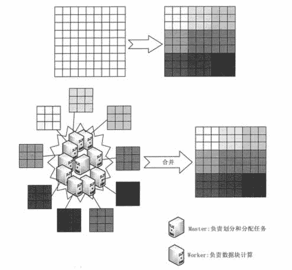
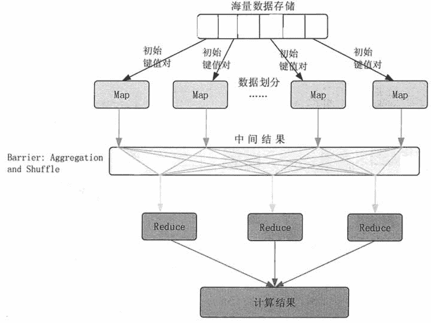
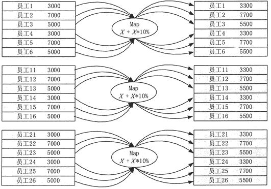

# Hadoop MapReduce 简介

> 原文：[`c.biancheng.net/view/3604.html`](http://c.biancheng.net/view/3604.html)

本节首先简单介绍大数据批处理概念，然后介绍典型的批处理模式 MapReduce，最后对 Map 函数和 Reduce 函数进行描述。

## 批处理模式

批处理模式是一种最早进行大规模数据处理的模式。批处理主要操作大规模静态数据集，并在整体数据处理完毕后返回结果。批处理非常适合需要访问整个数据集合才能完成的计算工作。

例如，在计算总数和平均数时，必须将数据集作为一个整体加以处理，而不能将其视作多条记录的集合。这些操作要求在计算进行过程中数据维持自己的状态。

需要处理大量数据的任务通常最适合用批处理模式进行处理，批处理系统在设计过程中就充分考虑了数据的量，可提供充足的处理资源。

由于批处理在应对大量持久数据方面的表现极为出色，因此经常被用于对历史数据进行分析。

为了提高处理效率，对大规模数据集进行批处理需要借助分布式并行程序。

传统的程序基本是以单指令、单数据流的方式按顺序执行的。这种程序开发起来比较简单，符合人们的思维习惯，但是性能会受到单台计算机的性能的限制，很难在给定的时间内完成任务。

而分布式并行程序运行在大量计算机组成的集群上，可以同时利用多台计算机并发完成同一个数据处理任务，提高了处理效率，同时，可以通过增加新的计算机扩充集群的计算能力。

Google 最先实现了分布式并行处理模式 MapReduce，并于 2004 年以论文的方式对外公布了其工作原理，Hadoop MapReduce 是它的开源实现。Hadoop MapReduce 运行在 HDFS 上。

## MapReduce 简释

如图 1 所示，如果我们想知道相当厚的一摞牌中有多少张红桃，最直观的方式就是一张张检查这些牌，并且数出有多少张是红桃。这种方法的缺陷是速度太慢，特别是在牌的数量特别高的情况下，获取结果的时间会很长。

图 1  找出有多少张红桃 MapReduce 方法的规则如下。

*   把这摞牌分配给在座的所有玩家。
*   让每个玩家数自己手中的牌中有几张是红桃，然后把这个数目汇报上来。
*   把所有玩家汇报的数字加起来，得到最后的结论。

显而易见，MapReduce 方法通过让所有玩家同时并行检查牌来找出一摞牌中有多少红桃，可以大大加快得到答案的速度。

MapReduce 方法使用了拆分的思想，合并了两种经典函数。

**1）映射（Map)**

对集合中的每个元素进行同一个操作。如果想把表单里每个单元格乘以二，那么把这个函数单独地应用在每个单元格上的操作就属于映射（Map)。

**2）化简（Reduce)**

遍历集合中的元素来返回一个综合的结果。如果想找出表单里所有数字的总和，那么输出表单里一列数字的总和的任务就属于化简（Reduce)。

下面使用 MapReduce 数据分析的基本方法来重新审视前面分散纸牌找出红桃总数的例子。在这个例子里，玩家代表计算机，因为他们同时工作，所以他们是个集群。

把牌分给多个玩家并且让他们各自数数，就是在并行执行运算，此时每个玩家都在同时计数。这就把这项工作变成了分布式的，因为多个不同的人在解决同一个问题的过程中并不需要知道他们的邻居在干什么。

告诉每个人去数数，实际上就是对一项检查每张牌的任务进行了映射。不是让玩家把红桃牌递回来，而是让他们把想要的东西化简为一个数字。

需要注意的是牌分配得是否均匀。如果某个玩家分到的牌远多于其他玩家，那么他数牌的过程可能比其他人要慢很多，从而会影响整个数牌的进度。

进一步还可以问一些更有趣的问题，例如，“一摞牌的平均值是什么？”。我们可以通过合并“所有牌的值的和是什么？”及“我们有多少张牌？”这两个问题来得到答案。用这个“和”除以“牌的张数”就得到了平均值。

MapReduce 算法的机制要远比数牌复杂得多，但是主体思想是一致的，即通过分散计算来分析大量数据。无论是 Google、百度、腾讯、NASA，还是小创业公司，MapReduce 都是目前分析互联网级别数据的主流方法。

## MapReduce 基本思想

使用 MapReduce 处理大数据的基本思想包括 3 个层面。首先，对大数据采取分而治之的思想。对相互间不具有计算依赖关系的大数据实现并行处理，最自然的办法就是采取分而治之的策略。

其次，把分而治之的思想上升到抽象模型。为了克服 MPI 等并行计算方法缺少高层并行编程模型这一缺陷，MapReduce 借鉴了 Lisp 函数式语言中的思想，用 Map 和 Reduce 两个函数提供了高层的并行编程抽象模型。

最后，把分而治之的思想上升到架构层面，统一架构为程序员隐藏系统层的实现细节。

MPI 等并行计算方法缺少统一的计算框架支持，程序员需要考虑数据存储、划分、分发、结果收集、错误恢复等诸多细节，为此，MapReduce 设计并提供了统一的计算框架，为程序员隐藏了绝大多数系统层面的处理细节。

**1\. 大数据处理思想：分而治之**

并行计算的第一个重要问题是如何划分计算任务或者计算数据以便对划分的子任务或数据块同时进行计算。但是，一些计算问题的前后数据项之间存在很强的依赖关系，无法进行划分，只能串行计算。

对于不可拆分的计算任务或相互间有依赖关系的数据无法进行并行计算。一个大数据若可以分为具有同样计算过程的数据块，并且这些数据块之间不存在数据依赖关系，则提高处理速度的最好办法就是并行计算。

例如，假设有一个巨大的 2 维数据，大得无法同时放进一个计算机的内存，如图 2 所示，现在需要求每个元素的开立方。因为对每个元素的处理是相同的，并且数据元素间不存在数据依赖关系，因此可以考虑将其划分为子数组，由一组计算机并行处理。

图 2  MapReduce 分而治之的思想**2\. 构建抽象模型：Map 函数和 Reduce 函数**

Lisp 函数式程序设计语言是一种列表处理语言。Lisp 定义了可对列表元素进行整体处理的 各种操作。例如，(add #(1 2 3 4) #(4 3 2 1)) 产生的结果为 #(5 5 5 5)。

Lisp 中还提供了类似于 Map 函数和 Reduce 函数的操作。如：

*   (map 'vector #+ #(1 2 3 4 5) #(10 11 12 13 14))，通过定义加法 Map 运算将两个向量相加产生的结果为 #(11 13 15 17 19)。
*   (reduce #' + #(11 13 15 17 19)) 通过加法归并产生的累加结果为 75。

Map 函数对一组数据元素进行某种重复式的处理，Reduce 函数对 Map 函数的中间结果进行某种进一步的结果整理。

MapReduce 通过借鉴 Lisp 的思想，定义了 Map 和 Reduce 两个抽象的编程接口，为程序员提供了一个清晰的操作接口抽象描述，由用户去编程实现。

**1) Map:<k1,v1>List(<K2,V2>)**

输入：键值对<k1,v1>表示的数据。

处理：数据记录将以“键值对”形式传入 Map 函数；Map 函数将处理这些键值对，并以另一种键值对形式输出中间结果 List(<K2,V2>)。

输出：键值对 List(<K2,V2>)示的一组中间数据。

**2) Reduce:<K2,List(V2)>→List(<K3,V3>)**

输入：由 Map 输出的一组键值对 List(<K2,V2>)将被进行合并处理，同样主键下的不同数值会合并到一个列表 List(V2)中，故 Reduce 的输入为<K2,List(V2)>。

处理：对传入的中间结果列表数据进行某种整理或进一步的处理，并产生最终的输出结果 List(<K3,V3>)。

输出：最终输出结果 List(<K3,V3>)。

基于 MapReduce 的并行计算模型如图 3 所示。各个 Map 函数对所划分的数据并行处理，从不同的输入数据产生不同的中间结果。

各个 Reduce 函数也各自并行计算，负责处理不同的中间结果。进行 Reduce 函数处理之前，必须等到所有的 Map 函数完成。

因此，在进入 Reduce 函数前需要有一个同步屏障；这个阶段也负责对 Map 函数的中间结果数据进行收集整理处理，以便 Reduce 函数能更有效地计算最终结果，最终汇总所有 Reduce 函数的输出结果即可获得最终结果。

图 3  基于 MapReduce 的并行计算模型**3）上升到架构：并行自动化并隐藏底层细节**

MapReduce 提供了一个统一的计算框架，来完成计算任务的划分和调度，数据的分布存储和划分，处理数据与计算任务的同步，结果数据的收集整理，系统通信、负载平衡、计算性能优化、系统结点出错检测和失效恢复处理等。

MapReduce 通过抽象模型和计算框架把需要做什么与具体怎么做分开了，为程序员提供了一个抽象和高层的编程接口和框架，程序员仅需要关心其应用层的具体计算问题，仅需编写少量的处理应用本身计算问题的程序代码。

与具体完成并行计算任务相关的诸多系统层细节被隐藏起来，交给计算框架去处理：从分布代码的执行，到大到数千个，小到单个的结点集群的自动调度使用。

MapReduce 计算架构提供的主要功能包括以下几点。

**1）任务调度**

提交的一个计算作业（Job)将被划分为很多个计算任务（Tasks)。

任务调度功能主要负责为这些划分后的计算任务分配和调度计算结点（Map 结点或 Reduce 结点），同时负责监控这些结点的执行状态，以及 Map 结点执行的同步控制，也负责进行一些计算性能优化处理。例如，对最慢的计算任务采用多备份执行，选最快完成者作为结果。

**2）数据/程序互定位**

为了减少数据通信量，一个基本原则是本地化数据处理，即一个计算结点尽可能处理其本地磁盘上分布存储的数据，这实现了代码向数据的迁移。

当无法进行这种本地化数据处理时，再寻找其他可用结点并将数据从网络上传送给该结点（数据向代码迁移)，但将尽可能从数据所在的本地机架上寻找可用结点以减少通信延迟。

**3）出错处理**

在以低端商用服务器构成的大规模 MapReduce 计算集群中，结点硬件（主机、兹盘、内存等）出错和软件有缺陷是常态。因此，MapReduce 架构需要能检测并隔离出错结点，并调度分配新的结点接管出错结点的计算任务。

**4）分布式数据存储与文件管理**

海量数据处理需要一个良好的分布数据存储和文件管理系统作为支撑，该系统能够把海量数据分布存储在各个结点的本地磁盘上，但保持整个数据在逻辑上成为一个完整的数据文件。

为了提供数据存储容错机制，该系统还要提供数据块的多备份存储管理能力。

**5）Combiner 和 Partitioner**

为了减少数据通信开销，中间结果数据进入 Reduce 结点前需要进行合并（Combine）处理，即把具有同样主键的数据合并到一起避免重复传送。

一个 Reduce 结点所处理的数据可能会来自多个 Map 结点，因此，Map 结点输出的中间结果需使用一定的策略进行适当的划分（Partition）处理，保证相关数据发送到同一个 Reduce 结点上。

## Map 函数和 Reduce 函数

MapReduce 是一个使用简易的软件框架，基于它写出来的应用程序能够运行在由大规模通用服务器组成的大型集群上，并以一种可靠容错的方式并行处理 TB 级别的数据集。

MapReduce 将复杂的、运行在大规模集群上的并行计算过程高度地抽象为两个简单的函数：Map 函数和 Reduce 函数。

简单来说，一个 Map 函数就是对一些独立元素组成的概念上的列表的每一个元素进行指定的操作。

例如，对一个员工薪资列表中每个员工的薪资都增加 10%，就可以定义一个“加 10%” 的 Map 函数来完成这个任务，如图 4 所示。

事实上，每个元素都是被独立操作的，原始列表没有被更改，而是创建了一个新的列表来保存新的答案。这就是说，Map 函数的操作是可以高度并行的，这对高性能要求的应用，以及并行计算领域的需求非常有用。

图 4  Hadoop 的 MapReduce 与 HDFS 集群架构
在图 4 中，把 18 个员工的表分成 3 个模块，每个模块包括 6 个员工，由一个 Map 函数负责处理，这样就可以比顺序处理的效率提高 3 倍。而在每一个 Map 函数中，对每个员工薪资的处理操作都是完全相同的，即增加 10%。

Reduce 函数的操作指的是对一个列表的元素进行适当的合并。

例如，如果想知道员工的平均薪资是多少？就可以定义一个 Reduce 函数，通过让列表中的元素跟与自己相邻的元素相加的方式，可把列表数量减半，如此递归运算直到列表只剩下一个元素，然后用这个元素除以人数，就得到了平均薪资。

虽然 Reduce 函数不如 Map 函数那么并行，但是因为 Reduce 函数总是有一个简单的答案，并且大规模的运算相对独立，所以 Reduce 函数在高度并行环境下也很有用。

Map 函数和 Reduce 函数都是以 <key，value>作为输入的，按一定的映射规则转换成另一个或一批 <key，value> 进行输出，如表 1 所示。

| 函数 | 输入 | 输出 | 注解 |
| --- | --- | --- | --- |
| Map | Map<k1,V1> | List(<k1,V2>) | 将输入数据集分解成一批<key,value>对，然后进行处理；每一个<key,value>输入，Map 会输出一批<K2,V2> |
| Reduce | <k2,List(V2)> | <K3,V3> | MapReduce 框架会把 Map 的输出，按 key 归类为 <K2,List(V2)>。List(V2) 是一批属于同一个 K2 的 value |

Map 函数的输入数据来自于 HDFS 的文件块，这些文件块的格式是任意类型的，可以是文档，可以是数字，也可以是二进制。文件块是一系列元素组成的集合，这些元素也可以是任意类型的。

Map 函数首先将输入的数据块转换成 <key,Value> 形式的键值对，键和值的类型也是任意的。

Map 函数的作用就是把每一个输入的键值对映射成一个或一批新的键值对。输出键值对里的键与输入键值对里的键可以是不同的。

需要注意的是，Map 函数的输出格式与 Reduce 函数的输入格式并不相同，前者是 List(<K2,V2>) 格式，后者是 <K2，List(V2)> 的格式。所以，Map 函数的输出并不能直接作为 Reduce 函数的输入。

MapReduce 框架会把 Map 函数的输出按照键进行归类，把具有相同键的键值对进行合并，合并成 <K2,List(V2)> 的格式，其中，List(V2) 是一批属于同一个 K2 的 value。

Reduce 函数的任务是将输入的一系列具有相同键的值以某种方式组合起来，然后输出处理后的键值对，输出结果一般会合并成一个文件。

为了提高 Reduce 的处理效率，用户也可以指定 Reduce 任务的个数，也就是说，可以有多个 Reduce 并发来完成规约操作。

MapReduce 框架会根据设定的规则把每个键值对输入到相应的 Reduce 任务进行处理。这种情况下，MapReduce 将会输出多个文件。

一般情况下，并不需要把这些输出文件进行合并，因为这些文件也许会作为下一个 MapRedue 任务的输入。