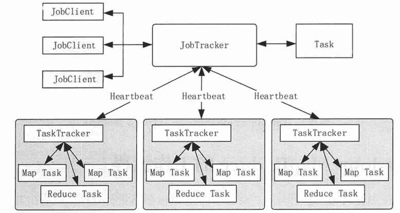
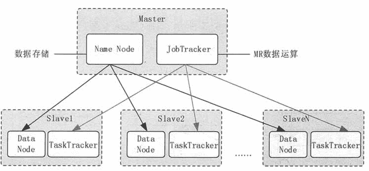

# Hadoop MapReduce 架构

> 原文：[`c.biancheng.net/view/3607.html`](http://c.biancheng.net/view/3607.html)

Hadoop MapReduce 是 Hadoop 平台根据 MapReduce 原理实现的计算框架，目前已经实现了两个版本，MapReduce 1.0 和基于 YARN 结构的 MapReduce 2.0。

尽管 MapReduce 1.0 中存在一些问题，但是整体架构比较清晰，更适合初学者理解 MapReduce 的核心概念。所以，本教程首先使用 MapReduce 1.0 来介绍 MapReduce 的核心概念，然后再在此基础上介绍 MapReduce 2.0。

一个 Hadoop MapReduce 作业（job）的基本工作流程就是，首先把存储在 HDFS 中的输入数据集切分为若干个独立的数据块，由多个 Map 任务（Task）以完全并行的方式处理这些数据块。

MapReduce 框架会对 Map 任务的输出先进行排序，然后把结果作为输入传送给 Reduce 任务。

一般来讲，每个 Map 和 Reduce 任务都会运行在集群的不同结点上，从而发挥集群的整体能力。作业的输入和输出通常都存储在文件系统中。

MapReduce 框架负责整个任务的调度和监控，以及重新执行失败的任务。

Hadoop MapReduce 1.0 的架构如图 1 所示，由 Client（客户端）、JobTracker（作业跟踪器）、TaskTracker（任务跟踪器）、Task（任务）组成。

图 1  Hadoop MapReduce 1 .0 的架构

#### 1）JobClient

用户编写的 MapReduce 程序通过 JobClient 提交给 JobTracker。

#### 2）JobTracker

JobTracker 主要负责资源监控和作业调度，并且监控所有 TaskTracker 与作业的健康情况，一旦有失败情况发生，就会将相应的任务分配到其他结点上去执行。

#### 3）TaskTracker

TaskTraker 会周期性地将本结点的资源使用情况和任务进度汇报给 JobTracker，与此同时会接收 JobTracker 发送过来的命令并执行操作。

#### 4）Task

Task 分为 Map Task 和 Reduce Task 两种，由 TaskTracker 启动，分别执行 Map 和 Reduce 任务。一般来讲，每个结点可以运行多个 Map 和 Reduce 任务。

MapReduce 设计的一个核心理念就是“计算向数据靠拢”，而不是传统计算模式的“数据向计算靠拢”。这是因为移动大量数据需要的网络传输开销太大，同时也大大降低了数据处理的效率。

所以，Hadoop MapReduce 框架和 HDFS 是运行在一组相同的结点上的。这种配置允许框架在那些已经存好数据的结点上高效地调度任务，这可以使整个集群的网络带宽被非常高效地利用，从而减少了结点间数据的移动。

如图 2 所示，Hadoop MapReduce 框架由一个单独的 JobTracker 和每个集群结点都有的一个 TaskTracker 共同组成。

JobTracker 负责调度构成一个作业的所有任务，这些任务分布在不同的 TaskTracker 上，JobTracker 监控它们的执行，并重新执行已经失败的任务。TaskTracker 仅负责执行由 JobTracker 指派的任务。

应用程序需要指定 I/O 的路径，并通过实现合适的接口或抽象类提供 Map 和 Reduce 函数，再加上其他作业参数，就构成了作业配置（Job Configuration)。

Hadoop 的 Client 提交作业（如 Jar 包、可执行程序等）和配置信息给 JobTracker，后者负责分发这些软件和配置信息给 TaskTracker，调度任务并监控它们的执行，同时提供状态和诊断信息给 JobClient。
图 2  Hadoop 的 MapReduce 与 HDFS 集群架构