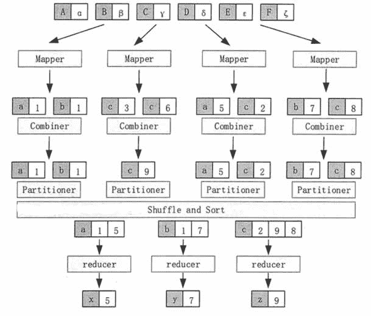

# Hadoop MapReduce 工作流程

> 原文：[`c.biancheng.net/view/3626.html`](http://c.biancheng.net/view/3626.html)

MapReduce 就是将输入进行分片，交给不同的 Map 任务进行处理，然后由 Reduce 任务合并成最终的解。

MapReduce 的实际处理过程可以分解为 Input、Map、Sort、Combine、Partition、Reduce、Output 等阶段，具体的工作流程如图 1 所示。

图 1  MapReduce 的工作流程
在 Input 阶段，框架根据数据的存储位置，把数据分成多个分片（Splk），在多个结点上并行处理。

Map 任务通常运行在数据存储的结点上，也就是说，框架是根据数据分片的位置来启动 Map 任务的，而不是把数据传输到 Map 任务的位置上。这样，计算和数据就在同一个结点上，从而不需要额外的数据传输开销。

在 Map 阶段，框架调用 Map 函数对输入的每一个 <key,value> 进行处理，也就是完成 Map<K1,V1>→List(<K2,V2>) 的映射操作。图 1 为找每个文件块中每个字母出现的次数，其中，K1 表示字母，V2 表示该字母出现的次数。

在 Sort 阶段，当 Map 任务结束以后，会生成许多 <K2,V2>形式的中间结果，框架会对这些中间结果按照键进行排序。图 1 就是按照字母顺序进行排序的。

在 Combine 阶段，框架对于在 Sort 阶段排序之后有相同键的中间结果进行合并。合并所使用的函数可以由用户进行定义。在图 1 中，就是把 K2 相同（也就是同一个字母）的 V2 值相加的。这样，在每一个 Map 任务的中间结果中，每一个字母只会出现一次。

在 Partition 阶段，框架将 Combine 后的中间结果按照键的取值范围划分为 R 份，分别发给 R 个运行 Reduce 任务的结点，并行执行。分发的原则是，首先必须保证同一个键的所有数据项发送给同一个 Reduce 任务，尽量保证每个 Reduce 任务所处理的数据量基本相同。

在图 1 中，框架把字母 a、b、c 的键值对分别发给了 3 个 Reduce 任务。框架默认使用 Hash 函数进行分发，用户也可以提供自己的分发函数。

在 Reduce 阶段，每个 Reduce 任务对 Map 函数处理的结果按照用户定义的 Reduce 函数进行汇总计算，从而得到最后的结果。在图 1 中，Reduce 计算每个字母在整个文件中出现的次数。只有当所有 Map 处理过程全部结束以后，Reduce 过程才能开始。

在 Output 阶段，框架把 Reduce 处理的结果按照用户指定的输出数据格式写入 HDFS 中。

在 MapReduce 的整个处理过程中，不同的 Map 任务之间不会进行任何通信，不同的 Reduce 任务之间也不会发生任何信息交换。用户不能够显式地从一个结点向另一个结点发送消息，所有的信息交换都是通过 MapReduce 框架实现的。

MapReduce 计算模型实现数据处理时，应用程序开发者只需要负责 Map 函数和 Reduce 函数的实现。MapReduce 计算模型之所以得到如此广泛的应用就是因为应用开发者不需要处理分布式和并行编程中的各种复杂问题。

如分布式存储、分布式通信、任务调度、容错处理、负载均衡、数据可靠等，这些问题都由 Hadoop MapReduce 框架负责处理，应用开发者只需要负责完成 Map 函数与 Reduce 函数的实现。