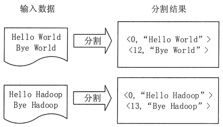
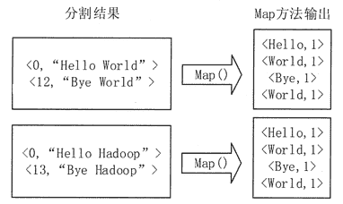
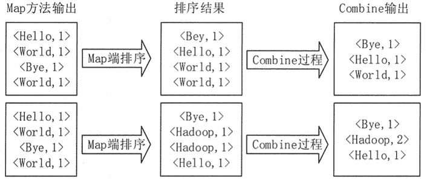
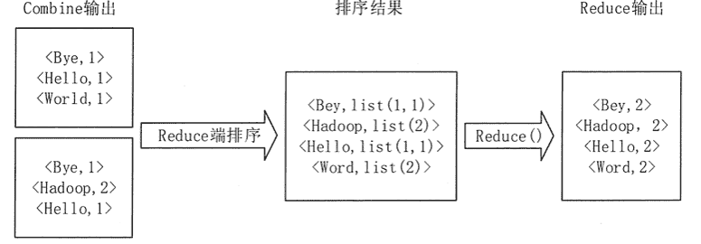

# MapReduce 实例分析：单词计数

> 原文：[`c.biancheng.net/view/3627.html`](http://c.biancheng.net/view/3627.html)

单词计数是最简单也是最能体现 MapReduce 思想的程序之一，可以称为 MapReduce 版“Hello World”。单词计数的主要功能是统计一系列文本文件中每个单词出现的次数。本节通过单词计数实例来阐述采用 MapReduce 解决实际问题的基本思路和具体实现过程。

## 设计思路

首先，检查单词计数是否可以使用 MapReduce 进行处理。因为在单词计数程序任务中，不同单词的出现次数之间不存在相关性，相互独立，所以，可以把不同的单词分发给不同的机器进行并行处理。因此，可以采用 MapReduce 来实现单词计数的统计任务。

其次，确定 MapReduce 程序的设计思路。把文件内容分解成许多个单词，然后把所有相同的单词聚集到一起，计算出每个单词出现的次数。

最后，确定 MapReduce 程序的执行过程。把一个大的文件切分成许多个分片，将每个分片输入到不同结点上形成不同的 Map 任务。每个 Map 任务分别负责完成从不同的文件块中解析出所有的单词。

Map 函数的输入采用 <key,value> 方式，用文件的行号作为 key，文件的一行作为 value。Map 函数的输出以单词作为 key，1 作为 value，即 <单词,1> 表示该单词出现了 1 次。

Map 阶段结束以后，会输出许多 <单词,1> 形式的中间结果，然后 Sort 会把这些中间结果进行排序并把同一单词的出现次数合并成一个列表，得到 <key,List(value)>形式。例如，<Hello,<1,1,1,1,1>> 就表明 Hello 单词在 5 个地方出现过。

如果使用 Combine,那么 Combine 会把每个单词的 List(value) 值进行合并，得到 <key,value> 形式，例如，<Hello,5> 表明 Hello 单词出现过 5 次。

在 Partition 阶段，会把 Combine 的结果分发给不同的 Reduce 任务。Reduce 任务接收到所有分配给自己的中间结果以后，就开始执行汇总计算工作，计算得到每个单词出现的次数并把结果输出到 HDFS 中。

## 处理过程

下面通过一个实例对单词计数进行更详细的讲解。

**1）将文件拆分成多个分片。**

该实例把文件拆分成两个分片，每个分片包含两行内容。在该作业中，有两个执行 Map 任务的结点和一个执行 Reduce 任务的结点。每个分片分配给一个 Map 结点，并将文件按行分割形成 <key,value> 对，如图 1 所示。这一步由 MapReduce 框架自动完成，其中 key 的值为行号。

**2）将分割好的 <key,value> 对交给用户定义的 Map 方法进行处理，生成新的 <key,value> 对，如图 2 所示。**
图 1  分割过程

图 2  执行 Map 函数
**3）**在实际应用中，每个输入分片在经过 Map 函数分解以后都会生成大量类似 <Hello,1> 的中间结果，为了减少网络传输开销，框架会把 Map 方法输出的 <key,value> 对按照 key 值进行排序，并执行 Combine 过程，将 key 值相同的 value 值累加，得到 Map 的最终输出结果，如图 3 所示。

图 3  Map 端排序及 Combine 过程
**4）**Reduce 先对从 Map 端接收的数据进行排序，再交由用户自定义的 Reduce 方法进行处理，得到新的 <key,value> 对，并作为结果输出，如图 4 所示。

图 4  Reduce 端排序及输出结果
看到这，你肯定对案例单词计数基本思路和具体实现过程已经了解了，想了解如何编写具体实现代码及如何运行程序，可参考《MapReduce 编程实例：单词计数》教程。