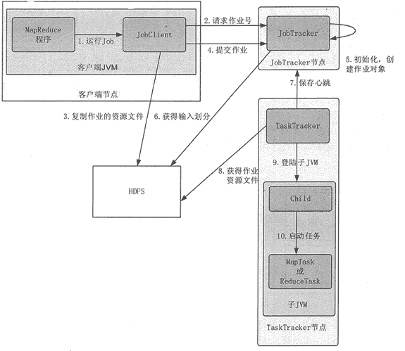

# MapReduce 执行流程和 Shuffle 过程

> 原文：[`c.biancheng.net/view/3630.html`](http://c.biancheng.net/view/3630.html)

本节将对 Hadoop MapReduce 的工作机制进行介绍，主要从 MapReduce 的作业执行流程和 Shuffle 过程方面进行阐述。通过加深对 MapReduce 工作机制的了解，可以使程序开发者更合理地使用 MapReduce 解决实际问题。

## Hadoop MapReduce 作业执行流程

整个 Hadoop MapReduce 的作业执行流程如图 1 所示，共分为 10 步。

图 1  Hadoop MapReduce 的作业执行流程

#### 1\. 提交作业

客户端向 JobTracker 提交作业。首先，用户需要将所有应该配置的参数根据需求配置好。作业提交之后，就会进入自动化执行。在这个过程中，用户只能监控程序的执行情况和强制中断作业，但是不能对作业的执行过程进行任何干预。提交作业的基本过程如下。

**1）**客户端通过 Runjob() 方法启动作业提交过程。

**2）**客户端通过 JobTracker 的 getNewJobId() 请求一个新的作业 ID。

**3）**客户端检查作业的输出说明，计算作业的输入分片等，如果有问题，就抛出异常，如果正常，就将运行作业所需的资源（如作业 Jar 文件，配置文件，计算所得的输入分片等）复制到一个以作业 ID 命名的目录中。

**4）**通过调用 JobTracker 的 submitjob() 方法告知作业准备执行。

#### 2\. 初始化作业

JobTracker 在 JobTracker 端开始初始化工作，包括在其内存里建立一系列数据结构，来记录这个 Job 的运行情况。

**1）**JobTracker 接收到对其 submitJob() 方法的调用后，就会把这个调用放入一个内部队列中，交由作业调度器进行调度。初始化主要是创建一个表示正在运行作业的对象，以便跟踪任务的状态和进程。

**2）**为了创建任务运行列表，作业调度器首先从 HDFS 中获取 JobClient 已计算好的输入分片信息，然后为每个分片创建一个 MapTask，并且创建 ReduceTask。

#### 3\. 分配任务

JobTracker 会向 HDFS 的 NameNode 询问有关数据在哪些文件里面，这些文件分别散落在哪些结点里面。JobTracker 需要按照“就近运行”原则分配任务。

TaskTracker 定期通过“心跳”与 JobTracker 进行通信，主要是告知 JobTracker 自身是否还存活，以及是否已经准备好运行新的任务等。

JobTracker 接收到心跳信息后，如果有待分配的任务，就会为 TaskTracker 分配一个任务，并将分配信息封装在心跳通信的返回值中返回给 TaskTracker。

对于 Map 任务，JobTracker 通常会选取一个距离其输入分片最近的 TaskTracker，对于 Reduce 任务，JobTracker 则无法考虑数据的本地化。

#### 4.执行任务

**1）**TaskTracker 分配到一个任务后，通过 HDFS 把作业的 Jar 文件复制到 TaskTracker 所在的文件系统，同时，TaskTracker 将应用程序所需要的全部文件从分布式缓存复制到本地磁盘。TaskTracker 为任务新建一个本地工作目录，并把 Jar 文件中的内容解压到这个文件夹中。

**2）**TaskTracker 启动一个新的 JVM 来运行每个任务（包括 Map 任务和 Reduce 任务），这样，JobClient 的 MapReduce 就不会影响 TaskTracker 守护进程。任务的子进程每隔几秒便告知父进程它的进度，直到任务完成。

#### 5\. 进程和状态的更新

一个作业和它的每个任务都有一个状态信息，包括作业或任务的运行状态，Map 任务和 Reduce 任务的进度，计数器值，状态消息或描述。任务在运行时，对其进度保持追踪。

这些消息通过一定的时间间隔由 ChildJVM 向 TaskTracker 汇聚，然后再向 JobTracker 汇聚。JobTracker 将产生一个表明所有运行作业及其任务状态的全局视图，用户可以通过 Web UI 进行查看。JobClient 通过每秒查询 JobTracker 来获得最新状态，并且输出到控制台上。

#### 6\. 作业的完成

当 JobTracker 接收到的这次作业的最后一个任务已经完成时，它会将 Job 的状态改为“successful”。当 JobClient 获取到作业的状态时，就知道该作业已经成功完成，然后 JobClient 打印信息告知用户作业已成功结束，最后从 Runjob() 方法返回。

## HadoopMapReduce 的 Shuffle 阶段

Hadoop MapReduce 的 Shuffle 阶段是指从 Map 的输出开始，包括系统执行排序，以及传送 Map 输出到 Reduce 作为输入的过程。

排序阶段是指对 Map 端输出的 Key 进行排序的过程。不同的 Map 可能输出相同的 Key，相同的 Key 必须发送到同一个 Reduce 端处理。Shuffle 阶段可以分为 Map 端的 Shuffle 阶段和 Reduce 端的 Shuffle 阶段。Shuffle 阶段的工作过程，如图 2 所示。

#### 1\. Map 端的 Shuffle 阶段

**1）**每个输入分片会让一个 Map 任务来处理，默认情况下，以 HDFS 的一个块的大小（默认为 64MB）为一个分片。Map 函数开始产生输出时，并不是简单地把数据写到磁盘中，因为频繁的磁盘操作会导致性能严重下降。它的处理过程是把数据首先写到内存中的一个缓冲区， 并做一些预排序，以提升效率。

图 2  Hadoop MapReduce 的 Shuffle 阶段
**2）**每个 Map 任务都有一个用来写入输出数据的循环内存缓冲区（默认大小为 100MB)，当缓冲区中的数据量达到一个特定阈值（默认是 80%）时，系统将会启动一个后台线程，把缓冲 区中的内容写到磁盘中（即 Spill 阶段)。在写磁盘过程中，Map 输出继续被写到缓冲区中，但如果在此期间缓冲区被填满，那么 Map 任务就会阻塞直到写磁盘过程完成。

**3）**在写磁盘前，线程首先根据数据最终要传递到的 Reduce 任务把数据划分成相应的分区（Partition）。在每个分区中，后台线程按 Key 进行排序，如果有一个 Combiner，便会在排序后 的输出上运行。

**4）**一旦内存缓冲区达到溢出写的阈值，就会创建一个溢出写文件，因此在 Map 任务完成其最后一个输出记录后，便会有多个溢出写文件。在 Map 任务完成前，溢出写文件被合并成一个索引文件和数据文件（多路归并排序）（Sort 阶段)。

**5）**溢出写文件归并完毕后，Map 任务将删除所有的临时溢出写文件，并告知 TaskTracker 任务已完成，只要其中一个 Map 任务完成，Reduce 任务就会开始复制它的输出（Copy 阶段)。

**6）**Map 任务的输出文件放置在运行 Map 任务的 TaskTracker 的本地磁盘上，它是运行 Reduce 任务的 TaskTracker 所需要的输入数据。

#### 2\. Reduce 端的 Shuffle 阶段

**1）**Reduce 进程启动一些数据复制线程，请求 Map 任务所在的 TaskTracker 以获取输出文件（Copy 阶段）。

**2）**将 Map 端复制过来的数据先放入内存缓冲区中，Merge 有 3 种形式，分别是内存到内存，内存到磁盘，磁盘到磁盘。默认情况下，第一种形式不启用，第二种形式一直在运行（Spill 阶段），直到结束，第三种形式生成最终的文件（Merge 阶段）。

**3）**最终文件可能存在于磁盘中，也可能存在于内存中，但是默认情况下是位于磁盘中的。当 Reduce 的输入文件已定，整个 Shuffle 阶段就结束了，然后就是 Reduce 执行，把结果放到 HDFS 中（Reduce 阶段）。

## Hadoop MapReduce 的主要特点

MapReduce 在设计上具有的主要技术特点如下。

**1\. 向“外”横向扩展，而非向“上”纵向扩展**

MapReduce 集群的构建完全选用价格便宜、易于扩展的低端商用服务器，而非价格昂贵、不易扩展的高端服务器。

对于大规模数据处理，由于有大量数据存储的需要，因此，基于低端服务器的集群远比基于高端服务器的集群优越，这就是 MapReduce 并行计算集群会基于低端服务器实现的原因。

**2\. 失效被认为是常态**

MapReduce 集群中使用大量的低端服务器，因此，结点硬件失效和软件出错是常态，因而一个设计良好、具有高容错性的并行计算系统不能因为结点失效而影响计算服务的质量。

任何结点失效都不应当导致结果的不一致或不确定性，任何一个结点失效时，其他结点要能够无缝接管失效结点的计算任务，当失效结点恢复后应能自动无缝加入集群，而不需要管理员人工进行系统配置。

MapReduce 并行计算软件框架使用了多种有效的错误检测和恢复机制，如结点自动重启技术，使集群和计算框架具有对付结点失效的健壮性，能有效处理失效结点的检测和恢复。

**3\. 把处理向数据迁移**

传统高性能计算系统通常有很多处理器结点与一些外存储器结点相连，如用存储区域网络连接的磁盘阵列，因此，大规模数据处理时，外存文件数据 I/O 访问会成为一个制约系统性能的瓶颈。

为了减少大规模数据并行计算系统中的数据通信开销，不应把数据传送到处理结点，而应当考虑将处理向数据靠拢和迁移。MapReduce 采用了数据/代码互定位的技术方法，计算结点将首先尽量负责计算其本地存储的数据，以发挥数据本地化特点，仅当结点无法处理本地数据时，再采用就近原则寻找其他可用计算结点，并把数据传送到该可用计算结点。

**4\. 顺序处理数据，避免随机访问数据**

大规模数据处理的特点决定了大量的数据记录难以全部存放在内存中，而通常只能放在外存中进行处理。由于磁盘的顺序访问要远比随机访问快得多，因此 MapReduce 主要设计为面向顺序式大规模数据的磁盘访问处理。

为了实现高吞吐量的并行处理，MapReduce 可以利用集群中的大量数据存储结点同时访问数据，以此利用分布集群中大量结点上的磁盘集合提供高带宽的数据访问和传输。

**5\. 为应用幵发者隐藏系统层细节**

专业程序员之所以写程序困难，是因为程序员需要记住太多的编程细节，这对大脑记忆是一个巨大的认知负担，需要高度集中注意力，而并行程序编写有更多困难。

例如，需要考虑多线程中诸如同步等复杂繁琐的细节。由于并发执行中的不可预测性，程序的调试查错也十分困难，而且，大规模数据处理时程序员需要考虑诸如数据分布存储管理、数据分发、数据通信和同步、计算结果收集等诸多细节问题。

MapReduce 提供了一种抽象机制，可将程序员与系统层细节隔离开来，程序员仅需描述需要计算什么，而具体怎么去计算就交由系统的执行框架去处理，这样程序员可从系统层细节中解放出来，而致力于其应用本身计算问题的算法设计。

**6\. 平滑无缝的可扩展性**

这里指出的可扩展性主要包括两层意义上的扩展性：数据扩展性和系统规模扩展性。

理想的软件算法应当能随着数据规模的扩大而表现出持续的有效性，性能上的下降程度应与数据规模扩大的倍数相当，在集群规模上，要求算法的计算性能应能随着结点数的增加保持接近线性程度的增长。

绝大多数现有的单机算法都达不到以上理想的要求，把中间结果数据维护在内存中的单机算法在大规模数据处理时会很快失效，从单机到基于大规模集群的并行计算从根本上需要完全不同的算法设计。

但是，MapReduce 在很多情形下能实现以上理想的扩展性特征，对于很多计算问题，基于 MapReduce 的计算性能可随结点数目的增长保持近似于线性的增长。