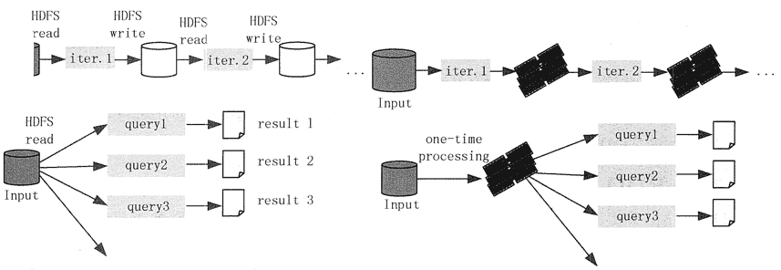

# Spark 是什么？Spark 和 Hadoop 的区别

> 原文：[`c.biancheng.net/view/3642.html`](http://c.biancheng.net/view/3642.html)

Spark 是加州大学伯克利分校 AMP（Algorithms，Machines，People）实验室开发的通用内存并行计算框架。

Spark 在 2013 年 6 月进入 Apache 成为孵化项目，8 个月后成为 Apache 顶级项目。

Spark 以其先进的设计理念，迅速成为社区的热门项目，围绕着 Spark 推出了 SparkSQL、SparkStreaming、MLlib 和 GraphX 等组件，逐渐形成大数据处理一站式解决平台。

## Spark 与 Hadoop

Hadoop 已经成了大数据技术的事实标准，Hadoop MapReduce 也非常适合于对大规模数据集合进行批处理操作，但是其本身还存在一些缺陷。特别是 MapReduce 存在的延迟过高，无法胜任实时、快速计算需求的问题，使得需要进行多路计算和迭代算法的用例的作业过程并非十分高效。

根据 Hadoop MapReduce 的工作流程，可以分析出 Hadoop MapRedcue 的一些缺点。

#### 1）Hadoop MapRedue 的表达能力有限。

所有计算都需要转换成 Map 和 Reduce 两个操作，不能适用于所有场景，对于复杂的数据处理过程难以描述。

#### 2）磁盘 I/O 开销大。

Hadoop MapReduce 要求每个步骤间的数据序列化到磁盘，所以 I/O 成本很高，导致交互分析和迭代算法开销很大，而几乎所有的最优化和机器学习都是迭代的。所以，Hadoop MapReduce 不适合于交互分析和机器学习。

#### 3）计算延迟高。

如果想要完成比较复杂的工作，就必须将一系列的 MapReduce 作业串联起来然后顺序执行这些作业。每一个作业都是高时延的，而且只有在前一个作业完成之后下一个作业才能开始启动。因此，Hadoop MapReduce 不能胜任比较复杂的、多阶段的计算服务。

Spark 是借鉴了 Hadoop MapReduce 技术发展而来的，继承了其分布式并行计算的优点并改进了 MapReduce 明显的缺陷。

Spark 使用 Scala 语言进行实现，它是一种面向对象的函数式编程语言，能够像操作本地集合对象一样轻松地操作分布式数据集。它具有运行速度快、易用性好、通用性强和随处运行等特点，具体优势如下。

**1）**Spark 提供了内存计算，把中间结果放到内存中，带来了更高的迭代运算效率。通过支持有向无环图（DAG）的分布式并行计算的编程框架，Spark 减少了迭代过程中数据需要写入磁盘的需求，提高了处理效率。

**2）**Spark 为我们提供了一个全面、统一的框架，用于管理各种有着不同性质（文本数据、图表数据等）的数据集和数据源（批量数据或实时的流数据）的大数据处理的需求。

Spark 使用函数式编程范式扩展了 MapReduce 模型以支持更多计算类型，可以涵盖广泛的工作流，这些工 作流之前被实现为 Hadoop 之上的特殊系统。

Spark 使用内存缓存来提升性能，因此进行交互式分析也足够快速，缓存同时提升了迭代算法的性能，这使得 Spark 非常适合数据理论任务，特别是机器学习。

**3）Spark 比 Hadoop 更加通用。**Hadoop 只提供了 Map 和 Reduce 两种处理操作，而 Spark 提供的数据集操作类型更加丰富，从而可以支持更多类型的应用。

Spark 的计算模式也属于 MapReduce 类型，但提供的操作不仅包括 Map 和 Reduce，还提供了包括 Map、Filter、FlatMap、Sample、GroupByKey、ReduceByKey、Union、Join、Cogroup、MapValues、Sort、PartionBy 等多种转换操作，以及 Count、Collect、Reduce、Lookup、Save 等行为操作。

**4）Spark 基于 DAG 的任务调度执行机制比 Hadoop MapReduce 的迭代执行机制更优越。**

Spark 各个处理结点之间的通信模型不再像 Hadoop 一样只有 Shuffle 一种模式，程序开发者可以使用 DAG 开发复杂的多步数据管道，控制中间结果的存储、分区等。

图 1 对 Hadoop 和 Spark 的执行流程进行了对比。
图 1  Hadoop 与 Spark 执行流程对比
从中可以看出，Hadoop 不适合于做迭代计算，因为每次迭代都需要从磁盘中读入数据，向磁盘写中间结果，而且每个任务都需要从磁盘中读入数据，处理的结果也要写入磁盘，磁盘 I/O 开销很大。而 Spark 将数据载入内存后，后面的迭代都可以直接使用内存中的中间结果做计算，从而避免了从磁盘中频繁读取数据。

对于多维度随机查询也是一样。在对 HDFS 同一批数据做成百或上千维度查询时，Hadoop 每做一个独立的查询，都要从磁盘中读取这个数据，而 Spark 只需要从磁盘中读取一次后，就可以针对保留在内存中的中间结果进行反复查询。

Spark 在 2014 年打破了 Hadoop 保持的基准排序（SortBenchmark）记录，使用 206 个结点在 23 分钟的时间里完成了 100TB 数据的排序，而 Hadoop 则是使用了 2000 个结点在 72 分钟才完成相同数据的排序。也就是说，Spark 只使用了百分之十的计算资源，就获得了 Hadoop 3 倍的速度。

尽管与 Hadoop 相比，Spark 有较大优势，但是并不能够取代 Hadoop。

因为 Spark 是基于内存进行数据处理的，所以不适合于数据量特别大、对实时性要求不高的场合。另外，Hadoop 可以使用廉价的通用服务器来搭建集群，而 Spark 对硬件要求比较高，特别是对内存和 CPU 有更高的要求。

## Spark 的适用场景

总而言之，大数据处理场景有以下几个类型。

**1）复杂的批量处理**

偏重点是处理海量数据的能力，对处理速度可忍受，通常的时间可能是在数十分钟到数小时。

**2）基于历史数据的交互式查询**

通常的时间在数十秒到数十分钟之间。

**3）基于实时数据流的数据处理**

通常在数百毫秒到数秒之间。

目前对以上三种场景需求都有比较成熟的处理框架。，

*   用 Hadoop 的 MapReduce 技术来进行批量海量数据处理。
*   用 Impala 进行交互式查询。
*   用 Storm 分布式处理框架处理实时流式数据。

以上三者都是比较独立的，所以维护成本比较高，而 Spark 能够一站式满足以上需求。

通过以上分析，可以总结 Spark 的适应场景有以下几种。

**1）**Spark 是基于内存的迭代计算框架，适用于需要多次操作特定数据集的应用场合。需要反复操作的次数越多，所需读取的数据量越大，受益越大；数据量小但是计算密集度较大的场合，受益就相对较小。

**2）**Spark 适用于数据量不是特别大，但是要求实时统计分析的场景。

**3）**由于 RDD 的特性，Spark 不适用于那种异步细粒度更新状态的应用，例如，Web 服务的存储，或增量的 Web 爬虫和索引，也就是不适合增量修改的应用模型。