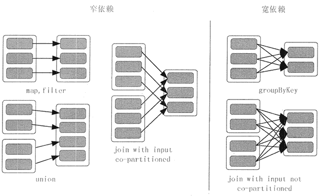

# Spark RDD 是什么？

> 原文：[`c.biancheng.net/view/3644.html`](http://c.biancheng.net/view/3644.html)

Spark 的核心是建立在统一的抽象弹性分布式数据集（Resiliennt Distributed Datasets，RDD）之上的，这使得 Spark 的各个组件可以无缝地进行集成，能够在同一个应用程序中完成大数据处理。本节将对 RDD 的基本概念及与 RDD 相关的概念做基本介绍。

## RDD 的基本概念

RDD 是 Spark 提供的最重要的抽象概念，它是一种有容错机制的特殊数据集合，可以分布在集群的结点上，以函数式操作集合的方式进行各种并行操作。

通俗点来讲，可以将 RDD 理解为一个分布式对象集合，本质上是一个只读的分区记录集合。每个 RDD 可以分成多个分区，每个分区就是一个数据集片段。一个 RDD 的不同分区可以保存到集群中的不同结点上，从而可以在集群中的不同结点上进行并行计算。

图 1 展示了 RDD 的分区及分区与工作结点（Worker Node）的分布关系。

图 1  RDD 分区及分区与工作节点的分布关系
RDD 具有容错机制，并且只读不能修改，可以执行确定的转换操作创建新的 RDD。具体来讲，RDD 具有以下几个属性。

*   只读：不能修改，只能通过转换操作生成新的 RDD。
*   分布式：可以分布在多台机器上进行并行处理。
*   弹性：计算过程中内存不够时它会和磁盘进行数据交换。
*   基于内存：可以全部或部分缓存在内存中，在多次计算间重用。

RDD 实质上是一种更为通用的迭代并行计算框架，用户可以显示控制计算的中间结果，然后将其自由运用于之后的计算。

在大数据实际应用开发中存在许多迭代算法，如机器学习、图算法等，和交互式数据挖掘工具。这些应用场景的共同之处是在不同计算阶段之间会重用中间结果，即一个阶段的输出结果会作为下一个阶段的输入。

RDD 正是为了满足这种需求而设计的。虽然 MapReduce 具有自动容错、负载平衡和可拓展性的优点，但是其最大的缺点是采用非循环式的数据流模型，使得在迭代计算时要进行大量的磁盘 I/O 操作。

通过使用 RDD，用户不必担心底层数据的分布式特性，只需要将具体的应用逻辑表达为一系列转换处理，就可以实现管道化，从而避免了中间结果的存储，大大降低了数据复制、磁盘 I/O 和数据序列化的开销。

## RDD 基本操作

RDD 的操作分为转化（Transformation）操作和行动（Action）操作。转化操作就是从一个 RDD 产生一个新的 RDD，而行动操作就是进行实际的计算。

RDD 的操作是惰性的，当 RDD 执行转化操作的时候，实际计算并没有被执行，只有当 RDD 执行行动操作时才会促发计算任务提交，从而执行相应的计算操作。

#### **1\. 构建操作**

Spark 里的计算都是通过操作 RDD 完成的，学习 RDD 的第一个问题就是如何构建 RDD，构建 RDD 的方式从数据来源角度分为以下两类。

*   从内存里直接读取数据。
*   从文件系统里读取数据，文件系统的种类很多，常见的就是 HDFS 及本地文件系统。

第一类方式是从内存里构造 RDD，需要使用 makeRDD 方法，代码如下所示。

val rdd01 = sc.makeRDD(List(l,2,3,4,5,6))

这个语句创建了一个由“1,2,3,4,5,6”六个元素组成的 RDD。

第二类方式是通过文件系统构造 RDD，代码如下所示。

val rdd:RDD[String] == sc.textFile("file:///D:/sparkdata.txt",1)

这里例子使用的是本地文件系统，所以文件路径协议前缀是 file://。

#### 2\. 转换操作

RDD 的转换操作是返回新的 RDD 的操作。转换出来的 RDD 是惰性求值的，只有在行动操作中用到这些 RDD 时才会被计算。

许多转换操作都是针对各个元素的，也就是说，这些转换操作每次只会操作 RDD 中的一个元素，不过并不是所有的转换操作都是这样的。表 1 描述了常用的 RDD 转换操作。

**表 1 RDD 转换操作（rdd1={1, 2, 3, 3}，rdd2={3,4,5})**

| 函数名 | 作用 | 示例 | 结果 |
| --- | --- | --- | --- |
| map() | 将函数应用于 RDD 的每个元素，返回值是新的 RDD | rdd1.map(x=>x+l) | {2,3,4,4} |
| flatMap() | 将函数应用于 RDD 的每个元素，将元素数据进行拆分，变成迭代器，返回值是新的 RDD  | rdd1.flatMap(x=>x.to(3)) | {1,2,3,2,3,3,3} |
| filter() | 函数会过滤掉不符合条件的元素，返回值是新的 RDD | rdd1.filter(x=>x!=1) | {2,3,3} |
| distinct() | 将 RDD 里的元素进行去重操作 | rdd1.distinct()  | (1,2,3) |
| union() | 生成包含两个 RDD 所有元素的新的 RDD | rdd1.union(rdd2) | {1,2,3,3,3,4,5} |
| intersection() | 求出两个 RDD 的共同元素  | rdd1.intersection(rdd2) | {3} |
| subtract() | 将原 RDD 里和参数 RDD 里相同的元素去掉 | rdd1.subtract(rdd2) | {1,2} |
| cartesian() | 求两个 RDD 的笛卡儿积  | rdd1.cartesian(rdd2)  | {(1,3),(1,4)......(3,5)} |

#### 3\. 行动操作

行动操作用于执行计算并按指定的方式输出结果。行动操作接受 RDD，但是返回非 RDD，即输出一个值或者结果。在 RDD 执行过程中，真正的计算发生在行动操作。表 2 描述了常用的 RDD 行动操作。

**表 2 RDD 行动操作（rdd={1,2,3,3}）**

| 函数名 | 作用 | 示例 | 结果 |
| --- | --- | --- | --- |
| collect() | 返回 RDD 的所有元素 | rdd.collect() | {1,2,3,3} |
| count() | RDD 里元素的个数 | rdd.count() | 4 |
| countByValue() | 各元素在 RDD 中的出现次数 | rdd.countByValue() | {(1,1),(2,1),(3,2})} |
| take(num) | 从 RDD 中返回 num 个元素   | rdd.take(2) | {1,2} |
| top(num) | 从 RDD 中，按照默认（降序）或者指定的排序返回最前面的 num 个元素  | rdd.top(2) | {3,3} |
| reduce() | 并行整合所有 RDD 数据，如求和操作 | rdd.reduce((x,y)=>x+y) | 9 |
| fold(zero)(func) | 和 reduce() 功能一样，但需要提供初始值 | rdd.fold(0)((x,y)=>x+y) | 9 |
| foreach(func) | 对 RDD 的每个元素都使用特定函数 | rdd1.foreach(x=>printIn(x)) | 打印每一个元素 |
| saveAsTextFile(path) | 将数据集的元素，以文本的形式保存到文件系统中 | rdd1.saveAsTextFile(file://home/test) |   |
| saveAsSequenceFile(path)  | 将数据集的元素，以顺序文件格式保存到指 定的目录下 | saveAsSequenceFile(hdfs://home/test) |   |

aggregate() 函数的返回类型不需要和 RDD 中的元素类型一致，所以在使用时，需要提供所期待的返回类型的初始值，然后通过一个函数把 RDD 中的元素累加起来放入累加器。

考虑到每个结点都是在本地进行累加的，所以最终还需要提供第二个函数来将累加器两两合并。

aggregate(zero)(seqOp,combOp) 函数首先使用 seqOp 操作聚合各分区中的元素，然后再使用 combOp 操作把所有分区的聚合结果再次聚合，两个操作的初始值都是 zero。

seqOp 的操作是遍历分区中的所有元素 T，第一个 T 跟 zero 做操作，结果再作为与第二个 T 做操作的 zero，直到遍历完整个分区。

combOp 操作是把各分区聚合的结果再聚合。aggregate() 函数会返回一个跟 RDD 不同类型的值。因此，需要 seqOp 操作来把分区中的元素 T 合并成一个 U，以及 combOp 操作把所有 U 聚合。

下面举一个利用 aggreated() 函数求平均数的例子。

```

val rdd = List (1,2,3,4)
val input = sc.parallelize(rdd)
val result = input.aggregate((0,0))(
    (acc,value) => (acc._1 + value,acc._2 + 1),
    (acc1,acc2) => (acc1._1 + acc2._1,acc1._2 + acc2._2)
)
result:(Int,Int) = (10,4)
val avg = result._1 / result._2
avg:Int = 2.5
```

程序的详细过程大概如下。

定义一个初始值 (0,0)，即所期待的返回类型的初始值。代码 (acc,value) => (acc._1 + value,acc._2 + 1) 中的 value 是函数定义里面的 T，这里是 List 里面的元素。acc._1 + value，acc._2 + 1 的过程如下。

(0+1,0+1)→(1+2,1+1)→(3+3,2+1)→(6+4,3+1)，结果为(10,4)。

实际的 Spark 执行过程是分布式计算，可能会把 List 分成多个分区，假如是两个：p1(1,2) 和 p2(3,4)。

经过计算，各分区的结果分别为 (3,2) 和 (7,2)。这样，执行 (acc1,acc2) => (acc1._1 + acc2._2,acc1._2 + acc2._2) 的结果就是 (3+7,2+2)，即 (10,4)，然后可计算平均值。

## RDD 血缘关系

RDD 的最重要的特性之一就是血缘关系（Lineage )，它描述了一个 RDD 是如何从父 RDD 计算得来的。如果某个 RDD 丢失了，则可以根据血缘关系，从父 RDD 计算得来。

图 2 给出了一个 RDD 执行过程的实例。系统从输入中逻辑上生成了 A 和 C 两个 RDD， 经过一系列转换操作，逻辑上生成了 F 这个 RDD。

Spark 记录了 RDD 之间的生成和依赖关系。当 F 进行行动操作时，Spark 才会根据 RDD 的依赖关系生成 DAG，并从起点开始真正的计算。

图 2  RDD 血缘关系
上述一系列处理称为一个血缘关系（Lineage），即 DAG 拓扑排序的结果。在血缘关系中，下一代的 RDD 依赖于上一代的 RDD。例如，在图 2 中，B 依赖于 A，D 依赖于 C，而 E 依赖于 B 和 D。

## RDD 依赖类型

根据不同的转换操作，RDD 血缘关系的依赖分为窄依赖和宽依赖。窄依赖是指父 RDD 的每个分区都只被子 RDD 的一个分区所使用。宽依赖是指父 RDD 的每个分区都被多个子 RDD 的分区所依赖。

map、filter、union 等操作是窄依赖，而 groupByKey、reduceByKey 等操作是宽依赖，如图 3 所示。

join 操作有两种情况，如果 join 操作中使用的每个 Partition 仅仅和固定个 Partition 进行 join，则该 join 操作是窄依赖，其他情况下的 join 操作是宽依赖。

所以可得出一个结论，窄依赖不仅包含一对一的窄依赖，还包含一对固定个数的窄依赖，也就是说，对父 RDD 依赖的 Partition 不会随着 RDD 数据规模的改变而改变。

#### 1\. 窄依赖

1）子 RDD 的每个分区依赖于常数个父分区（即与数据规模无关)。

2）输入输出一对一的算子，且结果 RDD 的分区结构不变，如 map、flatMap。

3）输入输出一对一的算子，但结果 RDD 的分区结构发生了变化，如 union。

4）从输入中选择部分元素的算子，如 filter、distinct、subtract、sample。

#### 2\. 宽依赖

**1）子 RDD 的每个分区依赖于所有父 RDD 分区。**
图 3  RDD 窄依赖和宽依赖
**2）对单个 RDD 基于 Key 进行重组和 reduce，如 groupByKey、reduceByKey。**

**3）对两个 RDD 基于 Key 进行 join 和重组，如 join。**

Spark 的这种依赖关系设计，使其具有了天生的容错性，大大加快了 Spark 的执行速度。RDD 通过血缘关系记住了它是如何从其他 RDD 中演变过来的。当这个 RDD 的部分分区数据丢失时，它可以通过血缘关系获取足够的信息来重新运算和恢复丢失的数据分区，从而带来性能的提升。

相对而言，窄依赖的失败恢复更为高效，它只需要根据父 RDD 分区重新计算丢失的分区即可，而不需要重新计算父 RDD 的所有分区。而对于宽依赖来讲，单个结点失效，即使只是 RDD 的一个分区失效，也需要重新计算父 RDD 的所有分区，开销较大。

宽依赖操作就像是将父 RDD 中所有分区的记录进行了“洗牌”，数据被打散，然后在子 RDD 中进行重组。

## 阶段划分

用户提交的计算任务是一个由 RDD 构成的 DAG，如果 RDD 的转换是宽依赖，那么这个宽依赖转换就将这个 DAG 分为了不同的阶段（Stage)。由于宽依赖会带来“洗牌”，所以不同的 Stage 是不能并行计算的，后面 Stage 的 RDD 的计算需要等待前面 Stage 的 RDD 的所有分区全部计算完毕以后才能进行。

这点就类似于在 MapReduce 中，Reduce 阶段的计算必须等待所有 Map 任务完成后才能开始一样。

在对 Job 中的所有操作划分 Stage 时，一般会按照倒序进行，即从 Action 开始，遇到窄依赖操作，则划分到同一个执行阶段，遇到宽依赖操作，则划分一个新的执行阶段。后面的 Stage 需要等待所有的前面的 Stage 执行完之后才可以执行，这样 Stage 之间根据依赖关系就构成了一个大粒度的 DAG。

下面通过图 4 详细解释一下阶段划分。

假设从 HDFS 中读入数据生成 3 个不同的 RDD(A、C 和 E)，通过一系列转换操作后得到新的 RDD(G)，并把结果保存到 HDFS 中。可以看到这幅 DAG 中只有 join 操作是一个宽依赖，Spark 会以此为边界将其前后划分成不同的阶段。

同时可以注意到，在 Stage2 中，从 map 到 union 都是窄依赖，这两步操作可以形成一个流水线操作，通过 map 操作生成的分区可以不用等待整个 RDD 计算结束，而是继续进行 union 操作，这样大大提高了计算的效率。

图 4  DAG 阶级划分
把一个 DAG 图划分成多个 Stage 以后，每个 Stage 都代表了一组由关联的、相互之间没有宽依赖关系的任务组成的任务集合。在运行的时候，Spark 会把每个任务集合提交给任务调度器进行处理。

## RDD 缓存

Spark RDD 是惰性求值的，而有时候希望能多次使用同一个 RDD。如果简单地对 RDD 调用行动操作，Spark 每次都会重算 RDD 及它的依赖，这样就会带来太大的消耗。为了避免多次计算同一个 RDD，可以让 Spark 对数据进行持久化。

Spark 可以使用 persist 和 cache 方法将任意 RDD 缓存到内存、磁盘文件系统中。缓存是容错的，如果一个 RDD 分片丢失，则可以通过构建它的转换来自动重构。被缓存的 RDD 被使用时，存取速度会被大大加速。一般情况下，Executor 内存的 60% 会分配给 cache，剩下的 40％ 用来执行任务。

cache 是 persist 的特例，将该 RDD 缓存到内存中。persist 可以让用户根据需求指定一个持久化级别，如表 3 所示。

**表 3 持久化级别（StorageLevel)**

| 级别 | 使用空间 | CPU 时间 | 是否在内存 | 是否在磁盘 |
| --- | --- | --- | --- | --- |
| MEMORY_ONLY | 高 | 低 | 是 | 否 |
| MEMORY_ONLY_SER | 低 | 高 | 是 | 否 |
| MEMORY_AND_DISK | 高 | 中 | 部分 | 部分 |
| MEMORY_AND_DISK_SER | 低 | 高 | 部分 | 部分 |
| DISK_ONLY | 低 | 高 | 否 | 是 |

对于 MEMORY_AND_DISK 和 MEMORY_AND_DISK_SER 级别，系统会首先把数据保存在内存中，如果内存不够则把溢出部分写入磁盘中。

另外，为了提高缓存的容错性，可以在持久化级别名称的后面加上“_2”来把持久化数据存为两份，如 MEMORY_ONLY_2。

Spark 的不同 StorageLevel 的目的是为了满足内存使用和 CPU 效率权衡上的不同需求。可以通过以下步骤来选择合适的持久化级别。

**1）**如果 RDD 可以很好地与默认的存储级别（MEMORY_ONLY）契合，就不需要做任何修改了。这已经是 CPU 使用效率最高的选项，它使得 RDD 的操作尽可能快。

**2）**如果 RDD 不能与默认的存储级别很好契合，则尝试使用 MEMORY_ONLY_SER，并且选择一个快速序列化的库使得对象在有比较高的空间使用率的情况下，依然可以较快被访问。

**3）**尽可能不要将数据存储到硬盘上，除非计算数据集函数的计算量特别大，或者它们过滤了大量的数据。否则，重新计算一个分区的速度与从硬盘中读取的速度基本差不多。

**4）**如果想有快速故障恢复能力，则使用复制存储级别。所有的存储级别都有通过重新计算丢失数据恢复错误的容错机制，但是复制存储级别可以让任务在 RDD 上持续运行，而不需要等待丢失的分区被重新计算。

**5）**在不使用 cached RDD 的时候，及时使用 unpersist 方法来释放它。