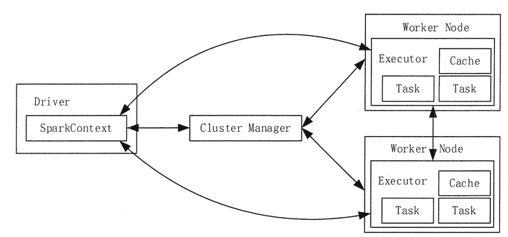
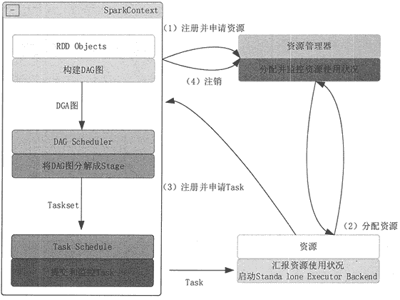

# Spark 总体架构和运行流程

> 原文：[`c.biancheng.net/view/3651.html`](http://c.biancheng.net/view/3651.html)

本节将首先介绍 Spark 的运行架构和基本术语，然后介绍 Spark 运行的基本流程，最后介绍 RDD 的核心理念和运行原理。

## Spark 总体架构

Spark 运行架构如图 1 所示，包括集群资源管理器（Cluster Manager）、多个运行作业任务的工作结点（Worker Node）、每个应用的任务控制结点（Driver）和每个工作结点上负责具体任务的执行进程（Executor）。
图 1  Spark 运行架构
Driver 是运行 Spark Applicaion 的 main() 函数，它会创建 SparkContext。SparkContext 负责和 Cluster Manager 通信，进行资源申请、任务分配和监控等。

Cluster Manager 负责申请和管理在 Worker Node 上运行应用所需的资源，目前包括 Spark 原生的 Cluster Manager、Mesos Cluster Manager 和 Hadoop YARN Cluster Manager。

Executor 是 Application 运行在 Worker Node 上的一个进程，负责运行 Task（任务），并且负责将数据存在内存或者磁盘上，每个 Application 都有各自独立的一批 Executor。每个 Executor 则包含了一定数量的资源来运行分配给它的任务。

每个 Worker Node 上的 Executor 服务于不同的 Application，它们之间是不可以共享数据的。与 MapReduce 计算框架相比，Spark 采用的 Executor 具有两大优势。

*   Executor 利用多线程来执行具体任务，相比 MapReduce 的进程模型，使用的资源和启动开销要小很多。
*   Executor 中有一个 BlockManager 存储模块，会将内存和磁盘共同作为存储设备，当需要多轮迭代计算的时候，可以将中间结果存储到这个存储模块里，供下次需要时直接使用，而不需要从磁盘中读取，从而有效减少 I/O 开销，在交互式查询场景下，可以预先将数据缓存到 BlockManager 存储模块上，从而提高读写 I/O 性能。

## Spark 运行流程

Spark 运行基本流程如图 2 所示，具体步骤如下。

**1）**构建 Spark Application 的运行环境（启动 SparkContext），SparkContext 向 Cluster Manager 注册，并申请运行 Executor 资源。

**2）**Cluster Manager 为 Executor 分配资源并启动 Executor 进程，Executor 运行情况将随着“心跳”发送到 Cluster Manager 上。
图 2  Spark 运行基本流程图
**3）**SparkContext 构建 DAG 图，将 DAG 图分解成多个 Stage，并把每个 Stage 的 TaskSet（任务集）发送给 Task Scheduler (任务调度器）。Executor 向 SparkContext 申请 Task, Task Scheduler 将 Task 发放给 Executor,同时，SparkContext 将应用程序代码发放给 Executor。

**4）**Task 在 Executor 上运行，把执行结果反馈给 Task Scheduler，然后再反馈给 DAG Scheduler。运行完毕后写入数据，SparkContext 向 ClusterManager 注销并释放所有资源。

DAG Scheduler 决定运行 Task 的理想位置，并把这些信息传递给下层的 Task Scheduler。

DAG Scheduler 把一个 Spark 作业转换成 Stage 的 DAG，根据 RDD 和 Stage 之间的关系找出开销最小的调度方法，然后把 Stage 以 TaskSet 的形式提交给 Task Scheduler。此外，DAG Scheduler 还处理由于 Shuffle 数据丢失导致的失败，这有可能需要重新提交运行之前的 Stage。

Task Scheduler 维护所有 TaskSet，当 Executor 向 Driver 发送“心跳”时，Task Scheduler 会根据其资源剩余情况分配相应的 Task。另外，Task Scheduler 还维护着所有 Task 的运行状态，重试失败的 Task。

总体而言，Spark 运行机制具有以下几个特点。

**1）**每个 Application 拥有专属的 Executor 进程，该进程在 Application 运行期间一直驻留，并以多线程方式运行任务。

这种 Application 隔离机制具有天然优势，无论是在调度方面（每个 Driver 调度它自己的任务），还是在运行方面（来自不同 Application 的 Task 运行在不同的 JVM 中）。

同时，Executor 进程以多线程的方式运行任务，减少了多进程频繁的启动开销，使得任务执行非常高效可靠。当然，这也意味着 Spark Application 不能跨应用程序共享数据，除非将数据写入到外部存储系统。

**2）**Spark 与 Cluster Manager 无关，只要能够获取 Executor 进程，并能保持相互通信即可。

**3）**提交 SparkContext 的 JobClient 应该靠近 Worker Node,最好是在同一个机架里，因为在 Spark Application 运行过程中，SparkContext 和 Executor 之间有大量的信息交换。

**4）**Task 采用了数据本地性和推测执行的优化机制。数据本地性是指尽量将计算移到数据所在的结点上进行，移动计算比移动数据的网络开销要小得多。同时，Spark 采用了延时调度机制，可以在更大程度上优化执行过程。

**5）**Executor 上的 BlockManager（存储模块），可以把内存和磁盘共同作为存储设备。在处理迭代计算任务时，不需要把中间结果写入分布式文件系统，而是直接存放在该存储系统上，后续的迭代可以直接读取中间结果，避免了读写磁盘。在交互式查询情况下，也可以把相关数据提前缓存到该存储系统上，以提高查询性能。