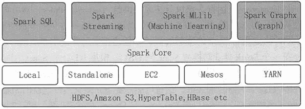

# Spark 生态圈简介

> 原文：[`c.biancheng.net/view/3653.html`](http://c.biancheng.net/view/3653.html)

Spark 生态圈是加州大学伯克利分校的 AMP 实验室打造的，是一个力图在算法（Algorithms）、机器（Machines）、人（People）之间通过大规模集成来展现大数据应用的平台。

AMP 实验室运用大数据、云计算、通信等各种资源及各种灵活的技术方案，对海量不透明的数据进行甄别并转化为有用的信息，以供人们更好地理解世界。该生态圈已经涉及机器学习、数据挖掘、数据库、信息检索、自然语言处理和语音识别等多个领域。

如图 1 所示，Spark 生态圈以 Spark Core 为核心，从 HDFS、Amazon S3 和 HBase 等持久层读取数据，以 Mesos、YARN 和自身携带的 Standalone 为 Cluster Manager 调度 Job 完成 Spark 应用程序的计算，这些应用程序可以来自于不同的组件。

如 Spark Shell/Spark Submit 的批处理，Spark Streaming 的实时处理应用，Spark SQL 的即席查询，MLlib 的机器学习，GraphX 的图处理和 SparkR 的数学计算等。

图 1  Spark 生态圈

#### 1\. Spark Core

本节已经介绍了 Spark Core 的基本情况，下面来总结 Spark 的内核架构。

**1）**提供了有向无环图（DAG）的分布式并行计算框架，并提供 cache 机制来支持多次迭代计算或者数据共享，大大减少了迭代计算之间读取数据的开销，这对于需要进行多次迭代的数据挖掘和分析的性能有很大提升。

**2）**在 Spark 中引入了 RDD 的抽象，它是分布在一组结点中的只读对象集合，这些集合是弹性的，如果数据集的一部分丢失，则可以根据血缘关系对它们进行重建，保证了数据的高容错性。

**3）**移动计算而非移动数据，RDD 分区可以就近读取 HDFS 中的数据块到各个结点内存中进行计算。

**4）**使用多线程池模型来减少 Task 启动开销。

**5）**采用容错的、高可伸缩性的 Akka 作为通信框架。

#### 2\. Spark Streaming

Spark Streaming 是一个对实时数据流进行高通量、容错处理的流式处理系统，可以对多种数据源（如 Kafka、Flume、Twitter、Zero 和 TCP 套接字）进行类似 map、reduce 和 join 的复杂操作，并将结果保存到外部文件系统、数据库中，或应用到实时仪表盘上。

Spark Streaming 的核心思想是将流式计算分解成一系列短小的批处理作业，这里的批处理引擎是 Spark Core。也就是把 Spark Streaming 的输入数据按照设定的时间片（如 1 秒）分成一段一段的数据，每一段数据都转换成 Spark 中的 RDD，然后将 Spark Streaming 中对 DStream 的转换操作变为对 Spark 中的 RDD 的转换操作，将 RDD 经过操作变成的中间结果保存在内存中。

根据业务的需求，整个流式计算可以对中间结果进行叠加，或者将中间结果存储到外部设备。本教程会在后边对 Spark Streaming 做详细介绍。

#### 3\. Spark SQL

Spark SQL 允许开发人员直接处理 RDD，以及查询存储在 Hive、HBase 上的外部数据。Spark SQL 的一个重要特点是其能够统一处理关系表和 RDD，使得开发人员可以轻松地使用 SQL 命令进行外部查询，同时进行更复杂的数据分析。

#### 4\. Spark MLlib

Spark MLlib 实现了一些常见的机器学习算法和实用程序，包括分类、回归、聚类、协同过滤、降维及底层优化，并且该算法可以进行扩充。Spark MLlib 降低了机器学习的门槛，开发人员只要具备一定的理论知识就能进行机器学习的工作。本教程将在后面对 Spark MLlib 做进一步介绍。

#### 5\. Spark GraphX

Spark GraphX 是 Spark 中用于图并行计算的 API，可以认为是 GraphLab 和 Pregel 在 Spark 上的重写及优化。与其他分布式图计算框架相比，Spark GraphX 最大的贡献是在 Spark 之上提供了一站式数据解决方案，可以方便且高效地完成图计算的一整套流水作业。

Spark GraphX 的核心抽象是 Resilient Distributed Property Graph，即一种点和边都带属性的有向多重图。它扩展了 Spark RDD 的抽象，有 Table 和 Graph 两种视图，而只需要一份物理存储。两种视图都有自己独有的操作符，从而使得操作灵活，并提高了执行效率。

需要说明的是，无论是 Spark Streaming、Spark SQL、Spark MLlib，还是 Spark GraphX，都可以使用 Spark Core 的 API 处理问题，它们的方法几乎是通用的，处理的数据也可以共享，从而可以完成不同应用之间数据的无缝集成。