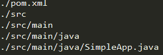

# Spark 开发实例（编程实践）

> 原文：[`c.biancheng.net/view/3654.html`](http://c.biancheng.net/view/3654.html)

本节将介绍如何实际动手进行 RDD 的转换与操作，以及如何编写、编译、打包和运行 Spark 应用程序。

## 启动 Spark Shell

Spark 的交互式脚本是一种学习 API 的简单途径，也是分析数据集交互的有力工具。Spark 包含多种运行模式，可使用单机模式，也可以使用分布式模式。为简单起见，本节采用单机模式运行 Spark。

无论采用哪种模式，只要启动完成后，就初始化了一个 SparkContext 对象（SC），同时也创建了一个 SparkSQL 对象用于 SparkSQL 操作。进入 Scala 的交互界面中，就可以进行 RDD 的转换和行动操作。

进入目录 SPARK_HOME/bin 下，执行如下命令启动 Spark Shell。

$./spark-shell

## Spark Shell 使用

假定本地文件系统中，文件 home/hadoop/SparkData/WordCount/text1 的内容如下。

hello world
hello My name is john I love Hadoop programming

下面我们基于该文件进行 Spark Shell 操作。

**1）利用本地文件系统的一个文本文件创建一个新 RDD。**

scala>var textFile = sc.textFile("file://home/Hadoop/SparkData/WordCount/text1");
textFile:org.apache.spark.rdd.RDD[String] = MappedRDD[1] at textFile at
<console>:12

**2）执行动作操作，计算文档中有多少行。**

scala>textFile.count() //RDD 中有多少行
17/05/17 22:59:07 INFO spark.SparkContext:Job finished:count at<console>:15, took 5.654325469 s
resl:Long = 2

返回结果表明文档中有“2”行。

**3）执行动作操作，获取文档中的第一行内容。**

scala>textFile.first() // RDD 第一行的内容
17/05/17 23:01:25 INFO spark.SparkContext:Job finished:first at <console>:15,took

返回结果表明文档的第一行内容是“hello world”。

**4）转换操作会将一个 RDD 转换成一个新的 RDD。获取包含“hello”的行的代码如下**。

scala>var newRDD = textFile.filter (line => line.contains("hello")) //有多少行含有 hello
scala>newRDD.ount() // 有多少行含 hello
17/05/17 23:06:33 INFO spark.SparkContext:Job finished:count at <console>:15，took 0.867975549 s
res4:Long = 2

这段代码首先通过转换操作 filter 形成一个只包括含有“hello”的行的 RDD，然后再通过 count 计算有多少行。

**5）Spark Shell 的 WordCount 实现**

scala> val file = sc.textFile ("file://home/hendoop/SparkData/WordCount/text1"));
scala> val count = file.flatMap(line=>line.split("")).map(word => (word,1)).reduceByKey(_+_)
scala> count.collect()
17/05/17 23:11:46 INFO spark.SparkContext:Job finished: collect at<console>：17,
took 1.624248037 s
res5: Array[(String, Int)] = Array((hello,2),(world,1),(My,1),(is,1),(love,1),(I,1),(John,1),(hadoop,1),(name,1),(programming,1))

1.  使用 sparkContext 类中的 textFile() 读取本地文件，并生成 MappedBJDD。
2.  使用 flatMap() 方法将文件内容按照空格拆分单词，拆分形成 FlatMappedRDD。
3.  使用 map(word=>(word,1)) 将拆分的单词形成 <单词,1> 数据对，此时生成 MappedBJDD。
4.  使用 reduceByKey() 方法对单词的频度进行统计，由此生成 ShuffledRDD，并由 collect 运行作业得出结果。

## 编写 Java 应用程序

#### 1\. 安装 maven

手动安装 maven，可以访问 maven 官方下载 apache-maven-3.3.9-bin.zip。选择安装目录为 /usr/local/maven。

sudo unzip ~/下载/apache-maven-3.3.9-bin.zip -d/usr/local
cd /usr/local
sudo mv apache-maven-3.3.9/ ./maven
sudo chown -R hadoop ./maven

#### 2\. 编写 Java 应用程序代码

在终端执行以下命令创建一个文件夹 sparkapp2，作为应用程序根目录。

cd~#进入用户主文件夹
mkdir -p ./sparkapp2/src/main/java

使用 vim./sparkapp2/src/main/java/SimpleApp.java 建立一个名为 SimpleApp.java 的文件，代码如下。

```

/*** SimpleApp.java ***/
import org.apache.spark.api.java.*;
import org.apache.spark.api.java.function.Function;

public class SimpleApp {
    public static void main(String[] args)  {
        String logFile = "file:///usr/local/spark/README.md"; // Should be some file on your system
        JavaSparkContext sc = new JavaSparkContext("local", "Simple App",
"file:///usr/local/spark/",new String[] {"target/simple-project-1.0.jar"});

        JavaRDD<String> logData = sc.textFile(logFile).cache();
        long numAs = logData.filter(new Function<String, Boolean>(){
            public Boolean call(String s) { 
                return s.contains ("a");
            }
        }).count();

        long numBs = logData.filter(new Function<String,Boolean>(){
            public Boolean call(String s) { 
                return s.contains("b");
            }
        }).count();
        System.out.printIn ("Lines with a:"+ numAs +",lines with b:"+ numBs);
    }
}
```

该程序依赖 Spark Java API，因此我们需要通过 maven 进行编译打包。在 ./sparkapp2 中新建文件 pom.xml（vim./sparkapp2/pom.xml），并声明该独立应用程序的信息及与 Spark 的依赖关系，代码如下。

```

<project>
    <groupld>edu.berkeley</groupId>
    <artifactId>simple-project</artifactId>
    <modelVersion>4.0.0</modelVersion>
    <name>Simple Project</name>
    <packaging>jar</packaging>
    <version>l.0</version>
    <repositories>
        <repository>
            <id>Akka repository</id>
            <url>http://repo.akka.io/releases</url>
        </repository>
    </repositories>

    <dependencies>
        <dependency> <!--Spark dependency -->
            <groupId>org.apache.spark<groupId>
            <artifactId>spark-core_2.11</artifactId>
            <version>2.1.0</version>
        </dependency>
    </dependencies>
</project>
```

#### 3\. 使用 maven 打包 Java 程序

为了保证 maven 能够正常运行，先执行以下命令检查整个应用程序的文件结构。

cd ~/sparkapp2
find

文件结构如图 1 所示。
图 1  SimpleApp.java 的文件结构接着，可以通过以下代码将这整个应用程序打包成 Jar。

/usr/local/maven/bin/mvn package

如果运行以上命令后出现类似下面的信息，说明 Jar 包生成成功。

[INFO] ---------------------------------------------
[INFO] BUILD SUCCESS
[INFO] ---------------------------------------------
[INFO] Total time: 6.583 s
[INFO] Finished at: 2017-02-19T15:52:08+08:00
[INFO] Final Memory: 15M/121M
[INFO]----------------------------------------------

#### 4\. 通过 spark-submit 运行程序

最后，可以将生成的 Jar 包通过 spark-submit 提交到 Spark 中运行，命令如下。

/usr/local/spark/bin/spark-submit --class "SimpleApp" ~/sparkapp2/target/simple-project-1.0.jar

最后得到的结果如下。

Lines with a: 62,Lines with b: 30