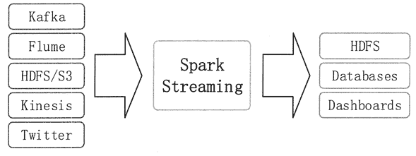
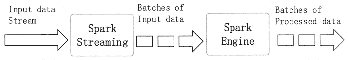

# Spark Streaming 简介

> 原文：[`c.biancheng.net/view/3658.html`](http://c.biancheng.net/view/3658.html)

Spark Streaming 是 Spark 核心 API 的一个扩展，可以实现高吞吐量的、具备容错机制的实时流数据的处理。

Spark Streaming 支持从多种数据源获取数据，包括 Kafka、Flume、Twitter、ZeroMQ、Kinesis 以及 TCP Sockets。从数据源获取数据之后，可以使用诸如 map、reduce、join 和 window 等高级函数进行复杂算法的处理，最后还可以将处理结果存储到文件系统、数据库和现场仪表盘中。

在 Spark 统一环境的基础上，可以使用 Spark 的其他子框架，如机器学习、图计算等，对流数据进行处理。Spark Streaming 处理的数据流如图 1 所示。
图 1  Spark Streaming 处理的数据流示意
与 Spark 的其他子框架一样，Spark Streaming 也是基于核心 Spark 的。Spark Streaming 在内部的处理机制是，接收实时的输入数据流，并根据一定的时间间隔（如 1 秒）拆分成一批批的数据，然后通过 Spark Engine 处理这些批数据，最终得到处理后的一批批结果数据。它的工作原理如图 2 所示。

图 2  Spark Streaming 原理示意
Spark Streaming 支持一个高层的抽象，叫作离散流（DiscretizedStream）或者 DStream，它代表连续的数据流。

DStream 既可以利用根据 Kafka、Flume 和 Kinesis 等数据源获取的输入数据流来创建，也可以在其他 DStream 的基础上通过高阶函数获得。

在内部，DStream 是由一系列 RDD 组成的。一批数据在 Spark 内核中对应一个 RDD 实例。因此，对应流数据的 DStream 可以看成是一组 RDD，即 RDD 的一个序列。也就是说，在流数据分成一批一批后，会通过一个先进先出的队列，Spark Engine 从该队列中依次取出一个个批数据，并把批数据封装成一个 RDD，然后再进行处理。

下面对 Spark Streaming 的一些常用术语进行说明。

| 名称 | 说明 |
| --- | --- |
| 离散流（Discretized Stream）或 DStream | Spark Streaming 对内部持续的实时数据流的抽象描述，即处理的一个实时数据流，在 Spark Streaming 中对应于一个 DStream 实例。 |
| 时间片或批处理时间间隔（BatchInterval） | 拆分流数据的时间单元，一般为 500 毫秒或 1 秒。 |
| 批数据（BatchData） | 一个时间片内所包含的流数据，表示成一个 RDD。 |
| 窗口（Window） | 一个时间段。系统支持对一个窗口内的数据进行计算 |
| 窗口长度（Window Length） | 一个窗口所覆盖的流数据的时间长度，必须是批处理时间间隔的倍数。 |
| 滑动步长（Sliding Interval） | 前一个窗口到后一个窗口所经过的时间长度。必须是批处理时间间隔的倍数。 |
| Input DStream | 一个 Input DStream 是一个特殊的 DStream。 |