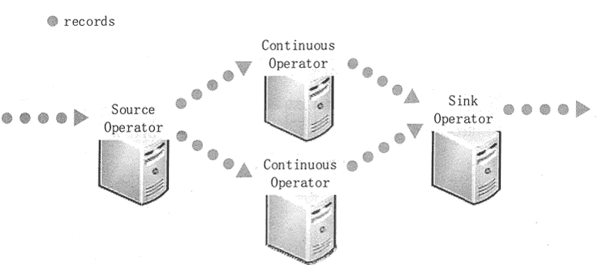
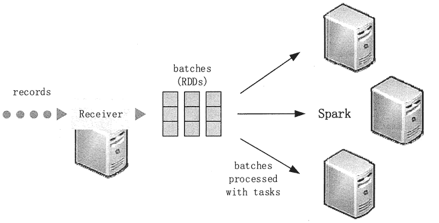
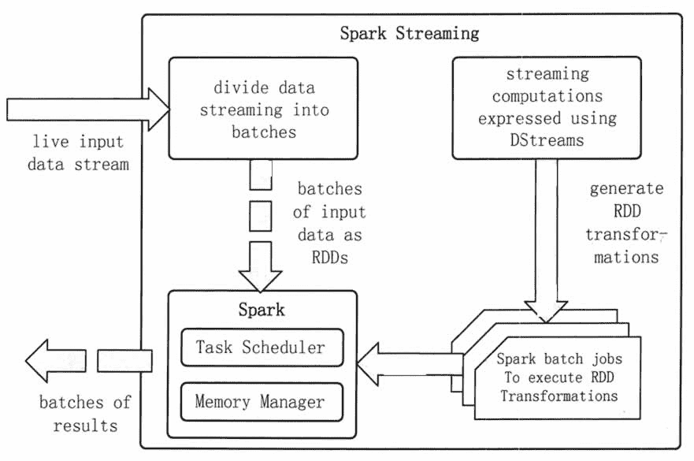
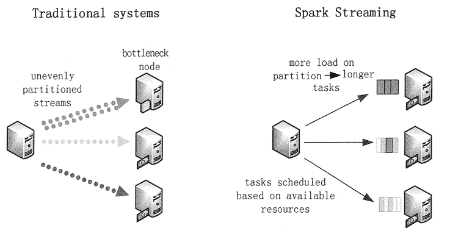
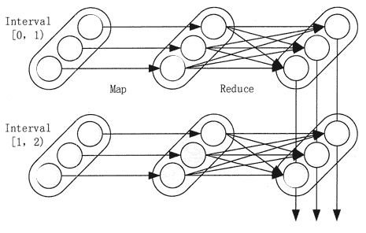
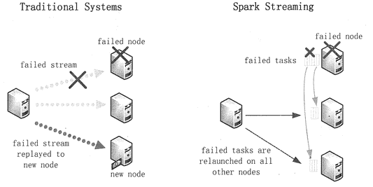
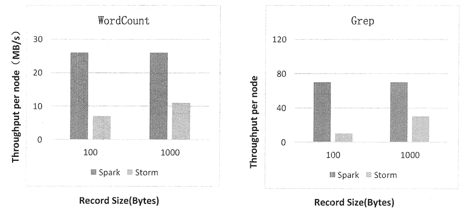

# Spark Streaming 的系统架构

> 原文：[`c.biancheng.net/view/3662.html`](http://c.biancheng.net/view/3662.html)

本节首先分析传统流处理系统架构存在的问题，然后介绍 Spark Streaming 的系统架构及其工作原理和优势。

## 传统流处理系统架构

流处理架构的分布式流处理管道执行方式是，首先用数据采集系统接收来自数据源的流数据，然后在集群上并行处理数据，最后将处理结果存放至下游系统。

为了处理这些数据，传统的流处理系统被设计为连续算子模型，其工作方式如图 1 所示。

系统包含一系列的工作结点，每组结点上运行一至多个连续算子。对于流数据，每个连续算子（ContinuousOperator）一次处理一条记录，并且将记录传输给管道中别的算子，源算子（SourceOperator）从采集系统接收数据，接着沉算子（SinkOperator）输出到下游系统。

连续算子是一种较为简单、自然的模型。然而，在大数据时代，随着数据规模的不断扩大，以及越来越复杂的实时分析，这个传统的架构面临着严峻的挑战。
图 1  传统流处理系统架构

#### 1）故障恢复问题。

数据越庞大，出现结点故障与结点运行变慢情况的概率也越高。因此，系统要是能够实时给出结果，就必须能够自动修复故障。但是在传统流处理系统中，在这些工作结点静态分配的连续算子要迅速完成这项工作仍然是个挑战。

#### 2）负载均衡问题。

在连续算子系统中，工作结点间的不平衡分配加载会造成部分结点性能的运行瓶颈。这些问题更常见于大规模数据与动态变化的工作量情况下。为了解决这个问题，需要系统必须能够根据工作量动态调整结点间的资源分配。

#### 3）支持统一的流处理与批处理及交互工作的需求。

在许多用例中，与流数据的交互或者与静态数据集的结合是很有必要的。这些都很难在连续算子系统中实现，当系统动态地添加新算子时，并没有为其设计临时查询功能，这样大大地削弱了用户与系统的交互能力。因此需要一个能够集成批处理、流处理与交互查询功能的引擎。

#### 4）高级分析能力的需求。

一些更复杂的工作需要不断学习和更新数据模型，或者利用 SQL 查询流数据中最新的特征信息。因此，这些分析任务中需要有一个共同的集成抽象组件，让开发人员更容易地去完成他们的工作。

## Spark Streaming 系统架构

Spark Streaming 引入了一个新结构，即 DStream，它可以直接使用 Spark Engine 中丰富的库，并且拥有优秀的故障容错机制。

传统流处理采用的是一次处理一条记录的方式，而 Spark Streaming 采用的是将流数据进行离散化处理，使之能够进行秒级以下的微型批处理。同时，Spark Streaming 的 Receiver 并行接收数据，将数据缓存至 Spark 工作结点的内存中。

经过延迟优化后，Spark Engine 对短任务（几十毫秒）能够进行批处理，并且可将结果输出至别的系统中。Spark Streaming 的系统架构如图 2 所示。

值得注意的是，与传统连续算子模型不同，传统模型是静态分配给一个结点进行计算的，而 Spark Task 可基于数据的来源及可用资源情况动态分配给工作结点。这能够更好地实现流处理所需要的两个特性：负载均衡与快速故障恢复。此外，Executor 除了可以处理 Task 外，还可以将数据存在 cache 或者 HDFS 上。

Spark Streaming 中的流数据就是 Spark 的弹性分布式数据集（RDD），是 Spark 中容错数据集的一个基本抽象。正是如此，这些流数据才能使用 Spark 的任意指令与库。
图 2  Spark Streaming 系统架构
Spark Streaming 是将流式计算分解成一系列短小的批处理作业。这里的批处理引擎是 Spark Core。

Spark Streaming 首先把输入数据按照批段大小（如 1 秒）分成一段一段的数据（DStream），并把每一段数据都转换成 Spark 中的 RDD，然后将 Spark Streaming 中对 DStream 的 Transformation 操作变为 Spark 中对 RDD 的 Transformation 操作，并将操作的中间结果保存在内存中。

整个流式计算根据业务的需求可以对中间的结果进行叠加，或者存储到外部设备。图 3 显示了 Spark Streaming 的整个计算流程。
图 3  Spark Streaming 计算流程

## 动态负载均衡

Spark 系统将数据划分为小批量，允许对资源进行细粒度分配。

传统的流处理系统采用静态方式分配任务给结点，如果其中的一个分区的计算比别的分区更密集，那么该结点的处理将会遇到性能瓶颈，同时将会减缓管道处理。而在 Spark Streaming 中，作业任务将会动态地平衡分配给各个结点，一些结点会处理数量较少且耗时较长的任务，别的结点将会处理数量更多且耗时更短的任务。

静态和动态负载均衡的对比如图 4 所示。
图 4  静态和动态负载均衡的对比

## 容错性

对于流式计算来说，容错性至关重要。首先来介绍 Spark 中 RDD 的容错机制。每一个 RDD 都是一个不可变的分布式可重算的数据集，其记录着确定性的操作血缘关系，所以只要输入数据是可容错的，则任意一个 RDD 的分区都可以利用原始输入数据通过转换操作而重新计算来得到。

对于 Spark Streaming 来说，其 RDD 的血缘关系如图 5 所示，图中的每一个椭圆形表示一个 RDD，椭圆形中的每个圆形代表一个 RDD 中的一个 Partition，图中的每一列的多个 RDD 表示一个 DStream，而每一行最后一个 RDD 则表示每一个 Batch Size 所产生的中间结果 RDD。

我们可以看到，图 5 中的每一个 RDD 都是通过血缘相连接的，RDD 中任意的 Partition 出错，都可以并行地在其他机器上将缺失的 Partition 计算出来。这个容错恢复方式比连续计算模型的效率更高。
图 5  Spark Streaming 中 RDD 的血缘关系图
在结点故障的案例中，传统系统会在别的结点上重启失败的连续算子。为了重新计算丢失的信息，不得不重新运行一遍先前的数据流处理过程。此时，只有一个结点能够处理重新计算，并且整个管道将无法继续进行工作，直至新的结点信息已经恢复到故障前的状态。

在 Spark Streaming 中，计算将被拆分成多个小的任务，保证能在任何地方运行而又不影响合并后结果的正确性。因此，失败的任务可以同时重新在集群结点上并行处理，从而均匀地分布在所有重新计算情况下的众多结点中，这样相比于传统方法能够更快地从故障中恢复过来。两种故障恢复方式的比较如图 6 所示。

图 6  故障恢复方式的比较

## 实时性、扩展性与吞吐量

Spark Streaming 将流式计算分解成多个 Spark Job，对于每一段数据的处理都会经过 Spark DAG 的图分解过程及 Spark 的任务集的调度过程。

对于目前版本的 Spark Streaming 而言，其最小的批次大小的选取为 0.5~2 秒，所以 Spark Streaming 能够满足除对实时性要求非常高（如高频实时交易）之外的所有流式准实时计算场景。

Spark 目前在 EC2 上已能够线性扩展到 100 个结点（每个结点 4Core），可以以数秒的延迟处理 6GB/秒的数据量，吞吐量可达 60MB 条记录/秒。

图 7 是利用 WordCount 和 Grep 两个用例所做的测试，在 Grep 这个测试中，Spark Streaming 中的每个结点的吞吐量是 670KB 条记录/秒，而 Storm 中的每个结点的吞吐量是 115KB 条记录/秒。
图 7  Spark Streaming 与 Storm 吞吐量比较