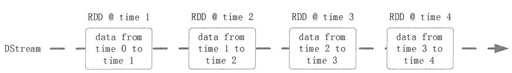
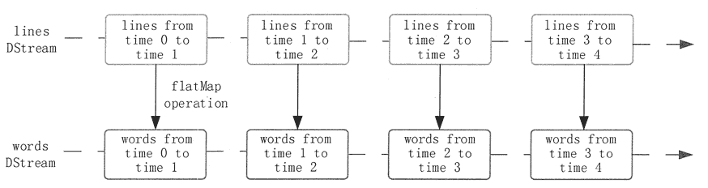

# Spark Streaming 编程模型

> 原文：[`c.biancheng.net/view/3664.html`](http://c.biancheng.net/view/3664.html)

本节将介绍 Spark Streaming 的编程模型，包括 DStream 的操作流程和使用方法。

## DStream 的操作流程

DStream 作为 Spark Streaming 的基础抽象，它代表持续性的数据流。这些数据流既可以通过外部输入源来获取，也可以通过现有的 DStream 的 Transformation 操作来获得。

在内部实现上，DStream 由一组时间序列上连续的 RDD 来表示。如图 1 所示，每个 RDD 都包含了自己特定时间间隔内的数据流。
图 1  DStream 中在时间轴下生成离散的 RDD 序列
如图 2 所示，对 DStream 中数据的各种操作也是映射到内部的 RDD 上来进行的，可以通过 RDD 的 Transformation 生成新的 DStream。这里的执行引擎是 Spark。

图 2  DStream 中的数据操作流程

## Spark Streaming 使用

作为构建于 Spark 之上的应用框架，Spark Streaming 承袭了 Spark 的编程风格。本节以 Spark Streaming 官方提供的 WordCount 代码为例来介绍 Spark Streaming 的使用方式。

```

import org.apache.spark._
import org.apache.spark.streaming._
import org.apache.spark.streaming.StreamingContext._

//创建一个拥有两个工作线程，时间片长度为 1 秒的 StreamContext
//主结点需要 2 核以免饥饿状态发生

val conf = new SparkConf().setMaster("local[2]").setAppName("NetworkWordCount");
val ssc = new StreamingContext(conf,Seconds(1))
// 创建连接至 hostname:port 的 DStreamCreate,如 localhost:9999
val lines = ssc.socketTextStream("localhost",9999)
//把每一行分解为单词
val words = lines.flatMap (_.split(""))

import org.apache.spark.streaming.StreamingContext._

//计数每一个时间片内的单词量
val pairs = words.map(word => (word, 1))
val wordCounts =  pairs.reduceByKey(_+_)

//打印该 DStream 生成的每个 RDD 中的前 10 个单词
wordCounts.print()
ssc.start() // 启动计算
ssc.awaitTermination()   //等待计算完成
```

#### 1\. 创建 StreamingContext 对象

Spark Streaming 初始化的主要工作是创建 Streaming Context 对象，通过创建函数的参数指明 Master Server，设定应用名称，指定 Spark Streaming 处理数据的时间间隔等。上述代码可设定应用的名称为 NetworkWordCount，处理数据的时间间隔为 1 秒。

#### 2\. 创建 InputDStream

Spark Streaming 需要指明数据源。该实例指明使用 socketTextStream，也就是以 socket 连接作为数据源读取数据。Spark Streaming 支持多种不同的数据源，包括 Kafka、Flume、HDFS/S3、Kinesis、Twitter。

#### 3\. 操作 DStream

对于从数据源得到的 DStream，用户可以对其进行各种操作，该实例所示的操作就是一个典型的 WordCount 执行流程。对于当前时间窗口内从数据源得到的数据，首先进行分割，然后利用 map 和 reduceByKey 方法进行计算，最后使用 print() 方法输出结果。

#### 4\. 启动 Spark Streaming

之前的所有步骤只是创建了执行流程，程序没有真正连接上数据源，也没有对数据进行任何操作，只是设定好了所有的执行计划，当 ssc.start() 启动后程序才真正进行所有预期的操作。

## DStream 的输入源

Spark Streaming 的所有操作都是基于流的，而输入源是这一系列操作的起点。输入 DStream 和 DStream 接收的流都代表输入数据流的来源，Spark Streaming 提供了两种内置数据流来源：基础来源和高级来源。

#### 1\. 基础来源

基础来源是在 StreamingContext API 中直接可用的来源，如文件系统、Socket （套接字）等。

前面的例子已经使用了 ssc.socketTextStream() 方法，即通过 TCP 套接字连接，从文本数据中创建一个 DStream。除了套接字之外，StreamingContext 的 API 还提供了从文件和 Akka actors 中创建 DStreams 作为输入源的方法。

Spark Streaming 提供了 streamingContext.fileStream(dataDirectory) 方法，该方法可以从任何文件系统（如 HDFS、S3、NFS 等）的文件中读取数据，然后创建一个 DStream。

Spark Streaming 监控 dataDirectory 目录和在该目录下的所有文件的创建处理过程。需要注意的是，文件必须是具有相同的数据格式的，创建的文件必须在 dataDirectory 目录下。对于简单的文本文件，可以使用一个简单的方法 StreamingContext.textFileStream(dataDirectory) 来读取数据。

Spark Streaming 也可以基于自定义 Actors 的流创建 DStream。通过 Akka actors 接收数据流的使用方法是 streamingContext.actorStream(actorProps,actor—name)。

Spark Streaming 使用 streamingContext.queueStream（queueOfRDDs）方法可以创建基于 RDD 队列的 DStream，每个 RDD 队列将被视为 DStream 中的一块数据流进行加工处理。

#### 2.高级来源

局级来源，如 Kafka、Flume、Kinesis、Twitter 等，可以通过额外的实用工具类来创建。高级来源需要外部 non-Spark 库的接口，其中一些有复杂的依赖关系（如 Kafka、Flume)。因此通过这些来源创建 DStreams 需要明确其依赖。例如，如果想创建一个使用 Twitter tweets 的数据的 DStream 流，必须按以下步骤来做。

**1）在 sbt 或 maven 工程里添加 spark-streaming-twitter_2.10 依赖。**

**2）开发：导入 TwitterUtils 包，通过 TwitterUtils.createStream 方法创建一个 DStream。**

**3）部署：添加所有依赖的 Jar 包，然后部署应用程序。**

需要注意的是，这些高级来源一般在 Spark Shell 中不可用，因此基于这些高级来源的应用不能在 Spark Shell 中进行测试。如果必须在 Spark Shell 中使用它们，则需要下载相应的 maven 工程的 Jar 依赖并添加到类路径中。另外，输入 DStream 也可以创建自定义的数据源，需要做的就是实现一个用户定义的接收器。