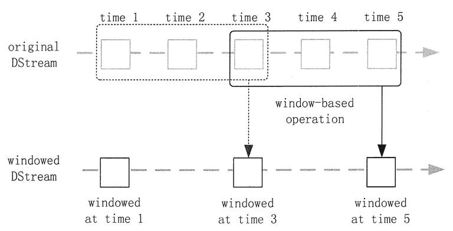

# Spark DStream 相关操作

> 原文：[`c.biancheng.net/view/3666.html`](http://c.biancheng.net/view/3666.html)

与 RDD 类似，DStream 也提供了自己的一系列操作方法，这些操作可以分成 3 类：普通的转换操作、窗口转换操作和输出操作。

## 普通的转换操作

普通的转换操作如表 1 所示

**表 1 普通的转换操作**

| Suo | 描述 |
| --- | --- |
| map(func) | 源 DStream 的每个元素通过函数 func 返回一个新的 DStream。 |
| flatMap(func) | 类似于 map 操作，不同的是，每个输入元素可以被映射出 0 或者更多的输出元素 |
| filter(func) | 在源 DStream 上选择 func 函数的返回值仅为 true 的元素，最终返回一个新的 DStream。 |
| repartition(numPartitions) | 通过输入的参数 numPartitions 的值来改变 DStream 的分区大小 |
| union(otherStream) | 返回一个包含源 DStream 与其他 DStream 的元素合并后的新 DStream |
| count() | 对源 DStream 内部所含有的 RDD 的元素数量进行计数，返回一个内部的 RDD 只包含一个元素的 DStream |
| reduce(func) | 使用函数 func（有两个参数并返回一个结果）将源 DStream 中每个 RDD 的元素进行聚合操作，返回一个内部所包含的 RDD 只有一个元素的新 DStream |
| countByValue() | 计算 DStream 中每个 RDD 内的元素出现的频次并返回新的 DStream(<K,Long>)，其中，K 是 RDD 中元素的类型，Long 是元素出现的频次 |
| reduceByKey(func,[numTasks]) | 当一个类型为 <K,V> 键值对的 DStream 被调用的时候，返回类型为键值对的新 DStream，其中每个键的值 V 都是使用聚合函数 func 汇总的。可以通过配置 numTasks 设置不同的并行任务数 |
| join(otherStream,[numTasks]) | 当被调用类型分别为 <K,V> 和 <K,W> 键值对的两个 DStream 时，返回一个类型为 <K,<V,W>> 键值对的新 DStream |
| cogroup(otherStream,[numTasks]) | 当被调用的两个 DStream 分别含有 <K,V> 和 <K,W>键值对时，返回一个 <K,Seq[V],seq[W]> 类型的新的 DStream |
| transform(func) | 通过对源 DStream 的每个 RDD 应用 RDD-to-KDD 函数，返回一个新的 DStream，这可以用来在 DStream 中做任意 RDD 操作 |
| updateStateByKey(func) | 返回一个新状态的 DStream，其中每个键的新状态是基于前一个状态和其新值通过函数 func 计算得出的。这个方法可以被用来维持每个键的任何状态数据 |

在表 1 列出的操作中，transform(func) 方法和 updateStateByKey(fhnc) 方法值得再深入地探讨一下。

#### 1\. transform(func) 方法

transform 方法及类似的 transformWith(func) 方法允许在 DStream 上应用任意 RDD-to-RDD 函数，它们可以被应用于未在 DStream API 中暴露的任何 RDD 操作中。

例如，每批次的数据流与另一数据集的连接功能不能直接暴露在 DStream API 中，但可以轻松地使用 transform(func) 方法来做到这一点，这使得 DStream 的功能非常强大。

例如，可以通过连接预先计算的垃圾邮件信息的输入数据流，来做实时数据清理的筛选。事实上，也可以在 transform(func) 方法中使用机器学习和图形计算的算法。

#### 2\. updateStateByKey(func) 方法

updateStateByKey(func) 方法可以保持任意状态，同时允许不断有新的信息进行更新。要使用此功能，必须进行以下两个步骤。

**1）定义状态：**状态可以是任意的数据类型。

**2）定义状态更新函数：**用一个函数指定如何使用先前的状态和从输入流中获取的新值更新状态。

用一个例子来说明，假设要进行文本数据流中单词计数。在这里，正在运行的计数是状态而且它是一个整数。更新功能定义如下。

def updateFunction(newValues : seq[Int], runningCount:option[Int]);
Option[Int] = {
    val newCount = ... //给前序 runningCount 添加新值，获取新 count
    Some(newCount)
}

此函数应用于含有键值对的 DStream 中（例如，在前面的单词计数示例中，在 DStream 含有 <word,1> 键值对)。它会针对里面的每个元素（如 WordCount 中的 Word）调用更新函数，其中，newValues 是最新的值，runningCount 是之前的值。

val runningCounts = pairs.updateStateByKeyInt

## 窗口转换操作

Spark Streaming 还提供了窗口的计算，它允许通过滑动窗口对数据进行转换，窗口转换操作如表 2 所示

**表 2 窗口转换操作**

| 转换 | 描述 |
| --- | --- |
| window(windowLength,slideInterval) | 返回一个基于源 DStream 的窗口批次计算得到新的 DStream |
| countByWindow(windowLength,slideInterval) | 返回基于滑动窗口的 DStream 中的元素的数量 |
| reduceByWindow(func,windowLength,slideInterval) | 基于滑动窗口对源 DStream 中的元素进行聚合操作，得到一个新的 DStream |
| reduceByKeyAndWindow(func,windowLength,slideInterval,[numTasks]) | 基于滑动窗口对 <K,V> 键值对类型的 DStream 中的值按 K 使用聚合函数 func 进行聚合操作，得到一个新的 DStream |
| reduceByKeyAndWindow(func,invFunc,windowLength,slideInterval,[numTasks]) | 一个更高效的实现版本，先对滑动窗口中新的时间间隔内的数据进行增量聚合，再移去最早的同等时间间隔内的数据统计量。 例如，计算 t+4 秒这个时刻过去 5 秒窗口的 WordCount 时，可以将 t+3 时刻过去 5 秒的统计量加上 [t+3,t+4] 的统计量，再减去 [t-2,t-1] 的统计量，这种方法可以复用中间 3 秒的统计量，提高统计的效率 |
| countByValueAndWindow(windowLength,slideInterval,[numTasks]) | 基于滑动窗口计算源 DStream 中每个 RDD 内每个元素出现的频次，并返回 DStream[<K,Long>]，其中，K 是 RDD 中元素的类型，Long 是元素频次。Reduce 任务的数量可以通过一个可选参数进行配置 |

在 Spark Streaming 中，数据处理是按批进行的，而数据采集是逐条进行的，因此在 Spark Streaming 中会先设置好批处理间隔，当超过批处理间隔的时候就会把采集到的数据汇总起来成为一批数据交给系统去处理。

对于窗口操作而言，在其窗口内部会有 N 个批处理数据，批处理数据的大小由窗口间隔决定，而窗口间隔指的就是窗口的持续时间。

在窗口操作中，只有窗口的长度满足了才会触发批数据的处理。除了窗口的长度，窗口操作还有另一个重要的参数，即滑动间隔，它指的是经过多长时间窗口滑动一次形成新的窗口。滑动间隔默认情况下和批次间隔相同，而窗口间隔一般设置得要比它们两个大。在这里必须注意的一点是，滑动间隔和窗口间隔的大小一定得设置为批处理间隔的整数倍。

如图 1 所示，批处理间隔是 1 个时间单位，窗口间隔是 3 个时间单位，滑动间隔是 2 个时间单位。对于初始的窗口（time 1~time 3)，只有窗口间隔满足了才会触发数据的处理。

这里需要注意，有可能初始的窗口没有被流入的数据撑满，但是随着时间的推进/窗口最终会被撑满。每过 2 个时间单位，窗口滑动一次，这时会有新的数据流入窗口，窗口则移去最早的 2 个时间单位的数据，而与最新的 2 个时间单位的数据进行汇总形成新的窗口（time 3~ time 5)。

图 1  DStream 的批处理间隔示意
对于窗口操作，批处理间隔、窗口间隔和滑动间隔是非常重要的 3 个时间概念，是理解窗口操作的关键所在。

## 输出操作

Spark Streaming 允许 DStream 的数据被输出到外部系统，如数据库或文件系统。输出操作实际上使 transformation 操作后的数据可以被外部系统使用，同时输出操作触发所有 DStream 的 transformation 操作的实际执行（类似于 RDD 操作）。表 3 列出了目前主要的输出操作。

| 转换 | 描述 |
| --- | --- |
| print() | 在 Driver 中打印出 DStream 中数据的前 10 个元素 |
| saveAsTextFiles(prefix,[suffix]) | 将 DStream 中的内容以文本的形式保存为文本文件，其中，每次批处理间隔内产生的文件以 prefix-TIME_IN_MS[.suffix] 的方式命名 |
| saveAsObjectFiles(prefix,[suffix]) | 将 DStream 中的内容按对象序列化，并且以 SequenceFile 的格式保存，其中，每次批处理间隔内产生的文件以 prefix—TIME_IN_MS[.suffix]的方式命名 |
| saveAsHadoopFiles(prefix,[suffix]) | 将 DStream 中的内容以文本的形式保存为 Hadoop 文件，其中，每次批处理间隔内产生的文件以 prefix-TIME_IN_MS[.suffix] 的方式命名 |
| foreachRDD(func) | 最基本的输出操作，将 func 函数应用于 DStream 中的 RDD 上，这个操作会输出数据到外部系统，例如，保存 RDD 到文件或者网络数据库等。需要注意的是，func 函数是在该 Streaming 应用的 Driver 进程里执行的 |

dstream.foreachRDD 是一个非常强大的输出操作，它允许将数据输出到外部系统。但是，如何正确高效地使用这个操作是很重要的，下面来讲解如何避免一些常见的错误。

通常情况下，将数据写入到外部系统需要创建一个连接对象（如 TCP 连接到远程服务器)，并用它来发送数据到远程系统。出于这个目的，开发者可能在不经意间在 Spark Driver 端创建了连接对象，并尝试使用它保存 RDD 中的记录到 Spark Worker 上，代码如下。

dstream.foreachRDD { rdd =>
    val connection = createNewConnection() //在 Driver 上执行
    rdd.foreach { record =>
        connection.send(record) // 在 Worker 上执行
    }
}

这是不正确的，这需要连接对象进行序列化并从 Driver 端发送到 Worker 上。连接对象很少在不同机器间进行这种操作，此错误可能表现为序列化错误（连接对不可序列化)、初始化错误（连接对象需要在 Worker 上进行初始化）等，正确的解决办法是在 Worker 上创建连接对象。

通常情况下，创建一个连接对象有时间和资源开销。因此，创建和销毁的每条记录的连接对象都可能会导致不必要的资源开销，并显著降低系统整体的吞吐量。

一个比较好的解决方案是使用 rdd.foreachPartition 方法创建一个单独的连接对象，然后将该连接对象输出的所有 RDD 分区中的数据使用到外部系统。

还可以进一步通过在多个 RDDs/batch 上重用连接对象进行优化。一个保持连接对象的静态池可以重用在多个批处理的 RDD 上，从而进一步降低了开销。

需要注意的是，在静态池中的连接应该按需延迟创建，这样可以更有效地把数据发送到外部系统。另外需要要注意的是，DStream 是延迟执行的，就像 RDD 的操作是由 Actions 触发一样。默认情况下，输出操作会按照它们在 Streaming 应用程序中定义的顺序逐个执行。

## 持久化

与 RDD 一样，DStream 同样也能通过 persist() 方法将数据流存放在内存中，默认的持久化方式是 MEMORY_ONLY_SER，也就是在内存中存放数据的同时序列化数据的方式，这样做的好处是，遇到需要多次迭代计算的程序时，速度优势十分的明显。

而对于一些基于窗口的操作，如 reduceByWindow、reduceByKeyAndWindow，以及基于状态的操作，如 updateStateBykey， 其默认的持久化策略就是保存在内存中。

对于来自网络的数据源（Kafka、Flume、Sockets 等），默认的持久化策略是将数据保存在两台机器上，这也是为了容错性而设计的。