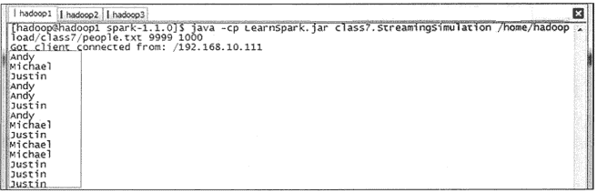

# Spark Streaming 编程实战（开发实例）

> 原文：[`c.biancheng.net/view/3671.html`](http://c.biancheng.net/view/3671.html)

本节介绍如何编写 Spark Streaming 应用程序，由简到难讲解使用几个核心概念来解决实际应用问题。

## 流数据模拟器

在实例演示中模拟实际情况，需要源源不断地接入流数据，为了在演示过程中更接近真实环境，首先需要定义流数据模拟器。该模拟器的主要功能是通过 Socket 方式监听指定的端口号，当外部程序通过该端口进行连接并请求数据时，模拟器将定时将指定的文件数据进行随机获取，并发送给外部程序。

流数据模拟器的代码如下。

```

import java.io.{PrintWriter}
import java.net.ServerSocket
import scala.io.Source

object StreamingSimulation {

    //定义随机获取整数的方法
    def index(length:Int) = {
        import java.util.Random
        val rdm = new Random
        rdm.nextInt(length)
    }

    def main(args: Array[String]) {
        //调用该模拟器需要 3 个参数，分别为文件路径、端口号和间隔时间（单位为毫秒）
        if (args.length != 3) {
            System.err.printIn("Usage:<filename> <port><millisecond>")
            System.exit(1)
        }

        //获取指定文件总的行数
        val filename = args(0)
        val lines = Source.fromFile(filename).getLines.toList
        val filerow = lines.length

        //指定监听某端口，当外部程序请求时建立连接
        val listener = new ServerSocket(args(1).toInt)
        while (true) {
            val socket = listener.accept()
            new Thread() {
                override def run = {
                    printIn("Got client connected from: " + socket.getInetAddress)
                    val out = new PrintWriter(socket.getOutputStream(), true)
                    while (true) {
                        Thread.sleep(args(2).toLong)
                        //当该端口接受请求时，随机获取某行数据发送给对方
                        val content = lines(index(filerow))
                        printIn(content)
                        out.write(content + '\n') out.flush()
                    }
                    socket.close()
                }
            }.start()
        }
    }
}
```

在 IDEA 开发环境打包配置界面中：

*   首先需要在 ClassPath 加入 Jar 包（/app/scala-2.10.4/lib/scala—swing.jar/app/scala—2.10.4/lib/scala—library.jar/app/scala—2.10.4/lib/scala—actors.jar）。
*   然后单击“Build”→“Build Artifacts”，选择“Build”或者“Rebuild”动作。
*   最后使用以下命令复制打包文件到 Spark 根目录下。

cd /home/hadoop/IdeaProjects/out/artifacts/LearnSpark_jar
cp LearnSpark.jar /app/hadoop/spark-1.1.0/

## 实例 1：读取文件演示

在该实例中，Spark Streaming 将监控某目录中的文件，获取在该间隔时间段内变化的数据，然后通过 Spark Streaming 计算出该时间段内的单词统计数。

程序代码如下。

```

import org.apache.spark.SparkConf
import org.apache.spark.streaming.{Seconds,StreamingContext}
import org.apache.spark.streaming.StreamingContext._

object FileWordCount {
    def main(args:Array[String]) {
        val sparkConf = new SparkConf().setAppName("FileWordCount").setMaster("local[2]")

        //创建 Streaming 的上下文，包括 Spark 的配置和时间间隔，这里时间间隔为 20 秒 val ssc = new StreamingContext(sparkConf,Seconds(20))
        //指定监控的目录，这里为 /home/hadoop/temp/
        val lines = ssc.textFileStream("/home/hadoop/temp/")
        //对指定文件夹中变化的数据进行单词统计并且打印
        val words = lines.flatMap (_.split(""))
        val wordCounts = words.map(x => (x, 1)).reduceByKey(_+_)
        wordCounts.print()
        // 启动 Streaming
        ssc.start()
        ssc.awaitTermination()
    }
}
```

运行代码的步骤共有三步。

#### 1）创建 Streaming 监控目录。

创建 /home/hadoop/temp 为 Spark Streaming 监控的目录，在该目录中定时添加文件，然后由 Spark Streaming 统计出新添加的文件中的单词个数。

#### 2）使用以下命令启动 Spark 集群。

$cd /app/hadoop/spark-1.1.0
$sbin/start-all.sh

#### 3）在 IDEA 中运行 Streaming 程序。

在 IDEA 中运行该实例，由于该实例没有输入参数故不需要配置参数，在运行日志中将定时打印时间戳。如果在监控目录中加入文件，则输出时间戳的同时将输出该时间段内新添加的文件的单词统计个数。

## 实例 2：网络数据演示

在该实例中将由流数据模拟器以 1 秒的频度发送模拟数据，Spark Streaming 通过 Socket 接收流数据并每 20 秒运行一次来处理接收到的数据，处理完毕后打印该时间段内数据出现的频度，即在各处理段时间内的状态之间并无关系。

程序代码如下。

```

import org.apache.spark.{SparkContext,SparkConf}
import org.apache.spark.streaming.{Milliseconds,Seconds,StreamingContext}
import org.apache.spark.streaming.StreamingContext._ 
import org.apache.spark.storage.StorageLevel

object NetworkWordCount {
    def main(args: Array[String]) {
        val conf = new SparkConf().setAppName("NetworkWordCount").setMaster("local[2]")
        val sc = new SparkContext(conf)
        val ssc = new StreamingContext(sc,Seconds(20))

        //通过 Socket 获取数据，需要提供 Socket 的主机名和端口号，数据保存在内存和硬盘中
        val lines = ssc.socketTextStream(args(0),args(1).toInt,StorageLevel.MEMORY_AND_DISK_SER)

        //对读入的数据进行分割、计数
        val words = lines.flatMap(_.split(","))
        val wordCounts = words.map(x => (x, 1)).reduceByKey(_ + _) wordCounts.print()
        ssc.start()
        ssc.awaitTermination()
    }
}
```

运行代码的步骤共有四步。

#### 1）启动流数据模拟器。

启动流数据模拟器，模拟器 Socket 的端口号为 9999，频度为 1 秒。在该实例中将定时发送 /home/hadoop/upload/class7 目录下的 people.txt 数据文件，其中，people.txt 数据的内容如下。

1 Michael
2 Andy
3 Justin
4

启动流数据模拟器的命令如下。

$cd /app/hadoop/spark-1.1.0
$java -cp LearnSpark.jar class7.StreamingSimulation \   
/home/hadoop/upload/class7/people.txt 9999 1000

在没有程序连接时，该程序处于阻塞状态。

#### 2）在 IDEA 中运行 Streaming 程序。

在 IDEA 中运行该实例，需要配置连接 Socket 的主机名和端口号，在这里配置主机名为 hadoop1，端口号为 9999。

#### 3）观察模拟器发送情况。

IDEA 中的 Spark Streaming 程序与模拟器建立连接，当模拟器检测到外部连接时开始发送测拭数据，数据是随机在指定的文件中获取的一行数据，时间间隔为 1 秒。图 1 是一个模拟器发送情况的截图。
图 1  模拟器发送情况的截图

#### 4）观察统计结果。

在 IDEA 的运行窗口中，可以观测到统计结果。通过分析可知，Spark Streaming 每段时间内的单词数为 20，正好是 20 秒内每秒发送数量的总和。

---------------------------
Time：14369195400000ms 
(Andy,2)  
(Michael,9)   
(Justin,9) 

## 实例 3：Stateful 演示

该实例为 Spark Streaming 状态操作，由流数据模拟器以 1 秒的频度发送模拟数据，Spark Streaming 通过 Socket 接收流数据并每 5 秒运行一次来处理接收到的数据，处理完毕后打印程序启动后单词出现的频度。

也就是说，每次输出的结果不仅仅是统计该时段内接收到的数据，还包括前面所有时段的数据。相比较实例 2，在该实例中，各时间段内的状态之间是相关的。

程序代码如下。

```

import org.apache.log4j.{Level,Logger}
import org.apache.spark.{SparkContext,SparkConf}
import org.apache.spark.streaming.{Seconds,StreamingContext}
import org.apache.spark.streaming.StreamingContext._

object StatefulWordCount {
    def main(args: Array[String]) {
        if (args.length != 2) {
            System.err.printIn("Usage: StatefulWordCount <filename> <port> ")
            System.exit(1)
        }
        Logger.getLogger("org.apache.spark").setLevel(Level.ERROR)
        Logger.getLogger("org.eclipse.jetty.server").setLevel(Level.OFF)
        //定义更新状态方法，参数 values 为当前批次单词频度，state 为以往批次单词频度
        val updateFunc = (values: Seq[Int],state: Option[Int]) => {
            val currentCount = values.foldLeft(0)(_ + _)
            val previousCount = state.getOrElse (0)
            Some(currentCount + previousCount)
        }
        val conf = new SparkConf().setAppName("StatefulWordCount").setMaster("local[2]")
        val sc = new SparkContext(conf)
        // 创建 StreamingContext, Spark Steaming 运行时间间隔为 5 秒
        val ssc = new StreamingContext(sc, Seconds(5))
        //定义 checkpoint 目录为当前目录
        ssc.checkpoint(".")
        //获取从 Socket 发送过来的数据
        val lines = ssc.socketTextStream(args(0),args(1).toInt)
        val words = lines.flatMap(_.split("." ))
        val wordCounts = words.map(x => (x, 1))

        //使用 updateStateByKey 来更新状态，统计单词总的次数
        val stateDstream = wordCounts.updateStateByKeyInt
        stateDstream.print()
        ssc.start()
        ssc.awaitTermination ()
    }
}
```

启动数据流模拟器和在 IDEA 启动应用程序的方法与实例 2 相同。

在 IDEA 的运行窗口中查看运行情况，可以观察到第一次统计的单词总数为 0，第二次为 5，第 N 次为 5(N-1)，即统计的单词总数为程序运行单词数的总和。

----------------------
Time：14369196110000ms
----------------------

----------------------
Time：14369196150000ms
----------------------
(Andy,2)
(Michael, 1)
(Justin,2)

## 实例 4：窗口演示

该实例为 Spark Streaming 窗口操作，由流数据模拟器以 1 秒的频度发送模拟数据，Spark Streaming 通过 Socket 接收流数据并每 10 秒运行一次来处理接收到的数据，处理完毕后打印程序启动后单词出现的频度。

相比前面的实例，Spark Streaming 窗口统计是通过 reduceByKeyAndWindow() 方法实现的，在该方法中需要指定窗口时间长度和滑动时间间隔。

程序代码如下：

```

import org.apache.log4j.{Level,Logger}
import org.apache.spark.{SparkContext,SparkConf}
import org.apache.spark.storage.StorageLevel
import org.apache.spark.streaming._
import org.apache.spark.streaming.StreamingContext._

object StatefulWordCount {
    def main(args: Array[String]) {
        if (args.length != 4) {
            System.err.printIn("Usage: StatefulWordCount <filename> <port><WindowDuration><slideDuration>
             ")
            System.exit(1)
        }
        Logger.getLogger("org.apache.spark").setLevel(Level.ERROR)
        Logger.getLogger("org.eclipse.jetty.server").setLevel(Level.OFF)

        val conf = new SparkConf().setAppName("WindowWordCount").setMaster("local[2]")
        val sc = new SparkContext(conf)
        // 创建 StreamingContext
        val ssc = new StreamingContext(sc, Seconds(5))
        //定义 checkpoint 目录为当前目录
        ssc.checkpoint(".")
        //通过 Socket 获取数据，需提供 Socket 的主机名和端口号，数据保存在内存和硬盘中
        val lines = ssc.socketTextStream(args(0),args(1).toInt,StorageLevel.MEMORY_ONLY_SER)
        val words = lines.flatMap(_.split("." ))
        //Windows 操作，第一种方式为叠加处理，第二种方式为增量处理
        val wordCounts = words.map(x => (x, 1)).reduceByKeyAndWindow(_+_,_-_,Seconds(args(2).toInt),Seconds(srg3).toInt)
        wordCounts.print()
        ssc.start()
        ssc.awaitTermination ()
    }
}
```

启动数据流模拟器和在 IDEA 启动应用程序的方法与实例 2 相同。

在 IDEA 的运行窗口中，可以观察到第一次统计的单词总数为 4，第二次为 14，第 N 次为 10(N-l)+4，即统计的单词总数为程序运行单词数的总和。

----------------------
Time：14369196740000ms
----------------------
(Andy,1)
(Michael, 2)
(Justin,1)

----------------------
Time：14369196750000ms
----------------------
(Andy,4)
(Michael, 5)
(Justin,5)