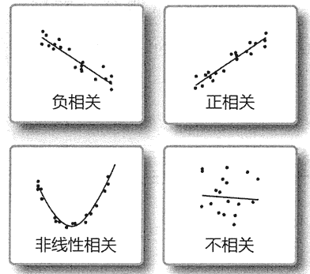
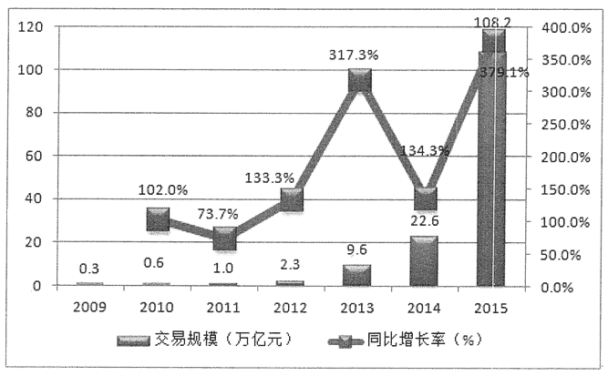
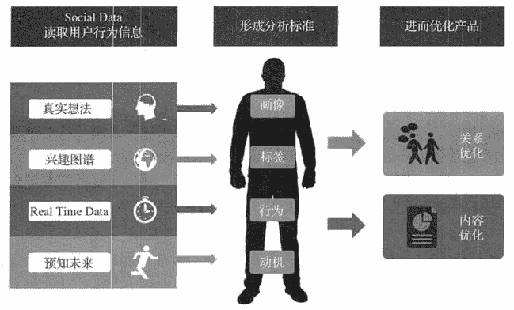
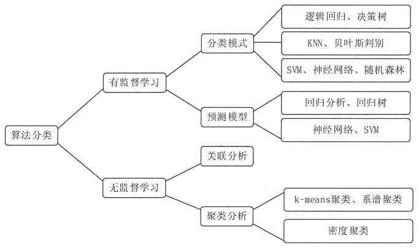

# 数据挖掘是什么？

> 原文：[`c.biancheng.net/view/3675.html`](http://c.biancheng.net/view/3675.html)

本节将对数据挖掘的基本概念进行介绍，包括数据挖掘的定义、数据挖掘的价值类型和数据挖掘算法的类型等。

## 什么是数据挖掘

数据挖掘是从大量的、不完全的、有噪声的、模糊的、随机的实际数据中，提取出蕴涵在其中的，人们事先不知道的，但是具有潜在有用性的信息和知识的过程。

用来进行数据挖掘的数据源必须是真实的和大量的，并且可能不完整和包括一些干扰数据项。发现的信息和知识必须是用户感兴趣和有用的。一般来讲，数据挖掘的结果并不要求是完全准确的知识，而是发现一种大的趋势。

数据挖掘可简单地理解为通过对大量数据的操作，发现有用的知识的过程。它是一门涉及面很广的交叉学科，包括机器学习、数理统计、神经网络、数据库、模式识别、粗糙集、模糊数学等相关技术。

就具体应用而言，数据挖掘是一个利用各种分析工具在海量数据中发现模型和数据间关系的过程，这些模型和关系可以用来做预测。

数据挖掘的知识发现，不是要去发现放之四海而皆淮的真理，也不是要去发现崭新的自然科学定理和纯数学公式，更不是什么机器定理证明。实际上，所有发现的知识都是相对的，是有特定前提和约束条件，面向特定领域的，同时还要能够易于被用户理解，最好能用自然语言表达所发现的结果。

数据挖掘其实是一类深层次的数据分析方法。数据分析本身已经有很多年的历史，只不过在过去，数据收集和分析的目的是用于科学研究。另外，由于当时计算能力的限制，对大数据量进行分析的复杂数据分析方法受到了很大限制。

现在，由于各行业业务自动化的实现，商业领域产生了大量的业务数据，这些数据不再是为了分析的目的而收集的，而是由于纯机会的商业运作而产生的。

分析这些数据也不再是单纯为了研究的需要，更主要是为商业决策提供真正有价值的信息，进而获得利润。但所有企业面临的一个共同问题是，企业数据量非常大，而其中真正有价值的信息却很少，对大量的数据进行深层分析，进而获得有利于商业运作、提高竞 争力的信息，就像从矿石中淘金一样，数据挖掘也因此而得名。

## 数据挖掘的价值类型

数据挖掘就是在海量的数据中找到有价值的数据，为企业经营决策提供依据。价值通常包括相关性、趋势和特征。

#### 1）相关性

相关性分析是指对两个或多个具备相关性的变量元素进行分析，从而衡量两个变量因素的相关密切程度。

元素之间需要存在一定的联系或者概率才可以进行相关性分析。相关性不等于因果性，所涵盖的范围和领域几乎覆盖了我们所见到的各个方面。相关性分析用于确定数据之间的变化情况，即其中一个属性或几个属性的变化是否会对其他属性造成影响，影响有多大。图 1 就是几种常见的相关性的示例。
图 1  属性之间的相关性

#### 2）趋势

趋势分析是指将实际达到的结果，与不同时期财务报表中同类指标的历史数据进行比较，从而确定财务状况、经营成果和现金流量的变化趋势和变化规律的一种分析方法。可以通过折线图预测数据的走向和趋势，也可以通过环比、同比的方式对比较的结果进行说明，如图 2 所示。
图 2  发展趋势

#### 3）特征

特征分析是指根据具体分析的内容寻找主要对象的特征。例如，互联网类数据挖掘就是找出用户的各方面特征来对用户进行画像，并根据不同的用户给用户群打相应的标签。如图 3 所示。
图 3  用户特征画像

## 数据挖掘算法的类型

在大数据挖掘中，我们的目标是如何用有一个（或多个）简单而有效的算法或算法的组合来提取有价值的信息，而不是去追求算法模型的完美。

常用的数据挖掘算法一般分为两大类：有监督的学习和无监督的学习，如图 4 所示。

图 4  常用数据控掘算法的类型
有监督的学习是基于归纳的学习，是通过对大量已知分类或输出结果的数据进行训练，建立分类或预测模型，用来分类未知实例或预测输出结果的未来值。

无监督学习方法是在学习训练之前，对没有预定义好分类的实例按照某种相似性度量方法，计算实例之间的相似程度，并将最为相似的实例聚类在一组，解释每组的含义，从中发现聚类的意义。