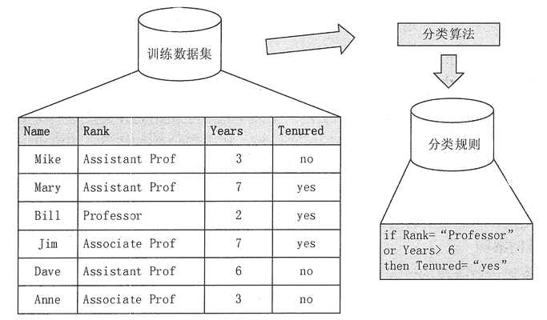
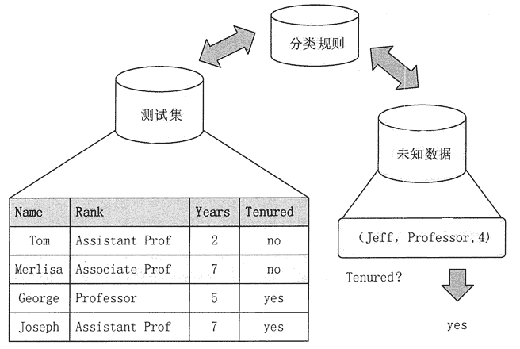

# 数据挖掘之分类和预测简介

> 原文：[`c.biancheng.net/view/3678.html`](http://c.biancheng.net/view/3678.html)

分类和预测是两种使用数据进行预测的方式，可用来确定未来的结果。

分类是用于预测数据对象的离散类别的，需要预测的属性值是离散的、无序的。

预测则是用于预测数据对象的连续取值的，需要预测的属性值是连续的、有序的。

例如，在银行业务中，根据贷款申请者的信息来判断贷款者是属于“安全”类还是“风险”类，这是数据挖掘中的分类任务。而分析给贷款人的贷款量就是数据挖掘中的预测任务。

本节将对常用的分类与预测方法进行介绍，其中有些算法是只能用来进行分类或者预测的，但是有些算法是既可以用来进行分类，又可以进行预测的。

## 分类的基本概念

分类算法反映的是如何找出同类事物的共同性质的特征型知识和不同事物之间的差异性特征知识。分类是通过有指导的学习训练建立分类模型，并使用模型对未知分类的实例进行分类。分类输出属性是离散的、无序的。

分类技术在很多领域都有应用。当前，市场营销的很重要的一个特点就是强调客户细分。采用数据挖掘中的分类技术，可以将客户分成不同的类别。

例如，可以通过客户分类构造一个分类模型来对银行贷款进行风险评估；设计呼叫中心时可以把客户分为呼叫频繁的客户、偶然大量呼叫的客户、稳定呼叫的客户、其他、来帮助呼叫中心寻找出这些不同种类客户之间的特征，这样的分类模型可以让用户了解不同行为类别客户的分布特征。

其他分类应用还有文献检索和搜索引擎中的自动文本分类技术，安全领域的基于分类技术的入侵检测等。

分类就是通过对已有数据集（训练集）的学习，得到一个目标函数 f（模型），来把每个属性集 X 映射到目标属性 y（类）上（y 必须是离散的)。

分类过程是一个两步的过程：第一步是模型建立阶段，或者称为训练阶段，第二步是评估阶段。

#### 1）训练阶段

训练阶段的目的是描述预先定义的数据类或概念集的分类模型。该阶段需要从已知的数据集中选取一部分数据作为建立模型的训练集，而把剩余的部分作为检验集。通常会从已知数据集中选取 2/3 的数据项作为训练集，1/3 的数据项作为检验集。

训练数据集由一组数据元组构成，假定每个数据元组都已经属于一个事先指定的类别。训练阶段可以看成为学习一个映射函数的过程，对于一个给定元组 x， 可以通过该映射函数预测其类别标记。该映射函数就是通过训练数据集，所得到的模型（或者称为分类器），如图 1 所示。该模型可以表示为分类规则、决策树或数学公式等形式。
图 1  分类算法的训练阶段

#### 2）评估阶段

在评估阶段，需要使用第一阶段建立的模型对检验集数据元组进行分类，从而评估分类模型的预测准确率，如图 2 所示。

分类器的准确率是分类器在给定测试数据集上正确分类的检验元组所占的百分比。如果认为分类器的准确率是可以接受的，则使用该分类器对类别标记未知的数据元组进行分类。
图 2  分类算法的评估阶段

## 预测的基本概念

预测模型与分类模型类似，可以看作一个映射或者函数 y=f(x)，其中，x 是输入元组，输出 y 是连续的或有序的值。与分类算法不同的是，预测算法所需要预测的属性值是连续的、有序的，分类所需要预测的属性值是离散的、无序的。

数据挖掘的预测算法与分类算法一样，也是一个两步的过程。测试数据集与训练数据集在预测任务中也应该是独立的。预测的准确率是通过 y 的预测值与实际已知值的差来评估的。

预测与分类的区别是，分类是用来预测数据对象的类标记，而预测则是估计某些空缺或未知值。例如，预测明天上证指数的收盘价格是上涨还是下跌是分类，但是，如果要预测明天上证指数的收盘价格是多少就是预测。