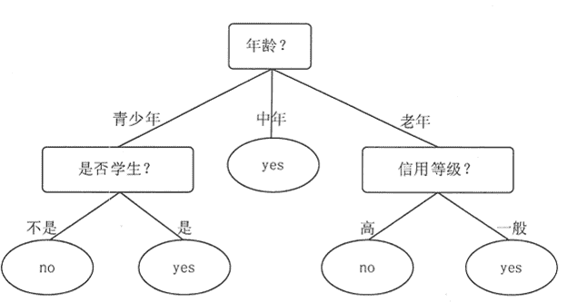

# 决策树和朴素贝叶斯算法简介

> 原文：[`c.biancheng.net/view/3688.html`](http://c.biancheng.net/view/3688.html)

本节主要介绍数据挖掘中常见的分类方法决策树和朴素贝叶斯算法。

## 决策树算法

决策树（Decision Tree，DT）分类法是一个简单且广泛使用的分类技术。

决策树是一个树状预测模型，它是由结点和有向边组成的层次结构。树中包含 3 种结点：根结点、内部结点和叶子结点。决策树只有一个根结点，是全体训练数据的集合。

树中的一个内部结点表示一个特征属性上的测试，对应的分支表示这个特征属性在某个值域上的输出。一个叶子结点存放一个类别，也就是说，带有分类标签的数据集合即为实例所属的分类。

#### 1\. 决策树案例

使用决策树进行决策的过程就是，从根结点开始，测试待分类项中相应的特征属性，并按照其值选择输出分支，直到到达叶子结点，将叶子结点存放的类别作为决策结果。

图 1 是一个预测一个人是否会购买电脑的决策树。利用这棵树，可以对新记录进行分类。从根结点（年龄）开始，如果某个人的年龄为中年，就直接判断这个人会买电脑，如果是青少年，则需要进一步判断是否是学生，如果是老年，则需要进一步判断其信用等级。
图 1  预测是否购买电脑的决策树
假设客户甲具备以下 4 个属性：年龄 20、低收入、是学生、信用一般。通过决策树的根结点判断年龄，判断结果为客户甲是青少年，符合左边分支，再判断客户甲是否是学生，判断结果为用户甲是学生，符合右边分支，最终用户甲落在“yes”的叶子结点上。所以预测客户甲会购买电脑。

#### 2\. 决策树的建立

决策树算法有很多，如 ID3、C4.5、CART 等。这些算法均采用自上而下的贪婪算法建立决策树，每个内部结点都选择分类效果最好的属性来分裂结点，可以分成两个或者更多的子结点，继续此过程直到这棵决策树能够将全部的训练数据准确地进行分类，或所有属性都被用到为止。

**1）特征选择**

按照贪婪算法建立决策树时，首先需要进行特征选择，也就是使用哪个属性作为判断结点。选择一个合适的特征作为判断结点，可以加快分类的速度，减少决策树的深度。

特征选择的目标就是使得分类后的数据集比较纯。如何衡量一个数据集的纯度？这里就需要引入数据纯度概念——信息增益。

信息是个很抽象的概念。人们常常说信息很多，或者信息较少，但却很难说清楚信息到底有多少。

1948 年，信息论之父 Shannon 提出了“信息熵”的概念，才解决了对信息的量化度量问题。通俗来讲，可以把信息熵理解成某种特定信息的出现概率。信息嫡表示的是信息的不确定度，当各种特定信息出现的概率均匀分布时，不确定度最大，此时嫡就最大。反之，当其中的某个特定信息出现的概率远远大于其他特定信息的时候，不确定度最小，此时熵就很小。

所以，在建立决策树的时候，希望选择的特征能够使分类后的数据集的信息熵尽可能变小，也就是不确定性尽量变小。当选择某个特征对数据集进行分类时，分类后的数据集的信息嫡会比分类前的小，其差值表示为信息增益。信息增益可以衡量某个特征对分类结果的影响大小。

ID3 算法使用信息增益作为属性选择度量方法，也就是说，针对每个可以用来作为树结点的特征，计算如果采用该特征作为树结点的信息增益。然后选择信息增益最大的那个特征作为下一个树结点。

**2）剪枝**

在分类模型建立的过程中，很容易出现过拟合的现象。过拟合是指在模型学习训练中，训练样本达到非常高的逼近精度，但对检验样本的逼近误差随着训练次数呈现出先下降后上升的现象。过拟合时训练误差很小，但是检验误差很大，不利于实际应用。

决策树的过拟合现象可以通过剪枝进行一定的修复。剪枝分为预先剪枝和后剪枝两种。

预先剪枝是指，在决策树生长过程中，使用一定条件加以限制，使得在产生完全拟合的决策树之前就停止生长。

预先剪枝的判断方法也有很多，例如，信息增益小于一定阈值的时候通过剪枝使决策树停止生长。但如何确定一个合适的阈值也需要一定的依据，阈值太高会导致模型拟合不足，阈值太低又导致模型过拟合。

后剪枝是指，在决策树生长完成之后，按照自底向上的方式修剪决策树。后剪枝有两种方式，一种是用新的叶子结点替换子树，该结点的预测类由子树数据集中的多数类决定，另一种是用子树中最常使用的分支代替子树。

预先剪枝可能会过早地终止决策树的生长，而后剪枝一般能够产生更好的效果。但后剪枝在子树被剪掉后，决策树生长过程中的一部分计算就被浪费了。

#### 3\. Spark MLlib 决策树算法

Spark MLlib 支持连续型和离散型的特征变量，也就是既支持预测也支持分类。

在 Spark MLlib 中、建立决策树时是按照信息增益选择划分特征的，它采用前向剪枝的方法来防止过拟合，当任意一个以下情况发生时，Spark MLlib 的决策树结点就终止划分，形成叶子结点。

*   树高度达到指定的最大高度 maxDepth。
*   当前结点的所有属性分裂带来的信息増益都小于指定的阈值 minInstancesPerNode。
*   结点分割出的子结点的最少样本数量小于阈值 minInstancesPerNode。

Spark MLlib 的决策树算法是由 DecisionTree 类实现的，该类支持二元或多标签分类，并且还支持预测。用户通过配置参数 Strategy 来说明是进行分类，还是进行预测，以及使用什么方法进行分类。

#### 1）Spark MLlib 的 DecisionTree 的训练函数

DecisionTree 调用 trainClassifier 方法进行分类训练，参数如下所示。

def trainClassifier(
    input: RDD[LabeledPoint],
    numClasses: Int,
    categoricalFeaturesInfo: Map[Int,Int], impurity: String,
    maxDepth:Int,
    maxBins:Int): DecisionTreeModel

该训练函数将返回一个决策树模型，函数各个参数的含义如下。

| 名称 | 说明 |
| --- | --- |
| Input | 表示输入数据集，每个 RDD 元素代表一个数据点，每个数据点都包含标签和数据特征，对分类来讲，标签的值是 {0,1,...,numClasses-1}。 |
| numClasses | 表示分类的数量，默认值是 2。 |
| categoricalFeaturesInfo | 存储离散性属性的映射关系，例如，（5→4)表示数据点的第 5 个特征是离散性属性，有 4 个类别，取值为{0,1,2,3}。 |
| impurity | 表示信息纯度的计算方法，包括 Gini 参数或信息熵。 |
| maxDepth | 表示树的最大深度。 |
| maxBins | 表示每个结点的分支的最大值。 |

#### **2）Spark MLlib 的 DecisionTree 的预测函数**

DecisionTreeModel.predict 方法可以接收不同格式的数据输入参数，包括向量、RDD，返回的是计算出来的预测值。该方法的 API 如下。

def predict(features:Vector):Double
def predict(features: RDD[Vector]): RDD[Double]

其中，第一种预测方法是接收一个数据点，输入参数是一个描述输入数据点的特征向量，返回的是输入数据点的预测值。第二种预测方法可以接收一组数据点，输入参数是一个 RDD，RDD 中的每一个元素都是描述一个数据点的特征向量，该方法对每个数据点的预测值以 RDD 的方式返回。

#### 4\. Spark MLlib 决策树算法实例

实例：导入训练数据集，使用 ID3 决策树建立分类模型，采用信息增益作为选择分裂特征的纯度参数，最后使用构造好的决策树，对两个数据样本进行分类预测。

该实例使用的数据存放在 dt.data 文档中，提供了 6 个点的特征数据和与其对应的标签，数据如下所示。

1 1:1 2:0 3:0 4:1
0 1:1 2:0 3:1 4:1
0 1:0 2:1 3:0 4:0
1 1:1 2:1 3:0 4:0
1 1:1 2:0 3:0 4:0
1 1:1 2:1 3:0 4:0

数据文件的每一行是一个数据样本，其中，第 1 列为其标签，后面 4 列为数据样本的 4 个特征值，格式为（key: value）。

实现的代码如下所示。

```

import org.apache.spark.mllib.tree.DecisionTree
import org.apache.spark.mllib.util.MLUtils
import org.apache.spark.{SparkConf, SparkContext}

object DecisionTreeByEntropy {
    def main(args: Array[String]) {
    val conf = new SparkConf().setMaster("local[4]").setAppName ( "DecisionTreeByEntropy")
    val sc = new SparkContext (conf)

    //上载和分解数据
    val data = MLUtils.loadLibSVMFile (sc, ("/home/hadoop/exercise/dt.data"))
    val numClasses = 2 //设定分类数量
    val categoricalFeaturesInfo = Map[Int,Int]() //设定输入格式
    val impurity = "entropy" //设定信息增益的计算方式 val maxDepth = 5 //设定树的最大高度
    val maxBins = 3 //设定分裂数据集如最大个数

    //建立模型并打印结果
    val model = DecisionTree.trainClassifier(data,numClasses,categoricalFeaturesInfo,impurity,maxDepth,maxBins)
    printIn ("model.depth:"+ model.depth)
    printIn ("model.numNodes:" + model.numNodes) printIn ("model.topNode:" + model.topNode)

    //从数据集中抽取两个数据样本进行预测并打印结果
    val labelAndPreds = data.take(2).map { point =>
        val prediction = model.predict(point.features)
        (point.label, prediction)
    }
    labelAndPreds.foreach(printIn)
    sc.stop
    }
}
```

运行以上代码将输出构建的决策分类树的信息，包括树的高度、结点数和树的根结点的详细信息，以及两个样本的实际值和预测值。具体信息如下。

model.depth:2
model.numNodes:5
model.topNode:id = 1, isLeaf = false, predict = 1.0 (prob = 0.6666666666666666),
impurity = 0.9182958340544896, split = Some(Feature = 0, threshold = 0.0, featureType = Continuous, categories = List())r
stats = Some(gain = 0.31668908831502096, impurity = 0.9182958340544896,
left impurity = 0.0, right impurity = 0.7219280948873623)
(1.0,1.0)
(0.0,0.0)

#### 5\. 算法优缺点

决策树是非常流行的分类算法。一般情况下，不需要任何领域知识或参数设置，它就可以处理高维数据。它对知识的表示是直观的，并且具有描述性，非常容易理解，有助于人工分析。用决策树进行学习和分类的步骤非常简单，效率高。决策树只需要一次构建，就可以反复使用，但每一次预测的最大计算次数不能超过决策树的深度。

一般来讲，决策树具有较好的分类准确率，但是决策树的成功应用可能依赖于所拥有的建模数据。

## 朴素贝叶斯算法

朴素贝叶斯（Nawe Bayes）算法是一种十分简单的分类算法。它的基础思想是，对于给出的待分类项，求解在此项出现的条件下各个类别出现的概率，哪个最大，就认为此待分类项属 于哪个类别。

#### 1\. 贝叶斯公式

朴素贝叶斯分类算法的核心是贝叶斯公式，即 P(B|A)=P(A|B)P(B)/P(A)。换个表达形式 会更清晰一些，P(类别|特征)=P(特征|类别)P(类别)/P(特征)。

如果 X 是一个待分类的数据元组，由 n 个属性描述，H 是一个假设，如 X 属于类 C， 则分类问题中，计算概率 P(H|X)的含义是，已知元组 X 的每个元素对应的属性值，求出；V 属于 C 类的概率。

例如，X 的属性值为 age=25, income=$5 000, H 对应的假设是，X 会买电脑。

*   P(H|X)：表示在已知某客户信息 age=25，income=$5 000 的条件下，该客户会买电脑的概率。
*   P(H)：表示对于任何给定的客户信息，该客户会购买电脑的概率。
*   P(X|H)：表示已知客户会买电脑，那么该客户的属性值为 age=25, income=$5 000 的概率。
*   P(X)：表示在所有的客户信息集合中，客户的属性值为 age=25, income=$5 000 的概率。

#### 2\. 工作原理

**1）**设 D 为样本训练集，每一个样本 X 都是由 n 个属性值组成的，即 X=(x1,x2,...,xn))，对应的属性集为 A1,A2,A3,…,An。

**2）**假设有 m 个类标签，即 C1,C2,…,Cm。对于某待分类元素 X，朴素分类器会把 P(C1|X) (i=1,2,…,m)值最大的类标签 C1 作为的类别。因此目标就是找出 P(C1|X) 中的最大值 (P(C1|X)=P(X|C1)P(C1)|P(X)

**3）**如果 n 的值特别大，也就是说样本元组有很多属性，那么对于 P(X|C1) 的计算会相当复杂。所以朴素贝叶斯算法做了一个假设，即对于样本元组中的每个属性，由于它们都互相条件独立，因此有 P(X|C1)=P(X1|C1)P(X2|C1)...(Xn|C1)。由于可以从训练集中计算出来，所以训练样本空间中，属于类 C1 并且对应属性 A1 的概率等于 x1 的数目除以样本空间中属于类 C1 的样本数目。

**4）**为了预测 X 所属的类标签，可以根据前面的步骤算出每一个类标签 C1 对应的 P(X|C1)P(C1) 值，当某一个类标签 C1，对于任意 j(1≤j≤m,j≠i)，都有 P(X|C1)P(1)>P(X|C1)P(C1) 时，则认为 X 属于类标签 C1。

#### 3\. Spark MLlib 朴素贝叶斯算法

Spark MLlib 的朴素贝叶斯算法主要是计算每个类别的先验概率，各类别下各个特征属性的条件概率的，其分布式实现方法是对样本进行聚合操作，统计所有标签出现的次数、对应特征之和。

聚合操作后，可以通过聚合结果计算先验概率、条件概率，得到朴素贝叶斯分类模型。预测时，根据模型的先验概率、条件概率，计算每个样本属于每个类别的概率，最后取最大项作为样本的类别。

Spark MLlib 支持 Multinomial Naive Bayes 和 Bernoulli Naive Bayes。Multinomial Naive Bayes 主要用于文本的主题分类，分析时会考虑单词出现的次数，即词频，而 Binarzied Multinomial Naive Bayes 不考虑词频，只考虑这个单词有没有出现，主要用于文本情绪分析。可以通过参数指定算法使用哪个模型。

Spark MLlib 的 Native Bayes 调用 train 方法进行分类训练，其参数如下所示。

def train(
    input:RDD[LabeledPoint],
    lambda:double,
    modelType:String):NativeBayesModel

该训练函数将返回一个朴素贝叶斯模型，函数各个参数的含义如下。

*   input 表示输入数据集，每个 RDD 元素代表一个数据点，每个数据点包含标签和数据特征，对分类来讲，标签的值是 {0,1,...,numClasses-1}。
*   lambda 是一个加法平滑参数，默认值是 1.0。
*   modelType 用于指定是使用 Multinomial Native Bayes 还是 Bernoulli Native Bayes 算法模型，默认是 Multinomial Naive Bayes。

Spark MLlib 的 Native Bayes 的预测函数 NativeBayesModel.predict 方法与 DecisionTree 的预测函数一样，可以接收不同的数据输入参数，包向量、RDD，返回的是计算出来的预测值。

#### 4\. Spark MLlib 朴素贝叶斯算法实例

以表 1 的购买电脑样本数据作为训练数据集，使用 Multinomial Native Bayes 建立分类模型，然后使用构造好的分类模型，对一个数据样本进行分类预测。

**表 1 购买电脑样本数据**

| age | income | student | credit_rating | buys_computer |
| --- | --- | --- | --- | --- |
| ≤30 | high | no | fair | no |
| ≤30 | high | no | excellent | no |
| 31~40 | high | no | fair | yes |
| >40 | medium | no | fair | yes |
| >40 | low | yes | fair | yes |
| >40 | low | yes | excellent | no |
| 31~40 | low | yes | excellent | yes |
| ≤30 | medium | no | fair | no |
| ≤30 | low | yes | fair | yes |
| >40 | medium | yes | fair | yes |
| ≤30 | medium | yes | excellent | yes |
| 31~40 | medium | no | excellent | yes |
| 31~40 | high | yes | fair | yes |
| >40 | medium | no | excellent | no |

该实例使用的数据存放在 sample_computer.data 文档中，数据文件的每一行是一个数据样本，其中，第 1 列为其标签，后面 4 列为数据样本的 4 个特征值。标签与特征值以“，”分割，特征值之间用空格分隔，如下所示。

buys_computer,age income student credit_rating

其中，buys_computer 的取值为，no 为 0，yes 为 1；age 的取值为，≤30 为 0，31~40 为 1，>40 为 2；income 的取值为，low 为 0，medium 为 1，high 为 2；student 的取值为，no 为 0，yes 为 1，credit_rating 的取值为，fair 为 0，excellent 为 1。

对应于表 1 的数据的前 3 行数据如下。

实现的代码如下所示：

```

import org.apache.spark.mllib.classification.{NaiveBayes,NaiveBayesModel}
import org.apache.spark.mllib.linalg.Vectors
import org.apache.spark.mllib.regression.LabeledPoint
import org.apache.spark.{SparkContext,SparkConf}

object NaiveBayes {
    def main (args : Array[String]) : Unit = {
        val conf = new SparkConf().setMaster("local").setAppName("NaiveBayes")
        val sc = new SparkContext(conf)
        val path ="../data/sample_computer.data"
        val data = sc.textFile(path)
        val parsedData = data.map {
            line =>
                val parts = line.split(','))
                LabeledPoint (parts(0).toDouble,Vectors.dense (parts(1).split('').map(_.toDouble)))
        }
        //样本划分 train 和 test 数据样本 60% 用于 train
        val splits = parsedData.randomSplit(Array(0.6,0.4),seed = 11L)
        val training = splits(0)
        val test = splits(1)
        //获得训练模型，第一个参数为数据，第二个参数为平滑参数，默认为 1
        val model = NaiveBayes.train(training,lambda = 1.0)
        //对测试样本进行测试
        val predictionAndLabel = test.map(p => (model.predict(p.features),p.label))
        //对模型进行准确度分析
        val accuracy = 1.0 *predictionAndLabel.filter (x => x._1 == x._2).count()/test.count.()
        //打印一个预测值
        printIn ("NaiveBayes 精度------>" + accuracy)
        printIn ("假如 age<=30, income=medium, student=yes,credit_rating=fair,是否购买电脑：" + model.predict(Vectors.dense(0.0,2.0,0.0,1.0)))
        //保存 model
        val ModelPath = "../model/NativeBayes_model.obj"
        model.save(sc.ModelPath)
    }
}

```

#### 5\. 算法优缺点

朴素贝叶斯算法的主要优点就是算法逻辑简单，易于实现；同时，分类过程的时空开销小，只会涉及二维存储。

理论上，朴素贝叶斯算法与其他分类方法相比，具有最小的误差率。但是实际上并非总是如此，这是因为朴素贝叶斯模型假设属性之间相互独立，这个假设在实际应用中往往是不成立的，在属性个数比较多或者属性之间相关性较大时，分类效果不好，而在属性相关性较小时，朴素贝叶斯算法的性能最为良好。