# 回归分析预测技术简介

> 原文：[`c.biancheng.net/view/3687.html`](http://c.biancheng.net/view/3687.html)

回归分析的基本概念是用一群变量预测另一个变量的方法。通俗点来讲，就是根据几件事情的相关程度来预测另一件事情发生的概率。回归分析的目的是找到一个联系输入变量和输出变量的最优模型。

回归方法有许多种，可通过 3 种方法进行分类：自变量的个数、因变量的类型和回归线的形状。

**1）**依据相关关系中自变量的个数不同进行分类，回归方法可分为一元回归分析法和多元回归分析法。在一元回归分析法中，自变量只有一个，而在多元回归分析法中，自变量有两个以上。

**2）**按照因变量的类型，回归方法可分为线性回归分析法和非线性回归分析法。

**3）**按照回归线的形状分类时，如果在回归分析中，只包括一个自变量和一个因变量，且二者的关系可用一条直线近似表示，则这种回归分析称为一元线性回归分析；如果回归分析中包括两个或两个以上的自变量，且因变量和自变量之间是非线性关系，则称为多元非线性回归分析。

#### 1\. 线性回归

线性回归是世界上最知名的建模方法之一。在线性回归中，数据使用线性预测函数来建模，并且未知的模型参数也是通过数据来估计的。这些模型被叫作线性模型。在线性模型中，因变量是连续型的，自变量可以是连续型或离散型的，回归线是线性的。

#### 1）一元线性回归

回归分析的目的是找到一个联系输入变量和输出变量的最优模型。更确切地讲，回归分析是确定变量 Y 与一个或多个变量 X 之间的相互关系的过程。

Y 通常叫作响应输出或因变量，X 叫作输入、回归量、解释变量或自变量。线性回归最适合用直线（回归线）去建立因变量 Y 和一个或多个自变量 X 之间的关系，如图 1 所示。可以用以下公式来表示。

Y = a+b x X+e

其中，a 为截距，b 为回归线的斜率，e 是误差项。

要找到回归线，就是要确定回归系数 a 和 b。假定变量 y 的方差是一个常量，可以用最小二乘法来计算这些系数，使实际数据点和估计回归直线之间的误差最小，只有把误差做到最小时得出的参数，才是我们最需要的参数。这些残差平方和常常被称为回归直线的误差平方和，用 SSE 来表示，如下。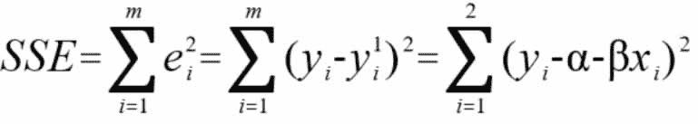
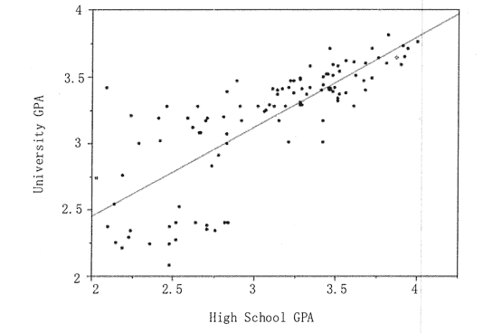
图 1  一元线性回归
如图 2 所示，回归直线的误差平方和就是所有样本中的   值与回归线上的点中的  的差的平方的总和。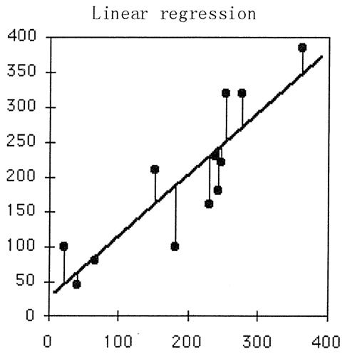
图 2  回归直线的误差平方和示意

#### 2）多元线性回归

多元线性回归是单元线性回归的扩展，涉及多个预测变量。响应变量 Y 的建模为几个预测变量的线性函数，可通过一个属性的线性组合来进行预测，其基本的形式如下。

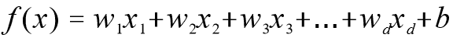

线性回归模型的解释性很强，模型的权值向量十分直观地表达了样本中每一个属性在预测中的重要度。例如，要预测今天是否会下雨，并且已经基于历史数据学习到了模型中的权重向量和截距么则可以综合考虑各个属性来判断今天是否会下雨。

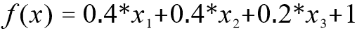

其中，X1 表示风力，X2 表示湿度，X3 表示空气质量。

在训练模型时，要让预测值尽量逼近真实值，做到误差最小，而均方误差就是表达这种误差的一种方法，所以求解多元线性回归模型，就求解使均方误差最小化时对应的参数。

#### 3）线性回归的优缺点

线性回归是回归任务最常用的算法之一。它的最简单的形式是用一个连续的超平面来拟合数据集，例如，当仅有两个变量时就用一条直线进行拟合。如果数据集内的变量存在线性关系，拟合程度就相当高。

线性回归的理解和解释都非常直观，还能通过正则化来避免过拟合。此外，线性回归模型很容易通过随机梯度下降法来更新数据模型。但是，线性回归在处理非线性关系时非常糟糕，在识别复杂的模式上也不够灵活，而添加正确的相互作用项或多项式又极为棘手且耗时。

#### 2\. Spark MLlib 的 SGD 线性回归算法

Spark MLlib 的 SGD 线性回归算法是由 LinearRegressionWithSGD 类实现的，该类是基于无正规化的随机梯度下降算法，使用由（标签，特征序列）组成的 RDD 来训练线性回归模型的。

每一对（标签，特征序列）描述一组特征/以及这些特征所对应的标签。算法按照指定的步长进行迭代，迭代的次数由参数说明，每次迭代时，用来计算下降梯度的样本数也是由参数给出的。

Spark MLlib 中的 SGD 线性回归算法的实现类 LinerRegressionWithSGD 具有以下变量。

class LinerRegressionWithRGD private (
    private var stepSize: Double,
    private var numIterations: Int,
    private var miniBatchFraction: Double
)

#### 1）Spark MLlib 的 LinerRegressionWithRGD 构造函数

使用默认值构造 SparkMLlib 的 LinerRegressionWithRGD 实例的接口如下。

{stepSize:1.0,numIterations:100,miniBatchFraction:1.0}。

参数的含义解释如下。

*   stepSize 表示每次迭代的步长。
*   numIterations 表示方法单次运行需要迭代的次数。
*   miniBatchFraction 表示计算下降梯度时所使用样本数的比例。

#### 2）Spark MLlib 的 LinerRegressionWithRGD 训练函数

Spark MLlib 的 LinerRegressionWithRGD 训练函数 LinerRegressionWithRGD.train 方法有很多重载方法，这里展示其中参数最全的一个来进行说明。LinerRegressionWithRGD.train 方法预览如下。

def train(
    input:RDD[LabeledPoint],
    numIterations:Int,
    stepSize:Double,
    miniBatchFraction:Double,
    initialWeights:Vector):LinearRegressionModel

参数 numIterations、stepSize 和 miniBatchFraction 的含义与构造函数相同，另外两个参数的含义如下。

*   input 表示训练数据的 RDD，每一个元素由一个特征向量和与其对应的标签组成。
*   initialWeights 表示一组初始权重，每个对应一个特征。

#### 3\. Spark MLlib 的 SGD 线性回归算法实例

该实例使用数据集进行模型训练，可通过建立一个简单的线性模型来预测标签的值，并且可通过计算均方差来评估预测值与实际值的吻合度。

本实例使用 LinearRegressionWithSGD 算法 建立预测模型的步骤如下。
**①** 装载数据。数据以文本文件的方式进行存放。
**②** 建立预测模型。设置迭代次数为 100，其他参数使用默认值，进行模型训练形成数据模型。
**③** 打印预测模型的系数。
**④** 使用训练样本评估模型，并计算训练错误值。

该实例使用的数据存放在 lrws_data.txt 文档中，提供了 67 个数据点，每个数据点为 1 行，每行由 1 个标签值和 8 个特征值组成，每行的数据格式如下。

标签值，特征 1 特征 2 特征 3 特征 4 特征 5 特征 6 特征 7 特征 8

其中，第一个值为标签值，用“,”与特征值分开，特征值之间用空格分隔。前 5 行的数据如下。

-0.4307829,-1.63735562648104 -2.00621178480549 -1.86242597251066 -1.02470580167082 -0.522940888712441 -0.863171185425945 -1.04215728919298 -0.8644665073373.06

-0.1625189,-1.98898046126935 -0.722008756122123 -0.787896192088153 -1.02470580167082 -0.522940888712441 -0.863171185425945 -1.04215728919298 -0.864466507337306

-0.1625189, -1.578 818 8754 8545, -2.1887840293994 1.36116336875686 -1.02470580167082 -0.522940888712441 -0.863171185425945 0.342627053981254 -0.155348103855541

-0.1625189,-2.16691708463163 -0.807993896938655 -0.787896192088153 -1.02470580167082 -0.522940888712441 -0.863171185425945 -1.04215728919298 -0.864466507337306

0.3715636,-0.507874475300631 -0.458834049396776 -0.250631301876899 -1.02470580167082 -0.522940888712441 -0.863171185425945 -1.04215728919298 -0.864466507337306

在本实例中，将数据的每一列视为一个特征指标，使用数据集建立预测模型。实现的代码如下。

```

import java.text.SimpleDateFormat
import java.util.Date
import org.apache.log4j.{Level,Logger}
import org.apache.spark.mllib.linalg.Vectors
import org.apache.spark.mllib.regression.{LinearRegressionWithSGD, LabeledPoint}
import org.apache.spark.{SparkContext, SparkConf}

/**
* 计算回归曲线的 MSE
* 对多组数据进行模型训练，然后再利用模型来预测具体的值 * 公式：f(x) =a1*x1+a2*x2+a3*x3+....
*/

object LinearRegression2 {

    //屏蔽不必要的曰志
    Logger.getLogger("org.apache.spark").setLevel(Level.WARN)
    Logger.getLogger("org.apache.eclipse.jetty.server").setLevel(Level.OFF)
    //程序入口
    val conf = new SparkConf().setAppName(LinearRegression2).setMaster("local[1]")
    val sc = new SparkContext(conf)
    def main(args:Array[String]) {
        //获取数据集路径
        val data = sc.textFile (("/home/hadoop/exercise/lpsa2.data",1)
        //处理数据集
        val parsedData = data.map{ line =>
            val parts = line.split (",")
            LabeledPoint (parts(0).toDouble,Vectors.dense(parts(1).split('').map(_.toDouble)))
        }
        //建立模型
        val numIterations = 100
        val model = LinearRegressionWithSGD.train(parsedData, numIterations,0.1)
        //获取真实值与预测值
        val valuesAndPreds = parsedData.map { point => 
            //对系数进行预测
            val prediction = model.predict(point.features)
            (point, label, prediction) //（实际值，预测值）
        }

        //打印权重
        var weights = model.weights
        printIn("model.weights" + weights)
        //存储到文档
        val isString = new SimpleDateFormat("yyyyMMddHHmmssSSS").format{new Date ())
        val path = "("/home/hadoop/exercise/" + isString + "/results")"
        ValuesAndPreds.saveAsTextFile(path)
        //计算均方误差
        val MSE = valuesAndPreds.map {case (v,p) => math.pow ((v - p),2)}.reduce(_ + _) / valuesAndPreds.count
        printIn ("训练的数据集的均方误差是" + MSE)
        sc. stop ()
    }
}
```

运行程序会打印回归公式的系数和训练的数据集的均方误差值。将每一个数据点的预测值，存放在结果文件中，数据项的格式为（实际值，预测值)。

#### 4\. 逻辑回归

逻辑回归是用来找到事件成功或事件失败的概率的。首先要明确一点，只有当目标变量是分类变量时，才会考虑使用逻辑回归方法，并且主要用于两种分类问题。

#### 1）逻辑回归举例

医生希望通过肿瘤的大小 X1、长度 X2、种类 X3 等特征来判断病人的肿瘤是恶性肿瘤还是良性肿瘤，这时目标变量 y 就是分类变量（0 表示良性肿瘤，1 表示恶性肿瘤)。线性回归是通过一些 x 与 y 之间的线性关系来进行预测的，但是此时由于 y 是分类变量，它的取值只能是 0、1，或者 0、1、2 等，而不能是负无穷到正无穷，所以引入了一个 sigmoid 函数，即  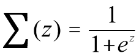 ，此时 x 的输入可以是负无穷到正无穷，输出 y 总是[0,1]，并且当 x=0 时，y 的值为 0.5,如图 3(a) 所示。

x=0 时，y=0.5，这是决策边界。当要确定肿瘤是良性还是恶性时，其实就是要找出能够分开这两类样本的边界，也就是决策边界，如图 3(b) 所示。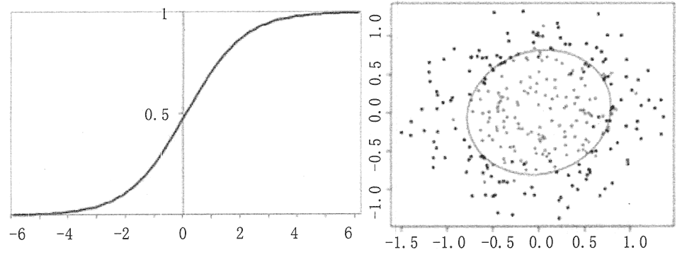
图 3  sigmoid 函数曲线图和决策边界示意

#### 2）逻辑回归函数

在分类情形下，经过学习之后的逻辑回归分类器其实就是一组权值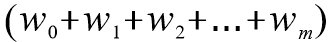。当测试样本集中的测试数据来到时，将这一组权值按照与测试数据线性加和的方式，求出一个 z 值，即 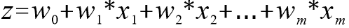，其中，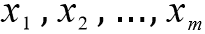 是样本数据的各个特征，维度为 m。之后按照 sigmoid 函数的形式求出 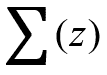，即 逻辑回归函数的意义如图 4 所示。

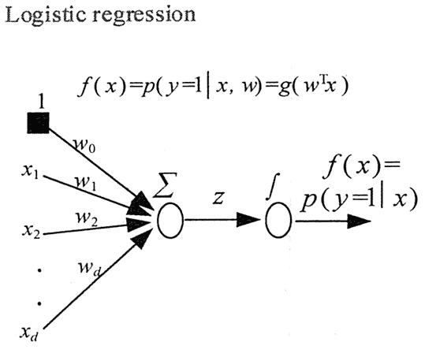
图 4  逻辑回归函数的意义示意
由于 sigmoid 函数的定义域是 (-inf,inf)，而值域为 (0,1)，因此最基本的逻辑回归分类器适合对二分目标进行分类。

方法是，利用 sigmoid 函数的特殊数学性质，将结果映射到 (0,1) 中，设定一个概率阈值（不一定非是 0.5)，大于这个阈值则分类为 1，小于则分类为 0。

求解逻辑回归模型参数的常用方法之一是，采用最大似然估计的对数形式构建函数，再利用梯度下降函数来进行求解。

#### 3）逻辑回归的优缺点

逻辑回归特别适合用于分类场景，尤其是因变量是二分类的场景，如垃圾邮件判断，是否患某种疾病，广告是否点击等。逻辑回归的优点是，模型比线性回归更简单，好理解，并且实现起来比较方便，特别是大规模线性分类时。

逻辑回归的缺点是需要大样本量，因为最大似然估计在低样本量的情况下不如最小二乘法有效。逻辑回归对模型中自变量的多重共线性较为敏感，需要对自变量进行相关性分析，剔除线性相关的变量，以防止过拟合和欠拟合。