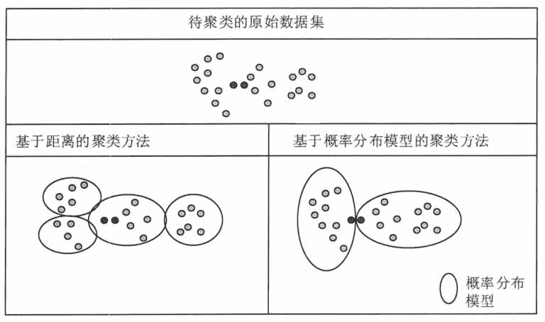

# 什么是聚类分析？聚类分析方法的类别

> 原文：[`c.biancheng.net/view/3693.html`](http://c.biancheng.net/view/3693.html)

聚类分析是指将数据对象的集合分组为由类似的对象组成的多个类的分析过程。

## 基本概念

聚类（Clustering）就是一种寻找数据之间内在结构的技术。聚类把全体数据实例组织成一些相似组，而这些相似组被称作簇。处于相同簇中的数据实例彼此相同，处于不同簇中的实例彼此不同。

聚类技术通常又被称为无监督学习，与监督学习不同的是，在簇中那些表示数据类别的分类或者分组信息是没有的。

数据之间的相似性是通过定义一个距离或者相似性系数来判别的。图 1 显示了一个按照数据对象之间的距离进行聚类的示例，距离相近的数据对象被划分为一个簇。
图 1  聚类分析示意
聚类分析可以应用在数据预处理过程中，对于复杂结构的多维数据可以通过聚类分析的方法对数据进行聚集，使复杂结构数据标准化。

聚类分析还可以用来发现数据项之间的依赖关系，从而去除或合并有密切依赖关系的数据项。聚类分析也可以为某些数据挖掘方法（如关联规则、粗糙集方法），提供预处理功能。

在商业上，聚类分析是细分市场的有效工具，被用来发现不同的客户群，并且它通过对不同的客户群的特征的刻画，被用于研究消费者行为，寻找新的潜在市场。

在生物上，聚类分析被用来对动植物和基因进行分类，以获取对种群固有结构的认识。

在保险行业上，聚类分析可以通过平均消费来鉴定汽车保险单持有者的分组，同时可以根据住宅类型、价值、地理位置来鉴定城市的房产分组。

在互联网应用上，聚类分析被用来在网上进行文档归类。

在电子商务上，聚类分析通过分组聚类出具有相似浏览行为的客户，并分析客户的共同特征，从而帮助电子商务企业了解自己的客户，向客户提供更合适的服务。

## 聚类分析方法的类别

目前存在大量的聚类算法，算法的选择取决于数据的类型、聚类的目的和具体应用。聚类算法主要分为 5 大类：基于划分的聚类方法、基于层次的聚类方法、基于密度的聚类方法、基于网格的聚类方法和基于模型的聚类方法。

#### 1\. 基于划分的聚类方法

基于划分的聚类方法是一种自顶向下的方法，对于给定的 n 个数据对象的数据集 D，将数据对象组织成 k(k≤n) 个分区，其中，每个分区代表一个簇。图 2 就是基于划分的聚类方法的示意图。
图 2  层次聚类算法示意
基于划分的聚类方法中，最经典的就是 k-平均（k-means）算法和 k-中心（k-medoids）算法，很多算法都是由这两个算法改进而来的。

基于划分的聚类方法的优点是，收敛速度快，缺点是，它要求类别数目 k 可以合理地估计，并且初始中心的选择和噪声会对聚类结果产生很大影响。

#### 2\. 基于层次的聚类方法

基于层次的聚类方法是指对给定的数据进行层次分解，直到满足某种条件为止。该算法根据层次分解的顺序分为自底向上法和自顶向下法，即凝聚式层次聚类算法和分裂式层次聚类算法。

#### 1）自底向上法。

首先，每个数据对象都是一个簇，计算数据对象之间的距离，每次将距离最近的点合并到同一个簇。然后，计算簇与簇之间的距离，将距离最近的簇合并为一个大簇。不停地合并，直到合成了一个簇，或者达到某个终止条件为止。

簇与簇的距离的计算方法有最短距离法、中间距离法、类平均法等，其中，最短距离法是将簇与簇的距离定义为簇与簇之间数据对象的最短距离。自底向上法的代表算法是 AGNES(AGglomerativeNESing)算法。

#### 2）自顶向下法。

该方法在一开始所有个体都属于一个簇，然后逐渐细分为更小的簇，直到最终每个数据对象都在不同的簇中，或者达到某个终止条件为止。自顶向下法的代表算法是 DIANA（DivisiveANAlysis）算法。

基于层次的聚类算法的主要优点包括，距离和规则的相似度容易定义，限制少，不需要预先制定簇的个数，可以发现簇的层次关系。基于层次的聚类算法的主要缺点包括，计算复杂度太高，奇异值也能产生很大影响，算法很可能聚类成链状。

#### 3\. 基于密度的聚类方法

基于密度的聚类方法的主要目标是寻找被低密度区域分离的高密度区域。与基于距离的聚类算法不同的是，基于距离的聚类算法的聚类结果是球状的簇，而基于密度的聚类算法可以发现任意形状的簇。

基于密度的聚类方法是从数据对象分布区域的密度着手的。如果给定类中的数据对象在给定的范围区域中，则数据对象的密度超过某一阈值就继续聚类。

这种方法通过连接密度较大的区域，能够形成不同形状的簇，而且可以消除孤立点和噪声对聚类质量的影响，以及发现任意形状的簇，如图 3 所示。

基于密度的聚类方法中最具代表性的是 DBSAN 算法、OPTICS 算法和 DENCLUE 算法。 图 2 是基于层次的聚类算法的示意图，上方是显示的是 AGNES 算法的步骤，下方是 DIANA 算法的步骤。这两种方法没有优劣之分，只是在实际应用的时候要根据数据特点及想要的簇的个数，来考虑是自底而上更快还是自顶而下更快。
图 3  密度聚类算法示意

#### 4\. 基于网格的聚类方法

基于网格的聚类方法将空间量化为有限数目的单元，可以形成一个网格结构，所有聚类都在网格上进行。基本思想就是将每个属性的可能值分割成许多相邻的区间，并创建网格单元的集合。每个对象落入一个网格单元，网格单元对应的属性空间包含该对象的值，如图 4 所示。
图 4  基于网格的聚类算法示意
基于网格的聚类方法的主要优点是处理速度快，其处理时间独立于数据对象数，而仅依赖于量化空间中的每一维的单元数。这类算法的缺点是只能发现边界是水平或垂直的簇，而不能检测到斜边界。另外，在处理高维数据时，网格单元的数目会随着属性维数的增长而成指数级增长。

#### 5\. 基于模型的聚类方法

基于模型的聚类方法是试图优化给定的数据和某些数学模型之间的适应性的。该方法给每一个簇假定了一个模型，然后寻找数据对给定模型的最佳拟合。假定的模型可能是代表数据对象在空间分布情况的密度函数或者其他函数。这种方法的基本原理就是假定目标数据集是由一系列潜在的概率分布所决定的。

图 5 对基于划分的聚类方法和基于模型的聚类方法进行了对比。左侧给出的结果是基于距离的聚类方法，核心原则就是将距离近的点聚在一起。右侧给出的基于概率分布模型的聚类方法，这里采用的概率分布模型是有一定弧度的椭圆。

图 5 中标出了两个实心的点，这两点的距离很近，在基于距离的聚类方法中，它们聚在一个簇中，但基于概率分布模型的聚类方法则将它们分在不同的簇中，这是为了满足特定的概率分布模型。
图 5  聚类方法对比示意
在基于模型的聚类方法中，簇的数目是基于标准的统计数字自动决定的，噪声或孤立点也是通过统计数字来分析的。基于模型的聚类方法试图优化给定的数据和某些数据模型之间的适应性。