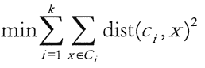
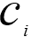

# k-means 聚类算法简介

> 原文：[`c.biancheng.net/view/3708.html`](http://c.biancheng.net/view/3708.html)

k-means 算法是一种基于划分的聚类算法，它以 k 为参数，把 n 个数据对象分成 k 个簇，使簇内具有较高的相似度，而簇间的相似度较低。

#### 1\. 基本思想

k-means 算法是根据给定的 n 个数据对象的数据集，构建 k 个划分聚类的方法，每个划分聚类即为一个簇。该方法将数据划分为 n 个簇，每个簇至少有一个数据对象，每个数据对象必须属于而且只能属于一个簇。同时要满足同一簇中的数据对象相似度高，不同簇中的数据对象相似度较小。聚类相似度是利用各簇中对象的均值来进行计算的。

k-means 算法的处理流程如下。首先，随机地选择 k 个数据对象，每个数据对象代表一个簇中心，即选择 k 个初始中心；对剩余的每个对象，根据其与各簇中心的相似度（距离），将它赋给与其最相似的簇中心对应的簇；然后重新计算每个簇中所有对象的平均值，作为新的簇中心。

不断重复以上这个过程，直到准则函数收敛，也就是簇中心不发生明显的变化。通常采用均方差作为准则函数，即最小化每个点到最近簇中心的距离的平方和。

新的簇中心计算方法是计算该簇中所有对象的平均值，也就是分别对所有对象的各个维度的值求平均值，从而得到簇的中心点。例如，一个簇包括以下 3 个数据对象 {(6,4,8),(8,2,2),(4,6,2)}，则这个簇的中心点就是 ((6+8+4)/3,(4+2+6)/3,(8+2+2)/3)=(6,4,4)。

k-means 算法使用距离来描述两个数据对象之间的相似度。距离函数有明式距离、欧氏距离、马式距离和兰氏距离，最常用的是欧氏距离。
k-means 算法是当准则函数达到最优或者达到最大的迭代次数时即可终止。当采用欧氏距离时，准则函数一般为最小化数据对象到其簇中心的距离的平方和，即 。
其中，k 是簇的个数， 是第 i 个簇的中心点，dist(,x)为 X 到 的距离。

#### 2\. Spark MLlib 中的 k-means 算法

Spark MLlib 中的 k-means 算法的实现类 KMeans 具有以下参数。

class KMeans private (
    private var k: int,
    private var maxiterations: Int,
    private var runs: Int,
    private var initializationMode String
    private var initializationStep: Int,
    private var epsilon: Double,
    private var seed: Long) extends: Serializable with Logging

#### 1）MLlib 的 k-means 构造函数

使用默认值构造 MLlib 的 k-means 实例的接口如下。

{k: 2,maxIterations: 20,runs: 1, initializationMode: KMeans.K_MEANS_PARALLEL,InitializationSteps: 5,epsilon: le-4,seed:random}。

参数的含义解释如下。

| 名称 | 说明 |
| --- | --- |
| k | 表示期望的聚类的个数。 |
| maxIterations | 表示方法单次运行的最大迭代次数。 |
| runs | 表示算法被运行的次数。k-means 算法不保证能返回全局最优的聚类结果，所以在目标数据集上多次跑 k-means 算法，有助于返回最佳聚类结果。 |
| initializationMode | 表示初始聚类中心点的选择方式，目前支持随机选择或者 K_MEANS_PARALLEL 方式，默认是 K_MEANS_PARALLEL。 |
| initializationsteps | 表示 K_MEANS_PARALLEL 方法中的步数。 |
| epsilon | 表示 k-means 算法迭代收敛的阈值。 |
| seed | 表示集群初始化时的随机种子。 |

通常应用时，都会先调用 KMeans.train 方法对数据集进行聚类训练，这个方法会返回 KMeansModel 类实例，然后可以使用 KMeansModel.predict 方法对新的数据对象进行所属聚类的预测。

#### 2）MLlib 中的 k-means 训练函数

MLlib 中的 k-means 训练函数 KMeans.train 方法有很多重载方法，这里以参数最全的一个 来进行说明。KMeans.train 方法如下。

def train(
    data:RDD[Vector],
    k:Int
    maxIterations:Int
    runs:Int
    initializationMode: String,
    seed: Long): KMeansModel = {
        new KMeans().setK(k)    -
        .setMaxIterations(maxIterations)
        .setRuns(runs)
        .setInitializatinMode(initializationMode)
        .setSeed(seed)
        .run(data)
    }
)

方法中各个参数的含义与构造函数相同，这里不再重复。

#### 3）MLlib 中的 k-means 的预测函数

MLlib 中的 k-means 的预测函数 KMeansModel.predict 方法接收不同格式的数据输入参数，可以是向量或者 RDD，返回的是输入参数所属的聚类的索引号。KMeansModel.predict 方法的 API 如下。

def predict(point:Vector):Int
def predict(points:RDD[Vector]):RDD[int]

第一种预测方法只能接收一个点，并返回其所在的簇的索引值；第二个预测方法可以接收一组点，并把每个点所在簇的值以 RDD 方式返回。

#### 3\. MLlib 中的 k-means 算法实例

实例：导入训练数据集，使用 k-means 算法将数据聚类到两个簇当中，所需的簇个数会作为参数传递到算法中，然后计算簇内均方差总和（WSSSE），可以通过增加簇的个数 k 来减小误差。

本实例使用 k-means 算法进行聚类的步骤如下。

**①** 装载数据，数据以文本文件的方式进行存放。

**②** 将数据集聚类，设置类的个数为 2 和迭代次数为 20，进行模型训练形成数据模型。

**③** 打印数据模型的中心点。

**④** 使用误差平方之和来评估数据模型。

**⑤** 使用模型测试单点数据。

**⑥** 进行交叉评估 1 时，返回结果；进行交叉评估 2 时，返回数据集和结果。

该实例使用的数据存放在 kmeans_data.txt 文档中，提供了 6 个点的空间位置坐标，数据如下所示。

0.0 0.0 0.0
0.1 0.1 0.1
0.2 0.2 0.2
9.0 9.0 9.0
9.1 9.1 9.1
9.2 9.2 9.2

每行数据描述了一个点，每个点有 3 个数字描述了其在三维空间的坐标值。将数据的每一列视为一个特征指标，对数据集进行聚类分析。实现的代码如下所示。

```

import org.apache.log4j.{Level,Logger}
import org.apache.spark.{SparkConf,SparkContext}
import org.apache.spark.mllib.clustering.KMeans
import org.apache.spark.mllib.linalg.Vectors

object Kmeans {
    def main(args: Array[String])   {
        //设置运行环境
        val conf = new SparkConf().setAppName("Kmeans").setMaster("local[4]")
        val sc = new SparkContext(conf)
        //装载数据集
        val data = sc.textFile("/home/hadoop/exercise/kmeans_data.txt", 1)
        val parsedData = data.map(s => Vectors.dense(s.split('').map(_.toDouble)))
        //将数据集聚类，设置类的个数为 2，迭代次数为 20，进行模型训练形成数据模型
        val numClusters = 2
        val numIterations = 20
        val model = KMeans.train(parsedData,numClusters, numIterations)
        //打印数据模型的中心点
        printIn("Cluster centers:")
        for (c <- model.clustercenters) {
            printIn ("" + c.toString)
        }
        //使用误差平方之和来评估数据模型
        val cost = model.computeCost(parsedData)
        printIn("Within Set Sum of Squared Errors = " + cost)
        //使用模型测试单点数据
        printIn("Vectors 0.2 0.2 0.2 is belongs to clusters:" + model.predict(Vectors.dense("0.2 0.2 0.2".split('').map(_.toDouble))))
        printIn("Vectors 0.25 0.25 0.25 is belongs to clusters:" +  model.predict(Vectors.dense("0.25 0.25 0.25".split('')).map(_.toDouble))))  
        printIn("Vectors 8 8 8 is belongs to clusters:" +model.predict(Vectors.dense("8 8 8".split(' ').map(_.toDouble))))
        //交叉评估 1，只返回结果
        val testdata = data.map(s => Vectors.dense(s.split('').map(_.toDouble)))
        val result1 = model.predict(testdata)
        result1.saveAsTextFile ("/home/hadoop/upload/class8/result_kmeans1")
        //交叉评估 2，返回数据集和结果
        val result2 = data.map {
            line =>
                val linevectore = Vectors.dense(line.split('').map(_.toDouble))
                val prediction = model.predict(linevectore) line + " " + prediction
        }.saveAsTextFile("/home/hadoop/upload/class8/result_kmeans2")
        sc.stop ()
    }
}
```

运行代码后，在运行窗口中可以看到计算出的数据模型，以及找出的两个簇中心点：(9.1, 9.1, 9.1) 和 (0.1, 0.1, 0.1)；并使用模型对测试点进行分类，可求出它们分别属于簇 1、1、0。

同时，在 /home/hadoop/spark/mllib/exercise 目录中有两个输出目录：result_kmeansl 和 result_kmeans2。在交叉评估 1 中只输出了 6 个点分别属于簇 0、0、0、1、1、1；在交叉评估 2 中输出了数据集和每个点所属的簇。

#### 4\. 算法优缺点

k-means 聚类算法是一种经典算法，该算法简单高效，易于理解和实现；算法的时间复杂度低，为 O(tkm)，其中，r 为迭代次数，k 为簇的数目，m 为记录数，n 为维数，并且 t<<m k<<n。

k-means 算法也有许多不足的地方。

*   需要人为事先确定簇的个数，k 的选择往往会是一个比较困难的问题。
*   对初始值的设置很敏感，算法的结果与初始值的选择有关。
*   对噪声和异常数据非常敏感。如果某个异常值具有很大的数值，则会严重影响数据分布。
*   不能解决非凸形状的数据分布聚类问题。
*   主要用于发现圆形或者球形簇，不能识别非球形的簇。