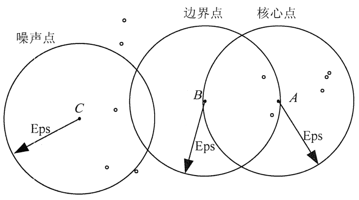
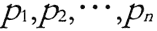
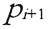
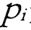
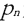
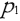
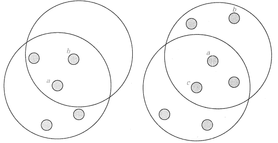
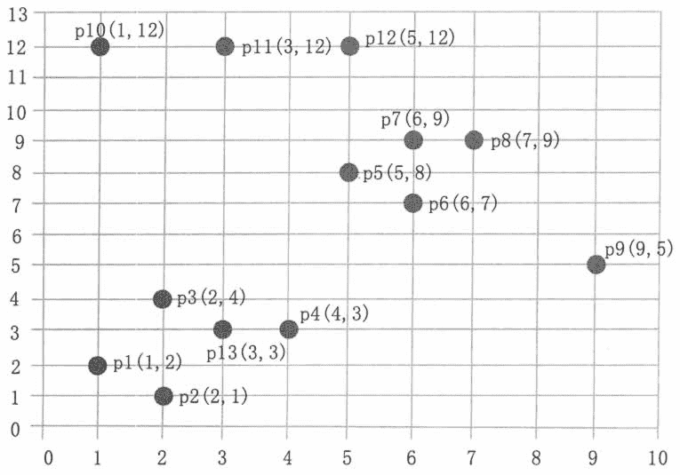

# DBSCAN 聚类算法简介

> 原文：[`c.biancheng.net/view/3699.html`](http://c.biancheng.net/view/3699.html)

DBSCAN（Density—Based Spatial Clustering of Application with Noise）算法是一种典型的基于密度的聚类方法。它将簇定义为密度相连的点的最大集合，能够把具有足够密度的区域划分为簇，并可以在有噪音的空间数据集中发现任意形状的簇。

#### 1\. 基本概念

DBSCAN 算法中有两个重要参数：Eps 和 MmPtS。Eps 是定义密度时的邻域半径，MmPts 为定义核心点时的阈值。

在 DBSCAN 算法中将数据点分为以下 3 类。

#### 1）核心点

如果一个对象在其半径 Eps 内含有超过 MmPts 数目的点，则该对象为核心点。

#### 2）边界点

如果一个对象在其半径 Eps 内含有点的数量小于 MinPts，但是该对象落在核心点的邻域内，则该对象为边界点。

#### 3）噪音点

如果一个对象既不是核心点也不是边界点，则该对象为噪音点。

通俗地讲，核心点对应稠密区域内部的点，边界点对应稠密区域边缘的点，而噪音点对应稀疏区域中的点。

在图 1 中，假设 MinPts=5，Eps 如图中箭头线所示，则点 A 为核心点，点 B 为边界点，点 C 为噪音点。点 A 因为在其 Eps 邻域内含有 7 个点，超过了 Eps=5，所以是核心点。

点 E 和点 C 因为在其 Eps 邻域內含有点的个数均少于 5，所以不是核心点；点 B 因为落在了点 A 的 Eps 邻域内，所以点 B 是边界点；点 C 因为没有落在任何核心点的邻域内，所以是噪音点。
图 1  DBSCAN 算法数据点类型示意进一步来讲，DBSCAN 算法还涉及以下一些概念。

| 名称 | 说明 |
| --- | --- |
| Eps 邻域 | 简单来讲就是与点的距离小于等于 Eps 的所有点的集合。 |
| 直接密度可达 | 如果点 p 在核心点 q 的 Eps 邻域內，则称数据对象 p 从数据对象 q 出发是直接密度可达的。 |
| 密度可达 | 如果存在数据对象链 是从 关于 Eps 和 MinPts 直接密度可达的，则数据对象 是从数据对象 关于 EpsMinPts 密度可达的。 |
| 密度相连 | 对于对象 p 和对象 q，如果存在核心对象样本 o，使数据对象 p 和对象 q 均从 o 密度可达，则称 p 和 q 密度相连。显然，密度相连具有对称性。 |
| 密度聚类簇 | 由一个核心点和与其密度可达的所有对象构成一个密度聚类簇。 |

图 2  直接密度可达和密度可达示意
在图 2 中，点 a 为核心点，点 b 为边界点，并且因为 a 直接密度可达 b。但是 b 不直接密度可达 a（因为 b 不是一个核心点）。因为 c 直接密度可达 a，a 直接密度可达 b，所以 c 密度可达 b。但是因为 b 不直接密度可达 a，所以 b 不密度可达 c。但是 b 和 c 密度相连。

#### 2\. 算法描述

DBSCAN 算法对簇的定义很简单，由密度可达关系导出的最大密度相连的样本集合，即为最终聚类的一个簇。

DBSCAN 算法的簇里面可以有一个或者多个核心点。如果只有一个核心点，则簇里其他的非核心点样本都在这个核心点的 Eps 邻域里。如果有多个核心点，则簇里的任意一个核心点的 Eps 邻域中一定有一个其他的核心点，否则这两个核心点无法密度可达。这些核心点的 Eps 邻域里所有的样本的集合组成一个 DBSCAN 聚类簇。

DBSCAN 算法的描述如下。

*   输入：数据集，邻域半径 Eps，邻域中数据对象数目阈值 MinPts;
*   输出：密度联通簇。

处理流程如下。

**1）**从数据集中任意选取一个数据对象点 p；

**2）**如果对于参数 Eps 和 MinPts，所选取的数据对象点 p 为核心点，则找出所有从 p 密度可达的数据对象点，形成一个簇；

**3）**如果选取的数据对象点 p 是边缘点，选取另一个数据对象点；

**4）**重复（2）、（3）步，直到所有点被处理。

DBSCAN 算法的计算复杂的度为 O(n²)，n 为数据对象的数目。这种算法对于输入参数 Eps 和 MinPts 是敏感的。

#### 3\. 算法实例

下面给出一个样本数据集，如表 1 所示，并对其实施 DBSCAN 算法进行聚类，取 Eps=3，MinPts=3。

**表 1 DSCAN 算法样本数据集**

| p1 | p2 | p3 | p4 | p5 | p6 | p7 | p8 | p9 | p10 | p11 | p12 | p13 |
| --- | --- | --- | --- | --- | --- | --- | --- | --- | --- | --- | --- | --- |
| 1 | 2 | 2 | 4 | 5 | 6 | 6 | 7 | 9 | 1 | 3 | 5 | 3 |
| 2 | 1 | 4 | 3 | 8 | 7 | 9 | 9 | 5 | 12 | 12 | 12 | 3 |

数据集中的样本数据在二维空间内的表示如图 3 所示。
图 3  直接密度可达和密度可达示意**第一步**，顺序扫描数据集的样本点，首先取到 p1(1,2)。

**1）**计算 p1 的邻域，计算出每一点到 p1 的距离，如 d(p1,p2)=sqrt(1+1)=1.414。

**2）**根据每个样本点到 p1 的距离，计算出 p1 的 Eps 邻域为 {p1,p2,p3,p13}。

**3）**因为 p1 的 Eps 邻域含有 4 个点，大于 MinPts(3)，所以，p1 为核心点。

**4）**以 p1 为核心点建立簇 C1，即找出所有从 p1 密度可达的点。

**5）**p1 邻域内的点都是 p1 直接密度可达的点，所以都属于 C1。

**6）**寻找 p1 密度可达的点，p2 的邻域为 {p1,p2,p3,p4,p13}，因为 p1 密度可达 p2，p2 密度可达 p4，所以 p1 密度可达 p4，因此 p4 也属于 C1。

**7）**p3 的邻域为 {p1,p2,p3,p4,p13}，p13 的邻域为 {p1,p2,p3,p4,p13}，p3 和 p13 都是核心点，但是它们邻域的点都已经在 Cl 中。

**8）**P4 的邻域为 {p3,p4,p13}，为核心点，其邻域内的所有点都已经被处理。

**9）**此时，以 p1 为核心点出发的那些密度可达的对象都全部处理完毕，得到簇 C1，包含点 {p1,p2,p3,p13,p4}。

**第二步**，继续顺序扫描数据集的样本点，取到 p5(5,8)。

**1）**计算 p5 的邻域，计算出每一点到 p5 的距离，如 d(p1,p8)-sqrt(4+1)=2.236。

**2）**根据每个样本点到 p5 的距离，计算出 p5 的 Eps 邻域为{p5,p6,p7,p8}。

**3）**因为 p5 的 Eps 邻域含有 4 个点，大于 MinPts(3)，所以，p5 为核心点。

**4）**以 p5 为核心点建立簇 C2，即找出所有从 p5 密度可达的点，可以获得簇 C2，包含点 {p5,p6,p7,p8}。

**第三步**，继续顺序扫描数据集的样本点，取到 p9(9,5)。

**1）**计算出 p9 的 Eps 邻域为 {p9}，个数小于 MinPts(3)，所以 p9 不是核心点。

**2）**对 p9 处理结束。

**第四步**，继续顺序扫描数据集的样本点，取到 p10(1,12)。

**1）**计算出 p10 的 Eps 邻域为 {p10,pll}，个数小于 MinPts(3),所以 p10 不是核心点。

**2）**对 p10 处理结束。

**第五步**，继续顺序扫描数据集的样本点，取到 p11(3,12)。

**1）**计算出 p11 的 Eps 邻域为 {p11,p10,p12}，个数等于 MinPts(3)，所以 p11 是核心点。

**2）**从 p12 的邻域为 {p12,p11}，不是核心点。

**3）**以 p11 为核心点建立簇 C3，包含点 {p11,p10,p12}。

**第六步**，继续扫描数据的样本点，p12、p13 都已经被处理过，算法结束。

#### 4\. 算法优缺点

和传统的 k-means 算法相比，DBSCAN 算法不需要输入簇数 k 而且可以发现任意形状的聚类簇，同时，在聚类时可以找出异常点。

DBSCAN 算法的主要优点如下。

**1）**可以对任意形状的稠密数据集进行聚类，而 k-means 之类的聚类算法一般只适用于凸数据集。

**2）**可以在聚类的同时发现异常点，对数据集中的异常点不敏感。

**3）**聚类结果没有偏倚，而 k-means 之类的聚类算法的初始值对聚类结果有很大影响。

DBSCAN 算法的主要缺点如下。

**1）**样本集的密度不均匀、聚类间距差相差很大时，聚类质量较差，这时用 DBSCAN 算法一般不适合。

**2）**样本集较大时，聚类收敛时间较长，此时可以对搜索最近邻时建立的 KD 树或者球树进行规模限制来进行改进。

**3）**调试参数比较复杂时，主要需要对距离阈值 Eps，邻域样本数阈值 MinPts 进行联合调参，不同的参数组合对最后的聚类效果有较大影响。

**4）**对于整个数据集只采用了一组参数。如果数据集中存在不同密度的簇或者嵌套簇，则 DBSCAN 算法不能处理。为了解决这个问题，有人提出了 OPTICS 算法。

**5）**DBSCAN 算法可过滤噪声点，这同时也是其缺点，这造成了其不适用于某些领域，如对网络安全领域中恶意攻击的判断。