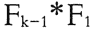
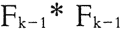
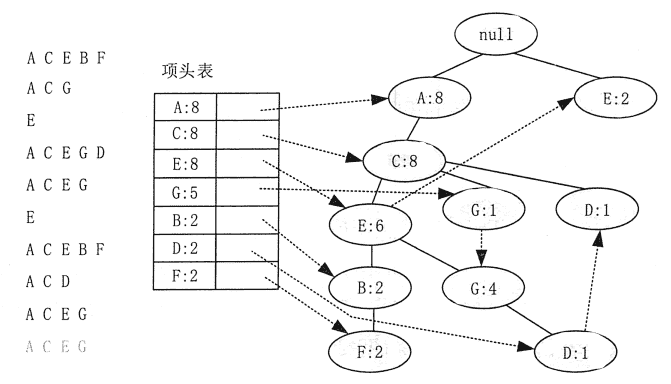
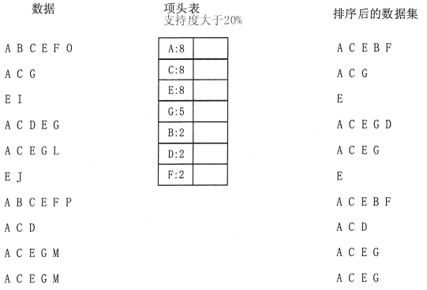
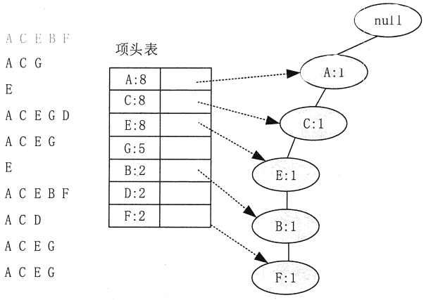
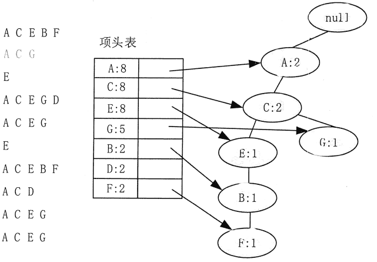
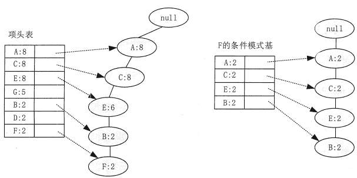
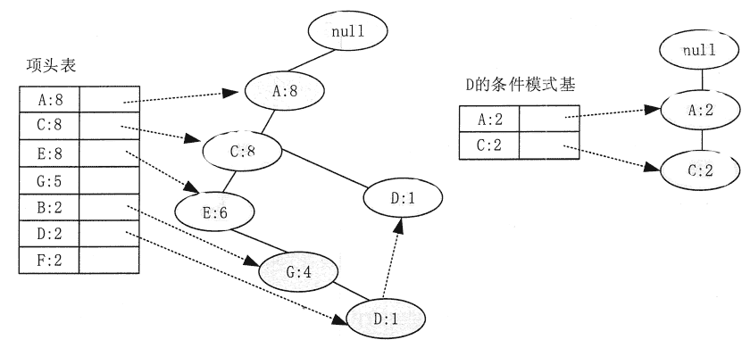

# Apriori 算法和 FP-Tree 算法简介

> 原文：[`c.biancheng.net/view/3715.html`](http://c.biancheng.net/view/3715.html)

本节主要描述了基于 Apriori 算法的关联分析方法。为了克服 Apriori 算法在复杂度和效率方面的缺陷，本节还进一步的介绍了基于 FP-Tree 的频繁模式挖掘方法。

## Apriori 关联分析算法

Apriori 算法是挖掘产生关联规则所需频繁项集的基本算法，也是最著名的关联分析算法之一。

#### 1\. Apriori 算法

Apriori 算法使用了逐层搜索的迭代方法，即用 k-项集探索（k+1）-项集。为提高按层次搜索并产生相应频繁项集的处理效率，Apriori 算法利用了一个重要性质，该性质还能有效缩小频繁项集的搜索空间。

Apriori 性质：一个频繁项集的所有非空子集也必须是频繁项集。即假如项集 A 不满足最小支持度阈值，即 A 不是频繁的，则如果将项集 B 添加到项集 A 中，那么新项集（AUB）也不可能是频繁的。

Apriori 算法简单来说主要有以下几个步骤。

**1）**通过单遍扫描数据集，确定每个项的支持度。一旦完成这一步，就可得到所有频繁 1-项集的集合 F1。

**2）**使用上一次迭代发现的频繁（k-1）-项集，产生新的候选 k-项集。

**3）**为了对候选项集的支持度计数，再次扫描一遍数据库，使用子集函数确定包含在每一个交易 t 中的所有候选 k-项集。

**4）**计算候选项集的支持度计数后，算法将删除支持度计数小于支持度阈值的所有候选项集。

**5）**重复步骤**（2）、（3）、（4**），当没有新的频繁项集产生时，算法结束。

Apriori 算法是个逐层算法，它使用“产生——测试”策略来发现频繁项集。在由（k-1）-项集产生 k-项集的过程中“新产生的 k-项集先要确定它的所有的（k-1）-项真子集都是频繁的，如果有一个不是频繁的，那么它可以从当前的候选项集中去掉。

产生候选项集的方法有以下几种。

#### 1）蛮力法

从 2-项集开始以后所有的项集都是从 1-项集完全拼出来的。例如，3- 项集由 3 个 1-项集拼出，要列出所有的可能性。然后再按照剪枝算法剪枝，即确定当前的项集的所有（k-1）-项集是否都是频繁的。

#### 2） 法

由 1-项集和（k-1）-项集生成 k-项集，然后再剪枝。这种方法是完全的，因为每一个频繁 k-项集都是由一个频繁（k-1）-项集和一个频繁 1-项集产生的。由于顺序的关系，这种方法会产生大量重复的频繁 k-项集。

#### 3）法

由两个频繁（k-1 ）-项集生成候选 k-项集，但是两个频繁（k-1）-项集的前 k-2 项必须相同，最后一项必须相异。由于每个候选项集都是由一对频繁（k-1）-项集合并而成的，所以需要附加的候选剪枝步骤来确保该候选的其余 k-2 个子集是频繁的。

#### 2\. 由频繁项集产生关联规则

一旦从事务数据集中找出频繁项集，就可以直接由它们产生强关联规则，即满足最小支持度和最小置信度的规则。计算关联规则的置信度并不需要再次扫描事物数据集，因为这两个项集的支持度计数已经在频繁项集产生时得到。

假设有频繁项集 Y，X 是 Y 的一个子集，那么如果规则 X→Y→X 不满足置信度阈值，则形如 X1→Y1→X1 的规则一定也不满足置信度阈值，其中，X1 是 X 的子集。根据该性质，假设由频繁项集 {a,b,c,d｝产生关联规则，关联规则｛b,c,d}→{a} 具有低置信度，则可以丢弃后件包含 a 的所有关联规则，如{c,d}→{a,b}，{b,d}→{a,c} 等。

#### 3\. 算法优缺点

Apriori 算法作为经典的频繁项集产生算法，使用先验性质，大大提高了频繁项集逐层产生的效率，它简单易理解，数据集要求低。但是随着应用的深入，它的缺点也逐渐暴露出来，主要的性能瓶颈有以下两点。

*   多次扫描事务数据集，需要很大的 I/O 负载。对每次 k 循环，对候选集 ck 中的每个元素都必须通过扫描数据集一次来验证其是否加入 lk。
*   可能产生庞大的候选集。候选项集的数量是呈指数级增长的，如此庞大的候选项集对时间和空间都是一种挑战。

## FP-Tree 关联分析算法

2000 年，Han Jiawei 等人提出了基于频繁模式树（Frequent Pattern Tree, FP—Tree）的发现频繁模式的算法 FP-Growth。其思想是构造一棵 FP-Tree，把数据集中的数据映射到树上，再根据这棵 FP-Tree 找出所有频繁项集。

FP-Growth 算法是指，通过两次扫描事务数据集，把每个事务所包含的频繁项目按其支持度降序压缩存储到 FP-Tree 中。

在以后发现频繁模式的过程中，不需要再扫描事务数据集，而仅在 FP-Tree 中进行查找即可。通过递归调用 FP-Growth 的方法可直接产生频繁模式，因此在整个发现过程中也不需产生候选模式。由于只对数据集扫描两次，因此 FP-Growth 算法克服了 Apriori 算法中存在的问题，在执行效率上也明显好于 Apriori 算法。

#### 1\. FP—Tree 的构造

为了减少 I/O 次数，FP-Tree 算法引入了一些数据结构来临时存储数据。这个数据结构包括 3 部分：项头表、FP-Tree 和结点链接，如图 1 所示。
图 1  FP-Tree 数据结构
第一部分是一个项头表，记录了所有的频繁 1-项集出现的次数，按照次数降序排列。例如, 在图 1 中，A 在所有 10 组数据中出现了 8 次，因此排在第一位。

第二部分是 FP-Tree，它将原始数据集映射到了內存中的一颗 FP-Tree。

第三部分是结点链表。所有项头表里的频繁 1—项集都是一个结点链表的头，它依次指向 FP-Tree 中该频繁 1-项集出现的位置。这样做主要是方便项头表和 FP-Tree 之间的联系查找和更新。

#### 1）项头表的建立

建立 FP-Tree 需要首先建立项头表。第一次扫描数据集，得到所有频繁 1-项集的计数。然后删除支持度低于阈值的项，将频繁 1—项集放入项头表，并按照支持度降序排列。

第二次扫描数据集，将读到的原始数据剔除非频繁 1-项集，并按照支持度降序排列。

在这个例子中有 10 条数据，首先第一次扫描数据并对 1-项集计数，发现 F、O、I、L、J、P、M、N 都只出现一次，支持度低于阈值(20%)，因此它们不会出现在项头表中。将剩下的 A、C、E、G、B、D、F 按照支持度的大小降序排列，组成了项头表。

接着第二次，扫描数据，对每条数据剔除非频繁 1—项集，并按照支持度降序排列。例如，数据项 A、B, C、E、F、O 中的 O 是非频繁 1-项集，因此被剔除，只剩下了 A、B、C、E、F。 按照支持度的顺序排序，它变成了 A、C、E、B、F，其他的数据项以此类推。将原始数据集里的频繁 1-项集进行排序是为了在后面的 FP-Tree 的建立时，可以尽可能地共用祖先结点。

经过两次扫描，项头集已经建立，排序后的数据集也已经得到了，如图 2 所示。
图 2  FP-Tree 项头表示意

#### 2）FP-Tree 的建立

有了项头表和排序后的数据集，就可以开始 FP-Tree 的建立了。

开始时 FP-Tree 没有数据，建立 FP-Tree 时要一条条地读入排序后的数据集，并将其插入 FP-Tree。插入时，排序靠前的结点是祖先结点，而靠后的是子孙结点。如果有共用的祖先，则对应的公用祖先结点计数加 1。插入后，如果有新结点出现，则项头表对应的结点会通过结点链表链接上新结点。直到所有的数据都插入到 FP-Tree 后，FP-Tree 的建立完成。

下面来举例描述 FP-Tree 的建立过程。首先，插入第一条数据 A、C、E、E、F，如图 3 所示。此时 FP-Tree 没有结点，因此 A、C、E、B、F 是一个独立的路径，所有结点的计数都为 1，项头表通过结点链表链接上对应的新增结点。

图 3  FP-Tree 的构造示意 1
接着插入数据 A、C、G，如图 4 所示。由于 A、C、G 和现有的 FP-Tree 可以有共有的祖先结点序列 A、C，因此只需要增加一个新结点 G，将新结点 G 的计数记为 1，同时 A 和 C 的计数加 1 成为 2。当然，对应的 G 结点的结点链表要更新。

图 4  FP-Tree 的构造示意 2
用同样的办法可以更新后面 8 条数据，最后构成的 FP-Tree，如图 1 所示。由于原理类似，就不再逐步描述。

#### 2\. FP-Tree 的挖掘

下面讲解如何从 FP-Tree 挖掘频繁项集。基于 FP-Tree、项头表及结点链表，首先要从项头表的底部项依次向上挖掘。对于项头表对应于 FP-Tree 的每一项，要找到它的条件模式基。

条件模式基是指以要挖掘的结点作为叶子结点所对应的 FP 子树。得到这个 FP 子树，将子树中每个结点的计数设置为叶子结点的计数，并删除计数低于支持度的结点。基于这个条件模式基,就可以递归挖掘得到频繁项集了。

还是以上面的例子来进行讲解。先从最底部的 F 结点开始，寻找 F 结点的条件模式基，由于 F 在 FP-Tree 中只有一个结点，因此候选就只有图 5 左边所示的一条路径，对应 {A:8,C:8,E:6,B:2,F:2}。接着将所有的祖先结点计数设置为叶子结点的计数，即 FP 子树变成 {A:2,C:2,E:2,B:2,F:2}。

条件模式基可以不写叶子结点，因此最终的 F 的条件模式基如图 5 右边所示。

基于条件模式基，很容易得到 F 的频繁 2-项集为 {A:2,F:2},{C:2,F:2},{E:2,F:2}, {B:2,F:2}。递归合并 2—项集，可得到频繁 3—项集为{A:2,C:2,F:2}, {A:2,E:2,F:2}, {A:2,B:2,F:2}, {C:2,E:2, F:2}, {C:2,B2, F:2}, {E:2,B2, F:2}。递归合并 3-项集，可得到频繁 4—项集为{A:2,C:2,E:2,F:2}，{A:2,C:2,B2,F:2}, {C:2,E:2,B2,F:2}。一直递归下去，得到最大的频繁项集为频繁 5-项集，为 {A:2,C:2,E:2,B2,F:2}。

图 3  FP-Tree 的挖掘示意 1
F 结点挖掘完后，可以开始挖掘 D 结点。D 结点比 F 结点复杂一些，因为它有两个叶子结点，因此首先得到的 FP 子树如图 5 左边所示。

接着将所有的祖先结点计数设置为叶子结点的计数，即变成 {A:2,C:2,E:1 G:1,D:1,D:1}。此时，E 结点和 G 结点由于在条件模式基里面的支持度低于阈值，所以被删除，最终，去除了低支持度结点和叶子结点后的 D 结点的条件模式基为 {A:2,C:2}。通过它，可以很容易得到 D 结点的频繁 2-项集为 {A:2,D:2}，{C:2,D:2}。递归合并 2-项集，可得到频繁 3-项集为 {A:2,C:2,D:2}。D 结点对应的最大的频繁项集为频繁 3_ 项集。

用同样的方法可以递归挖掘到 B 的最大频繁项集为频繁 4-项集 {A:2,C:2,E:2,B2}。继续挖掘，可以递归挖掘到 G 的最大频繁项集为频繁 4-项集 {A:5,C:5,E:4,G:4}，E 的最大频繁项集为频繁 3-项集 {A:6,C:6,E:6},C 的最大频繁项集为频繁 2-项集{A:8,C:8}。由于 A 的条件模式基为空，因此可以不用去挖掘了。

图 4  FP-Tree 的挖掘示意 2
至此得到了所有的频繁项集，如果只是要最大的频繁 k-项集，则从上面的分析可以看到，最大的频繁项集为 5-项集，包括｛A:2,C:2,E:2,B:2,F:2｝。

#### 3\. MLlib 的 FP-Growth 算法实例

Spark MLlib 中 FP-Growth 算法的实现类 FPGrowth 具有以下参数。

class FPGrowth private (
    private var minSupport: Double,
    private var numPartitions: Int) extends Logging with Serializable

变量的含义如下。

*   minSupport 为频繁项集的支持度阈值，默认值为 0.3。
*   numPartitions 为数据的分区个数，也就是并发计算的个数。

首先，通过调用 FPGrowth.run 方法构建 FP-Growth 树，树中将会存储频繁项集的数据信息，该方法会返回 FPGrowthModel；然后，调用 FPGrowthModel.generateAssociationRules 方法生成置信度高于阈值的关联规则，以及每个关联规则的置信度。

实例：导入训练数据集，使用 FP-Growth 算法挖掘出关联规则。该实例使用的数据存放在 fpg.data 文档中，提供了 6 个交易样本数据集。样本数据如下所示。

r z h k p
z y x w v u t s
s x o n r
x z y m t s q e
z
x z y r q t p

数据文件的每一行是一个交易记录，包括了该次交易的所有物品代码，每个字母表示一个物品，字母之间用空格分隔。

实现的代码如下所示。

```

import org.apache.spark.mllib.fpm.FPGrowth import org.apache.spark.{SparkConf,SparkContext}

object FP_GrowthTest {
    def main(args:Array[String]){
        val conf = new SparkConf().setAppName("FPGrowthTest").setMaster("local[4]")
        val sc = new SparkContext(conf)
        //设置参数
        val minSupport = 0.2 //最小支持度
        val minConfidence = 0.8 //最小置信度
        val numPartitions = 2 //数据分区数
        //取出数据
        val data = sc.textFile("data/mllib/fpg.data")
        //把数据通过空格分割
        val transactions = data.map (x=>x.split (""))
        transactions.cache()
        //创建一个 FPGrowth 的算法实列
        val fpg = new FPGrowth()
        fpg.setMinSupport(minSupport)
        fpg.setNumPartitions(numPartitions)

        //使用样本数据建立模型
        val model = fpg.run(transactions)
        //查看所有的频繁项集，并且列出它出现的次数
        model.freqItemsets.collect().foreach(itemset=>{
            printIn (itemset.items.mkString("[",",","]")+itemset.freq)
        })

        //通过置信度筛选出推荐规则
        //antecedent 表示前项，consequent 表示后项
        //confidence 表示规则的置信度
        model.generateAssociationRules(minConfidence).collect().foreach(rule=>{printIn(rule.antecedent.mkString(",")+"-->" + rule.consequent.mkString("")+"-->"+ rule.confidence)
        })

        //查看规则生成的数量
        printIn(model.generateAssociationRules (minConfidence).collect().length)
```

运行结果会打印频繁项集和关联规则。

部分频繁项集如下。

[t] , 3
[t, x] ,3
[t, x, z] , 3
[t, z] , 3
[s] , 3
[s, t] , 2
[s, t, x] , 2
[s, t, x, z] , 2
[s, t, z], 2
[s, x] , 2
[s, x, z] , 2

部分关联规则如下。

s, t, x --> z --> 1.0
s, t, x --> y --> 1.0
q, x --> t --> 1.0
q, x --> y --> 1.0
q, x --> z --> 1.0
q, y, z --> t --> 1.0
q, y, z --> x --> 1.0
t, x, z --> y --> 1.0
q, x, z --> t --> 1.0
q, x, z --> y --> 1.0