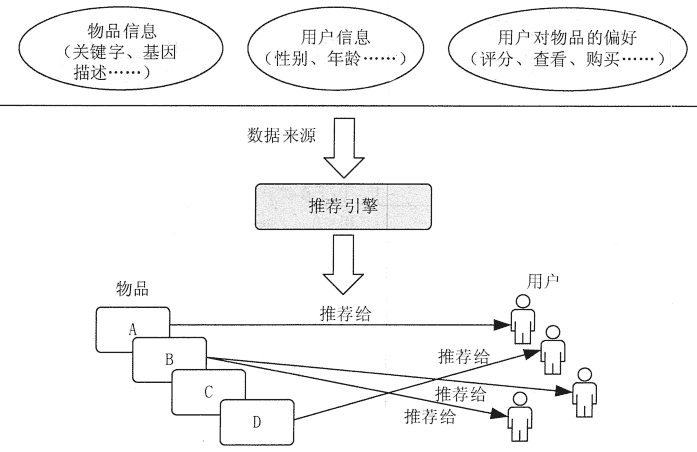
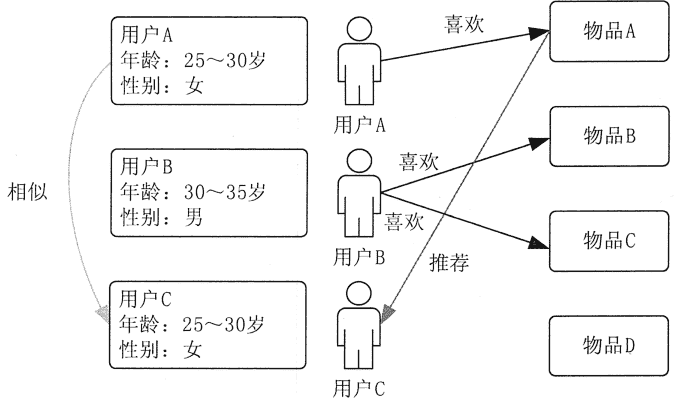
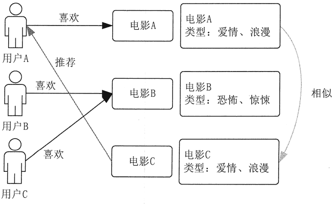
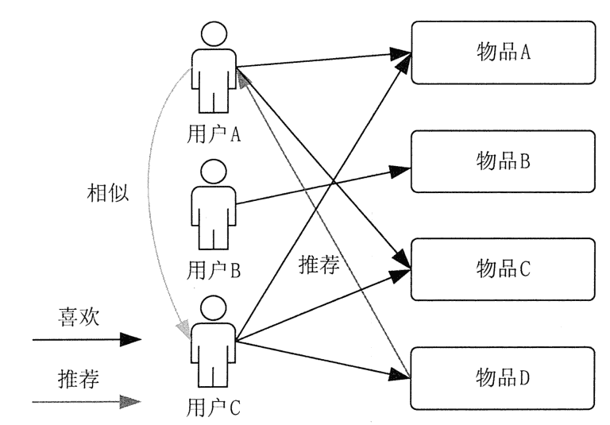
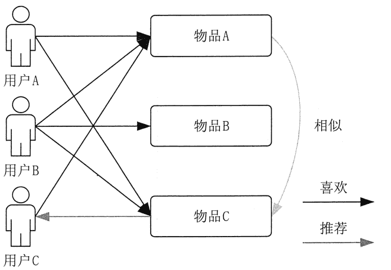
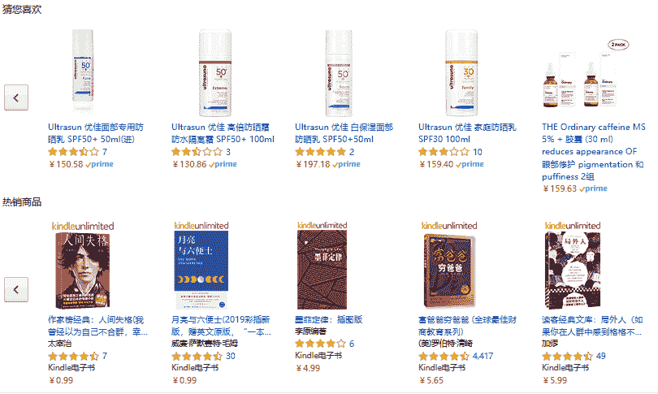

# 基于大数据的个性化推荐系统

> 原文：[`c.biancheng.net/view/3719.html`](http://c.biancheng.net/view/3719.html)

随着互联网时代的发展和大数据时代的到来，人们逐渐从信息匮乏的时代走入了信息过载的时代。为了让用户从海量信息中高效地获取自己所需的信息，推荐系统应运而生。

推荐系统的主要任务就是联系用户和信息，它一方面帮助用户发现对自己有价值的信息，另一方面让信息能够展现在对它感兴趣的用户面前，从而实现信息消费者和信息生产者的双赢。基于大数据的推荐系统通过分析用户的历史记录了解用户的喜好，从而主动为用户推荐其感兴趣的信息，满足用户的个性化推荐需求。

## 推荐系统概述

推荐系统是自动联系用户和物品的一种工具，它通过研究用户的兴趣爱好，来进行个性化推荐。以 Google 和百度为代表的搜索引擎可以让用户通过输入关键词精确找到自己需要的相关信息。但是，搜索引擎需要用户提供能够准确描述自己的需求的关键词，否则搜索引擎就无能为力了。

与搜索引擎不同的是，推荐系统不需要用户提供明确的需求，而是通过分析用户的历史行为来对用户的兴趣进行建模，从而主动给用户推荐可满足他们兴趣和需求的信息。每个用户所得到的推荐信息都是与自己的行为特征和兴趣有关的，而不是笼统的大众化信息。

随着推荐引擎的出现，用户获取信息的方式从简单的目标明确的数据搜索转换到更高级更符合人们使用习惯的信息发现。随着推荐技术的不断发展，推荐引擎已经在电子商务(如 Amazon.当当网)和一些基于社会的化站点(包括音乐、电影和图书分享，如豆瓣等)中都取得很大的成功。

图 1 展示了推荐引擎的工作原理，它接收的输入是推荐的数据源，一般情况下，推荐引擎所需要的数据源包括以下几点。

*   要推荐物品或內容的元数据，如关键字、基因描述等。
*   系统用户的基本信息，如性别、年龄等。
*   用户对物品或者信息的偏好，根据应用本身的不同，可能包括用户对物品的评分，用户查看物品的记录，用户的购买记录等。

用户的偏好信息可以分为显式用户反馈和隐式用户反馈两大类。

*   显式用户反馈是用户在网站上自然浏览或者使用网站以外，显式地提供的反馈信息，如用户对物品的评分，或者对物品的评论等。
*   隐式用户反馈是用户在使用网站时产生的数据，隐式地反映了用户对物品的喜好，如用户购买了某物品，用户查看了某物品的信息等。

图 1  推荐引擎的工作原理
显式用户反馈能准确地反映用户对物品的真实喜好，但需要用户付出额外的劳动，而隐式用户行为，通过一些分析和处理，也能反映用户的喜好，只是数据不是很精确，有些行为的分析存在较大的噪声。但只要选择正确的行为特征，隐式用户反馈也能得到很好的效果。例如，在电子商务的网站上，购买行为其实就是一个能很好表现用户喜好的隐式用户反馈。

推荐引擎根据不同的推荐机制可能用到数据源中的不同部分，然后根据这些数据，分析出一定的规则或者直接对用户对其他物品的喜好进行预测计算。这样，推荐引擎就可以在用户进入的时候给他推荐他可能感兴趣的物品。

## 推荐机制

大部分推荐引擎的工作原理是基于物品或者用户的相似集进行推荐，所以可以对推荐机制进行以下分类。

*   基于人口统计学的推荐：根据系统用户的基本信息发现用户的相关程度。
*   基于内容的推荐：根据推荐物品或内容的元数据，发现物品或者内容的相关性。
*   基于协同过滤的推荐：根据用户对物品或者信息的偏好，发现物品或者內容本身的相关性，或者是发现用户的相关性。

#### 1）基于人口统计学的推荐

基于人口统计学的推荐机制可根据用户的基本信息发现用户的相关程度，然后将相似用户喜爱的其他物品推荐给当前用户，图 2 描述了这种推荐机制的工作原理。

从图 2 中可以很清楚地看出，首先，系统对每个用户都有一个用户基本信息的模型，其中包括用户的年龄、性别等，然后，系统会根据用户的基本信息计算用户的相似度，可以看到用户 A 的基本信息和用户 C 一样，所以系统会认为用户 A 和用户 C 是相似用户，在推荐引擎中，可以称他们是“邻居”，最后，基于“邻居”用户群的喜好推荐给当前用户一些物品，图 2 所示为将用户 A 喜欢的物品 A 推荐给用户 C。

基于人口统计学的推荐机制的主要优势是对于新用户来讲没有“冷启动”的问题，这是因为该机制不使用当前用户对物品的喜好历史数据。该机制的另一个优势是它是领域独立的，不依赖于物品本身的数据，所以可以在不同的物品领域都得到使用。

图 2  基于人口统计学的推荐机制的工作原理
基于人口统计学的推荐机制的主要问题是基于用户的基本信息对用户进行分类的方法过于粗糙，尤其是对品味要求较高的领域，如图书、电影和音乐等领域，无法得到很好的推荐效果。另外，该机制可能涉及一些与需要查找的信息本身无关却比较敏感的信息，如用户的年龄等，这些信息涉及了用户的隐私。

#### 2）基于内容的推荐

基于内容的推荐是在推荐引擎出现之初应用最为广泛的推荐机制，它的核心思想是根据推荐物品或内容的元数据，发现物品或内容的相关性，然后基于用户以往的喜好记录，推荐给用户相似的物品。图 3 描述了基于内容推荐的基本原理。

图 3 中给出了基于内容推荐的一个典型的例子，即电影推荐系统。首先，需要对电影的元数据进行建模，这里只简单地描述了电影的类型。然后，通过电影的元数据发现电影间的相似度，由于电影 A 和 C 的类型都是“爱情、浪漫”，所以它们会被认为是相似的电影。最后，实现推荐，由于用户 A 喜欢看电影 A，那么系统就可以给他推荐类似的电影 C。
图 3  基于内容推荐机制的工作原理
基于内容的推荐机制的好处在于它能基于用户的口味建模，能提供更加精确的推荐。但它也存在以下几个问题。

*   需要对物品进行分析和建模，推荐的质量依赖于物品模型的完整和全面程度。
*   物品相似度的分析仅仅依赖于物品本身的特征，而没有考虑人对物品的态度。
*   因为是基于用户以往的历史做出推荐，所以对于新用户有“冷启动”的问题。

虽然基于内容的推荐机制有很多不足和问题，但它还是成功地应用在一些电影、音乐、图书的社交站点。有些站点还请专业的人员对物品进行基因编码，例如，在潘多拉的推荐引擎中，每首歌有超过 100 个元数据特征，包括歌曲的风格、年份、演唱者等。

#### 3）基于协同过滤的推荐

随着互联网时代的发展，Web 站点更加提倡用户参与和用户贡献，因此基于协同过滤的推荐机制应运而生。它的原理就是根据用户对物品或者信息的偏好，发现物品或者内容本身的相关性，或者发现用户的相关性，然后再基于这些相关性进行推荐。

基于协同过滤的推荐可以分为 3 个子类：基于用户的协同过滤推荐，基于项目的协同过滤推荐和基于模型的协同过滤推荐。

#### ① 基于用户的协同过滤推荐

基于用户的协同过滤推荐的基本原理是根据所有用户对物品或者信息的偏好，发现与当前用户口味和偏好相似的“邻居”用户群。一般的应用是采用计算“k-邻居”的算法，然后基于这 k 个邻居的历史偏好信息，为当前用户进行推荐的。图 4 描述了基于用户的协同过滤推荐机制的基本原理。

如图 4 所示，假设用户 A 喜欢物品 A 和物品 C，用户 B 喜欢物品 B，用户 C 喜欢物品 A、物品 C 和物品 D。从这些用户的历史喜好信息中可以发现，用户 A 和用户 C 的口味和偏好是比较类似的，同时用户 C 还喜欢物品 D ，那么系统可以推断用户 A 很可能也喜欢物品 D，因此可以将物品 D 推荐给用户 A。
图 4  基于用户的协同过滤推荐机制的基本原理
基于用户的协同过滤推荐机制和基于人口统计学的推荐机制都是计算用户的相似度，并基于“邻居”用户群计算推荐的，它们的不同之处在于如何计算用户的相似度。基于人口统计学的机制只考虑用户本身的特征，而基于用户的协同过滤机制是在用户的历史偏好的数据上计算用户的相似度，它的基本假设是，喜欢类似物品的用户可能有相同或者相似的口味和偏好。

#### ② 基于项目的协同过滤推荐

基于项目的协同过滤推荐的基本原理是使用所有用户对物品或者信息的偏好，发现物品和物品之间的相似度，然后根据用户的历史偏好信息，将类似的物品推荐给用户，图 5 描述了它的基本原理。

图 5  基于项目的协同过滤推荐机制的基本原理
假设用户 A 喜欢物品 A 和物品 C，用户 B 喜欢物品 A、物品 B 和物品 C，用户 C 喜欢物品 A。从这些用户的历史喜好可以分析出物品 A 和物品 C 是比较类似的，因为喜欢物品 A 的人都喜欢物品 C。基于这个数据可以推断用户 C 很有可能也喜欢物品 C，所以系统会将物品 C 推荐给用户 C。

基于项目的协同过滤推荐和基于内容的协同过滤推荐其实都是基于物品相似度的预测推荐，只是相似度计算的方法不一样，前者是从用户历史的偏好进行推断的，而后者是基于物品本身的属性特征信息进行推断的。

#### **③** 基于模型的协同过滤推荐

基于模型的协同过滤推荐就是指基于样本的用户喜好信息，采用机器学习的方法训练一个推荐模型，然后根据实时的用户喜好的信息进行预测，从而计算推荐。

这种方法使用离线的历史数据进行模型训练和评估，需要耗费较长的时间，依赖于实际的数据集规模、机器学习算法计算复杂度。

基于协同过滤的推荐机制是目前应用最为广泛的推荐机制，它具有以下两个优点。

*   它不需要对物品或者用户进行严格的建模，而且不要求物品的描述是机器可理解的，所以这种方法也是领域无关的。
*   这种方法计算岀来的推荐是开放的，可以共用他人的经验，能够很好地支持用户发现潜在的兴趣偏好。

基于协同过滤的推荐机制也存在以下几个问题。

*   方法的核心是基于历史数据，所以对新物品和新用户都有“冷启动”的问题。
*   推荐的效果依赖于用户历史偏好数据的多少和准确性。
*   对于一些特殊品味的用户不能给予很好的推荐。
*   由于以历史数据为基础，抓取和建模用户的偏好后，很难修改或者根据用户的使用进行演变，从而导致这个方法不够灵活。

#### 4）混合推荐机制

在现行的 Web 站点上的推荐往往不是只采用了某一种推荐机制和策略的，而是将多个方法混合在一起，从而达到更好的推荐效果。有以下几种比较流行的组合推荐机制的方法。

*   加权的混合：用线性公式将几种不同的推荐按照一定权重组合起来，具体权重的值需要在测试数据集上反复实验，从而达到最好的推荐效果。
*   切换的混合：对于不同的情况（如数据量，系统运行状况，用户和物品的数目等），选择最为合适的推荐机制计算推荐。
*   分区的混合：采用多种推荐机制，并将不同的推荐结果分不同的区显示给用户。
*   分层的混合：采用多种推荐机制，并将一个推荐机制的结果作为另一个的输入，从而综合各个推荐机制的优缺点，得到更加准确的推荐。

## 推荐系统的应用

目前，在电子商务、社交网络、在线音乐和在线视频等各类网站和应用中，推荐系统都起着很重要的作用。下面将简要分析两个有代表性的推荐系统（Amazon 作为电子商务的代表，豆 瓣作为社交网络的代表）。

#### 1）推荐在电子商务中的应用：Amazon

Amazon 作为推荐系统的鼻祖，已经将推荐的思想渗透在应用的各个角落。Amazon 推荐的核心是，通过数据挖掘算法和用户与其他用户的消费偏好的对比，来预测用户可能感兴趣的商品。 Amazon 采用的是分区的混合的机制，即将不同的推荐结果分不同的区显示给用户。图 6 展示了用户在 Amazon 首页上能得到的推荐。

图 6  Amazon 推荐机制：首页
Amazon 利用了可以记录的所有用户在站点上的行为，并根据不同数据的特点对它们进行处理，从而分成不同区为用户推送推荐。

*   猜你喜欢：通常是根据用户的近期的历史购买或者查看记录给出一个推荐。
*   热销商品：采用了基于内容的推荐机制，将一些热销的商品推荐给用户。

图 7 展示了用户在 Amazon 浏览物品的页面上能得到的推荐。

图 7  Amazon 推荐机制：浏览物品
当用户浏览物品时，Amazon 会根据当前浏览的物品对所有用户在站点上的行为进行处理，然后在不同区为用户推送推荐。

经常一起购买的商品：采用数据挖掘技术对用户的购买行为进行分析，找到经常被一起或同一个人购买的物品集，然后进行捆绑销售，这是一种典型的基于项目的协同过滤推荐机制；

购买此商品的顾客也同时购买：这也是一个典型的基于项目的协同过滤推荐的应用，用户能更快更方便地找到自己感兴趣的物品。

#### 2）推荐在社交网站中的应用：豆瓣

豆瓣是国内做得比较成功的社交网站，它以图书、电影、音乐和同城活动为中心，形成了一个多元化的社交网络平台，下面来介绍豆瓣是如何进行推荐的。

当用户在豆瓣电影中将一些看过的或是感兴趣的电影加入到看过和想看的列表里，并为它们做相应的评分后，豆瓣的推荐引擎就已经拿到了用户的一些偏好信息。基于这些信息，豆瓣将会给用户展示图 8 所示的电影推荐。

图 8  豆瓣的推荐机制：基于用户品味的推荐
豆瓣的推荐是根据用户的收藏和评价自动得出的，每个人的推荐清单都是不同的，每天推荐的内容也可能会有变化。收藏和评价越多，豆瓣给用户的推荐就会越准确和丰富。

豆瓣是基于社会化的协同过滤的推荐，用户越多，用户的反馈越多，则推荐的效果越准确。相对于 Amazon 的用户行为模型，豆瓣电影的模型更加简单，就是“看过”和“想看”，这也让他们的推荐更加专注于用户的品位，毕竟买东西和看电影的动机还是有很大不同的。

另外，豆瓣也有基于物品本身的推荐，当用户查看一些电影的详细信息时，它会给用户推荐出“喜欢这个电影的人也喜欢的电影”，这是一个基于协同过滤的推荐的应用。