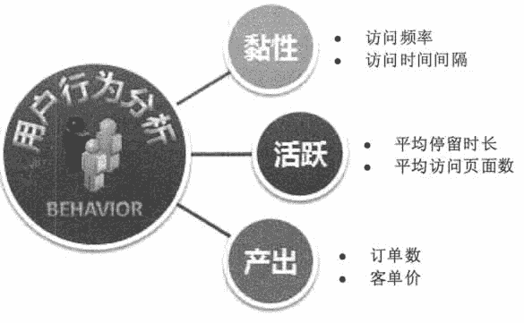
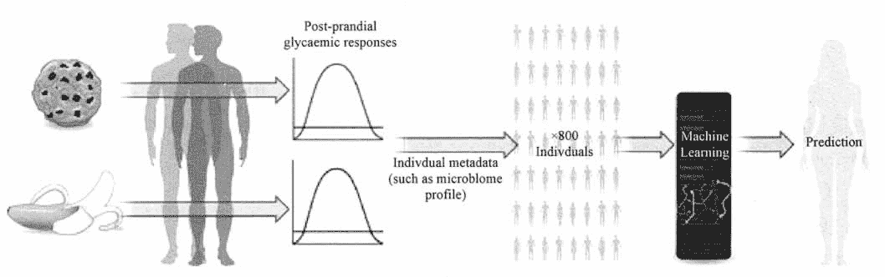

# 大数据预测（大数据核心应用）

> 原文：[`c.biancheng.net/view/3723.html`](http://c.biancheng.net/view/3723.html)

大数据预测是大数据最核心的应用，它将传统意义的预测拓展到“现测”。大数据预测的优势体现在，它把一个非常困难的预测问题，转化为一个相对简单的描述问题，而这是传统小数据集根本无法企及的。从预测的角度看，大数据预测所得出的结果不仅仅是用于处理现实业务的简单、客观的结论，更是能用于帮助企业经营的决策。

#### 1\. 预测是大数据的核心价值

大数据的本质是解决问题，大数据的核心价值就在于预测，而企业经营的核心也是基于预测而做出正确判断。在谈论大数据应用时，最常见的应用案例便是“预测股市”“预测流感”“预测消费者行为”等。

大数据预测则是基于大数据和预测模型去预测未来某件事情的概率。让分析从“面向已经发生的过去”转向“面向即将发生的未来”是大数据与传统数据分析的最大不同。

大数据预测的逻辑基础是，每一种非常规的变化事前一定有征兆，每一件事情都有迹可循，如果找到了征兆与变化之间的规律，就可以进行预测。大数据预测无法确定某件事情必然会发生，它更多是给出一个事件会发生的概率。

实验的不断反复、大数据的日渐积累让人类不断发现各种规律，从而能够预测未来。利用大数据预测可能的灾难，利用大数据分析癌症可能的引发原因并找出治疗方法，都是未来能够惠及人类的事业。

例如，大数据曾被洛杉矶警察局和加利福尼亚大学合作用于预测犯罪的发生；Google 流感趋势利用搜索关键词预测禽流感的散布；麻省理工学院利用手机定位数据和交通数据进行城市规划；气象局通过整理近期的气象情况和卫星云图，更加精确地判断未来的天气状况。

#### 2\. 大数据预测的思维改变

在过去，人们的决策主要是依赖 20% 的结构化数据，而大数据预测则可以利用另外 80% 的非结构化数据来做决策。大数据预测具有更多的数据维度，更快的数据频度和更广的数据宽度。与小数据时代相比，大数据预测的思维具有 3 大改变：实样而非抽样；预测效率而非精确；相关关系而非因果关系。

#### 1）实样而非抽样

在小数据时代，由于缺乏获取全体样本的手段，人们发明了“随机调研数据”的方法。理论上，抽取样本越随机，就越能代表整体样本。但问题是获取一个随机样本的代价极高，而且很费时。人口调查就是一个典型例子，一个国家很难做到每年都完成一次人口调查，因为随机调研实在是太耗时耗力，然而云计算和大数据技术的出现，使得获取足够大的样本数据乃至全体数据成为可能。

#### 2）效率而非精确

小数据时代由于使用抽样的方法，所以需要在数据样本的具体运算上非常精确，否则就会“差之毫厘，失之千里”。例如，在一个总样本为 1 亿的人口中随机抽取 1000 人进行人口调查，如果在 1000 人上的运算出现错误，那么放大到 1 亿中时，偏差将会很大。但在全样本的情况下，有多少偏差就是多少偏差，而不会被放大。

在大数据时代，快速获得一个大概的轮廓和发展脉络，比严格的精确性要重要得多。有时候，当掌握了大量新型数据时，精确性就不那么重要了，因为我们仍然可以掌握事情的发展趋势。大数据基础上的简单算法比小数据基础上的复杂算法更加有效。数据分析的目的并非就是数据分析，而是用于决策，故而时效性也非常重要。

#### 3）相关性而非因果关系

大数据研究不同于传统的逻辑推理研究，它需要对数量巨大的数据做统计性的搜索、比较、聚类、分类等分析归纳，并关注数据的相关性或称关联性。相关性是指两个或两个以上变量的取值之间存在某种规律性。相关性没有绝对，只有可能性。但是，如果相关性强，则一个相关性成功的概率是很高的。

相关性可以帮助我们捕捉现在和预测未来。如果 A 和 B 经常一起发生，则我们只需要注意到 B 发生了，就可以预测 A 也发生了。

根据相关性，我们理解世界不再需要建立在假设的基础上，这个假设是指针对现象建立的有关其产生机制和内在机理的假设。因此，我们也不需要建立这样的假设，即哪些检索词条可以表示流感在何时何地传播；航空公司怎样给机票定价；沃尔玛的顾客的烹饪喜好是什么。取而代之的是，我们可以对大数据进行相关性分析，从而知道哪些检索词条是最能显示流感的传播的，飞机票的价格是否会飞涨，哪些食物是飓风期间待在家里的人最想吃的。

数据驱动的关于大数据的相关性分析法，取代了基于假想的易出错的方法。大数据的相关性分析法更准确、更快，而且不易受偏见的影响。建立在相关性分析法基础上的预测是大数据的核心。

相关性分析本身的意义重大，同时它也为研究因果关系奠定了基础。通过找出可能相关的事物，我们可以在此基础上进行进一步的因果关系分析。如果存在因果关系，则再进一步找出原因。这种便捷的机制通过严格的实验降低了因果分析的成本。我们也可以从相互联系中找到一些重要的变量，这些变量可以用到验证因果关系的实验中去。

#### 3\. 大数据预测的典型应用领域

互联网给大数据预测应用的普及带来了便利条件，结合国内外案例来看，以下 11 个领域是最有机会的大数据预测应用领域。

#### 1）天气预报

天气预报是典型的大数据预测应用领域。天气预报粒度已经从天缩短到小时，有严苛的时效要求。如果基于海量数据通过传统方式进行计算，则得出结论时明天早已到来，预测并无价值，而大数据技术的发展则提供了高速计算能力，大大提高了天气预报的实效性和准确性。

#### 2）体育赛事预测

2014 年世界杯期间，Google、百度、微软和高盛等公司都推出了比赛结果预测平台。百度的预测结果最为亮眼，全程 64 场比赛的预测准确率为 67%，进入淘汰赛后准确率为 94%。这意味着未来的体育赛事会被大数据预测所掌控。

Google 世界杯预测是基于 Opta Sports 的海量赛事数据来构建最终的预测模型的。百度则是通过搜索过去 5 年内全世界 987 支球队（含国家队和俱乐部队）的 3.7 万场比赛数据，

同时与中国彩票网站乐彩网、欧洲必发指数数据供应商 SPdex 进行数据合作，导入博彩市场的预测数据，建立了一个囊括 199 972 名球员和 1.12 亿条数据的预测模型，并在此基础上进行结果预测。

从互联网公司的成功经验来看，只要有体育赛事历史数据，并且与指数公司进行合作，便可以进行其他赛事的预测，如欧冠、NBA 等赛事。

#### 3）股票市场预测

去年，英国华威商学院和美国波士顿大学物理系的研究发现，用户通过 Google 搜索的金融关键词或许可以预测金融市场的走向，相应的投资战略收益高达 326%。此前则有专家尝试通过 Twitter 博文情绪来预测股市波动。

#### 4）市场物价预测

CPI 用于表征已经发生的物价浮动情况，但统计局的数据并不权威。大数据则可能帮助人们了解未来物价的走向，提前预知通货膨胀或经济危机。最典型的案例莫过于马云通过阿里 B2B 大数据提前知晓亚洲金融危机。

单个商品的价格预测更加容易，尤其是机票这样的标准化产品，“去哪儿”提供的“机票日历”就是价格预测，它能告知你几个月后机票的大概价位。

由于商品的生产、渠道成本和大概毛利在充分竞争的市场中是相对稳定的，与价格相关的变量是相对固定的，商品的供需关系在电子商务平台上可实时监控，因此价格可以预测。基于预测结果可提供购买时间建议，或者指导商家进行动态价格调整和营销活动以实现利益最大化。

#### 5）用户行为预测

基于用户搜索行为、浏览行为、评论历史和个人资料等数据，互联网业务可以洞察消费者的整体需求，进而进行针对性的产品生产、改进和营销。《纸牌屋》选择演员和剧情，百度基于用户喜好进行精准广告营销，阿里根据天猫用户特征包下生产线定制产品，Amazon 预测用户点击行为提前发货均是受益于互联网用户行为预测。如图 1 所示。

图 1  用户行为预测
受益于传感器技术和物联网的发展，线下的用户行为洞察正在酝酿。免费商用 Wi-Fi，iBeacon 技术、摄像头影像监控、室内定位技术、NFC 传感器网络、排队叫号系统，可以探知用户线下的移动、停留、出行规律等数据，从而进行精准营销或者产品定制。

#### 6）人体健康预测

中医可以通过望闻问切的手段发现一些人体内隐藏的慢性病，甚至通过看体质便可知晓一个人将来可能会出现什么症状。人体体征变化有一定规律，而慢性病发生前人体已经会有一些持续性异常。理论上来说，如果大数据掌握了这样的异常情况，便可以进行慢性病预测。

Nature 新闻与观点报道过 Zeevi 等人的一项研究，即一个人的血糖浓度如何受特定的食物影响的复杂问题。该研究根据肠道中的微生物和其他方面的生理状况，提岀了一种可以提供个性化的食物建议的预测模型，比目前的标准能更准确地预测血糖反应。如图 2 所示。

图 2  血糖浓度预测模型
智能硬件使慢性病的大数据预测变为可能。可穿戴设备和智能健康设备可帮助网络收集人体健康数据，如心率、体重、血脂、血糖、运动量、睡眠量等状况。如果这些数据足够精准、全面，并且有可以形成算法的慢性病预测模式，或许未来这些穿戴设备就会提醒用户身体罹患某种慢性病的风险。

#### 7）疾病疫情预测

疾病疫情预测是指基于人们的搜索情况、购物行为预测大面积疫情暴发的可能性，最经典的“流感预测”便属于此类。如果来自某个区域的“流感”“板蓝根”搜索需求越来越多，自然可以推测该处有流感趋势。

百度已经推出了疾病预测产品，目前可以就流感、肝炎、肺结核、性病这四种疾病，对全国每一个省份以及大多数地级市和区县的活跃度、趋势图等情况，进行全面的监控。未来，百度疾病预测监控的疾病种类将从目前的 4 种扩展到 30 多种，覆盖更多的常见病和流行病。用户可以根据当地的预测结果进行针对性的预防。

#### 8）灾害灾难预测

气象预测是最典型的灾难灾害预测。地震、洪涝、高温、暴雨这些自然灾害如果可以利用大数据的能力进行更加提前的预测和告知，便有助于减灾、防灾、救灾、赈灾。与过往不同的是，过去的数据收集方式存在着有死角、成本高等问题，而在物联网时代，人们可以借助廉价的传感器摄像头和无线通信网络，进行实时的数据监控收集，再利用大数据预测分析，做到更精准的自然灾害预测。

#### 9）环境变迁预测

除了进行短时间微观的天气、灾害预测之外，还可以进行更加长期和宏观的环境和生态变迁预测。森林和农田面积缩小，野生动物植物濒危，海岸线上升，温室效应这些问题是地球面临的“慢性问题”。人类知道越多地球生态系统以及天气形态变化的数据，就越容易模型化未来环境的变迁，进而阻止不好的转变发生。大数据可帮助人类收集、储存和挖掘更多的地球数据,同时还提供了预测的工具。

#### 10）交通行为预测

交通行为预测是指基于用户和车辆的 LBS 定位数据，分析人车出行的个体和群体特征，进行交通行为的预测。交通部门可通过预测不同时点、不同道路的车流量，来进行智能的车辆调度，或应用潮汐车道；用户则可以根据预测结果选择拥堵概率更低的道路。

百度基于地图应用的 LBS 预测涵盖范围更广。它在春运期间可预测人们的迁徙趋势来指导火车线路和航线的设置，在节假日可预测景点的人流量来指导人们的景区选择，平时还有百度热力图来告诉用户城市商圈、动物园等地点的人流情况，从而指导用户出行选择和商家的选点选址。

#### 11）能源消耗预测

力口州电网系统运营中心管理着加州超过 80% 的电网，向 3500 万用户每年输送 2.89 亿兆瓦电力，电力线长度超过 40 000 千米。该中心采用了 Space-Time Insight 的软件进行智能管理，综合分析来自天气、传感器、计量设备等各种数据源的海量数据，预测各地的能源需求变化，进行智能电能调度，平衡全网的电力供应和需求，并对潜在危机做出快速响应。中国智能电网业已在尝试类似的大数据预测应用。

除了上面列举的 11 个领域之外，大数据预测还可被应用在房地产预测、就业情况预测、高考分数线预测、选举结果预测、奥斯卡大奖预测、保险投保者风险评估、金融借贷者还款能力评估等领域，让人类具备可量化、有说服力、可验证的洞察未来的能力，大数据预测的魅力正在释放出来。